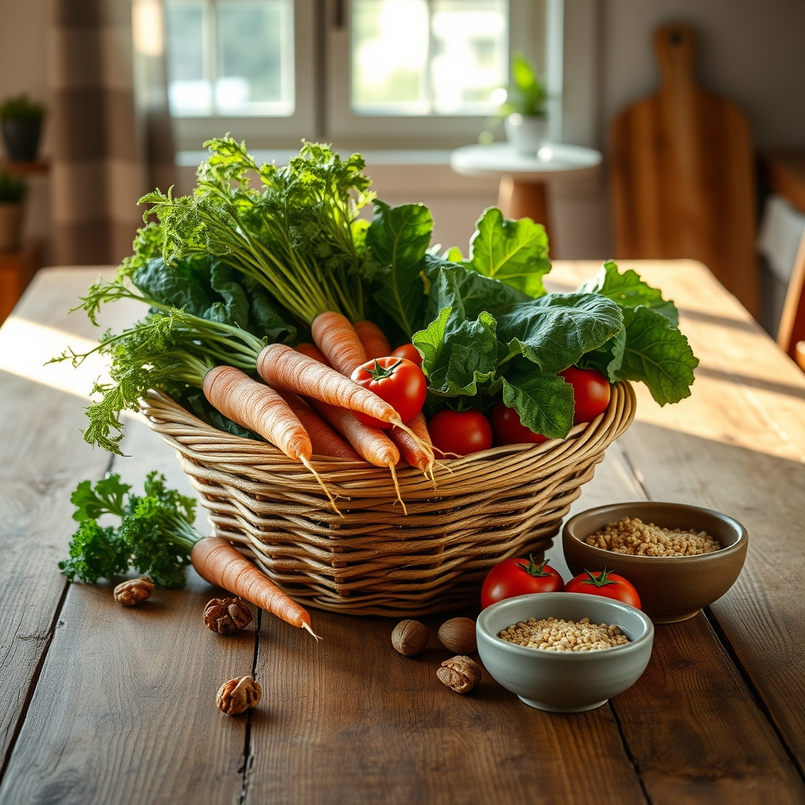

[Home](../index.md) > [Books](./index.md)  
# 🛡️🥦 In Defense of Food: An Eater's Manifesto  
  
[🛒 In Defense of Food: An Eater's Manifesto. As an Amazon Associate I earn from qualifying purchases.](https://amzn.to/3Nns9lY)  
  
🍎🥦🍚 Against nutritionism and the detrimental Western diet, return to simple, traditional eating: Eat food. Not too much. Mostly plants.  
  
## 🤖 AI Summary  
### 🧠 Core Philosophy: Rejecting Nutritionism  
* 🧪 **Nutritionism Defined:** Ideology reducing food to isolated nutrient components, ignoring whole food complexity. Often leads to misleading health claims.  
* 🍔 **Western Diet Critique:** Characterized by highly processed edible foodlike substances, refined grains, sugar, and unhealthy fats; linked to epidemics of chronic diseases (obesity, diabetes, heart disease).  
* 🌍 **Cultural Loss:** Modern food science and industry have replaced traditional food cultures and common sense about eating.  
  
### 📜 Actionable Principles: The Manifesto  
* 🍽️ **Eat Food:**  
    * Whole Prioritize whole, unprocessed foods.  
    * 👵 Great-grandmother Rule: Consume only foods your great-grandmother would recognize. Avoid products with long ingredient lists or unpronounceable additives.  
    * 🍎 Focus on foods that will eventually rot; avoid those designed for indefinite shelf life.  
    * 🛒 Shop the perimeter of the grocery store (fresh produce, meat, dairy) and frequent farmers' markets.  
    * 👨‍🌾 If possible, grow some of your own food.  
* 🥬 **Mostly Plants:**  
    * 🌿 Embrace a largely plant-based diet: fruits, vegetables, whole grains, legumes, nuts, seeds.  
    * 🌈 Emphasize diverse, colorful plants for a broad range of nutrients.  
    * 🥩 Reduce meat consumption; choose grass-fed/pasture-raised when consuming animal products.  
* 🤏 **Not Too Much:**  
    * 🧘 Practice moderation and mindful eating.  
    * 🛑 Stop eating when satisfied, not full.  
    * 👨‍👩‍👧‍👦 Eat meals at a table, not in the car or in front of screens.  
    * 🐢 Eat slowly and with others.  
    * 💰 Spend more on quality food, and implicitly, eat less of it.  
  
## ⚖️ Evaluation  
* ✅ **Core Message Validity:** Michael Pollan's central thesis, encapsulated in Eat food. Not too much. Mostly plants, is widely considered sound and supported by a consensus of scientific evidence linking whole food consumption to reduced risk of chronic diseases.  
* 🔬 **Critique of Nutritionism:** Pollan effectively highlights the pitfalls of reductionist approaches to food and the food industry's exploitation of health claims, which often obscure the true nutritional value of whole foods.  
* 🤨 **Straw Man Accusations:** Some critics argue Pollan presents a shallow caricature of science, suggesting that nutritional scientists do not exclusively focus on isolated nutrients and are aware of the complexity of food systems.  
* 📉 **Oversimplification of Science:** Pollan's reasoning about nutrition and research can be seen as unsophisticated and uninformed by some experts, overstating the dominance of reductionist approaches within nutrition science.  
* 🗣️ **Contradictory Rhetoric:** Despite his critique of nutritionism, Pollan has been noted for occasionally touting the benefits of specific nutrients, such as omega-3s, which some see as undermining his anti-reductionist stance.  
* 💸 **Practicality Concerns:** A common critique is that the book's recommendations, particularly those related to spending more on food or sourcing locally, may be impractical or elitist for less affluent individuals.  
* 🌱 **Lack of Vegetarian/Vegan Depth:** Some reviewers noted a surprising omission of a deeper exploration of plant-based diets, despite the mostly plants directive, given Pollan's emphasis on whole foods.  
* 🌟 **Influence and Impact:** Despite criticisms, In Defense of Food has significantly influenced public discourse on food, diet, and health, encouraging a more holistic and traditional view of eating.  
  
## 🔍 Topics for Further Understanding  
* 🦠 The human gut microbiome and its dynamic interaction with diet.  
* 🧬 Epigenetics and nutritional genomics: how food influences gene expression.  
* 🌾 Sustainable agriculture practices beyond organic certification.  
* ✊ Food sovereignty and community-based food systems.  
* 🧠 The psychology of eating: emotional connections to food, disordered eating patterns, and intuitive eating.  
* 🌐 Global dietary shifts and the impact of the Western diet on non-Western cultures.  
* 🏭 The role of ultra-processed foods (UPFs) in modern health crises and their specific mechanisms of harm.  
  
## ❓ Frequently Asked Questions (FAQ)  
### 💡 Q: What is the main argument of In Defense of Food: An Eater's Manifesto?  
✅ A: 📚 In Defense of Food argues that modern nutrition science and the food industry have overcomplicated eating, leading to a focus on isolated nutrients rather than whole foods, which has contributed to a rise in diet-related diseases. The book advocates for a return to simple, traditional eating principles.  
  
### 💡 Q: What does Michael Pollan mean by nutritionism in In Defense of Food?  
✅ A: 🧪 In Defense of Food defines nutritionism as an ideology, not a scientific discipline, that assumes the value of food is determined by its individual, scientifically identified nutrient components. Pollan argues this reductive view leads to misleading health claims and a fragmented understanding of food.  
  
### 💡 Q: What are the seven words Michael Pollan uses to summarize his advice in In Defense of Food?  
✅ A: 📝 In Defense of Food summarizes Michael Pollan's core dietary advice as: Eat food. Not too much. Mostly plants.  
  
### 💡 Q: How does In Defense of Food suggest avoiding edible foodlike substances?  
✅ A: 🚫 In Defense of Food suggests avoiding edible foodlike substances by following rules like not eating anything your great-grandmother wouldn't recognize as food, avoiding products with health claims on the packaging, and steering clear of foods with long ingredient lists containing unfamiliar or unpronounceable items.  
  
### 💡 Q: Does In Defense of Food criticize all nutritional science?  
✅ A: 🤔 While In Defense of Food is critical of the *ideology* of nutritionism and its impact on public health and the food industry, Pollan acknowledges that nutritional science has made some valuable contributions. However, he argues that its reductionist tendencies and incomplete understanding often lead to flawed advice.  
  
## 📚 Book Recommendations  
### Similar Books  
* 📘 The Omnivore's Dilemma by Michael Pollan (explores the origins of American food)  
* 📖 Food Rules: An Eater's Manual by Michael Pollan (a concise companion to In Defense of Food)  
* 🍔 Salt Sugar Fat: How the Food Giants Hooked Us by Michael Moss (investigates processed food industry tactics)  
* 📉 Supersized Lies: How the Food Industry Gets You Sick, Fat, and Nearly Broke by Ryan Fox (exposes food industry practices)  
  
### Contrasting Books  
* 🌱 The China Study by T. Colin Campbell (advocates for extreme plant-based diets with heavy scientific emphasis)  
* 🔬 Good Calories, Bad Calories by Gary Taubes (challenges conventional wisdom on fat and carbohydrates, focuses on scientific mechanisms)  
* 🧈 The Big Fat Surprise by Nina Teicholz (re-examines the science of dietary fat)  
  
### Related Books  
* [📜🌍⏳ Sapiens: A Brief History of Humankind](./sapiens-a-brief-history-of-humankind.md) by Yuval Noah Harari (provides a broad historical context for human food systems)  
* [🪢🌾 Braiding Sweetgrass: Indigenous Wisdom, Scientific Knowledge, and the Teachings of Plants](./braiding-sweetgrass.md) by Robin Wall Kimmerer (explores indigenous wisdom, botany, and humanity's relationship with nature)  
* 🧑‍🍳 Cooked: A Natural History of Transformation by Michael Pollan (explores the human impulse to cook and its cultural significance)  
  
## 🫵 What Do You Think?  
🤔 Given Pollan's assertion that we should Eat food. Not too much. Mostly plants, which of his specific rules do you find most challenging to implement in your daily life, and which do you find most impactful?