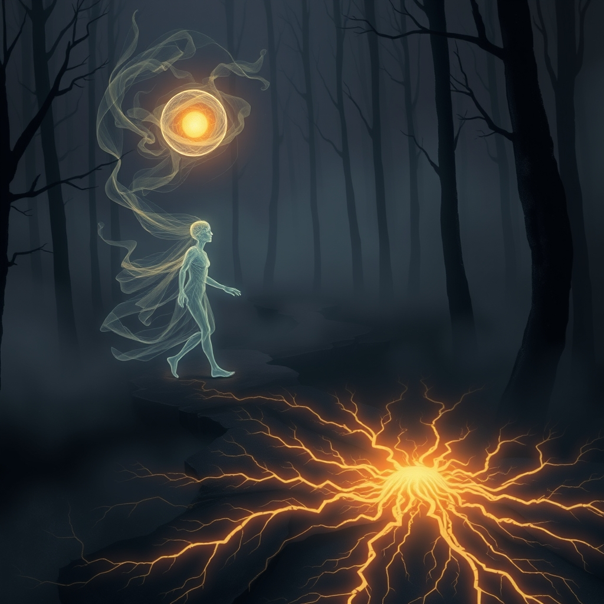

[Home](../index.md) > [Books](./index.md)  
# 👻🔗 In the Realm of Hungry Ghosts: Close Encounters with Addiction  
  
[🛒 In the Realm of Hungry Ghosts: Close Encounters with Addiction. As an Amazon Associate I earn from qualifying purchases.](https://amzn.to/4qAyytj)  
  
💔🧠🌍 In the Realm of Hungry Ghosts: Close Encounters with Addiction analyzes addiction not as a moral failing but as a deep-seated response to early trauma and emotional pain, advocating for compassion and systemic change over punitive measures.  
  
## 🏆 Gabor Maté's Addiction Strategy  
  
### 🧠 Addiction Etiology: Trauma & Disconnection  
* 🌱 **Root Cause:** Emotional pain, overwhelming stress, lost connection, deep discomfort with self.  
* 👶 **Developmental Impact:** Brain circuits for incentive, motivation, pain relief, stress regulation, and connection develop under early life nurturing environment; addiction represents a failure of these systems to mature.  
* 💊 **Self-Medication:** Drugs/behaviors are attempts to self-soothe or escape pain.  
  
### 💔 Understanding the Addict  
* 👻 **Hungry Ghost State:** Perpetual seeking of external substances/behaviors for relief, never satisfied, reflecting an inner emptiness.  
* 🧪 **Brain Chemistry:** Lower dopamine receptors or challenges in brain development (prenatal or childhood trauma) can lead to reward deficiency syndrome, driving stronger stimulation seeking.  
* 🙏 **Not a Moral Failing:** Addiction is a symptom of deeper malaise, not a choice.  
  
### 🤝 Treatment & Societal Approach  
* 👂 **Compassionate Inquiry:** Focus on Why the pain? not Why the addiction?.  
* 🩹 **Trauma-Informed Care:** Essential for healing underlying emotional wounds.  
* 💉 **Harm Reduction:** Pragmatic approach focusing on reducing negative consequences of drug use, prioritizing safety and trust over forced abstinence.  
* 🫂 **Human Connection:** The opposite of addiction is connection—to self, others, and purpose.  
* 🏛️ **Policy Shift:** Decriminalization and redirection of resources from law enforcement to prevention and care.  
  
## ⚖️ Critical Evaluation  
  
* 🎯 **Core Claim Validation:** Maté's central argument that addiction fundamentally arises from early childhood trauma, emotional loss, and environmental influences impacting brain development is powerfully articulated and widely influential, challenging the traditional view of addiction as a moral failing or purely genetic disease.  
* 🔗 **Trauma-Informed Alignment:** His work significantly aligns with the trauma-informed care framework, which increasingly recognizes the profound link between adverse childhood experiences (ACEs) and later addiction vulnerability, advocating for therapeutic approaches that address these underlying issues.  
* 🧠 **Neurobiological & Environmental Depth:** Maté provides extensive evidence showcasing how the early nurturing environment profoundly shapes crucial brain circuits responsible for reward, motivation, and stress regulation, thereby influencing an individual's predisposition to addictive behaviors.  
* 🚫 **Critique of War on Drugs:** His strong condemnation of the War on Drugs and advocacy for harm reduction strategies are supported by evidence suggesting punitive measures are ineffective and exacerbate addiction, whereas harm reduction can improve health outcomes and establish trust.  
* 📉 **Reductionist Vision Criticism:** Psychologist Stanton Peele critiques Maté's perspective as a reductionist vision of addiction, arguing that not all addicts experienced childhood trauma, and not all traumatized individuals become addicts.  
* ⚠️ **Overbroad Trauma Definition:** Critics also suggest Maté's interpretation of trauma is so expansive it risks being undiscriminating, potentially leading to the identification of trauma in nearly every case, even when not explicitly apparent, and possibly downplaying other significant contributing factors.  
* 🧬 **Genetic Factors Understated:** While Maté acknowledges biological aspects, some critiques indicate that his strong emphasis on environment and trauma may understate the role of genetic predispositions, which some research suggests can account for a significant portion of addiction risk (up to 50%).  
* 🧪 **Evidence-Based Solutions:** Professor James C. Coyne has raised concerns that Maté's approach might diverge from established evidence-based solutions in health and social problems, although he concedes issues with overspecialization in research and practice.  
  
📝 **Verdict:** In the Realm of Hungry Ghosts offers a profoundly compassionate and insightful reframe of addiction, compellingly linking it to unresolved trauma and developmental experiences. Maté's call for empathy and systemic reform is vital and well-supported in many aspects. However, its near-singular focus on trauma as the root cause, while powerful, has been criticized for potentially oversimplifying the multifactorial nature of addiction by downplaying genetic predispositions and the broader array of validated treatment modalities. The book is indispensable for shifting societal understanding and encouraging humane responses, though a holistic view benefits from integrating diverse perspectives on addiction's complex origins.  
  
## 🔍 Topics for Further Understanding  
  
* 🧠 The neurobiology of craving and relapse in long-term recovery.  
* ✨ Advanced therapeutic interventions for complex trauma beyond talk therapy (e.g., EMDR, somatic experiencing).  
* 🌍 Systemic socio-economic factors influencing addiction rates beyond individual trauma, such as poverty, inequality, and discrimination.  
* 🧬 The role of epigenetics in the intergenerational transmission of trauma and addiction vulnerability.  
* ⚖️ A comparative analysis of global drug policies (e.g., Portugal's decriminalization model) and their measurable impacts on addiction, crime, and public health.  
* 📱 The emerging field of behavioral addictions (e.g., technology, gambling, pornography) viewed through a trauma-informed lens.  
* 🧘 Integrating mindfulness, self-compassion, and spiritual practices into evidence-based addiction treatment.  
  
## ❓ Frequently Asked Questions (FAQ)  
  
### 💡 Q: What is the Realm of Hungry Ghosts?  
✅ A: In Buddhist philosophy, the Realm of Hungry Ghosts depicts a state of insatiable craving and emptiness, where individuals constantly seek external substances or behaviors to fill a deep inner void, reflecting the perpetual dissatisfaction inherent in addiction.  
  
### 💡 Q: What does Gabor Maté believe causes addiction?  
✅ A: Gabor Maté asserts that addiction is primarily a coping mechanism stemming from early childhood trauma, emotional pain, and a lack of secure attachment, which disrupts normal brain development and the ability to self-regulate emotions.  
  
### 💡 Q: Does Maté believe addiction is a choice or a disease?  
✅ A: Maté argues that addiction is neither simply a choice nor solely a disease, but rather a complex manifestation of a person's desperate attempt to solve deep-seated emotional pain and discomfort, often rooted in early life adversity. While the National Institute on Drug Abuse defines addiction as a chronic, often relapsing brain disease, Maté emphasizes the underlying trauma rather than a purely biological or moral failing.  
  
### 💡 Q: What is Maté's stance on the War on Drugs?  
✅ A: Maté is a vocal critic of the War on Drugs, contending that its punitive and criminalizing approach is ineffective, costly, and exacerbates addiction by further traumatizing individuals. He advocates for harm reduction, decriminalization, and a shift towards compassionate care and treatment.  
  
### 💡 Q: Are Maté's views on addiction universally accepted?  
✅ A: While widely praised for his compassionate and trauma-informed approach, some of Maté's views, particularly the extent to which all addiction can be traced back to childhood trauma, have faced criticism for being potentially reductionist or for not fully accounting for genetic predispositions and the complexity of addiction.  
  
## 📚 Book Recommendations  
  
### 📖 Similar  
* 📖 The Myth of Normal by Gabor Maté  
* 📖 When the Body Says No by Gabor Maté  
* 📖 Chasing the Scream by Johann Hari  
* 📖 Dopamine Nation by Anna Lembke  
  
### 📖 Contrasting  
* 📖 Unbroken Brain by Maia Szalavitz  
* 📖 Rational Recovery by Jack Trimpey  
* 📖 Clean by David Sheff  
  
### 📖 Related  
* [🤕🎼🧠 The Body Keeps the Score: Brain, Mind, and Body in the Healing of Trauma](./the-body-keeps-the-score-brain-mind-and-body-in-the-healing-of-trauma.md) by Bessel van der Kolk  
* 📖 [👩🏼‍❤️‍💋‍👨🏻🔗 Attached: The New Science of Adult Attachment and How It Can Help You Find - and Keep - Love](./attached-the-new-science-of-adult-attachment-and-how-it-can-help-you-find-and-keep-love.md) by Amir Levine and Rachel Heller  
* 📖 Lost Connections by Johann Hari  
  
## 🫵 What Do You Think?  
  
🤔 How has understanding the link between trauma and addiction shifted your perspective on individuals struggling with substance use? 🌍 What societal changes do you believe are most critical to fostering a more compassionate and effective approach to addiction?