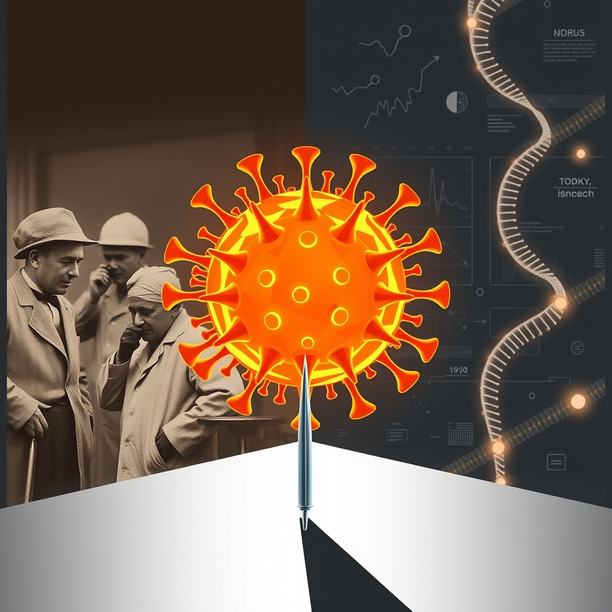

[Home](../index.md) > [Books](./index.md)  
# 🦠💀🔎💉 Influenza: The Hundred-Year Hunt to Cure the Deadliest Disease in History  
  
[🛒 Influenza: The Hundred-Year Hunt to Cure the Deadliest Disease in History. As an Amazon Associate I earn from qualifying purchases.](https://amzn.to/44PXnZ2)  
  
🦠🔬⏳ Examines humanity's century-long struggle against the elusive influenza virus, highlighting the medical community's triumphs and persistent challenges in understanding, treating, and preventing this devastating global killer.  
  
## 🤖 AI Summary  
  
### 📖 Book Overview  
* ✍️ **Author:** Jeremy Brown, ER doctor and Director of Emergency Care Research at NIH.  
* 🔍 **Focus:** History of influenza, particularly the 1918 pandemic, current research, vaccine controversies, pandemic preparedness.  
* 💡 **Core Argument:** Despite scientific advancements, influenza remains a formidable, unpredictable threat.  
* 🗓️ **Release:** 2018, coinciding with the 100th anniversary of the 1918 Spanish Flu.  
  
### 📜 Key Historical Insights  
* 💀 **1918 Pandemic:** Deadliest in history, killed 17 to 100 million worldwide, disproportionately affected young adults.  
* ❓ **Misdiagnosis:** Initially confused with other diseases due to severe, unusual symptoms.  
* 🧪 **Early Treatments:** Included bizarre methods like whiskey, blood-letting, and inhaling factory gases.  
* 🔬 **Virus Identification:** Influenza virus isolated in 1933; previously thought to be bacterial (Pfeiffer's bacillus).  
* 💉 **Vaccine Development:** First inactivated flu vaccine developed by Thomas Francis and Jonas Salk in the 1940s with US Army support, licensed for civilians in 1945.  
* 🧬 **Viral Evolution:** Continuous mutation necessitates annual vaccine adjustments.  
  
### 🚧 Modern Challenges  
* 👻 **Elusiveness:** Influenza virus constantly evolves, making it hard to predict and fully conquer.  
* 📉 **Vaccine Efficacy:** Varies yearly (10-60%) due to viral drift.  
* ⚠️ **Pandemic Preparedness:** Ongoing struggle; lessons from 1918 still highly relevant.  
* 📊 **Big Data Shortfalls:** Advanced technology still struggles to track flu outbreaks effectively.  
  
## ⚖️ Evaluation  
  
* ⭐ **Comprehensive Historical Account:** Brown provides a thorough, well-researched history of influenza, tracing its origins, major outbreaks (especially 1918), and the scientific efforts to combat it. Reviewers commend his ability to weave medical history with contemporary virology and clinical practice.  
* 🧑‍⚕️ **Expert Perspective:** As an ER doctor and NIH research director, Brown offers a unique and authoritative perspective, blending clinical experience with scientific insight.  
* 👍 **Clarity and Accessibility:** The book is praised for its no-nonsense account and scientific crispness, making complex scientific information accessible to a general audience.  
* ⏰ **Timeliness:** Released on the 100th anniversary of the 1918 pandemic, the book serves as a timely reminder of influenza's ongoing threat and the need for preparedness.  
* 📝 **Critiques on Scope/Style:** Some critics, while acknowledging its value, suggest that John M. Barry's [🦠🌍💀 The Great Influenza](./the-great-influenza.md) is better written for narrative history, and Gina Kolata's Flu also stands out as a strong work of science journalism on the topic. Brown's work is noted for being a solid book of popular science and strong in meander[ing] through the archives, but perhaps less for its literary flair.  
* 🌍 **Focus on Modern Relevance:** Brown effectively connects historical lessons to present-day concerns, including vaccine controversies, antiviral drug efficacy (e.g., Tamiflu), and government pandemic response strategies.  
  
## 🔍 Topics for Further Understanding  
  
* 🧪 **Universal Flu Vaccine Development:** Current state and challenges of creating a vaccine effective against all influenza strains.  
* 🐒 **Zoonotic Spillover Mechanisms:** Deeper dive into the ecological factors driving pathogen transmission from animals to humans, extending beyond influenza to other emerging infectious diseases. (e.g., concepts explored in David Quammen's *Spillover*)  
* 🌡️ **Impact of Climate Change on Viral Epidemiology:** How changing climates and animal migration patterns influence the spread and emergence of novel influenza strains.  
* ⚖️ **Ethical Considerations in Pandemic Response:** Balancing public health measures with civil liberties, particularly concerning mandates like vaccination and quarantine.  
* 🤝 **Global Health Governance and Equity:** Analysis of international collaborations and disparities in pandemic preparedness and vaccine distribution.  
* 🧠 **Psychological and Societal Effects of Prolonged Pandemics:** Beyond immediate mortality, the long-term mental health, economic, and social consequences.  
* 💊 **Evolution of Antiviral Drug Resistance:** The ongoing challenge of developing and maintaining effective antiviral treatments as viruses adapt.  
  
## ❓ Frequently Asked Questions (FAQ)  
  
### 💡 Q: What is Influenza: The Hundred-Year Hunt to Cure the Deadliest Disease in History about?  
✅ A: Jeremy Brown's Influenza: The Hundred-Year Hunt to Cure the Deadliest Disease in History explores the history of influenza, focusing on the 1918 Spanish Flu pandemic, scientific advancements, and the ongoing challenges in understanding and combating the constantly evolving virus.  
  
### 💡 Q: Who is Jeremy Brown, the author of Influenza: The Hundred-Year Hunt?  
✅ A: Jeremy Brown is an emergency room doctor and currently serves as the Director of Emergency Care Research at the National Institutes of Health (NIH).  
  
### 💡 Q: How deadly was the 1918 Spanish Flu pandemic discussed in Influenza: The Hundred-Year Hunt?  
✅ A: The 1918 Spanish Flu pandemic was exceptionally deadly, infecting an estimated one-third of the global population and causing between 17 million and 100 million deaths worldwide, making it the deadliest pandemic in recorded history.  
  
### 💡 Q: Did Influenza: The Hundred-Year Hunt discuss early treatments for the flu?  
✅ A: Yes, Influenza: The Hundred-Year Hunt to Cure the Deadliest Disease in History details early, often ineffective, treatments for the flu, including historical practices like whiskey, blood-letting, and even inhaling factory gases.  
  
### 💡 Q: What is the main takeaway regarding a cure from Influenza: The Hundred-Year Hunt?  
✅ A: A central theme of Influenza: The Hundred-Year Hunt to Cure the Deadliest Disease in History is that despite significant scientific progress over a century, a definitive cure for influenza remains elusive due to the virus's constant mutation and adaptability.  
  
## 📚 Book Recommendations  
  
### 📖 Similar  
* 🏛️ The Great Influenza by John M. Barry: A highly regarded, detailed historical account of the 1918 pandemic, focusing on its scientific, social, and political context.  
* 🌎 Pale Rider by Laura Spinney: Explores the global impact of the 1918 flu pandemic, emphasizing its varied effects across different cultures and societies.  
* 🕵️‍♀️ Flu by Gina Kolata: Chronicles the 1918 pandemic and the scientific quest to identify the virus and prevent future outbreaks.  
  
### ↔️ Contrasting  
* 🧬 The Gene: An Intimate History by Siddhartha Mukherjee: While also a science history, it focuses on genetics and its broader implications for humanity rather than a specific disease.  
* 🧠 Behave: The Biology of Humans at Our Best and Worst by Robert M. Sapolsky: Explores the biological underpinnings of human behavior, a vastly different scope than viral history.  
  
### 🔗 Related  
* 🐾 Spillover: Animal Infections and the Next Human Pandemic by David Quammen: Investigates how animal pathogens cross into human populations, highly relevant to understanding influenza's origins.  
* 🗣️ Pandemic 1918 by Catharine Arnold: Offers a narrative history focused on eyewitness accounts and the harrowing details of the 1918 flu.  
* 🛡️ Immune: A Journey into the Mysterious System That Keeps You Alive by Philipp Dettmer: Provides an engaging overview of the human immune system, crucial for understanding our defense against viruses like influenza.  
  
## 🫵 What Do You Think?  
  
💭 Given influenza's persistent unpredictability, do you believe our current global health strategies are adequate, or should we radically rethink our approach to pandemic preparedness? Which historical lesson from the Hundred-Year Hunt resonates most strongly with you today?