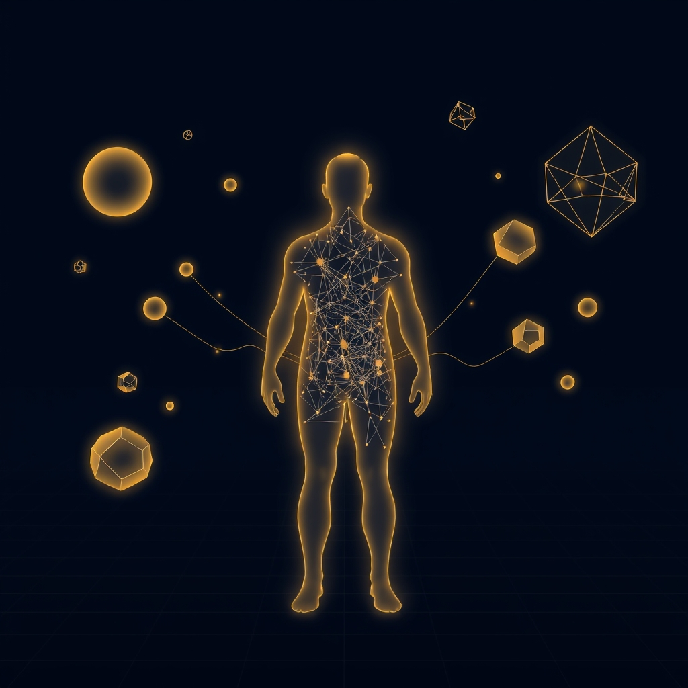

[Home](../index.md) > [Books](./index.md)  
# ℹ️ Information: A Very Short Introduction  
  
[🛒 Information: A Very Short Introduction. As an Amazon Associate I earn from qualifying purchases.](https://amzn.to/4jwu95Q)  
  
## 📚 Book Report: ℹ️ Information: A Very Short Introduction  
  
### 📖 Introduction  
  
* 👤 **Author:** Luciano Floridi, a leading philosopher of information and information ethics at the University of Oxford.  
* 📰 **Series:** Part of the highly regarded "A Very Short Introduction" series by Oxford University Press, known for concise yet authoritative introductions to complex topics.  
* 💡 **Topic:** Provides an illuminating exploration of the concept of information, examining its nature, role, dynamics, and profound impact across various fields and society.  
  
### 🔑 Key Concepts Discussed  
  
* 🔤 **Defining Information:** Explores the roots of information in mathematics (e.g., Claude Shannon's work) and science, distinguishing it from data and knowledge. Floridi proposes his own General Definition of Information (GDI) as well-formed, meaningful, and truthful data.  
* 🌳 **Nature of Information:** Discusses information as a physical phenomenon, a communication process, and its semantic meaning and value.  
* 🔄 **Information Dynamics:** Touches upon the processing, transmission, and storage of information.  
* 🎯 **Information's Role:** Examines the significance of information in diverse fields like biology (🧬 genetics as information), computing, and physics.  
* 🌍 **The Information Society:** Addresses the emergence of a society reliant on information, including concepts like "infoglut" (🤯 information overload).  
* ⚖️ **Ethical and Social Implications:** Considers critical issues such as privacy, ownership, copyright, open source, accessibility, and the digital divide.  
  
### 📢 Core Arguments/Thesis  
  
* 🌟 Information is a fundamental concept central to modern science and society, arguably as significant as energy or matter.  
* 🤔 Understanding information requires a philosophical approach that goes beyond mere technical definitions to grasp its meaning and value.  
* 📱 The rise of information and communication technologies (ICTs) is creating a new environment (the "infosphere") that profoundly shapes human reality and leads to new ethical challenges.  
  
### 🎯 Target Audience and Style  
  
* 🧑‍🎓 Written for newcomers and non-specialists seeking an accessible overview of the concept of information.  
* ✍️ Combines philosophical depth with clarity, wit, and an engaging style, typical of the VSI series.  
* 🚫 While mentioning mathematical roots (like Shannon), it avoids deep technical jargon, making it broadly approachable.  
  
### 🏁 Conclusion/Overall Impression  
  
* ✨ Floridi offers a brilliant, concise, and thought-provoking introduction to the multifaceted concept of information.  
* 🌐 It effectively highlights the pervasive influence and complexity of information in contemporary life, spanning scientific, technological, social, and ethical domains.  
* 🚀 Serves as an excellent starting point for anyone wishing to understand the philosophical underpinnings and broad implications of information in the modern world.  
  
## 📚 Further Reading Recommendations  
  
### 📑 Similar Books (Exploring Information & its Philosophy)  
  
* 📖 **The Information: A History, a Theory, a Flood** by James Gleick: A comprehensive and engaging historical account of information, tracing its development from early communication methods (like African talking drums) through key figures (Babbage, Shannon, Turing) to the digital age and the challenges of the "information flood". It covers the history, theory, and societal impact in detail.  
* 📖 **The Fourth Revolution: How the Infosphere is Reshaping Human Reality** by Luciano Floridi: Floridi's own more extensive work, building on the ideas in the VSI. It explores how ICTs are fundamentally changing our understanding of reality, identity, privacy, politics, and ethics, arguing we've entered an era of 'hyperhistory' dependent on information management.  
* 📖 **Being Digital** by Nicholas Negroponte: A classic (though now somewhat dated) exploration of the shift from atoms to bits and the implications of digital life.  
* 📖 **Code: The Hidden Language of Computer Hardware and Software** by Charles Petzold: Delves into the technical foundations of how information is encoded and processed in computers, starting from basic concepts like Morse code and building up to complex hardware and software interactions.  
* 📖 **Elements of Information Theory** by Thomas M. Cover & Joy A. Thomas: A standard textbook offering a rigorous mathematical treatment of information theory, focusing on concepts like entropy, data compression, and channel capacity. (More technical than Floridi or Gleick).  
* 📖 **An Introduction to Information Theory: Symbols, Signals and Noise** by John R. Pierce: An accessible introduction to the core concepts of Shannon's information theory.  
  
### ⚠️ Contrasting Perspectives (Critical Views on Information/Technology)  
  
* **[📱🧠 The Shallows: What the Internet Is Doing to Our Brains](./the-shallows-what-the-internet-is-doing-to-our-brains.md)** by Nicholas Carr: Argues that the constant connectivity and information flow of the internet are negatively impacting our cognitive abilities, particularly deep thinking and concentration.  
* **[📺💀 Amusing Ourselves to Death: Public Discourse in the Age of Show Business](./amusing-ourselves-to-death-public-discourse-in-the-age-of-show-business.md)** by Neil Postman: A pre-internet critique arguing that television as a medium degrades public discourse by prioritizing entertainment over substance – arguments that many find relevant to the internet age.  
* 📖 **Technopoly: The Surrender of Culture to Technology** by Neil Postman: Expands on his critique, arguing that technology subtly reshapes culture and values, often in undesirable ways.  
* 📖 **The Cult of the Amateur: How Today's Internet is Killing Our Culture** by Andrew Keen: A polemical critique arguing that user-generated content and the decline of traditional gatekeepers are eroding cultural standards and expertise.  
* 📖 **The Future of Reputation: Gossip, Rumor, and Privacy on the Internet** by Daniel Solove: Focuses specifically on the challenges to privacy and reputation management in the digital age.  
  
### 🎨 Creatively Related Books (Broader Themes, Tangential Connections)  
  
* 📖 **[Gödel, Escher, Bach: An Eternal Golden Braid](./godel-escher-bach.md)** by Douglas Hofstadter: A Pulitzer Prize-winning exploration of consciousness, self-reference, and intelligence through analogies drawn from mathematics (Gödel), art (Escher), and music (Bach). Connects deeply to themes of representation and systems.  
* 📖 **[Sapiens: A Brief History of Humankind](./sapiens-a-brief-history-of-humankind.md)** by Yuval Noah Harari: Discusses the crucial role of shared fictions, language, and information processing (like writing and money) in human cooperation and dominance.  
* 📖 **[Thinking, Fast and Slow](./thinking-fast-and-slow.md)** by Daniel Kahneman: Explores the cognitive biases and heuristics that shape how humans process information and make decisions.  
* 📖 **Understanding Media: The Extensions of Man** by Marshall McLuhan: The seminal work introducing the idea that "the medium is the message," arguing that the technology of communication itself, rather than just the content, shapes society and perception.  
* 📖 **The Master Algorithm** by Pedro Domingos: Explores the quest within machine learning for a single, universal algorithm capable of learning anything from data – a specific application of information processing.  
* 📖 **Why Information Grows: The Evolution of Order, from Atoms to Economies** by Cesar A. Hidalgo: Presents a perspective connecting the growth of information to physical embodiment and economic complexity.  
  
## 💬 [Gemini](../software/gemini.md) Prompt (gemini-2.5-pro-exp-03-25)  
> Write a markdown-formatted (start headings at level H2) book report, followed by a plethora of additional similar, contrasting, and creatively related book recommendations on Information A Very Short Introduction. Be thorough in content discussed but concise and economical with your language. Structure the report with section headings and bulleted lists to avoid long blocks of text.