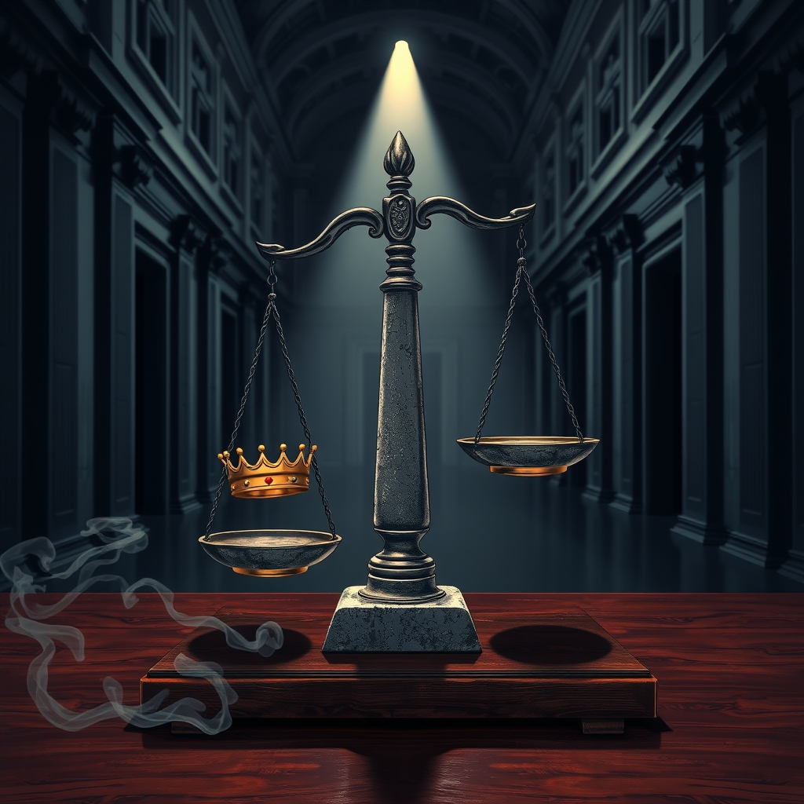

[Home](../index.md) > [Books](./index.md)  
# 🏛️💔 Injustice: How Politics and Fear Vanquished America's Justice Department  
  
[🛒 Injustice: How Politics and Fear Vanquished America's Justice Department. As an Amazon Associate I earn from qualifying purchases.](https://amzn.to/3LnOMG3)  
  
⚖️ Injustice: How Politics and Fear Vanquished America's Justice Department by Carol Leonnig and Aaron C. Davis reveals how political pressure and strategic caution undermined the integrity of the U.S. Justice Department, potentially jeopardizing the rule of law. ⚖️ 🏛️ 🚨  
  
## 🏆 Leonnig & Davis's Justice Department Independence Strategy  
  
### ➡️ Executive Overreach & Pressure  
* 🎯 **Targeting Enemies:** Presidential administrations using DOJ to pursue political adversaries.  
* 🛡️ **Shielding Allies:** Pressuring appointees to protect politically connected individuals.  
* 👑 **Loyalty Over Merit:** Appointing officials based on political fidelity rather than professional experience.  
* 🚧 **Circumventing Senate:** Utilizing interim appointments to bypass confirmation.  
  
### 🏛️ Internal Vulnerabilities  
* 📉 **Erosion of Career Staff:** Dismissal of experienced attorneys for political reasons.  
* 😞 **Morale Decline:** Hostility toward career employees leading to exodus.  
* 🗳️ **Politicized Hiring:** Control of hiring by political appointees, prioritizing partisan alignment.  
  
### ⚠️ Strategic Caution's Double Edge  
* ⏳ **Delayed Investigations:** Attorney General's slow-walking of high-profile cases.  
* 🚫 **Precedent Avoidance:** Hesitation to act decisively due to concerns about setting future legal precedents.  
* 🎭 **Perceived Impartiality:** Prioritizing the *appearance* of non-partisanship over swift justice.  
  
## ⚖️ Critical Evaluation  
  
📖 The book Injustice: How Politics and Fear Vanquished America's Justice Department by Carol Leonnig and Aaron C. Davis critically examines the erosion of the U.S. Justice Department's independence under recent administrations.  
  
* 🏛️ The book asserts that the Trump administration extensively politicized the DOJ, coercing appointees to shield allies, target opponents, and even assist in efforts to overturn the 2020 election. This aligns with broader criticisms and reports on political interference during that period.  
* 🤔 Leonnig and Davis also critique the Biden administration's Attorney General, Merrick Garland, for what they describe as principled, cautious and slow decision-making in investigations related to former President Trump. This cautious approach, intended to avoid politicization or setting negative legal precedents, is argued to have inadvertently hampered accountability and left the department vulnerable.  
* ⚔️ The authors reveal a daily war secretly waged for the soul of the department, citing examples like Stephen Miller's role in the purported purging of FBI agents who investigated Trump. This highlights internal resistance and the severe pressure faced by career officials.  
* 🕰️ While primarily focusing on recent events, the book’s themes resonate with historical instances of Justice Department politicization, such as the U.S. attorney firing scandal during the George W. Bush administration and the Saturday Night Massacre under Richard Nixon, indicating a recurring challenge to DOJ independence. These historical precedents underscore that the struggle for an impartial Justice Department is ongoing and transcends single administrations.  
  
✅ **Verdict:** Injustice provides a compelling and well-sourced account arguing that the Justice Department's foundational principles have been severely compromised by direct political manipulation and, paradoxically, by an overabundance of caution in upholding impartiality. Its core claim—that both aggressive interference and strategic reticence have undermined America's justice system—is robustly supported by detailed reporting and corroborated by external analyses of the periods discussed.  
  
## 🔍 Topics for Further Understanding  
  
* 🏛️ The structural vulnerabilities within the Department of Justice that enable political interference.  
* 🌎 Comparative analysis of justice system independence in other advanced democracies.  
* 📝 Specific legislative or administrative reforms proposed to insulate the DOJ from political pressure.  
* ⚖️ The long-term impact of perceived politicization on public trust in federal law enforcement.  
* 📰 The role of media scrutiny and whistleblower protections in safeguarding DOJ integrity.  
* 🧑‍⚖️ The ethical frameworks guiding prosecutorial discretion and political appointee conduct.  
  
## ❓ Frequently Asked Questions (FAQ)  
  
### 💡 Q: Which presidential administrations does Injustice primarily cover?  
✅ A: The book primarily covers the Trump and Biden administrations, with a focus on the Trump administration's efforts to politicize the Justice Department and the Biden administration's cautious approach to investigations involving Trump.  
  
### 💡 Q: What is the central argument of Injustice: How Politics and Fear Vanquished America's Justice Department?  
✅ A: The central argument is that the Justice Department's independence and its commitment to the rule of law were severely undermined by overt political pressure from the executive branch and by an overly cautious approach to politically sensitive investigations.  
  
### 💡 Q: Does the book Injustice: How Politics and Fear Vanquished America's Justice Department criticize Attorney General Merrick Garland?  
✅ A: Yes, the book criticizes Attorney General Merrick Garland for what the authors describe as a principled, cautious and slow decision-making in cases related to Donald Trump, suggesting that this hesitation potentially hindered accountability.  
  
## 📚 Book Recommendations  
  
### 🤝 Similar  
* 👑 Takeover: The Return of the Imperial Presidency and the Subversion of American Democracy by Charlie Savage  
* 🏛️ Power Wars: Inside Obama's Post-9/11 Presidency by Charlie Savage  
* ⚖️ The Rule of Law: Why Courts Matter by Thomas Bingham  
  
### ↔️ Contrasting  
* 👑 The Imperial Presidency by Arthur M. Schlesinger Jr.  
* 🛡️ Defending the Executive Branch by Saikrishna Prakash  
  
### 🔗 Related  
* [💰🤫 Dark Money: The Hidden History of the Billionaires Behind the Rise of the Radical Right](./dark-money-the-hidden-history-of-the-billionaires-behind-the-rise-of-the-radical-right.md) by Jane Mayer  
* 😵‍💫 Chaos: Charles Manson, the CIA, and the Secret History of the Sixties by Tom O'Neill  
  
## 🫵 What Do You Think?  
🤔 How do you believe the balance between executive power and Justice Department independence should be maintained? What are the most critical reforms needed to protect the rule of law in America?