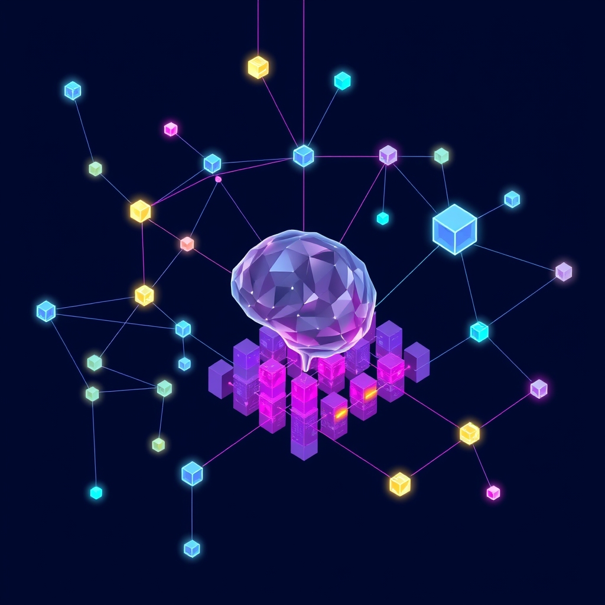

[Home](../index.md) > [Books](./index.md)  
# 🧠🔗🤔💡 Knowledge Representation and Reasoning  
  
by Ronald Brachman and Hector Levesque  
[🛒 Knowledge Representation and Reasoning. As an Amazon Associate I earn from qualifying purchases.](https://amzn.to/4knpJ2j)  
  
## 🤖 AI Summary  
### TL;DR 🤓  
🧠 Knowledge Representation and Reasoning (KR&R) is about 🧱 building formal systems that can ℹ️ represent knowledge and 💡 perform reasoning tasks in a way that is both ✅ logically sound and 💻 computationally tractable, ⚖️ focusing on the trade-offs between 🗣️ expressiveness and ⏱️ efficiency.  
  
### New or Surprising Perspective 🤔  
The book's strength lies in its emphasis on the 🤯 *limitations* of various KR&R approaches. 🧐 It doesn't just present methods; it meticulously dissects their assumptions, ⚙️ computational complexity, and 🌍 applicability to real-world problems. This critical, 😔 somewhat pessimistic, perspective (especially regarding the ⚖️ "scalability" of expressive logics) can be 😲 surprising to those who are new to the field and might initially expect more straightforward solutions. 🧭 It steers away from blindly adopting a particular formalism and encourages a deeper understanding of the 🤝 underlying trade-offs involved.  
  
### Deep Dive 🏊‍♀️  
  
#### Topics Covered 📚  
  
* **Introduction to Knowledge Representation:** Defining knowledge, reasoning, and representation. 🧠  
* **Logical Foundations:** Propositional logic, first-order logic (FOL), and their limitations. ➕➖✖️➗  
* **Semantic Networks and Description Logics:** Representing knowledge using graphs and structured descriptions. 🕸️  
* **Production Systems:** Rule-based reasoning and inference mechanisms. ⚙️  
* **Inheritance and Taxonomic Reasoning:** Reasoning about categories and their relationships. 👪  
* **Defaults and Nonmonotonic Reasoning:** Handling incomplete or uncertain information. 🤷‍♀️  
* **Reasoning about Time and Action:** Representing and reasoning about events, processes, and change. ⏳  
* **Situation Calculus and Event Calculus:** Formalisms for reasoning about actions and their effects. 🎬  
* **Knowledge Representation and the Web (Briefly):** Discussing the application of KR to the semantic web. 🌐  
  
#### Methods and Research Discussed 🔬  
  
* **Theorem Proving:** Using logical inference rules to derive conclusions. 🧑‍⚖️  
* **Model Checking:** Verifying that a system satisfies certain properties by exploring all possible states. ✅  
* **Description Logic Reasoning (e.g., Tableau algorithms):** Algorithms for checking subsumption, consistency, and other DL-specific inferences. 🖥️  
* **Resolution Theorem Proving:** A specific form of theorem proving that uses resolution as the primary inference rule. 🚀  
* **Forward and Backward Chaining:** Inference strategies for production systems. ➡️ ⬅️  
* **Circumscription:** A method for nonmonotonic reasoning that minimizes the extent of certain predicates. 📉  
* **Default Logic:** A nonmonotonic logic that allows reasoning with default assumptions. ⚠️  
  
#### Significant Theories, Theses, and Mental Models 💡  
  
* **The Knowledge Level:** Newell's concept of analyzing systems based on what they know, regardless of the underlying implementation. 🤓  
* **The Trade-off between Expressiveness and Tractability:** The central thesis that more expressive representation languages often lead to computationally harder reasoning problems. ⚖️  
* **The Importance of Semantics:** The need for clear and unambiguous meanings for representational elements. 💬  
* **The Frame Problem:** The difficulty of representing the effects of actions and avoiding unintended consequences. 🖼️  
* **The Qualification Problem:** The difficulty of specifying all the preconditions necessary for an action to succeed. 🤔  
* **The Ramification Problem:** The problem of specifying all the indirect consequences of an action. ⛓️  
  
#### Prominent Examples Discussed 🏦  
  
* **The Blocks World:** A classic AI planning domain involving manipulating blocks on a table. 🧱  
* **The Yale Shooting Problem:** A famous example illustrating the difficulties of reasoning about time and action with defaults. 🔫  
* **Family Trees:** Used to demonstrate inheritance and taxonomic reasoning. 🌳  
* **Medical Diagnosis:** Used to illustrate the application of knowledge representation to a real-world problem. 🩺  
  
#### Practical Takeaways 🛠️  
  
* **Choose the Right Representation:** Select a representation formalism that is appropriate for the task at hand, considering the trade-offs between expressiveness and tractability. 🎯  
* **Understand the Semantics:** Define the meaning of your representational elements precisely. 🗣️  
* **Consider Computational Complexity:** Be aware of the computational cost of reasoning with your chosen representation. 💸  
* **Use Modular Design:** Break down complex knowledge bases into smaller, more manageable modules. 🧩  
* **Test and Evaluate:** Thoroughly test and evaluate your knowledge-based systems to ensure that they are performing as expected. 🧪  
  
#### Quality of Information 💯  
  
The book is generally considered a high-quality resource.  
  
* **Author Credentials:** Ronald Brachman and Hector Levesque are highly respected researchers in the field of knowledge representation and reasoning. 👨‍🏫  
* **Rigor:** The book provides a rigorous and formal treatment of the subject matter. 💪  
* **Comprehensiveness:** It covers a wide range of topics in knowledge representation and reasoning. 📚  
* **Critical Analysis:** The book critically examines the strengths and weaknesses of different approaches. 🧐  
* **Scientific Backing:** The concepts presented are grounded in established research and theory. 🧪  
  
#### Additional Book Recommendations 📚  
  
* **Best Alternate Book on the Same Topic:** [🤖🧠 Artificial Intelligence: A Modern Approach](./artificial-intelligence-a-modern-approach.md) by Stuart Russell and Peter Norvig - covers KR&R in a broader AI context. 🤖  
* **Best Tangentially Related Book:** [♾️📐🎶🥨 Gödel, Escher, Bach: An Eternal Golden Braid](./godel-escher-bach.md) by Douglas Hofstadter - explores the relationship between formal systems, meaning, and consciousness. ♾️  
* **Best Diametrically Opposed Book:** (Difficult to suggest a truly "diametrically opposed" book, as the core principles are fundamental) Perhaps a book focused solely on deep learning, such as [🧠💻🤖 Deep Learning](./deep-learning.md) by Ian Goodfellow, Yoshua Bengio, and Aaron Courville, as it emphasizes learning from data rather than explicit knowledge representation. 🧠  
* **Best Fiction Book that Incorporates Related Ideas:** "Permutation City" by Greg Egan - explores themes of simulated realities and the nature of consciousness. 🌃  
* **Best Book that is More General:** "Artificial Intelligence: Structures and Strategies for Complex Problem Solving" by George Luger - provides a broad overview of AI. 🗺️  
* **Best Book that is More Specific:** Specific research papers on particular KR&R formalisms or applications, such as papers on OWL or specific description logic reasoners. 🔬  
* **Best Book that is More Rigorous:** Technical papers from journals like *Artificial Intelligence* or *Journal of Logic and Computation*. 🤓  
* **Best Book that is More Accessible:** "Paradigms of Artificial Intelligence Programming: Case Studies in Common Lisp" by Peter Norvig - offers a practical, example-driven approach to AI, including some KR techniques. 👨‍💻  
  
## 💬 [Gemini](https://gemini.google.com) Prompt  
> Summarize the book: Knowledge Representation and Reasoning by Ronald Brachman and Hector Levesque. Start with a TL;DR - a single statement that conveys a maximum of the useful information provided in the book. Next, explain how this book may offer a new or surprising perspective. Follow this with a deep dive. Catalogue the topics, methods, and research discussed. Be sure to highlight any significant theories, theses, or mental models proposed. Summarize prominent examples discussed. Emphasize practical takeaways, including detailed, specific, concrete, step-by-step advice, guidance, or techniques discussed. Provide a critical analysis of the quality of the information presented, using scientific backing, author credentials, authoritative reviews, and other markers of high quality information as justification. Make the following additional book recommendations: the best alternate book on the same topic; the best book that is tangentially related; the best book that is diametrically opposed; the best fiction book that incorporates related ideas; the best book that is more general or more specific; and the best book that is more rigorous or more accessible than this book. Format your response as markdown, starting at heading level H3, with inline links, for easy copy paste. Use meaningful emojis generously (at least one per heading, bullet point, and paragraph) to enhance readability. Do not include broken links or links to commercial sites.