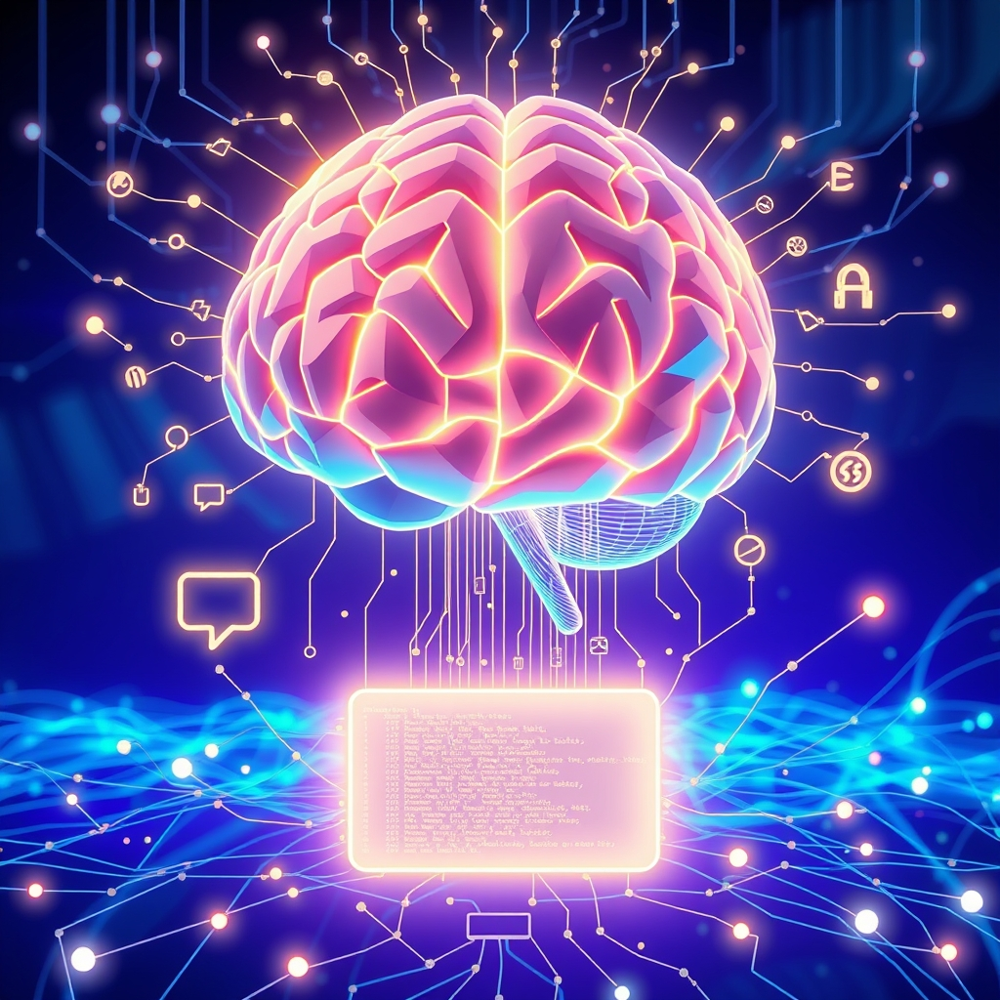

[Home](../index.md) > [Books](./index.md)  
# 🤖🦜 Large Language Models: Concepts, Techniques and Applications  
  
[🛒 Large Language Models: Concepts, Techniques and Applications. As an Amazon Associate I earn from qualifying purchases.](https://amzn.to/3Ty40sY)  
  
## 📖 Book Report: Large Language Models: Concepts, Techniques and Applications  
  
### 💡 Overview  
  
"Large Language Models: Concepts, Techniques and Applications" serves as an introduction to the science and applications of Large Language Models (LLMs), which are at the heart of revolutionary AI applications like conversational systems, machine translation, and text generation. 📚 The book aims to demystify how LLMs work, explore available models and their evaluation, and guide readers in building simple LLM applications. 💻 It combines theory and practice across six chapters, including Python exercises on the Colab platform.  
  
### 🧠 Key Concepts Covered  
  
📖 The book delves into the foundational concepts underpinning LLMs.  
  
* 🗣️ **Natural Language Processing (NLP):** It highlights NLP as the rapidly evolving discipline enabling machines to understand and generate human language.  
* 🤖 **Deep Neural Networks and Attention Mechanisms:** The book covers the underlying deep learning methodologies, including deep neural networks and attention mechanisms, which are crucial to LLMs' power to capture complex patterns.  
* 🔑 **LLM Fundamentals:** It explains how LLMs work and their ability to learn contextual representations of language.  
* 📊 **Model Evaluation:** The book discusses benchmarks used to evaluate LLM capabilities.  
  
### ⚙️ Techniques and Applications Discussed  
  
🚀 The publication explores various techniques and applications of LLMs.  
  
* 🏗️ **Building Simple Applications:** It guides readers on how to create basic applications using LLMs.  
* ⭐ **Relevant LLMs:** The book covers prominent models such as BERT, GPT-4, LLaMA, Palm-2, and Falcon.  
* 📝 **NLP Tasks:** It focuses on the application of LLMs in various NLP tasks.  
* 🌍 **Real-World Use Cases:** The book provides numerous examples and use cases demonstrating the tangible benefits of LLMs in everyday life and various industries, including conversational systems, machine translation, summary generation, and question answering.  
  
### 🎯 Target Audience  
  
🧑‍🎓 The book caters to a diverse audience spanning both industry and academia.  
  
* 👨‍💻 **AI Professionals and Data Scientists:** Those involved in AI, particularly NLP and deep learning, will find value in the technical underpinnings.  
* 📚 **Students and Academic Researchers:** Graduate students and researchers specializing in AI and NLP will find it a valuable resource for a robust foundation.  
* 💼 **Professionals in Related Fields:** Individuals in domains like machine translation, content generation, and chatbots can gain insights into optimizing their work processes with LLMs.  
* 👨‍🏫 **Prerequisites:** Familiarity with basic machine learning or deep learning techniques and proficiency in Python are recommended for better comprehension.  
  
### 👍 Strengths  
  
* ✨ **Accessible Introduction:** Offers a technical yet accessible introduction to LLMs.  
* 🤝 **Theory and Practice:** Combines theoretical concepts with practical exercises in Python.  
* ✅ **Comprehensive Coverage:** Covers foundations, methodologies, cutting-edge models, and practical use cases.  
* 🏢 **Industry and Academia Relevant:** Valuable for a broad range of professionals and students.  
  
## ➕ Additional Book Recommendations  
  
### 📚 Similar Books (Concepts, Techniques, Applications)  
  
* ⭐ ***Decoding Large Language Models*** by Irena Cronin: Provides a thorough journey through LLM architecture, training, and application, balancing theoretical foundations with practical examples and covering advanced topics like fine-tuning and ethical considerations.  
* 🚀 ***Quick Start Guide to Large Language Models: Strategies and Best Practices for Using ChatGPT and Other LLMs*** by Sinan Ozdemir: A practical guide exploring the function, capabilities, and limitations of prominent LLMs, focusing on chat systems and leveraging frameworks like LangChain for application implementation.  
* 🧠 ***Understanding Large Language Models: Learning Their Underlying Concepts and Technologies***: Explores the underlying concepts and technologies of LLMs.  
* **[🤖🗣️ Hands-On Large Language Models: Language Understanding and Generation](./hands-on-large-language-models-language-understanding-and-generation.md)** by Jay Alammar: Offers a practical resource for leveraging pretrained LLMs for various applications like text classification and retrieval-augmented generation (RAG), using intuitive diagrams and example-based walkthroughs.  
* 🎓 ***Foundations of Large Language Models*** by Tong Xiao and Jingbo Zhu: An academically grounded book focusing on the theoretical underpinnings like pretraining objectives, RLHF, and instruction tuning.  
  
### ⚖️ Contrasting Books (Different Perspectives or Related Fields)  
  
* 🛠️ ***Build a Large Language Model (From Scratch)*** by Sebastian Raschka: Takes a hands-on approach to building an LLM step-by-step without relying on existing libraries, providing a deep understanding of the internal workings.  
* 🏭 ***LLMs in Production*** by Christopher Brousseau and Matthew Sharp: Focuses on the practical aspects of deploying LLM-based applications in production environments, covering MLOps, efficiency, scaling, and cost considerations.  
* 🌐 ***Transformers for Natural Language Processing*** by Denis Rothman: While LLMs are often based on transformers, this book offers a deep dive specifically into transformer architectures and their application in NLP more broadly.  
* 💬 ***Practical Natural Language Processing***: A broader look at NLP techniques beyond just large language models.  
  
### 💡 Creatively Related Books (Broader AI, Philosophy, Ethics, etc.)  
  
* 📈 ***Introduction to Large Language Models for Business Leaders: Responsible AI Strategy Beyond Fear and Hype*** by I Almeida: Focuses on the strategic and business implications of LLMs, including responsible AI.  
* **[💾⬆️🛡️ Designing Data-Intensive Applications: The Big Ideas Behind Reliable, Scalable, and Maintainable Systems](./designing-data-intensive-applications.md)** by Martin Kleppmann: While not directly about LLMs, this book is highly relevant for understanding the underlying systems and data infrastructure required to build and deploy large-scale AI applications.  
* **[⌨️🤖 Prompt Engineering for LLMs: The Art and Science of Building Large Language Model-Based Applications](./prompt-engineering-for-llms-the-art-and-science-of-building-large-language-model-based-applications.md)** by John Berryman and Albert Ziegler: Concentrates on the crucial skill of crafting effective prompts to get the best results from LLMs, a vital practical aspect of working with these models.  
* **[🤖🏗️ AI Engineering: Building Applications with Foundation Models](./ai-engineering-building-applications-with-foundation-models.md)**: A broader look at the principles and practices of building AI applications with foundation models, including prompt engineering and model evaluation.  
* 🤔 Books on the philosophy of AI or the ethics of artificial intelligence would provide a contrasting, more theoretical perspective on the societal impact and considerations surrounding powerful AI systems like LLMs. (Based on the general knowledge about AI ethics)  
  
## 💬 [Gemini](../software/gemini.md) Prompt (gemini-2.5-flash-preview-04-17)  
> Write a markdown-formatted (start headings at level H2) book report, followed by a plethora of additional similar, contrasting, and creatively related book recommendations on Large Language Models: Concepts, Techniques and Applications. Be thorough in content discussed but concise and economical with your language. Structure the report with section headings and bulleted lists to avoid long blocks of text.