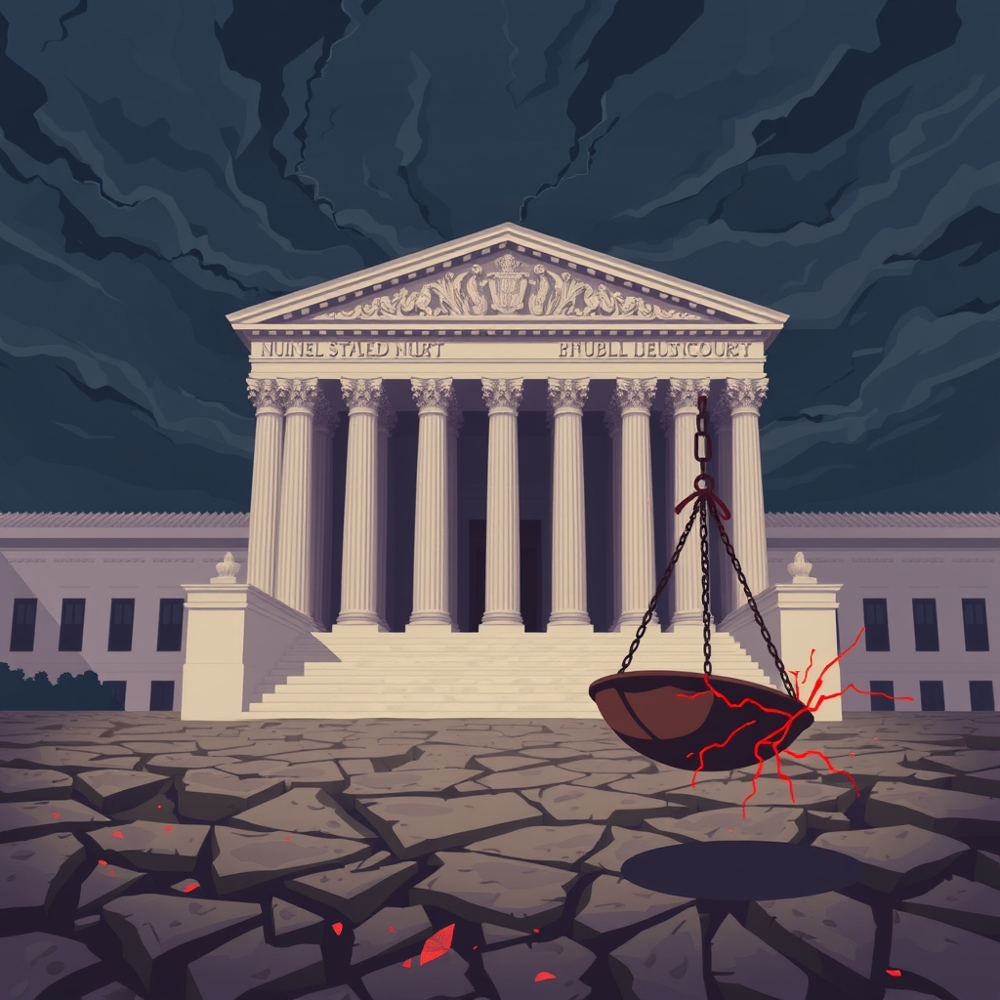

[Home](../index.md) > [Books](./index.md)  
# 🇺🇸🏛️🚫📜⚖️ Lawless: How the Supreme Court Runs on Conservative Grievance, Fringe Theories, and Bad Vibes  
  
[🛒 Lawless: How the Supreme Court Runs on Conservative Grievance, Fringe Theories, and Bad Vibes. As an Amazon Associate I earn from qualifying purchases.](https://amzn.to/45MWIc7)  
  
## 📖 Book Report: Lawless: How the Supreme Court Runs on Conservative Grievance, Fringe Theories, and Bad Vibes  
  
**✍️ Author:** Leah Litman  
  
**🗓️ Published:** 2024  
  
**🔎 Overview:**  
  
⚖️ Leah Litman's *Lawless* presents a critical examination of the current conservative majority on the United States Supreme Court. 🏛️ The book's central thesis is that the Court's decisions are increasingly driven not by consistent legal principles, adherence to text or history, or established precedent, but rather by conservative grievance, fringe legal theories, and a pervasive sense of "bad vibes" reflecting partisan political aims. 🎙️ Litman, a law professor and co-host of the *Strict Scrutiny* podcast, argues that a majority of the justices are motivated by a belief that Republicans and conservatives are unfairly treated in a changing society and use their judicial power to advance the interests and values of the Republican Party.  
  
**🔑 Key Themes and Arguments:**  
  
* ✨ **The Primacy of "Vibes" Over Law:** Litman contends that the conservative justices often prioritize outcomes aligned with conservative political goals over rigorous legal reasoning. 🤔 She describes this approach as the Court running on "vibes" – legal-ish justifications that repackage conservative political grievances.  
* 😢 **Conservative Grievance as a Driving Force:** The book highlights how a perceived sense of victimhood among conservatives fuels the Court's agenda. 🛡️ This includes areas such as the separation of church and state, LGBTQ+ rights, voting rights, and reproductive justice, where the Court is seen as actively working to protect a religious and social conservative minority.  
* 📜 **Disregard for Text, History, and Precedent:** Litman challenges the conservative justices' claims of strictly adhering to the text and history of the Constitution. 🧐 She provides examples where the Court has, in her view, disregarded or selectively applied these interpretive methods to reach desired outcomes.  
* 🗳️ **Partisan Outcomes in Key Areas:** The book analyzes significant contemporary constitutional law issues and demonstrates how the conservative majority's decisions consistently favor outcomes aligned with Republican political platforms, including issues related to the unitary executive.  
* ⚖️ **Critique of Judicial Ethics:** While not the sole focus, the book touches upon issues related to judicial ethics, viewing certain actions and sentiments of the justices as contributing to the "bad vibes" and perception of partisan bias.  
  
**✍️ Author's Approach:**  
  
🎭 Litman employs a witty, accessible, and often irreverent style to dissect complex legal concepts and judicial decisions. 🎓 Drawing on her legal expertise and experience, she aims to make the workings of the Supreme Court understandable to a broader audience, often incorporating pop culture references and sharp commentary. 🔥 The book is described as a "scathing takedown" and a "clear-eyed and alarming view" that is both informative and engaging.  
  
## 📚 Additional Book Recommendations  
  
**🤝 Similar Books (Critical of the Conservative Court/Legal Movement):**  
  
* 🏛️ **The Authority of the Court and the Peril of Politics** by Stephen Breyer  
    * 📢 While written by a former liberal justice, Breyer's book discusses the importance of public trust in the Court and the dangers of it being seen as a political institution, aligning with Litman's concerns about the current Court's direction and public perception.  
* 🙏 **The Gospel According to the Supreme Court: The Struggle to Establish America's Promised Land** by Kevin Kruse, Abraham Newman, and Joanne Pope Melish  
    * ⛪ This book examines the historical and ongoing relationship between religion and the Supreme Court's decisions, offering a broader context for Litman's points about the Court's approach to the separation of church and state and the favoring of religious conservative viewpoints.  
* 🗳️ **Minority Leader: How to Lead from the Outside and Make Change** by Stacey Abrams  
    * 🔑 While not solely focused on the judiciary, Abrams' work on voting rights and democratic participation provides crucial context for understanding one of the key areas Litman argues the conservative Court is actively reshaping based on partisan goals.  
  
**⚔️ Contrasting Books (Offering Different Perspectives or Defenses):**  
  
* 🗽 **The Constitution of Liberty** by F.A. Hayek  
    * 💡 A foundational text for some conservative legal thinkers, this book presents a philosophical argument for limited government and individual liberty that underpins many of the legal theories favored by the conservative legal movement, offering a contrasting ideological framework to Litman's critique.  
* 🗣️ **A Matter of Interpretation: Federal Courts and the Law** by Antonin Scalia  
    * 📜 This book outlines the late Justice Scalia's philosophy of originalism and textualism, providing a direct counterpoint to Litman's argument that conservative justices disregard text and history. 👓 Reading Scalia offers insight into the stated judicial philosophy of justices Litman critiques.  
* ⚖️ **Democracy and Distrust: A Theory of Judicial Review** by John Hart Ely  
    * 💭 A classic in legal theory, Ely's work explores the role of judicial review in a democratic society. 🛡️ While not strictly a defense of the current conservative court, it offers a theoretical framework for thinking about the limits of judicial power and the relationship between the Court and representative branches, a topic implicitly raised by Litman's analysis of a Court driven by minority grievances.  
  
**🎨 Creatively Related Books (Exploring Broader Themes or Contexts):**  
  
* **[💰🤫 Dark Money: The Hidden History of the Billionaires Behind the Rise of the Radical Right](./dark-money-the-hidden-history-of-the-billionaires-behind-the-rise-of-the-radical-right.md)** by Jane Mayer  
    * 🕵️‍♀️ While not exclusively about the judiciary, Mayer's investigative work reveals the funding networks and ideological infrastructure supporting the conservative legal movement and the appointment of conservative judges, providing important context for understanding the forces behind the Court Litman describes.  
* **[🇺🇸📖 These Truths: A History of the United States](./these-truths-a-history-of-the-united-states.md)** by Jill Lepore  
    * 📜 A comprehensive history of the United States, Lepore's book provides a broad historical context for understanding the long-standing debates about the Constitution, the role of the judiciary, and the recurring tensions between different visions of America – issues that form the backdrop of the contemporary Court battles Litman details.  
* **[🇺🇸📜 The Federalist Papers](./the-federalist-papers.md)** by James Madison, Alexander Hamilton, and John Jay  
    * 🏛️ Reading the arguments of the framers regarding the structure and powers of the U.S. government, including the judiciary, offers essential historical context for evaluating contemporary debates about the Supreme Court's role and the justices' interpretive methodologies.  
* 🏘️ **Caste: The Origins of Our Discontents** by Isabel Wilkerson  
    * 🌍 Wilkerson's exploration of a rigid social hierarchy in the United States provides a different lens through which to view the concept of entrenched power and the systemic disadvantages faced by certain groups, offering a resonant, albeit not directly legal, parallel to Litman's discussion of a Court potentially protecting a specific minority group's interests.  
  
## 💬 [Gemini](../software/gemini.md) Prompt (gemini-2.5-flash-preview-04-17)  
> Write a markdown-formatted (start headings at level H2) book report, followed by a plethora of additional similar, contrasting, and creatively related book recommendations on Lawless: How the Supreme Court Runs on Conservative Grievance, Fringe Theories, and Bad Vibes. Be thorough in content discussed but concise and economical with your language. Structure the report with section headings and bulleted lists to avoid long blocks of text.