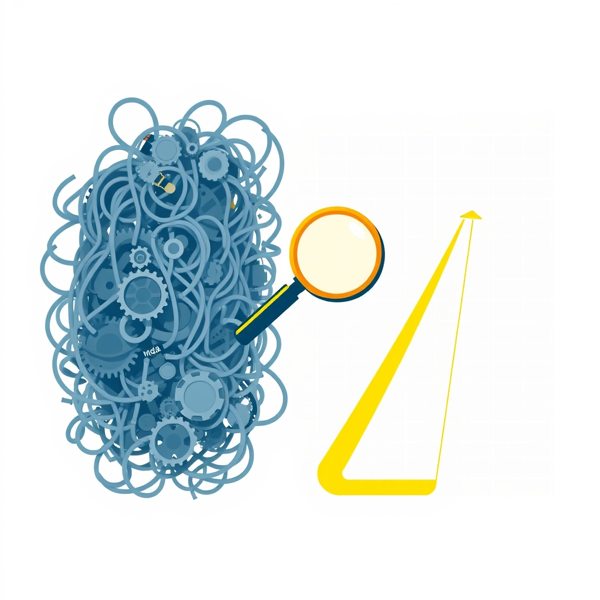

[Home](../index.md) > [Books](./index.md)  
# 🙈👁️💡🤔 Learning to See: Value-Stream Mapping to Add Value and Eliminate MUDA  
  
[🛒 Learning to See: Value-Stream Mapping to Add Value and Eliminate MUDA. As an Amazon Associate I earn from qualifying purchases.](https://amzn.to/4kTIB9d)  
  
## 🤖 AI Summary  
### **Learning to See: Value-Stream Mapping to Add Value and Eliminate MUDA** 🔍  
**TL;DR:** 📝 This book provides a practical, step-by-step guide to value-stream mapping, enabling organizations to identify and eliminate waste (muda) in their processes, ultimately improving efficiency and customer value.  
  
**New or Surprising Perspective:** 💡 While many lean methodologies focus on individual process improvements, "Learning to See" emphasizes the **holistic view** of the entire value stream. It reveals how seemingly efficient individual steps can contribute to overall inefficiency when viewed from a broader perspective. This highlights the importance of understanding the flow of information and materials across an entire organization, not just isolated pockets. It also demystifies the mapping process, making it accessible to a wider audience.  
  
#### **Deep Dive:** 🌊  
- **Topics:**  
    - Value-stream mapping (VSM) principles and techniques. 🗺️  
    - Identifying and categorizing the seven wastes (muda). 🗑️  
    - Creating current-state and future-state maps. 📈  
    - Implementing lean improvements based on VSM analysis. 🛠️  
    - The importance of information flow and material flow. 🔄  
    - Applying VSM in both manufacturing and service environments. 🏭 🏢  
    - Kaizen bursts and continuous improvement. 🚀  
- **Methods:**  
    - Step-by-step instructions for creating value-stream maps. 👣  
    - Using standardized symbols and icons for mapping. 📊  
    - Calculating key metrics like lead time and process time. ⏱️  
    - Analyzing data to identify bottlenecks and waste. 🔍  
    - Developing implementation plans for future-state improvements. 📝  
    - Team based activity. 🤝  
- **Research and Theories:**  
    - Rooted in Toyota Production System (TPS) principles. 🚗  
    - Emphasizes the concept of "flow" and "pull" systems. ➡️ ⬅️  
    - Draws on lean manufacturing and lean thinking methodologies. 💭  
    - Applies systems thinking to process analysis. 🌐  
- **Mental Models:**  
    - The "value stream" as a holistic system. 🌌  
    - "Muda" (waste) as anything that doesn't add value. 🚫  
    - The "current state" vs. the "future state" as a roadmap for improvement. 🛣️  
  
#### **Practical Takeaways:** 🎁  
- **Step-by-Step Mapping:**  
    - Start by defining the product family or service being mapped. 👨‍👩‍👧‍👦  
    - Walk the process, observing and documenting each step. 🚶‍♀️🚶‍♂️  
    - Collect data on process times, inventory levels, and information flow. 📊  
    - Draw the current-state map using standardized symbols. ✏️  
    - Analyze the map to identify waste and bottlenecks. 🚧  
    - Develop a future-state map with proposed improvements. 💡  
    - Create an implementation plan and track progress. 📈  
- **Waste Identification:**  
    - Look for overproduction, inventory, defects, waiting, transportation, motion, and over-processing. 🕵️‍♀️  
    - Use "5 Whys" to get to the root cause of problems. ❓❓❓❓❓  
    - Focus on eliminating waste, not just optimizing individual steps. 🎯  
- **Information Flow:**  
    - Map the flow of information alongside the material flow. 📜  
    - Identify information delays and inaccuracies. ⏳  
    - Implement visual management and electronic information systems. 🖥️  
- **Kaizen Bursts:**  
    - Conduct focused, short-term improvement events. ⚡  
    - Involve cross-functional teams. 🤝  
    - Implement quick wins and track results. ✅  
  
#### **Critical Analysis:** 🧐  
- **Quality:** The book is highly regarded for its clarity and practicality. The authors, Mike Rother and John Shook, have deep experience in lean manufacturing and are associated with the Lean Enterprise Institute. The book's methodology is grounded in proven TPS principles. Reviews consistently praise its accessibility and effectiveness. The use of standardized symbols and clear examples enhances its usability. The book is widely used in industry and academia, indicating its credibility.  
- **Scientific backing:** Lean principles are heavily tied to empirical observation and results in industrial settings. While not traditional scientific research, the methodologies are data driven, and the results are measurable. The book is well respected within the lean community.  
  
#### **Book Recommendations:** 📚  
- **Best Alternate (Same Topic):** "Value Stream Mapping: How to Visualize Work and Align Leadership for Organizational Transformation" by Karen Martin. It offers a broader perspective on organizational transformation using VSM. 🔄  
- **Tangentially Related:** "[📈⚙️♾️ The Goal: A Process of Ongoing Improvement](./the-goal.md)" by Eliyahu M. Goldratt. A novel that teaches the Theory of Constraints, a related methodology for process improvement. 🏭  
- **Diametrically Opposed:** "Reengineering the Corporation: A Manifesto for Business Revolution" by Michael Hammer and James Champy. This book promotes radical redesign rather than incremental improvement, contradicting the lean philosophy of continuous improvement. 💥  
- **Fiction (Related Ideas):** "[🐦‍🔥💻 The Phoenix Project](./the-phoenix-project.md): A Novel About IT, DevOps, and Helping Your Business Win" by Gene Kim, Kevin Behr, and George Spafford. This1 novel applies lean principles to IT operations. 💻  
- **More General:** "Lean Thinking" by James P. Womack and Daniel T. Jones. This book provides a broader overview of lean principles and their application. 💭  
- **More Specific:** "Creating Continuous Flow: An Action Guide for Managers, Engineers, and Production Associates" by Mike Rother and Rick Harris.2 This book focuses specifically on implementing continuous flow in manufacturing. ➡️  
- **More Rigorous:** "Toyota Production System: Beyond Large-Scale Production" by Taiichi Ohno. This is the original text by the creator of TPS, providing a deeper theoretical understanding. 📖  
- **More Accessible:** "[The Lean Startup](./the-lean-startup.md)" by Eric Ries. While focused on startups, it simplifies lean principles for a broader audience. 🚀  
  
## 💬 [Gemini](https://gemini.google.com) Prompt  
> Summarize the book: Learning to See: Value-Stream Mapping to Add Value and Eliminate Muda. Start with a TL;DR - a single statement that conveys a maximum of the useful information provided in the book. Next, explain how this book may offer a new or surprising perspective. Follow this with a deep dive. Catalogue the topics, methods, and research discussed. Be sure to highlight any significant theories, theses, or mental models proposed. Emphasize practical takeaways, including detailed, specific, concrete, step-by-step advice, guidance, or techniques discussed. Provide a critical analysis of the quality of the information presented, using scientific backing, author credentials, authoritative reviews, and other markers of high quality information as justification. Make the following additional book recommendations: the best alternate book on the same topic; the best book that is tangentially related; the best book that is diametrically opposed; the best fiction book that incorporates related ideas; the best book that is more general or more specific; and the best book that is more rigorous or more accessible than this book. Format your response as markdown, starting at heading level H3, with inline links, for easy copy paste. Use meaningful emojis generously (at least one per heading, bullet point, and paragraph) to enhance readability. Do not include broken links or links to commercial sites.  
  
## 🦋 Bluesky    
<blockquote class="bluesky-embed" data-bluesky-uri="at://did:plc:i4yli6h7x2uoj7acxunww2fc/app.bsky.feed.post/3mijdivkpui2i" data-bluesky-cid="bafyreida3sgihg7eu5whue3crlligr5gkgnjlrikvn4gvefa4wj2bik5n4">
🙈👁️💡🤔 Learning to See: Value-Stream Mapping to Add Value and Eliminate MUDA  
  
#AI Q: 🔍 What is the biggest source of wasted time in your daily routine?  
  
🗺️ Value Stream Mapping | 🗑️ Waste Reduction | 🚀 Continuous Improvement | 🏭 Lean Manufacturing  
https://bagrounds.org/books/learning-to-see
&mdash; <a href="https://bsky.app/profile/did:plc:i4yli6h7x2uoj7acxunww2fc?ref_src=embed">Bryan Grounds (@bagrounds.bsky.social)</a> <a href="https://bsky.app/profile/did:plc:i4yli6h7x2uoj7acxunww2fc/post/3mijdivkpui2i?ref_src=embed">2026-04-02T13:42:05.000Z</a></blockquote>  
## 🐘 Mastodon    
<blockquote class="mastodon-embed" data-embed-url="https://mastodon.social/@bagrounds/116335399743391902/embed" style="background: #282c37; border-radius: 8px; border: 1px solid #393f4f; margin: 0; max-width: 540px; min-width: 270px; overflow: hidden; padding: 0;"> <a href="https://mastodon.social/@bagrounds/116335399743391902" target="_blank" style="align-items: center; color: #d9e1e8; display: flex; flex-direction: column; font-family: system-ui, -apple-system, BlinkMacSystemFont, 'Segoe UI', Oxygen, Ubuntu, Cantarell, 'Fira Sans', 'Droid Sans', 'Helvetica Neue', Roboto, sans-serif; font-size: 14px; justify-content: center; letter-spacing: 0.25px; line-height: 20px; padding: 24px; text-decoration: none;"> <svg xmlns="http://www.w3.org/2000/svg" xmlns:xlink="http://www.w3.org/1999/xlink" width="32" height="32" viewBox="0 0 79 75"><path d="M63 45.3v-20c0-4.1-1-7.3-3.2-9.7-2.1-2.4-5-3.7-8.5-3.7-4.1 0-7.2 1.6-9.3 4.7l-2 3.3-2-3.3c-2-3.1-5.1-4.7-9.2-4.7-3.5 0-6.4 1.3-8.6 3.7-2.1 2.4-3.1 5.6-3.1 9.7v20h8V25.9c0-4.1 1.7-6.2 5.2-6.2 3.8 0 5.8 2.5 5.8 7.4V37.7H44V27.1c0-4.9 1.9-7.4 5.8-7.4 3.5 0 5.2 2.1 5.2 6.2V45.3h8ZM74.7 16.6c.6 6 .1 15.7.1 17.3 0 .5-.1 4.8-.1 5.3-.7 11.5-8 16-15.6 17.5-.1 0-.2 0-.3 0-4.9 1-10 1.2-14.9 1.4-1.2 0-2.4 0-3.6 0-4.8 0-9.7-.6-14.4-1.7-.1 0-.1 0-.1 0s-.1 0-.1 0 0 .1 0 .1 0 0 0 0c.1 1.6.4 3.1 1 4.5.6 1.7 2.9 5.7 11.4 5.7 5 0 9.9-.6 14.8-1.7 0 0 0 0 0 0 .1 0 .1 0 .1 0 0 .1 0 .1 0 .1.1 0 .1 0 .1.1v5.6s0 .1-.1.1c0 0 0 0 0 .1-1.6 1.1-3.7 1.7-5.6 2.3-.8.3-1.6.5-2.4.7-7.5 1.7-15.4 1.3-22.7-1.2-6.8-2.4-13.8-8.2-15.5-15.2-.9-3.8-1.6-7.6-1.9-11.5-.6-5.8-.6-11.7-.8-17.5C3.9 24.5 4 20 4.9 16 6.7 7.9 14.1 2.2 22.3 1c1.4-.2 4.1-1 16.5-1h.1C51.4 0 56.7.8 58.1 1c8.4 1.2 15.5 7.5 16.6 15.6Z" fill="currentColor"/></svg> 
Post by @bagrounds@mastodon.social
 
View on Mastodon
 </a> </blockquote>   
