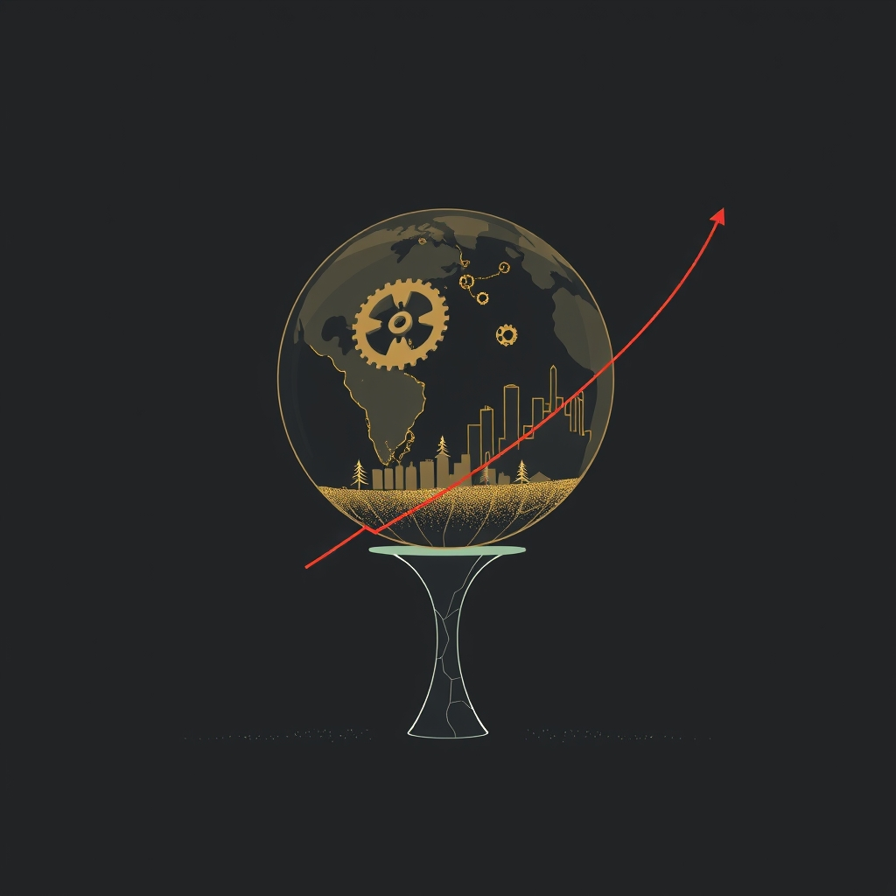

[Home](../index.md) > [Books](./index.md)  
# 📉🌍⏳ Limits to Growth: The 30-Year Global Update  
  
[🛒 Limits to Growth: The 30-Year Global Update. As an Amazon Associate I earn from qualifying purchases.](https://amzn.to/3JusFxb)  
  
⚠️🌍📉 Humanity is in dangerous overshoot of Earth's capacity, heading towards inevitable collapse if exponential population and consumption growth persist, but systemic change can still guide us to a sustainable future.  
  
## 🏆 Meadows, Randers, Meadows' Global Sustainability Strategy  
  
### 🌿 Core Philosophy: Finite Planet, Exponential Growth  
* ⚙️ **System Dynamics:** Interconnected global system variables—population, industrial output, food production, nonrenewable resources, pollution—drive future outcomes.  
* 📈 **Overshoot:** Current human activity, particularly resource consumption and waste generation, exceeds the Earth's regenerative and absorptive capacities.  
* 📊 **Exponential vs. Linear:** Exponential growth of population and industrial output on finite resources leads to eventual systemic collapse.  
* ⏳ **Delay Feedback:** Delays in recognizing and responding to environmental signals worsen the eventual consequences of overshoot.  
  
### ✅ Actionable Directives: Shifting to Sustainability  
* 🤔 **Conscious Choice:** Actively choose a path to global equilibrium rather than passively allowing natural limits to impose collapse.  
* 👣 **Reduce Footprint:** Lower the ecological footprint to a level below the global environment's carrying capacity.  
* 🌱 **Resource Management:**  
    * ♻️ **Renewables:** Use rate ≤ regeneration rate.  
    * ⛏️ **Non-renewables:** Use rate ≤ renewable substitute rate.  
    * 💨 **Pollution:** Emission rate ≤ environment's absorption rate.  
* 🔄 **Systemic Transformation:** Implement structural change—a revolution in societal organization, policy, and ethics, not just technical fixes.  
* 🔭 **Long-Term Horizon:** Policymakers must extend their time horizons to address complex, global, interconnected problems.  
* 🛡️ **Survivable Development:** Focus on development that avoids lasting conflict and ecosystem damage, rather than just sustainable development, which may no longer be a viable option given current overshoot.  
  
## ⚖️ Critical Evaluation  
  
* 🚫 **Initial Dismissal:** The original *Limits to Growth* was widely criticized, often dismissed as Malthusian doomsday prophecy by economists and technologists who misunderstood or misrepresented its assertions, particularly its warning of industrial and population collapse.  
* 🎯 **Prescient Projections:** Decades of empirical data show that global trends in population, industrialization, food production, resource depletion, and pollution have largely tracked the business-as-usual (worst-case) scenarios outlined in the original 1972 report and reiterated in the 30-Year Update.  
* 📊 **Updated Accuracy:** Recent analyses, including one by a KPMG analyst and research by Gaya Herrington, confirm the alarming alignment of real-world data with the *Limits to Growth* projections, suggesting humanity is either on track or ahead of schedule for overshoot and collapse by mid-century under current policies.  
* 🔄 **Evolving Variables:** While specific predictions like imminent raw material exhaustion proved premature in some cases, the core message of finite planetary boundaries and their endangerment through human intervention (e.g., climate change, biodiversity loss) remains highly relevant and increasingly evident.  
* 🛠️ **Technological Limitations:** The update emphasizes that technological advancements alone, while increasing food productivity and mitigating some pollution (e.g., sulfur dioxide), are insufficient to prevent collapse if underlying growth paradigms remain unchanged. Technology is a tool, reflecting societal values, not a panacea.  
* ✅ **Final Verdict:** *Limits to Growth: The 30-Year Global Update* stands as a remarkably prescient and fundamentally validated work. Its core claim—that continued exponential economic and population growth is unsustainable on a finite planet, leading to overshoot and potential societal collapse—is strongly supported by subsequent empirical data and continued global challenges, underscoring the urgent need for systemic societal transformation.  
  
## 🔍 Topics for Further Understanding  
  
* 🌍 **Planetary Boundaries** framework and its evolution from resource limits.  
* 🍩 **Doughnut Economics** and its integration of social foundations with ecological ceilings.  
* 📉 **The Degrowth movement** and its proposals for a planned contraction of economies.  
* 🔄 **Circular Economy** principles and their potential to decouple resource use from economic activity.  
* ⚖️ **Equity and social justice** dimensions of resource distribution and environmental impact.  
* 🤝 **The role of global governance** and international cooperation in addressing systemic challenges.  
* 🧠 **Psychology of denial** and delayed response to long-term systemic threats.  
* 📈 **Metrics beyond GDP** for measuring societal progress and well-being.  
* 🤖 **Technological optimism** versus eco-realism: A continuous debate.  
* ♻️ **Feedback loops** and emergent behavior in complex adaptive systems.  
  
## ❓ Frequently Asked Questions (FAQ)  
  
### 💡 Q: What is the main message of *Limits to Growth: The 30-Year Global Update*?  
✅ A: The book updates the original 1972 *Limits to Growth* report, concluding that humanity is in a state of overshoot—consuming resources and generating pollution faster than the Earth can regenerate or absorb—and is on an unsustainable path towards potential global collapse if current trends persist.  
  
### 💡 Q: Were the predictions of the original *Limits to Growth* report accurate?  
✅ A: Multiple studies and subsequent empirical data suggest that the original report's business-as-usual scenario, predicting overshoot and collapse, has tracked remarkably well with real-world trends over the past 30-50 years, despite some specific details diverging.  
  
### 💡 Q: What is the concept of overshoot as described in Limits to Growth?  
✅ A: Overshoot describes the state where human demands on natural resources exceed the Earth's carrying capacity, meaning we are drawing on resources faster than they can be restored and releasing wastes faster than the Earth can absorb them.  
  
### 💡 Q: Can technological advancements alone solve the problems highlighted in Limits to Growth?  
✅ A: The authors argue that while technology can offer solutions and improve efficiency, it is not a standalone remedy. Without fundamental changes in societal values, consumption patterns, and economic structures, technological fixes merely delay or shift the limits rather than eliminating them.  
  
### 💡 Q: What are the five basic factors analyzed in the World3 computer model used in Limits to Growth?  
✅ A: The World3 model analyzes the interactions between five key global trends: population growth, industrialization, food production, nonrenewable resource depletion, and pollution generation.  
  
## 📚 Book Recommendations  
  
### 📖 Similar  
* The Limits to Growth by Donella H. Meadows, Dennis L. Meadows, Jorgen Randers, William W. Behrens III  
* [🌐🔗🧠📖 Thinking in Systems: A Primer](./thinking-in-systems.md) by Donella H. Meadows  
* [🌍🆘 Earth for All: A Survival Guide for Humanity](./earth-for-all-a-survival-guide-for-humanity.md) by Sandrine Dixson-Declève, Owen Gaffney, Jayati Ghosh, Jørgen Randers, Johan Rockström  
  
### 🆚 Contrasting  
* The Skeptical Environmentalist by Bjørn Lomborg  
* More From Less: The Surprising Story of How We Learned to Prosper Using Fewer Resources—and What Happens Next by Andrew McAfee  
  
### 🔗 Related  
* [🍩🌍 Doughnut Economics: Seven Ways to Think Like a 21st-Century Economist](./doughnut-economics-seven-ways-to-think-like-a-21st-century-economist.md) by Kate Raworth  
* Collapse: How Societies Choose to Fail or Succeed by Jared Diamond  
* [🤏🧑 Small Is Beautiful: Economics as if People Mattered](./small-is-beautiful-economics-as-if-people-mattered.md) by E. F. Schumacher  
  
## 🫵 What Do You Think?  
  
🤔 Given the updated findings of *Limits to Growth: The 30-Year Global Update*, what systemic change do you believe is most critical for humanity to implement, and why?  
  
## 🐦 Tweet  
<blockquote class="twitter-tweet" data-theme="dark">
📉🌍⏳ Limits to Growth: The 30-Year Global Update  🌌 Systems Thinking | 🌍 Planetary Capacity | 📉 Exponential Growth | ♻️ Resource Consumption | 📊 System Dynamics | 🌱 Sustainability | 🎯 Empirical Data | 🚫 Initial Dismissal | 🕰️ Long-Term Horizon<a href="https://t.co/zhYHDlObCd">https://t.co/zhYHDlObCd</a>
&mdash; Bryan Grounds (@bagrounds) <a href="https://twitter.com/bagrounds/status/1988338645368271139?ref_src=twsrc%5Etfw">November 11, 2025</a></blockquote> 