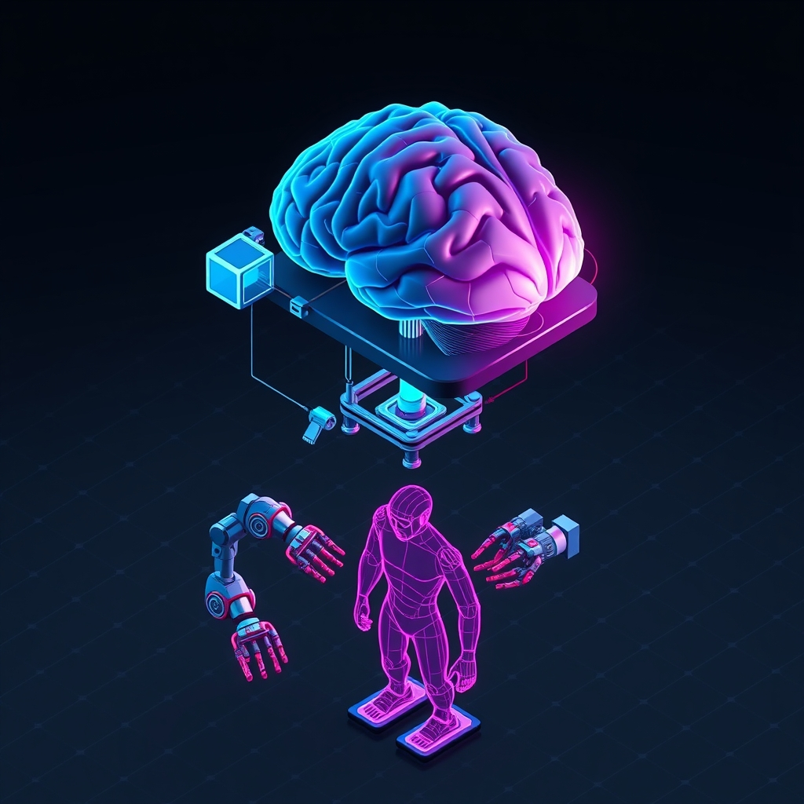

[Home](../index.md) > [Books](./index.md)  
# 🤖🛠️ LLM Engineer's Handbook: Master the art of engineering large language models from concept to production  
  
[🛒 LLM Engineer's Handbook: Master the art of engineering large language models from concept to production. As an Amazon Associate I earn from qualifying purchases.](https://amzn.to/4oknBe2)  
  
## 📘 Book Report: LLM Engineer's Handbook  
  
🤖 The LLM Engineer's Handbook: Master the art of engineering large language models from concept to production, ✍️ authored by Paul Iusztin and Maxime Labonne, 📚 serves as a pragmatic guide for building and deploying real-world applications powered by large language models. 🚀 Moving beyond theoretical discussions and isolated code snippets, 🧱 the book provides a structured, end-to-end framework for engineering production-ready LLM systems. 💡 The core of the book revolves around a hands-on project: creating an "LLM Twin" of the reader, 👯 an AI designed to mimic one's writing style and knowledge based on personal data. 🧪 This practical approach, combined with a strong emphasis on MLOps principles, 🧑‍💻 makes it a valuable resource for AI engineers, NLP professionals, and software developers looking to transition into the field of large language models.  
  
### ⚙️ Core Concepts and Structure  
  
🧱 The book is built upon a foundational architecture known as the Feature/Training/Inference (FTI) pipeline. 🪜 This structure promotes modularity and scalability in machine learning systems. 🚶 The authors methodically walk readers through each stage of this pipeline, from data ingestion to model deployment and monitoring. 🔑 A key takeaway is the book's realistic approach, which considers the constraints of smaller teams with limited computational resources, a perspective often missing from more academic texts.  
  
🗺️ The content is logically structured to follow the lifecycle of an LLM project:  
  
* 🧠 **Understanding the LLM Twin Concept and Architecture:** 🏗️ This section introduces the central project of the book and the FTI architectural pattern.  
* 🧰 **Tooling and Installation:** 🛠️ A practical overview of the necessary tools for building LLM applications, including orchestrators, experiment trackers, and monitoring tools.  
* 📊 **Data Engineering:** 💾 This part of the book focuses on the critical first step of any machine learning project: data collection, processing, and storage.  
* 🔍 **RAG Feature and Inference Pipelines:** 🧐 Detailed exploration of Retrieval-Augmented Generation (RAG), a technique to enhance LLMs with external knowledge.  
* 🎨 **Supervised Fine-Tuning and Preference Alignment:** 🎯 The book delves into methods for customizing and improving the performance of pre-trained models. 👍 This includes techniques like Direct Preference Optimization (DPO).  
* ⚡ **Inference Optimization:** 🚀 This section addresses the challenges of deploying large models, with a focus on techniques to improve latency and throughput, such as quantization and FlashAttention.  
* ♾️ **MLOps and LLMOps:** ⚙️ The final sections tie everything together with a comprehensive look at the operational side of LLM applications, including automation, versioning, testing, and monitoring.  
  
### 🎯 Target Audience and Prerequisites  
  
🧑‍💻 The LLM Engineer's Handbook is geared towards individuals with some existing technical knowledge. 🧑‍🎓 The ideal reader has a basic understanding of Python, general AI concepts, and familiarity with cloud platforms like AWS. 🚫 It is not an introductory text for complete beginners to programming or machine learning. 🌉 Instead, it serves as a bridge for those who want to move from a theoretical understanding of LLMs to the practical application of building and deploying them in a production environment.  
  
## 📚 Book Recommendations  
  
### 🔩 Similar Reads: The Nuts and Bolts of LLM Engineering  
  
* **[🤖🗣️ Hands-On Large Language Models: Language Understanding and Generation](./hands-on-large-language-models-language-understanding-and-generation.md)** by Jay Alammar and Maarten Grootendorst: 👓 This book offers a practical guide to using pretrained LLMs for various NLP tasks, with a strong emphasis on visual explanations and real-world applications.  
* 🏗️ **Building a Large Language Model (from Scratch)** by Sebastian Raschka: 🧱 For those who want to go deeper into the mechanics of LLMs, this book provides a step-by-step guide to creating and pretraining a language model from the ground up.  
* **[🤖🏗️ AI Engineering: Building Applications with Foundation Models](./ai-engineering-building-applications-with-foundation-models.md)** by Chip Huyen: 🧰 This book provides a comprehensive overview of building AI applications with foundation models, covering prompt engineering, dataset preparation, and model evaluation.  
* 🗣️ **Practical Natural Language Processing** by Sowmya Vajjala, Bodhisattwa Majumder, Anuj Gupta, and Harshit Surana: 📚 This book offers a comprehensive guide to building real-world NLP systems, covering both traditional and deep learning approaches.  
  
### 🧠 Contrasting Perspectives: The Theory and Foundations  
  
* 🗣️ **Speech and Language Processing** by Dan Jurafsky and James H. Martin: 📜 Often considered a foundational text in NLP, this book provides a deep dive into the linguistic and computational principles that underpin the field.  
* **[🧠💻🤖 Deep Learning](./deep-learning.md)** by Ian Goodfellow, Yoshua Bengio, and Aaron Courville: 📚 This book is a comprehensive theoretical introduction to the field of deep learning, covering the mathematical and conceptual foundations.  
* **[💯💻 The Hundred-Page Language Models Book: hands-on with PyTorch](./the-hundred-page-language-models-book-hands-on-with-pytorch-.md)** by Andriy Burkov: 📄 This concise book offers a clear and mathematically grounded explanation of how language models work, from basic concepts to modern transformer architectures.  
* 🔍 **Large Language Models: A Deep Dive: Bridging Theory and Practice** by Uday Kamath: 📚 This book offers an in-depth exploration of the design, training, and application of LLMs, with a strong emphasis on the underlying algorithms and techniques.  
  
### 🎨 Creative Connections: Expanding the Engineer's Mindset  
  
* **[🤖⚙️🔁 Designing Machine Learning Systems: An Iterative Process for Production-Ready Applications](./designing-machine-learning-systems-an-iterative-process-for-production-ready-applications.md)** by Chip Huyen: 🧱 This book focuses on the iterative process of designing and building reliable, scalable, and maintainable machine learning systems, a crucial skill for any MLOps-focused engineer.  
* **[🧑‍💻📈 The Pragmatic Programmer: Your Journey to Mastery](./the-pragmatic-programmer-your-journey-to-mastery.md)** by David Thomas and Andrew Hunt: 🕰️ A classic in software engineering, this book offers timeless advice on writing better software and becoming a more effective developer.  
* 🗺️ **Atlas of AI** by Kate Crawford: 🌏 This book offers a critical perspective on the social, political, and environmental costs of artificial intelligence, encouraging engineers to consider the broader implications of their work.  
* 🤖 **AI Ethics** by Mark Coeckelbergh: ⚖️ This book provides a practical and accessible analysis of the ethical issues surrounding AI, a vital topic for anyone building and deploying these powerful technologies.  
  
## 💬 [Gemini](../software/gemini.md) Prompt (gemini-2.5-pro)  
> Write a markdown-formatted (start headings at level H2) book report, followed by a plethora of additional similar, contrasting, and creatively related book recommendations on LLM Engineer's Handbook: Master the art of engineering large language models from concept to production. Never put book titles in quotes or italics. Be thorough in content discussed but concise and economical with your language. Structure the report with section headings and bulleted lists to avoid long blocks of text.