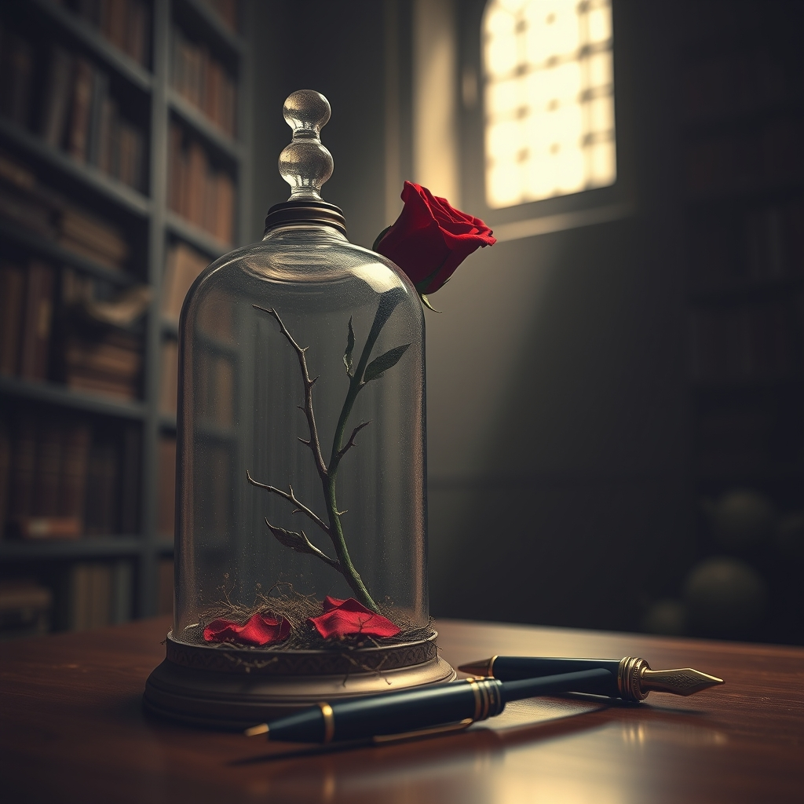

[Home](../index.md) > [Books](./index.md)  
# 👧💔🥀 Lolita  
  
[🛒 Lolita. As an Amazon Associate I earn from qualifying purchases.](https://amzn.to/3NT9Xkh)  
  
🖋️ Complex linguistic acrobatics and an unreliable voice weave a haunting exploration of obsession and the devastating power of manipulation.  
  
## 🗺️ Context  
  
- ✍️ Author: Vladimir Nabokov  
- 📚 Genre: Literary Fiction  
- 📖 Series: Standalone  
  
## ⭐ Assessment  
  
- 🍭 Core Appeal: The novel seduces readers with breathtakingly beautiful prose while forcing a direct confrontation with a deeply disturbing and taboo psychological landscape.  
- 🧠 Thematic Core: It examines the destructive nature of singular obsession, the fragility of innocence, and the terrifying way an individual can be completely overwritten by another person's fantasy.  
- ✍️ Writing Style: The narrative is famous for its intricate wordplay, multilingual puns, and a rhythmic, lyrical quality that masks the darker reality beneath the surface.  
- 🎭 Reader Experience: While the lush and erudite vocabulary creates a mesmerizing flow, this elegance serves as a sophisticated mask for a narrator who is masterfully deceptive.  
- 🏆 Critical Standing: Long considered a cornerstone of twentieth-century literature, it remains a polarizing masterwork praised for its technical brilliance and its brave interrogation of morality.  
  
## ❓ Frequently Asked Questions (FAQ)  
  
### ❓ Q: Why is the writing style of Lolita significant?  
  
A: 🤓 The prose in Lolita utilizes a highly decorative and allusive English that serves to both enchant the reader and complicate their moral judgment of the narrator.  
  
### ❓ Q: Is Lolita a love story?  
  
A: 🤓 Most modern literary critics view Lolita not as a romance, but as a tragic study of predatory obsession and the profound isolation of its young protagonist.  
  
### ❓ Q: Why did Lolita face significant controversy upon its release?  
  
A: 🤓 The book was initially banned in several countries due to its frank exploration of a forbidden and highly sensitive subject matter involving a minor.  
  
## 📚 Recommendations  
  
### 📖 Non-Fiction  
  
- 🦋 Vladimir Nabokov: The American Years by Brian Boyd  
- 🇮🇷 Reading Lolita in Tehran by Azar Nafisi  
  
### ❤️ If You Loved This  
  
- 🖼️ The Picture of Dorian Gray by Oscar Wilde  
- 🏛️ Death in Venice by Thomas Mann  
  
### ↔️ Similar But Different  
  
- 🎻 Notes on a Scandal by Zoe Heller  
- 🔍 Pale Fire by Vladimir Nabokov  
  
## 🫵 What Do You Think?  
  
- 🧐 Can the beauty of a writer's language justify or redeem a narrator with a deeply flawed moral compass?  
- 💭 How does the use of a first-person perspective change your empathy or skepticism toward a character's version of the truth?  
