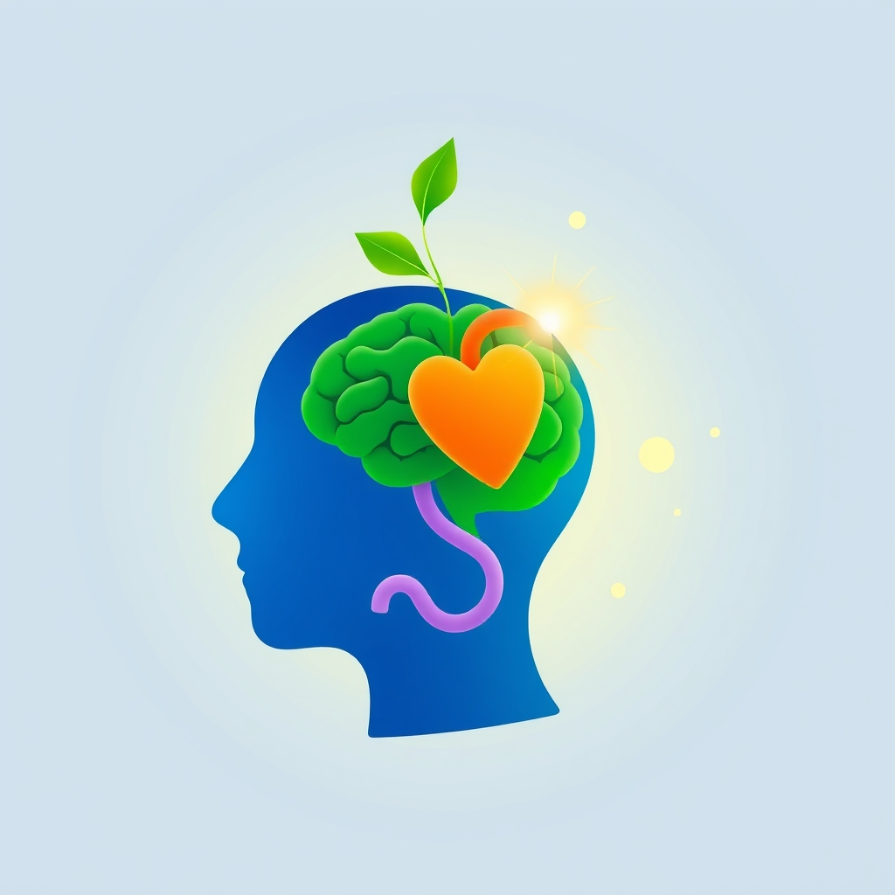

[Home](../index.md) > [Books](./index.md)  
# 🧠💪😊 Mental Fitness: Maximizing Mood, Motivation, & Mental Wellness by Optimizing the Brain-Body-Biome  
  
[🛒 Mental Fitness: Maximizing Mood, Motivation, & Mental Wellness by Optimizing the Brain-Body-Biome. As an Amazon Associate I earn from qualifying purchases.](https://amzn.to/487h5ln)  
  
## 🧠 Book Report: Mental Fitness  
  
### 🧐 Overview  
  
🧠 Mental Fitness: Maximizing Mood, Motivation, & Mental Wellness by Optimizing the Brain-Body-Biome, authored by nutritional biochemist and psychonutritionist Dr. Shawn Talbott, addresses the 😟 widespread issues of depression, 😥 anxiety, and 😫 burnout in modern society. 📚 The book proposes that many conventional solutions often fail to truly improve well-being, instead merely making individuals feel "different." 📣 It advocates for a transformative approach centered on 🪴 nurturing the "Brain-Body-Biome" to achieve a balanced mood, clear thinking, and abundant energy.  
  
### 🔑 Key Themes  
  
* 🧠 **The Gut-Heart-Brain Axis:** A central tenet of the book is that the intricate connection among the 🦠 gut, ❤️ heart, and 🧠 brain—termed the gut-heart-brain axis—is fundamental to mental wellness. 🗣️ Optimal communication within this system is presented as the pathway to improved mental health.  
* ✨ **Holistic Optimization:** 👨‍⚕️ Dr. Talbott provides a comprehensive framework for enhancing 💪 physical energy, 🧠 mental acuity, and 😊 emotional well-being through a combination of 🍎 nutrition, 🏃 movement, and 🧘 mindset.  
* 🎯 **Actionable Strategies:** 📝 The book offers practical methods for naturally optimizing this connection, suggesting that individuals can feel better by making informed choices in their daily lives. 🍎 These strategies include specific dietary recommendations, 🧘 practicing mindfulness, 🏃 engaging in exercise, 😴 prioritizing better sleep, and 💊 considering certain supplements.  
  
### ✍️ Author's Approach  
  
👨‍⚕️ Dr. Shawn Talbott, drawing on years of 🔬 research in nutritional psychology, presents a science-backed yet accessible guide. 💡 He posits that by actively nurturing the 🌱 Brain-Body-Biome, individuals can establish a "superhighway" to enhanced well-being. 🗣️ The narrative emphasizes empowering readers to make lifestyle changes for sustainable mental fitness. 💊 While the book highlights the role of supplements, it integrates them within a broader approach that champions 🍎 whole foods, 🏃 physical activity, and 🧘 mental practices.  
  
### 🎯 Target Audience  
  
🧑‍🤝‍🧑 This book is intended for individuals seeking proactive and natural methods to improve their mood, motivation, and overall mental wellness. 😥 It particularly resonates with those experiencing issues like depression, anxiety, and burnout, who are looking for alternatives or complements to pharmaceutical approaches. 🤔 While some new to holistic practices might find the promises of significant vitality and mental health improvement ambitious, those already aligned with mind-body wellness concepts will likely find it an encouraging and practical guide.  
  
### ✅ Conclusion  
  
🧠 Mental Fitness offers a compelling argument for the profound influence of the body's internal systems on mental health. 🗺️ It serves as a guide for readers to take an active role in their well-being by optimizing their gut-heart-brain axis through actionable lifestyle adjustments, thereby maximizing mood, motivation, and mental resilience.  
  
## 📚 Book Recommendations  
  
### ➕ Similar Books  
  
* 🧠 The Mind-Gut Connection by Emeran Mayer: This book delves into the complex dialogue between the 🧠 brain and the 🦠 gut, exploring how this hidden conversation impacts mood, choices, and overall health. It aligns closely with the emphasis on the gut-brain axis and its implications for mental and physical well-being.  
* 🌱 The Psychobiotic Revolution by Scott C. Anderson, John F. Cryan, and Ted Dinan: This work explores the emerging science of psychobiotics and their role in influencing mood, behavior, and mental health through the gut microbiome. It directly supports the core themes of optimizing the biome for mental wellness.  
  
### ➖ Contrasting Books  
  
* 🎾 The Inner Game of Tennis by W Timothy Gallwey: While also focused on performance and self-mastery, this book approaches mental fitness primarily from a psychological perspective, emphasizing overcoming self-doubt and achieving a state of relaxed concentration through mental techniques rather than a strong biological or biome-centric approach.  
* 💰 Think and Grow Rich by Napoleon Hill: This classic self-help book focuses on developing a mindset for success and achieving personal goals through principles of positive thinking, desire, and persistence. Its emphasis is largely on cognitive and psychological strategies for achievement, offering a contrasting viewpoint to the biologically focused approach of Mental Fitness.  
  
### 💡 Creatively Related Books  
  
* [🤕🎼🧠 The Body Keeps the Score: Brain, Mind, and Body in the Healing of Trauma](./the-body-keeps-the-score-brain-mind-and-body-in-the-healing-of-trauma.md) by Bessel van der Kolk: This book offers a profound exploration of how trauma impacts the body and brain, affecting pleasure, engagement, self-control, and trust. While differing in its focus on trauma, it creatively relates by demonstrating the deep, intricate connection between mental states and physical physiology, highlighting how the body holds experiences and influences mental health.  
* [⚡🧠🏃 Spark: The Revolutionary New Science of Exercise and the Brain](./spark-the-revolutionary-new-science-of-exercise-and-the-brain.md) by John J Ratey: This book investigates the powerful link between exercise and brain function, showcasing how physical activity can enhance cognitive abilities, improve mood, and even mitigate mental health disorders. It explores a key component (movement) of Mental Fitness in greater depth, offering a complementary scientific perspective on optimizing brain health through physical means.  
* 🧪 Huberman Lab Protocols by Andrew Huberman: These protocols, often discussed through Dr. Huberman's work, provide actionable, science-based strategies for improving brain function, enhancing mood and energy, and optimizing physical performance. This resource creatively relates by offering practical applications of neuroscience and physiology to achieve peak mental and physical states, similar to the goal of Mental Fitness but often with a broader scope of bio-optimizing techniques.  
  
## 💬 [Gemini](https://gemini.google.com) Prompt (gemini-2.5-flash)  
> Write a markdown-formatted (start headings at level H2) book report, followed by similar, contrasting, and creatively related book recommendations on Mental Fitness: Maximizing Mood, Motivation, & Mental Wellness by Optimizing the Brain-Body-Biome. Never quote or italicize titles. Be thorough but concise. Use section headings and bulleted lists to avoid long blocks of text.