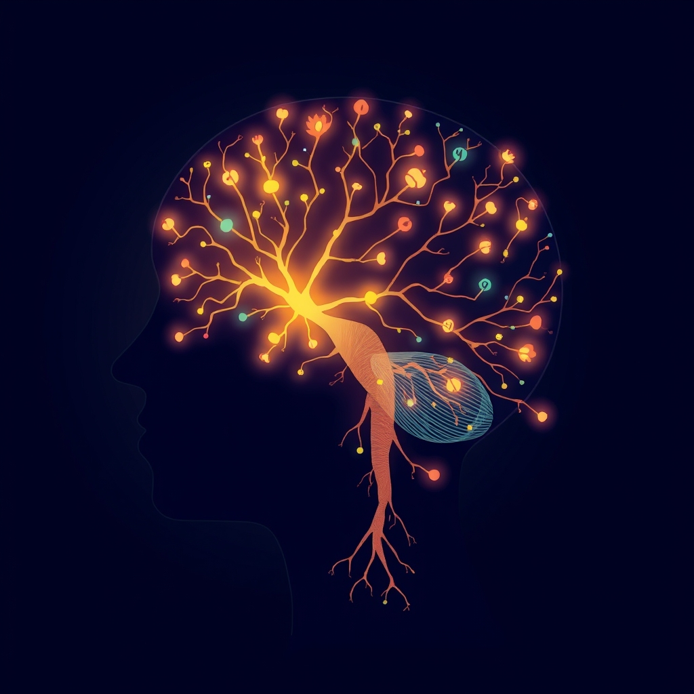

[Home](../index.md) > [Books](./index.md)  
# 🤱🏼🧠 Mother Brain: How Neuroscience Is Rewriting the Story of Parenthood  
  
[🛒 Mother Brain: How Neuroscience Is Rewriting the Story of Parenthood. As an Amazon Associate I earn from qualifying purchases.](https://amzn.to/45ocnyr)  
  
## 🧠 Book Report: 👩‍⚕️ Mother Brain: How Neuroscience Is Rewriting the Story of Parenthood by Chelsea Conaboy  
  
**👩‍💻 Author:** Chelsea Conaboy  
**📚 Genre:** Popular Science, Parenting  
  
### 📝 Synopsis  
  
* 🧠 *Mother Brain: How Neuroscience Is Rewriting the Story of Parenthood* by health and science journalist Chelsea Conaboy explores the significant neurological and cognitive changes that occur in the brains of new parents. 🤱  
* 🗣️ Conaboy challenges the pervasive myth of "maternal instinct," arguing that caregiving itself, regardless of biological relation or gender, reshapes the brain. 🔄  
* 🔬 The book delves into scientific research, much of it recent, to explain how hormonal shifts and the intense stimuli of caring for a baby drive these transformations. 👶  
* 🧑‍🏫 Conaboy interweaves this research with her personal experiences and accounts from other parents, creating a narrative that is both informative and relatable. 🤝  
  
### 🔑 Key Themes and Arguments  
  
* 👶 **Parenthood as a Developmental Stage:** Conaboy, supported by emerging research, posits that the brain changes experienced by birthing parents are so profound that parenthood should be considered a distinct developmental stage, akin to adolescence. 🧠  
* 🚫 **Debunking "Maternal Instinct":** The book systematically dismantles the concept of an innate "maternal instinct," showing it to be a socially constructed and often harmful idea. ⚠️ This myth, Conaboy argues, places undue pressure on mothers, shortchanges fathers, and hinders societal support for all caregivers. 💔  
* 🧠 **Neuroplasticity of the Parental Brain:** *Mother Brain* highlights the brain's remarkable plasticity in response to parenting. 🌱 Hormonal changes (in both gestational and non-gestational parents) and the experiential learning involved in childcare actively rewire neural circuits. 🔁 These changes are not limited to mothers; all highly involved parents, regardless of their path to parenthood, develop similar caregiving circuitry. 👨‍👩‍👧‍👦  
* 🤔 **Beyond "Mommy Brain":** While acknowledging the common complaints of "mommy brain" (e.g., forgetfulness), Conaboy argues that the underlying neurological story is far more complex and ultimately empowering. 💪 Some research even suggests potential long-term cognitive benefits to parenting. 📈  
* 🌍 **Societal Implications:** Conaboy connects the neuroscience of parenthood to broader societal issues, such as the need for paid parental leave and a more inclusive understanding of family structures. 🏛️ She argues that a scientific understanding of the caregiving brain can inform more supportive policies for families. 🤝  
  
### ✍️ Structure and Style  
  
* 📰 Conaboy employs a journalistic approach, making complex neurobiological research accessible to a general audience. 🧑‍🎓  
* 📖 The book blends scientific explanations with personal anecdotes and interviews, creating an engaging and often reassuring narrative. 🫂  
* 📚 While some readers find the synthesis of science occasionally dense, the overall presentation is considered readable and informative. ✅  
  
### 📢 Critical Reception  
  
* 🌟 *Mother Brain* has been largely well-received, praised for its thorough research, myth-busting approach, and compassionate tone. 👍  
* 🗣️ Reviewers have highlighted its importance for new parents, caregivers, and anyone interested in the science of human connection. 🫂  
* 🔎 Some critics noted the book's length and occasional density of scientific detail, but generally found it to be a valuable and enlightening read.💡  
* 👨‍👩‍👧‍👦 The consistent effort to include and validate the experiences of non-gestational parents has been particularly appreciated. ❤️  
  
### 🎯 Conclusion  
  
* 🧠 *Mother Brain* offers a compelling and scientifically grounded reinterpretation of parenthood. 🐣  
* 🔬 By revealing the profound neurobiological changes that accompany caregiving, Conaboy not only demystifies common parental experiences but also advocates for a more supportive and equitable understanding of what it means to be a parent. 🤝  
* 📚 It is presented as vital reading for understanding how parenting shapes us. 🌱  
  
## 📚 Additional Book Recommendations  
  
### 🧠 Similar Reads (Focus on Neuroscience of Parenthood/Brain Changes):  
  
* 🧠 **Brain-Based Parenting: The Neuroscience of Caregiving for Healthy Attachment** by Daniel A. Hughes and Jonathan Baylin: Explores how attachment-focused therapy works at a neural level and the brain science of early childhood. 👶  
* **[🕳️🧠👶🏽 The Whole-Brain Child: 12 Revolutionary Strategies to Nurture Your Child's Developing Mind](./the-whole-brain-child.md)** by Daniel J. Siegel and Tina Payne Bryson: While focused on the child's brain, it offers insights into parent-child interactions and brain development, which complements the understanding of the parent's brain. 🧠  
* 🫂 **The Neurobiology of Attachment-Focused Therapy** by Daniel A. Hughes and Jonathan Baylin: Delves into the brain science of attachment and trauma in children, relevant for understanding the caregiver's role in shaping brain development. 🧠  
  
### 🏛️ Contrasting Perspectives (Traditional/Sociological Views on Parenthood):  
  
* 👩‍💼 **Hard Labour: The Sociology of Parenthood, Family Life and Career** by Caroline Gatrell: Examines changes in family practices and paid work in the 21st century, focusing on qualified women balancing motherhood and employment, and includes fathers' perspectives. 👨‍👧  
* 👪 **New Old-Fashioned Parenting: A Guide to Help You Find the Balance Between Traditional and Modern Parenting** by Liat Hughes Joshi: Offers advice on blending traditional and contemporary child-rearing methods. ⚖️  
* 🌍 **The Sociology of Children and Families Series** by Bristol University Press: An academic series covering global issues affecting children and families, including theorizing contemporary parenthood. 📜  
  
### 🎨 Creatively Related Recommendations:  
  
#### 📖 Memoirs on the Transition to Motherhood/Parenthood:  
  
* 🤰 **A Life's Work: On Becoming a Mother** by Rachel Cusk: A lyrical and honest memoir about the early days of motherhood. ✍️  
* 🔬 **Like A Mother: A Feminist Journey Through the Science and Culture of Pregnancy** by Angela Garbes: Explores the physiological and cultural aspects of pregnancy and early motherhood. 🤰  
* 😭 **Body Full of Stars: Female Rage and My Passage into Motherhood** by Molly Caro May: A raw account of the physical and emotional challenges of new motherhood. 💔  
* ✉️ **Great With Child: Letters to a Young Mother** by Beth Ann Fennelly: A collection of letters offering guidance and empathy on early motherhood, particularly for those balancing artistic careers. 👩‍🎨  
* 💃 **The Blue Jay's Dance: A Memoir of Early Motherhood** by Louise Erdrich: A poetic and insightful look at pregnancy and early motherhood. 🤰  
* 🧩 **Bring Down the Little Birds** by Carmen Giménez: A fragmented and lyrical memoir about mothering young children while dealing with personal and family challenges. 💔  
* 🏞️ **Memoirs about Motherhood and the Outdoors** (various authors, curated by Meghan J. Ward): A collection of memoirs exploring the intersection of motherhood and a passion for the outdoors. 🌲  
* 👵 **What We Carry** by Maya Shanbhag Lang: A memoir about the evolving mother-daughter relationship, particularly as the author becomes a mother and her own mother experiences Alzheimer's. 🥺  
* 💔 **How We Fight for Our Lives** by Saeed Jones: While not solely about motherhood, it features the significant impact of the author's single mother on his life. ❤️  
  
#### 🧠 Books on Brain Plasticity and Learning in Adults:  
  
* 🔄 **[The Brain That Changes Itself](./the-brain-that-changes-itself.md): Stories of Personal Triumph from the Frontiers of Brain Science** by Norman Doidge: A classic in popular neuroscience, detailing the brain's capacity for change. 💪  
* 🌱 **The Brain's Way of Healing: Remarkable Discoveries and Recoveries from the Frontiers of Neuroplasticity** by Norman Doidge: Further explores the healing capacities of the brain. 🩹  
* 🦸 **Neuroplasticity: Your Brain's Superpower** by Philippe Douyon: Explores how the brain can adapt and heal, and how we can actively engage with our neurological health. 🧠  
* 💡 **Rewire Your Brain: Think Your Way to a Better Life** by John B. Arden: Offers practical strategies based on neuroscience to rewire the brain for positivity and well-being. ✨  
* 🧑‍🎓 **Neuroplasticity and Adult Learning** (Chapter in *Third International Handbook of Lifelong Learning*): Discusses factors influencing neuroplasticity over the adult lifespan and its implications for learning. 🧠  
  
#### 🫂 Books on the Neurobiology/Psychology of Attachment:  
  
* **[🧑‍❤️‍🧑🔗 Attached: The New Science of Adult Attachment and How It Can Help You Find - and Keep - Love](./attached-the-new-science-of-adult-attachment-and-how-it-can-help-you-find-and-keep-love.md)** by Amir Levine and Rachel S.F. Heller: Explores adult attachment styles and their impact on relationships. 👩‍❤️‍👨  
* **[🧠🧑‍🤝‍🧑 The Developing Mind: How Relationships and the Brain Interact to Shape Who We Are](./the-developing-mind-how-relationships-and-the-brain-interact-to-shape-who-we-are.md)** by Daniel J. Siegel: Discusses how relationships, particularly early attachments, shape brain development and our sense of self. 🧠  
* 🤝 **Attachment Theory: A Guide to Strengthening the Relationships in Your Life** by Thais Gibson: Offers guidance on understanding and improving attachment patterns. 💖  
* 🧠 **"Attachment" chapter in Cambridge Textbook of Neuroscience for Psychiatrists** by Lane Strathearn: Provides a neurobiological overview of attachment theory. 🔗  
  
#### ⚧️ Books Challenging Traditional Gender Roles in Parenting:  
  
* 🌈 **Raising Them: Our Adventure in Gender Creative Parenting** by Kyl Myers: A sociologist and genderqueer parent shares their family's story of raising a child without assigning gender at birth. 👨‍👩‍👧‍👦  
* ♾️ **Childhood Unlimited: Parenting Beyond the Gender Bias** by Virginia Méndez Mesón: A guide to feminist and gender-creative parenting, encouraging children to explore the full gender spectrum. ⚧️  
* 👨‍👩‍👧‍👦 **Gender Neutral Parenting: Raising Kids With The Freedom To Be Themselves**: Offers practical examples for implementing gender-neutral parenting. 🏳️‍🌈  
* 👧 Children's books like **William's Doll** by Charlotte Zolotow, **Morris Micklewhite and the Tangerine Dress** by Christine Baldacchino, and **Rosie Revere, Engineer** by Andrea Beaty, which challenge gender stereotypes from a young age. 📚  
  
#### 🧬 Books on the Evolutionary Psychology of Parenting:  
  
* 👪 **The Oxford Handbook of Evolutionary Psychology and Parenting** edited by Viviana A. Weekes-Shackelford and Todd K. Shackelford: A comprehensive resource on how evolutionary history informs current parenting roles and practices. 🧬  
* 🧠 **Evolutionary Psychology: The New Science of the Mind** by David M. Buss: A foundational text in evolutionary psychology that touches on mating and parenting strategies. 🐒  
* 🐣 **Handbook of Parenting, Volume 2: Biology and Ecology of Parenting** edited by Marc H. Bornstein: Includes chapters on the evolution of parenting and evolutionary approaches to childrearing. 📖  
  
#### 🧠 Books on Neuroscience-Aligned Parenting and Behavior:  
  
* 🤯 **Raising Kids with Big, Baffling Behaviors: Brain-Body-Sensory Strategies That Really Work** by Robyn Gobbel: Provides neuroscience-informed strategies for parents of children with challenging behaviors. 👪  
* 💚 **Brain-Body Parenting: How to Stop Managing Behavior and Start Raising Joyful, Resilient Kids** by Mona Delahooke: Focuses on understanding child behavior through the lens of brain and nervous system development. 🧠  
* 🧭 **Beyond Behaviors: Using Brain Science and Compassion to Understand and Solve Children's Behavioral Challenges** by Mona Delahooke: Offers a paradigm shift towards understanding the root causes of behavior.". ✨  
  
## 💬 [Gemini](../software/gemini.md) Prompt (gemini-2.5-pro-exp-03-25)  
> Write a markdown-formatted (start headings at level H2) book report, followed by a plethora of additional similar, contrasting, and creatively related book recommendations on Mother Brain: How Neuroscience Is Rewriting the Story of Parenthood. Be thorough in content discussed but concise and economical with your language. Structure the report with section headings and bulleted lists to avoid long blocks of text.