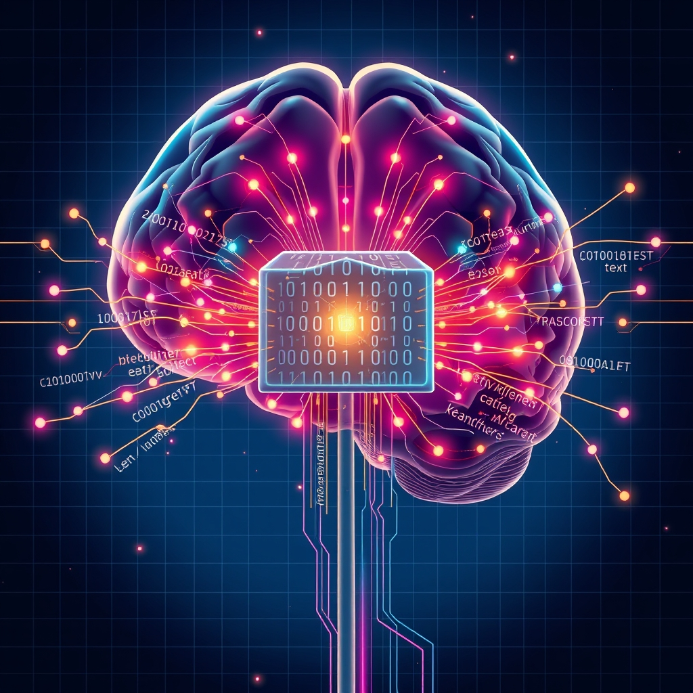

[Home](../index.md) > [Books](./index.md)  
# 🗣️💻 Natural Language Processing with Transformers  
  
[🛒 Natural Language Processing with Transformers. As an Amazon Associate I earn from qualifying purchases.](https://amzn.to/4eLqHU9)  
  
## 📖 Book Report: 🤖 Natural Language Processing with Transformers  
  
### 🏷️ Title and Author(s)  
  
* 🏷️ **Title:** 🤖 Natural Language Processing with Transformers, Revised Edition  
* ✍️ **Authors:** 👨‍🏫 Lewis Tunstall, 👩‍🏫 Leandro von Werra, 🐺 Thomas Wolf  
  
### 📝 Overview  
  
📚 This practical book serves as a comprehensive guide to applying transformer models to various 🗣️ Natural Language Processing (NLP) tasks. 👨‍💻 Written by experts, some of whom are affiliated with 🤗 Hugging Face, the book adopts a hands-on approach, heavily utilizing the 🤗 Hugging Face Transformers library, a widely used 🐍 Python-based deep learning library for NLP. 💻 It emphasizes solving real-world problems with code, making it highly relevant for practitioners. ✨ The book highlights how transformers have become the dominant architecture for achieving state-of-the-art results in NLP since their introduction in 2017.  
  
### 🔑 Key Concepts Covered  
  
📚 The book covers a range of essential concepts and techniques for working with transformers in NLP:  
  
* 🤖 Introduction to transformers and the 🤗 Hugging Face ecosystem.  
* 🏗️ Building, 🐛 debugging, and ⚙️ optimizing transformer models for core NLP tasks.  
* 🌍 Practical applications including text classification, named entity recognition, and question answering.  
* 🌐 Cross-lingual transfer learning using transformers.  
* 📉 Applying transformers in scenarios with limited labeled data.  
* ⚡ Techniques for making transformer models efficient for deployment, such as distillation, pruning, and quantization.  
* 🏋️ Training transformers from scratch and scaling to multiple GPUs and distributed environments.  
* 🤔 Discussing challenges and future directions in the field, including scaling and multimodal transformers.  
  
### 🎯 Target Audience  
  
🧑‍💻 The book is primarily aimed at data scientists, coders, and machine learning or software engineers who have some familiarity with deep learning and 🐍 Python. 🚀 It is particularly useful for those looking to leverage transformers for their own use cases and integrate them into applications.  
  
### 👍 Strengths  
  
* 💻 **Practical and Hands-on:** The book focuses on practical use cases and provides extensive code examples using the 🤗 Hugging Face Transformers library, which is a de facto standard in the field.  
* 🧑‍🏫 **Authored by Experts:** Written by individuals deeply involved with the 🤗 Hugging Face library and the development of transformer models.  
* 🗂️ **Task-Oriented Structure:** Most chapters are structured around a specific NLP task, making it easy to learn how to apply transformers to different problems.  
* 🛠️ **Covers Key Techniques:** Explains essential techniques for fine-tuning, optimization, and deployment of transformer models.  
* 📅 **Up-to-Date Content:** Covers recent advancements and practical considerations in using transformers.  
  
### ✅ Conclusion  
  
✨ *Natural Language Processing with Transformers* is an invaluable resource for anyone seeking to implement modern NLP solutions using the powerful transformer architecture and the user-friendly 🤗 Hugging Face library. 🚀 Its practical focus and comprehensive coverage of key tasks and techniques make it a highly recommended guide for data scientists and engineers in the field.  
  
## 📚 Additional Book Recommendations  
  
### 📖 Similar Books (Focus on Transformers/Modern NLP)  
  
* 📚 **Transformers for Natural Language Processing: Build innovative deep neural network architectures for NLP with Python, PyTorch, TensorFlow, BERT, RoBERTa, and more** by Denis Rothman. This book also focuses on transformers and covers various models and applications using different frameworks.  
* 📚 **Hands-On Generative AI with Transformers and Diffusion Models** by Omar Sanseviero, Pedro Cuenca, Apolinário Passos, Jonathan Whitaker. While broader than just NLP, it covers generative AI with a strong focus on transformers.  
* **[🤖🗣️ Hands-On Large Language Models: Language Understanding and Generation](./hands-on-large-language-models-language-understanding-and-generation.md)** by Jay Alammar, Maarten Grootendorst. This book delves into Large Language Models (LLMs), which are predominantly based on transformer architectures.  
* 📚 **Building Language Applications with Hugging Face** (This is the same book as the report, just a slightly different title/subtitle sometimes used) by Lewis Tunstall, Leandro von Werra, Thomas Wolf.  
  
### ⚖️ Contrasting Books (Different NLP Approaches or Focus)  
  
* 📚 **Foundations of Statistical Natural Language Processing** by Christopher D. Manning and Hinrich Schütze. A classic text covering traditional statistical methods in NLP before the deep learning era, providing a strong theoretical foundation.  
* 🗣️ **Speech and Language Processing: An Introduction to Natural Language Processing, Computational Linguistics, and Speech Recognition** by Dan Jurafsky and James H. Martin. Another foundational and comprehensive text covering a wide range of NLP and speech processing topics, including classical methods and introducing neural networks, though the focus is broader than just transformers. 👴 The 3rd edition includes more on deep learning.  
* 🧠 **Neural Network Methods for Natural Language Processing** by Yoav Goldberg. Focuses on neural network models for NLP, providing theoretical background on architectures that predate or are foundational to transformers (like RNNs and CNNs in NLP).  
* 🐍 **Natural Language Processing with Python** by Steven Bird, Ewan Klein, and Edward Loper. A practical introduction to NLP using the NLTK library, covering fundamental concepts and tasks with a more traditional or introductory approach compared to transformer-heavy books.  
* 🌐 **Practical Natural Language Processing** by Sowmya Vajjala, Bodhisattwa Majumder, Anuj Gupta, Harshit Surana. This book focuses on bridging the gap between research and real-world NLP system deployment, offering perspectives on practical challenges and business applications beyond just the models themselves.  
* 🙅 **Books on "Neuro-Linguistic Programming" (NLP)** such as "Frogs into Princes" by Richard Bandler and John Grinder or "NLP at Work" by Sue Knight. These are fundamentally different and belong to the field of personal development and communication, not computational natural language processing. ⚠️ Including them highlights the distinction in terminology.  
  
### ✨ Creatively Related Books (Broader AI/ML or Related Concepts)  
  
* **[🧠💻🤖 Deep Learning](./deep-learning.md)** by Ian Goodfellow, Yoshua Bengio, and Aaron Courville. A foundational textbook covering the mathematical and conceptual background of deep learning, essential for understanding the underpinnings of transformers.  
* 💻 **Hands-On Machine Learning with Scikit-Learn, Keras, and TensorFlow** by Aurélien Géron. While not solely focused on NLP, it provides practical guidance on machine learning and deep learning concepts and frameworks used in implementing transformer models.  
* 🏗️ **Deep Learning From Scratch: Building with Python from First Principles** by Seth Weidman. For those wanting to understand the core mechanics of deep learning models by building them using basic Python and NumPy.  
* 🗣️ **Deep Learning for Natural Language Processing** by Jian Zhang, Reza Bosagh Zadeh, and Richard Socher. This book covers deep learning techniques specifically for NLP, including foundational models leading up to transformers, and aims to make complex concepts accessible.  
* 🎨 **Generative AI for Everyone: Deep learning, NLP, and LLMs for creative and practical applications** by Karthikeyan Sabesan, Nilip Dutta. Covers the broader landscape of generative AI, including its foundations in deep learning and NLP with LLMs, and explores creative applications.  
* 🧱 **Build a Large Language Model (From Scratch)** by Sebastian Raschka. This book would provide a deep dive into the fundamental construction of LLMs, which are based on transformers, offering a different perspective than applying existing models.  
  
## 💬 [Gemini](../software/gemini.md) Prompt (gemini-2.5-flash-preview-04-17)  
> Write a markdown-formatted (start headings at level H2) book report, followed by a plethora of additional similar, contrasting, and creatively related book recommendations on Natural Language Processing with Transformers. Be thorough in content discussed but concise and economical with your language. Structure the report with section headings and bulleted lists to avoid long blocks of text.  
  
## 🐦 Tweet  
<blockquote class="twitter-tweet" data-theme="dark">
🗣️💻 Natural Language Processing with Transformers  🤖 Models | 🤗 Hugging Face | 🐍 Python | ⚙️ Optimization | 🌍 Cross-Lingual | 🚀 Deployment | 🗂️ Text Classification | 👉 Named Entity Recognition | ❓ Question Answering | 🧠 Neural Networks | 🪄 GenAI<a href="https://t.co/oUxYEmuKHH">https://t.co/oUxYEmuKHH</a>
&mdash; Bryan Grounds (@bagrounds) <a href="https://twitter.com/bagrounds/status/1944171641791295728?ref_src=twsrc%5Etfw">July 12, 2025</a></blockquote> 