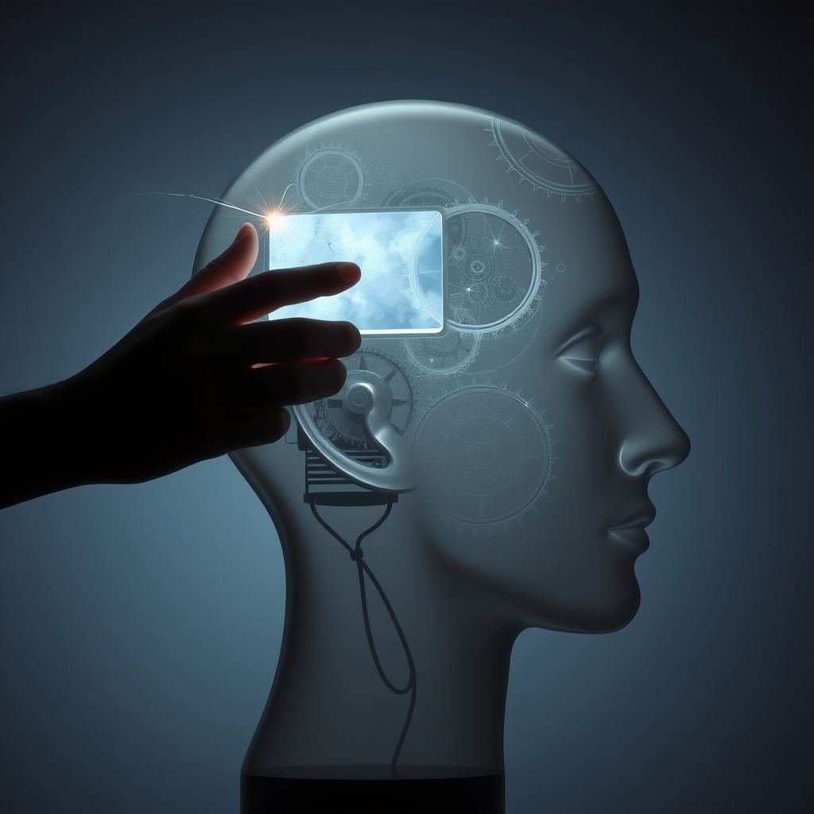

[Home](../index.md) > [Books](./index.md)  
# 🪄💭 Necessary Illusions: Thought Control in Democratic Societies  
  
[🛒 Necessary Illusions: Thought Control in Democratic Societies. As an Amazon Associate I earn from qualifying purchases.](https://amzn.to/3HmJ7hg)  
  
## 📚 Book Report: Necessary Illusions: Thought Control in Democratic Societies by Noam Chomsky  
  
### 📢 Introduction  
  
* 📖 **Book:** *Necessary Illusions: Thought Control in Democratic Societies*  
* ✍️ **Author:** Noam Chomsky  
* 📅 **Publication Date:** 1989  
* 🔑 **Core Argument:** 🗣️ Chomsky argues that in democratic societies, where overt force is less viable for control, the media and intellectual culture function as a system of propaganda, 🏭 manufacturing consent and 🧠 shaping thought to serve the interests of state and corporate power. 🎭 This creates "necessary illusions" to maintain the existing order and prevent genuine popular participation in decision-making.  
  
### 💡 Key Concepts and Arguments  
  
* 📣 **Propaganda Model:** ⚙️ Though more fully detailed in *Manufacturing Consent* (co-authored with Edward S. Herman), 📝 Chomsky applies its principles here. 📊 The model posits that systemic biases shape media content through filters like:  
    * 🏢 Concentrated ownership by corporations.  
    * 💰 Reliance on advertising revenue.  
    * 🤝 Dependence on official sources (government, business).  
    * 😠 "Flak" or negative responses to critical reporting.  
    * 🌍 An overarching ideology (e.g., anti-communism, now perhaps anti-terrorism or market fundamentalism).  
* 🏭 **Manufacturing Consent:** 📰 The media system doesn't necessarily need explicit directives; rather, it selects for personnel who internalize the values of the powerful and frames news in ways that support elite interests. 📉 Dissent is marginalized, and the range of acceptable debate is kept within narrow bounds.  
* 🎭 **"Necessary Illusions":** 🔑 The title phrase, borrowed from theologian Reinhold Niebuhr, refers to the beliefs and narratives required by elites to manage the public ("the bewildered herd") who must be kept passive and confused, 😕 prevented from understanding their actual interests or participating meaningfully in power.  
* 👨‍🏫 **Role of Intellectuals:** 🧐 Chomsky is critical of intellectuals and journalists who, consciously or not, protect elites by concealing or framing information in ways that uphold the status quo.  
* 🤫 **Subtle Control:** 🛡️ Unlike totalitarian states which rely on force, democratic societies achieve control through subtler means like shaping public opinion, 🧠 bounding the range of thinkable thought, and 🗣️ defining the terms of debate.  
* 📰 **Case Studies:** 📚 The book (based on Chomsky's 1988 Massey Lectures) uses contemporary examples (primarily U.S. foreign policy and media coverage thereof) to illustrate how these mechanisms work in practice.  
  
### 🧐 Critique and Analysis  
  
* 👍 **Strengths:** 💪 Provides a powerful framework for critically analyzing media; ✍️ meticulously documented arguments; 🤔 challenges assumptions about media objectivity and democratic processes.  
* 👎 **Criticisms:** 🤔 Some find the model overly deterministic or conspiratorial (though Chomsky emphasizes systemic factors over explicit conspiracy); 📰 critics argue it underestimates journalistic integrity and the potential for alternative media; 📅 some analysis may feel dated due to the late-Cold War context, though the core arguments remain relevant.  
  
### 🎯 Conclusion  
  
📚 *Necessary Illusions* remains a seminal work of media criticism. 🏛️ It offers a compelling, if unsettling, perspective on how power operates through ideology and information control in societies that pride themselves on freedom of speech and democracy. 👨‍🎓 Chomsky urges citizens to undertake "intellectual self-defense" to recognize and resist manipulation.  
  
## 📚 Further Reading Recommendations  
  
### 🤝 Similar Perspectives (Media Criticism, Power Structures, Propaganda)  
  
* **[🏭🫡 Manufacturing Consent: The Political Economy of the Mass Media](./manufacturing-consent.md)** by Edward S. Herman and Noam Chomsky: 🧱 The foundational text detailing the Propaganda Model discussed in *Necessary Illusions*. 📖 Essential companion reading.  
* 🗣️ **[🤔🔌 Understanding Power: The Indispensable Chomsky](./understanding-power-the-indispensable-chomsky.md)** edited by Peter R. Mitchell and John Schoeffel: 🎤 A collection of Chomsky's talks and interviews, offering accessible insights into his views on media, power, and global politics.  
* **[📺💀 Amusing Ourselves to Death: Public Discourse in the Age of Show Business](./amusing-ourselves-to-death-public-discourse-in-the-age-of-show-business.md)** by Neil Postman: 🤡 Argues that television (and by extension, modern media) degrades public discourse by prioritizing entertainment over substance, creating a populace easily distracted from important issues.  
* 📣 **Propaganda** by Edward Bernays: 👨‍🏫 A foundational text on public relations and propaganda by one of its pioneers (and Freud's nephew), offering a candid look at techniques for shaping public opinion.  
* 📰 **Inventing Reality: The Politics of News Media** by Michael Parenti: 🧐 A critical analysis, similar to Chomsky's, focusing on how media serves corporate and political interests, often ignoring systemic issues.  
  
### ⚔️ Contrasting Perspectives (Alternative Views on Media, Democracy, Ideology)  
  
* 🗣️ **Public Opinion** by Walter Lippmann: 👴 An early, influential work that, like Chomsky, questions the capacity of the average citizen but proposes management by expert elites, a view Chomsky critiques as anti-democratic.  
* 🧠 **[The Righteous Mind](./the-righteous-mind.md): Why Good People Are Divided by Politics and Religion** by Jonathan Haidt: 💡 Explores the psychological roots of political differences, offering a different lens (moral psychology) than Chomsky's power-structure focus to understand ideological divides.  
* 🤥 **Trust Me, I'm Lying: Confessions of a Media Manipulator** by Ryan Holiday: 🕵️ An insider's account of manipulating blogs and online media, offering a different, more tactical perspective on media distortion driven by clicks and controversy rather than solely elite ideology.  
  
### ✨ Creatively Related (Themes of Control, Dystopia, Psychology, Freedom)  
  
* **[👁️ Nineteen Eighty-Four](./1984.md)** by George Orwell: 🌃 The classic dystopian novel exploring totalitarian surveillance, thought control ("Newspeak," "doublethink"), and the manipulation of information and history.  
* 💊 **Brave New World** by Aldous Huxley: 🌈 A contrasting dystopia where control is achieved not through overt oppression but through pleasure, distraction, and conditioning – echoing themes of subtle societal control.  
* 🎭 **The Society of the Spectacle** by Guy Debord: 🤔 A philosophical critique arguing that modern capitalist society is dominated by images and mediated experiences ("the spectacle"), alienating individuals from authentic life and social relations.  
* 🧠 **[Thinking, Fast and Slow](./thinking-fast-and-slow.md)** by Daniel Kahneman: 💡 Explores cognitive biases and the two systems of thought (fast/intuitive vs. slow/deliberative), providing psychological context for why populations might be susceptible to manipulation and simplified narratives.  
* 🌐 **[The Age of Surveillance Capitalism](./the-age-of-surveillance-capitalism.md): The Fight for a Human Future at the New Frontier of Power** by Shoshana Zuboff: 📡 Examines how modern tech companies gather vast amounts of personal data to predict and modify behavior, presenting a new form of powerful, often invisible, control.  
  
## 💬 [Gemini](../software/gemini.md) Prompt (gemini-2.5-pro-exp-03-25)  
> Write a markdown-formatted (start headings at level H2) book report, followed by a plethora of additional similar, contrasting, and creatively related book recommendations on Necessary Illusions Thought Control in Democratic Societies. Be thorough in content discussed but concise and economical with your language. Structure the report with section headings and bulleted lists to avoid long blocks of text.