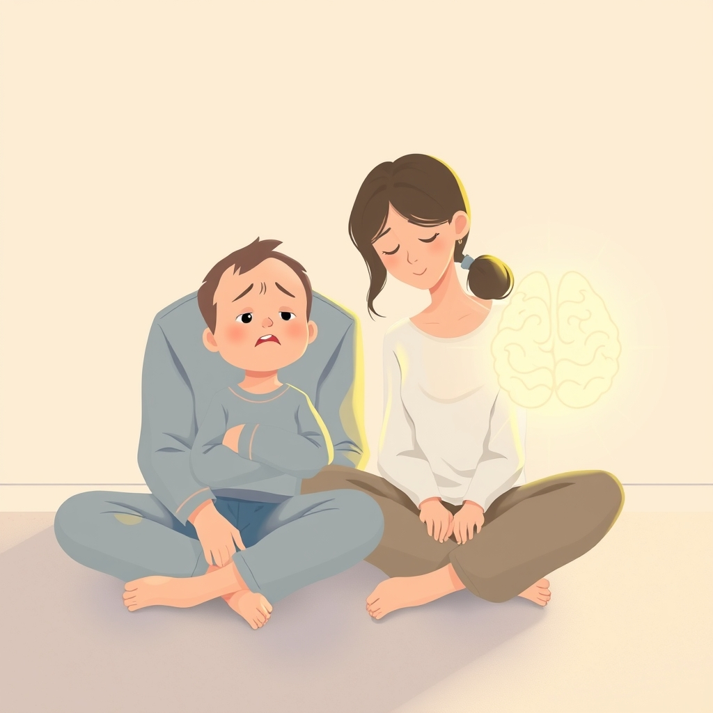

[Home](../index.md) > [Books](./index.md)  
# 🚫🎭🧠 No-Drama Discipline: The Whole-Brain Way to Calm the Chaos and Nurture Your Child's Developing Mind  
  
[🛒 No-Drama Discipline: The Whole-Brain Way to Calm the Chaos and Nurture Your Child's Developing Mind. As an Amazon Associate I earn from qualifying purchases.](https://amzn.to/4knWZGV)  
  
## 📚 Book Report: No-Drama Discipline  
  
### 🚀 Introduction  
* ✍️ **Authors:** Daniel J. Siegel, M.D. (neuropsychiatrist) and Tina Payne Bryson, Ph.D. (psychotherapist).  
* 🧠 **Main Premise:** 📖 The book presents a "whole-brain" approach to child discipline, shifting the focus from punishment to teaching. 🌱 It argues that discipline should be an opportunity to nurture a child's developing brain, build skills like self-control and emotional regulation, and strengthen the parent-child relationship. 🏷️ The term "discipline" itself is highlighted as meaning "to teach" rather than solely "to punish".  
  
### 🧠 Key Concepts  
* 🧠 **Whole-Brain Approach:** 💡 Recognizes that a child's brain, particularly the "upstairs brain" (responsible for rational thought, planning, and self-control) is still developing. ⚖️ Discipline strategies should engage both the emotional "downstairs brain" (reactive) and the thinking "upstairs brain".  
* 🔗 **Connect and Redirect:** 💖 This is the core strategy. 🤝 First, connect emotionally with the child to soothe their reactive "downstairs brain" and make them receptive. ➡️ Once calm, redirect by engaging their "upstairs brain" to teach, problem-solve, and set limits. 🔄 This moves a child from reactivity to receptivity and builds their brain long-term.  
* 🍎 **Discipline as Teaching:** 🎯 The goal is not simply to stop misbehavior (short-term goal) but to teach skills like impulse control, emotional management, empathy, and moral reasoning (long-term goal). ⚠️ Misbehavior is viewed as an opportunity for teaching and brain-building.  
* 🤔 **Mindsight:** 👁️ Developing the ability to understand one's own mind (insight) and the minds of others (empathy) is crucial for self-regulation and healthy relationships. 🌟 Discipline should foster these abilities.  
  
### 🛠️ Practical Strategies  
* 💖 **Connect First:** ✅ Validate feelings, offer comfort (getting below eye level, using loving touch), listen without lecturing, and reflect back what you hear. 🦈 Turn down internal "shark music" (parent's own fears/past experiences). ❓ Ask "why" the child is acting this way and consider "how" you communicate.  
* 🔄 **Redirect Strategies:** ➡️ Once connected, use strategies like reducing words, embracing emotions (instead of dismissing them), describing the situation neutrally, involving the child in finding solutions, reframing "no" into a "yes with conditions," emphasizing positive behaviors, and teaching Mindsight tools (insight, empathy, repair).  
* 🔬 **Brain Science Application:** 🧠 The book includes illustrations and real-life examples to make brain science concepts accessible (e.g., upstairs/downstairs brain, integrating left/right brain hemispheres) and show how strategies support healthy brain development. 🏷️ Strategies like "Name It to Tame It" (using words to understand emotions) and "Move It or Lose It" (using physical activity to shift mood) connect directly to brain function.  
  
### 👍 Strengths  
* 🧠 **Science-Based:** 🔬 Grounded in current neuroscience research on child brain development.  
* 🪜 **Practical and Accessible:** 🧰 Offers concrete strategies, relatable examples, and helpful illustrations.  
* 👪 **Relationship-Focused:** 💖 Emphasizes connection, empathy, and strengthening the parent-child bond.  
* 💪 **Empowering:** 🌟 Aims to empower parents with understanding and tools, rather than causing guilt or discouragement.  
* ⏳ **Long-Term View:** 🌱 Focuses on building essential life skills rather than just immediate compliance.  
  
### 👎 Potential Criticisms/Limitations  
* 💭 **Idealistic:** 😔 Some might find the consistent application of connection before redirection challenging in the heat of the moment, especially with frequent or intense misbehavior.  
* ⏰ **Time-Intensive:** ⏳ Implementing these strategies often requires more time and patience than traditional punitive measures.  
* 🤯 **Complexity:** 🤔 While simplified, understanding the underlying brain science might still feel complex for some readers.  
* 🪄 **No "Magic Wand":** ⚠️ The authors acknowledge these strategies don't guarantee perfect behavior or eliminate all challenges; flexibility and adapting to the specific child and situation are key.  
  
### 🎯 Conclusion  
* ✅ "No-Drama Discipline" provides a highly recommended, compassionate, and effective framework for guiding children's behavior. 🌱 By prioritizing connection and understanding brain development, it offers parents tools to discipline in a way that teaches crucial life skills, fosters emotional intelligence, and builds stronger family relationships.  
  
## 📚 Book Recommendations  
### 🔗 Similar Approaches (Positive Parenting, Brain Development, Connection)  
* **[🕳️🧠👶🏽 The Whole-Brain Child: 12 Revolutionary Strategies to Nurture Your Child's Developing Mind](./the-whole-brain-child.md)** by Daniel J. Siegel and Tina Payne Bryson: 📖 A foundational precursor to "No-Drama Discipline," this book delves deeper into the brain science and offers 12 strategies for fostering emotional and intellectual development. 🤝 It includes concepts like integrating the left and right brain, and the upstairs and downstairs brain. 📝 A companion workbook is also available.  
* **[👍🧠 The Yes Brain: How to Cultivate Courage, Curiosity, and Resilience in Your Child](./the-yes-brain.md)** by Daniel J. Siegel and Tina Payne Bryson: 🌱 Focuses on fostering qualities like resilience, insight, empathy, and creativity by nurturing a "Yes Brain" – one that is receptive, open, and adaptable.  
* 💖 **[🔌👋 The Power of Showing Up: How Parental Presence Shapes Who Our Kids Become and How Their Brains Get Wired](./the-power-of-showing-up.md)** by Daniel J. Siegel and Tina Payne Bryson: 👨‍👩‍👧‍👦 Explores the importance of parental presence based on the "Four S's": helping kids feel Safe, Seen, Soothed, and Secure.  
* 🤝 **Positive Discipline** series by Jane Nelsen (and co-authors): 🌟 A classic series focused on mutual respect, kindness, and firmness, teaching children self-discipline, responsibility, and problem-solving skills without punishment. 👶 There are versions for different age groups (preschoolers, teenagers) and situations (special needs, childcare providers).  
* 🗣️ **How to Talk So Kids Will Listen & Listen So Kids Will Talk** by Adele Faber and Elaine Mazlish: 👂 A highly regarded classic offering practical communication tools to foster cooperation, mutual respect, and positive relationships.  
* 👶 **How to Talk So Little Kids Will Listen: A Survival Guide to Life with Children Ages 2-7** by Joanna Faber and Julie King: 🗣️ Adapts the communication strategies from the original "How to Talk" book specifically for younger children.  
* **[🌱👼🏼 Raising Good Humans: A Mindful Guide to Breaking the Cycle of Reactive Parenting and Raising Kind, Confident Kids](./raising-good-humans-a-mindful-guide-to-breaking-the-cycle-of-reactive-parenting-and-raising-kind-confident-kids.md)** by Hunter Clarke-Fields: 🧠 Focuses on mindful parenting to manage parental reactivity and raise cooperative and confident children.  
* ☮️ **Peaceful Parent, Happy Kids: How to Stop Yelling and Start Connecting** (or **Calm Parents, Happy Kids**) by Dr. Laura Markham: 💖 Emphasizes emotional connection, coaching children's emotions, and setting limits with empathy.  
* ✅ **Positive Parenting: An Essential Guide** by Rebecca Eanes: 👨‍👩‍👧‍👦 A guide to building connection, improving communication, and applying positive parenting principles effectively. 📝 Also available as a workbook.  
* **[🤱🏼🤿🪞🌱 Parenting from the Inside Out: How a Deeper Self-Understanding Can Help You Raise Children Who Thrive](./parenting-from-the-inside-out-how-a-deeper-self-understanding-can-help-you-raise-children-who-thrive.md)** by Daniel J. Siegel and Mary Hartzell: 💔 Explores how parents' own childhood experiences impact their parenting and offers ways to develop self-understanding for more effective parenting.  
  
### ⚔️ Contrasting or Alternative Perspectives  
* 🇫🇷 **Bringing Up Bébé: One American Mother Discovers the Wisdom of French Parenting** by Pamela Druckerman: 🌍 Offers a different cultural perspective on child-rearing, often perceived as involving firmer boundaries and expectations from an early age compared to typical American positive parenting approaches.  
* 🐅 **The Battle Hymn of the Tiger Mother** by Amy Chua: 🐅 A controversial memoir detailing a stricter, achievement-focused parenting style rooted in traditional Chinese cultural values, contrasting sharply with the connection-focused approach of "No-Drama Discipline."  
* ⚖️ **Love and Logic** series by Foster Cline and Jim Fay: 👍 While promoting respect, this approach emphasizes natural consequences and allowing children to experience the results of their choices, which can sometimes differ in application from the empathy-first focus of Siegel and Bryson.  
* 📚 **(Academic/Critical Texts):** 🧐 Books or articles exploring critiques of "gentle parenting" or analyzing discipline from different psychological or sociological frameworks (e.g., behaviorism, critical theory). 🔬 Research exploring the effectiveness of different discipline styles can offer broader context. ⚠️ Note: Specific titles focusing solely on contrasting discipline *philosophies* (outside behaviorism or highly authoritarian styles) are less common in the popular parenting genre compared to variations within positive/respectful parenting.  
  
### ✨ Creatively Related (Neuroscience, Emotional Intelligence, Mindfulness)  
* 🧠 **Mindsight: The New Science of Personal Transformation** by Daniel J. Siegel: 🤔 Explores the concept of Mindsight (understanding the inner world of self and others) in greater depth, applicable beyond just parenting.  
* 🧘 **Aware: The Science and Practice of Presence** by Daniel J. Siegel: 🧘‍♀️ Focuses on mindfulness meditation and developing awareness as a tool for well-being, relevant for parents managing their own stress and reactivity.  
* **[❤️‍🔥💪 Grit: The Power of Passion and Perseverance](./grit-the-power-of-passion-and-perseverance.md)** by Angela Duckworth: 🌱 While not a parenting book per se, it explores the importance of perseverance and passion, traits many positive parenting approaches aim to foster.  
* **[🌱🧘🏼‍♀️🏆 Mindset: The New Psychology of Success](./mindset.md)** by Carol S. Dweck: ✅ Discusses the concept of fixed vs. growth mindsets, which is highly relevant to how parents approach challenges and learning with their children.  
* **[📱😥 The Anxious Generation: How the Great Rewiring of Childhood Is Causing an Epidemic of Mental Illness](./the-anxious-generation-how-the-great-rewiring-of-childhood-is-causing-an-epidemic-of-mental-illness.md)** by Jonathan Haidt: 😞 While focusing on the impact of modern childhood (smartphones, decline of free play), it touches on resilience and child development, offering a broader societal context.  
* 🐸 **Sitting Still Like a Frog: Mindfulness Exercises for Kids (and Their Parents)** by Eline Snel: 🧘 Offers practical mindfulness activities for children, aligning with the goal of teaching emotional regulation.  
* 🫂 **Books on [🫂💖 Attachment Theory](../topics/attachment-theory.md)** (e.g., by John Bowlby, Gordon Neufeld): 💖 Provide deeper understanding of the parent-child bond, which underpins the connection aspect of "No-Drama Discipline.".  
  
## 💬 [Gemini](../software/gemini.md) Prompt (gemini-2.5-pro-exp-03-25)  
> Write a markdown-formatted (start headings at level H2) book report, followed by a plethora of additional similar, contrasting, and creatively related book recommendations on No-Drama Discipline. Be thorough in content discussed but concise and economical with your language. Structure the report with section headings and bulleted lists to avoid long blocks of text.