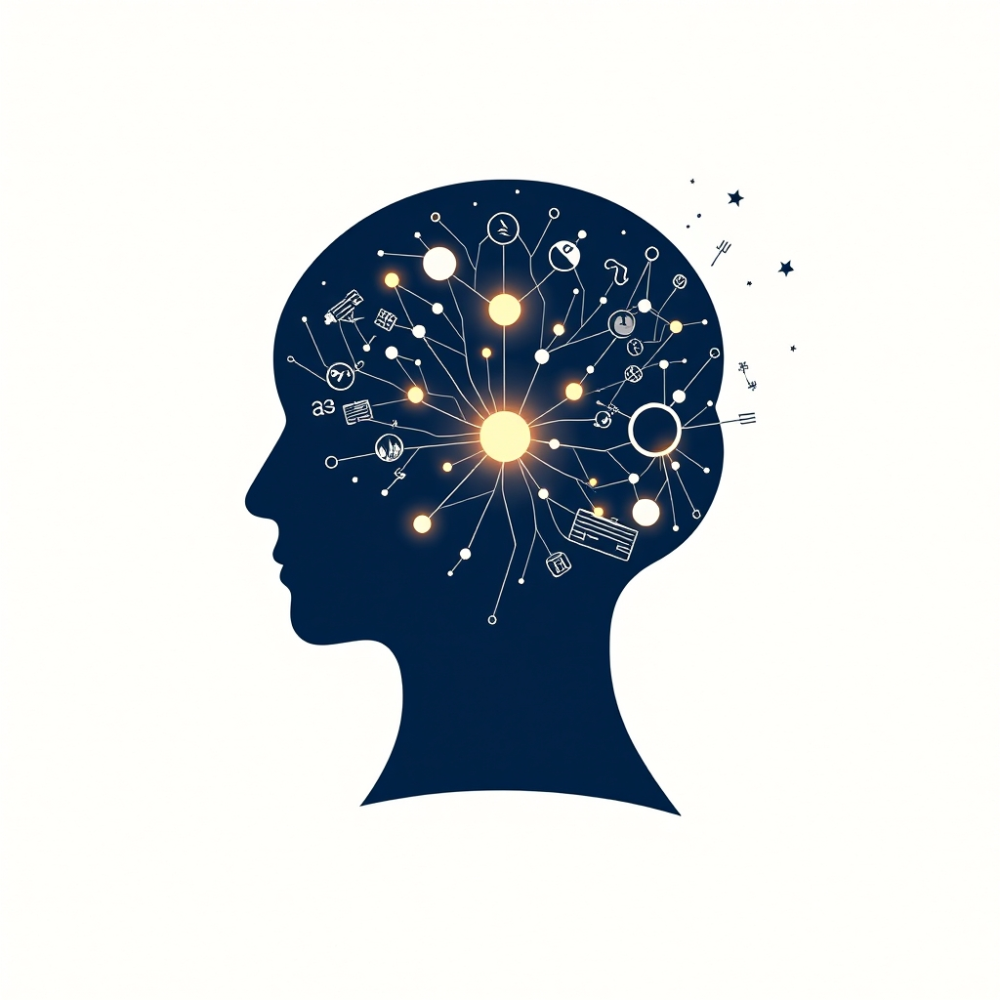

[Home](../index.md) > [Books](./index.md)  
# 🗣️ On Language  
  
[🛒 On Language. As an Amazon Associate I earn from qualifying purchases.](https://amzn.to/3TLztYD)  
  
## 🧐 A Look "On Language": A Report on Noam Chomsky's Foundational Work  
  
👨‍🏫 Noam Chomsky's *On Language* stands as a cornerstone of modern linguistics, a collection of works that fundamentally shifted the scientific understanding of language and its connection to the human mind. 📝 This report will dissect the book's core arguments, followed by a wide-ranging list of reading recommendations that engage with, challenge, and expand upon Chomsky's revolutionary ideas. 📚 The book itself is a compilation of two of Chomsky's significant works: *Language and Responsibility* and *Reflections on Language*. 🗣️ The former offers a more personal and political lens on his thinking, while the latter delves into the scientific and philosophical underpinnings of his linguistic theories.  
  
### 🔑 Key Tenets of Chomsky's Linguistic Framework  
  
🎯 At the heart of *On Language* lies a set of interconnected and groundbreaking arguments that have shaped the field of linguistics for decades.  
  
* 🧠 **Universal Grammar (UG):** Chomsky's most famous and influential concept is the theory of Universal Grammar. 👶 He posits that all humans are born with an innate, biological capacity for language. 🧬 This "language organ" is not a blank slate but comes pre-equipped with a set of universal principles and parameters that govern the structure of all human languages. 🌍 These principles explain the underlying similarities found across diverse languages, suggesting a common genetic endowment for language acquisition.  
  
* 🧩 **The Poverty of the Stimulus:** To support the idea of an innate language faculty, Chomsky presents the "poverty of the stimulus" argument. 🚫 He contends that the linguistic input children receive is insufficient and often too flawed to account for the rapid and complex grammatical knowledge they acquire. 🗣️ Children are able to produce and understand novel sentences they have never heard before, suggesting they are not simply imitating but are applying innate grammatical rules.  
  
* 🌱 **Innate vs. Learned:** Chomsky's work stands in stark opposition to the behaviorist theories popular at the time, most notably those of B.F. Skinner. 🙅‍♂️ While behaviorism proposed that language is learned through reinforcement and conditioning, Chomsky argued for a nativist approach, emphasizing the mind's inherent structures for language.  
  
* ↔️ **I-Language and E-Language:** Chomsky distinguishes between "I-language" (internalized language) and "E-language" (externalized language). 🧠 His primary focus is on I-language, the system of knowledge and computational procedures that exists within an individual's mind. 💬 E-language, which refers to the observable linguistic output and social conventions of language, is of less interest to his theoretical framework.  
  
### 📚 Book Recommendations  
  
#### 🤝 Echoes of Chomsky: Books in a Similar Vein  
  
* **[🗣️🧠 The Language Instinct: How the Mind Creates Language](./the-language-instinct-how-the-mind-creates-language.md)** **by Steven Pinker:** 🤔 Often considered a more accessible popularization of Chomskyan ideas, Pinker's work champions the concept of an innate language faculty. 🧬 He argues that language is a biological adaptation and provides a wealth of examples from child language acquisition and cognitive science to support the idea of a "language instinct."  
  
* 🗣️ ***Language and Mind*** **by Noam Chomsky:** 🧐 For those wanting a deeper dive into Chomsky's own writings, this collection of essays directly explores the relationship between language and human thought. 🧠 It provides a more detailed exposition of his theories on the biological basis of language and its implications for understanding the mind.  
  
* ✍️ ***Syntactic Structures*** **by Noam Chomsky:** 🚀 This is the seminal work that first introduced Chomsky's theory of generative grammar. 🤓 While more technical, it lays the formal groundwork for the ideas presented in *On Language* and is essential for understanding the foundations of modern linguistics.  
  
#### 🪙 The Other Side of the Coin: Contrasting Perspectives  
  
* 🗣️ ***Verbal Behavior*** **by B. F. Skinner:** 📜 This is the classic work of behaviorist psychology that Chomsky famously critiqued. 🐕‍🦺 Skinner argues that language is a learned behavior, shaped by environmental reinforcement. 📖 Reading this provides a direct contrast to Chomsky's nativist stance and helps to understand the intellectual context in which Chomsky's ideas emerged.  
  
* 👶 ***Constructing a Language: A Usage-Based Theory of Language Acquisition*** **by Michael Tomasello:** 🏗️ Tomasello presents a powerful alternative to Universal Grammar, arguing that language is not innate but is constructed by children from the language they hear around them. 👂 His "usage-based" theory emphasizes the role of social cognition and pattern-finding in language acquisition, directly challenging the "poverty of the stimulus" argument.  
  
* 🏝️ ***Language: The Cultural Tool*** **by Daniel L. Everett:** 🏞️ Drawing on his extensive fieldwork with the Pirahã people of the Amazon, Everett argues against the existence of a universal grammar. 🌍 He proposes that language is a cultural tool, shaped by the needs and values of the society that uses it, and not an innate instinct. 🔥 His work has sparked significant debate and offers a fascinating, anthropological perspective on the nature of language.  
  
#### 🎨 Beyond the Dichotomy: Creatively Related Explorations  
  
* 🎭 ***Metaphors We Live By*** **by George Lakoff and Mark Johnson:** 💡 This influential book argues that metaphor is not just a literary device but a fundamental aspect of human thought and language. 🧠 Lakoff and Johnson demonstrate how our conceptual systems are largely metaphorical, shaping how we perceive and interact with the world.  
  
* 🧬 ***Evolutionary Linguistics*** **by April McMahon and Robert McMahon:** 🐒 For those curious about the origins of language, this book provides a clear introduction to the interdisciplinary field of evolutionary linguistics. 🧠 It explores how the biological and neurological structures underlying language may have evolved, offering a different but related perspective on the biological basis of language.  
  
* 💭 ***Thought and Language*** **by Lev Vygotsky:** 👶 This classic work of psychology explores the intricate relationship between language and thought from a developmental perspective. 🧠 Vygotsky argues that thought is not merely expressed through language but is shaped and developed by it, offering a sociocultural perspective that complements Chomsky's more formal linguistic analysis.  
  
## 💬 [Gemini](../software/gemini.md) Prompt (gemini-2.5-pro)  
> Write a markdown-formatted (start headings at level H2) book report, followed by a plethora of additional similar, contrasting, and creatively related book recommendations on On Language. Be thorough in content discussed but concise and economical with your language. Structure the report with section headings and bulleted lists to avoid long blocks of text.