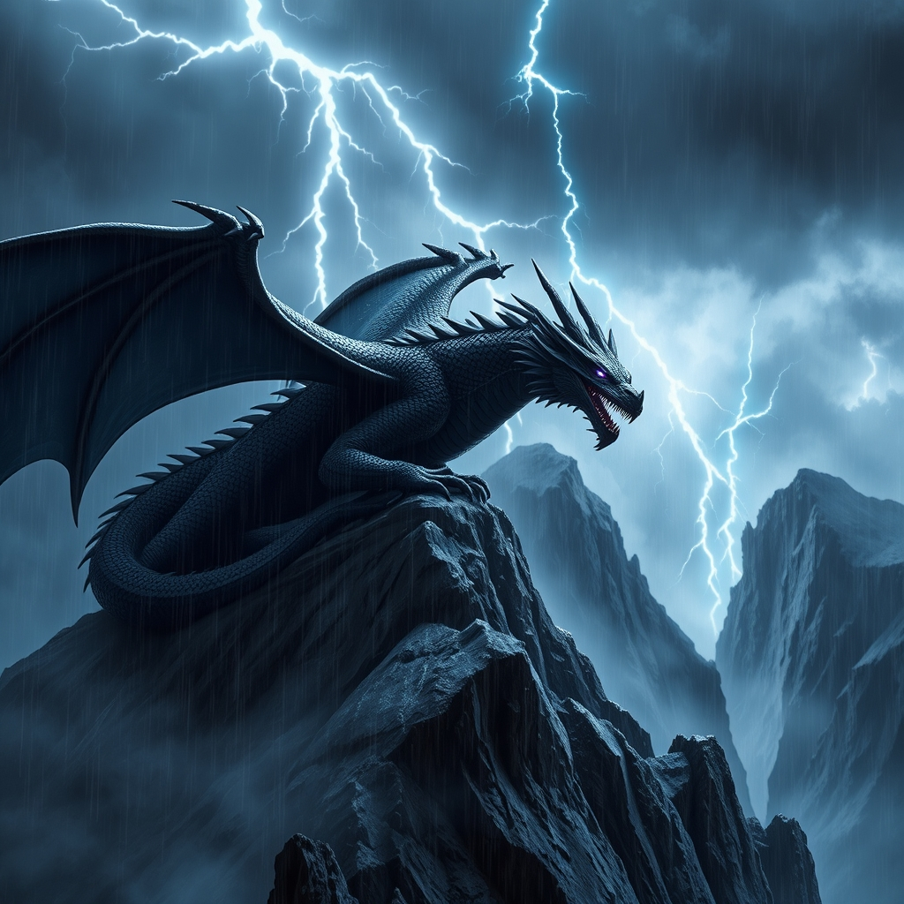

[Home](../index.md) > [Books](./index.md)  
# 🖤🐲⛈️ Onyx Storm  
  
[🛒 Onyx Storm. As an Amazon Associate I earn from qualifying purchases.](https://amzn.to/3Z95D3u)  
  
## 🤖 AI Summary  
### Context 🐉  
* Author: Rebecca Yarros ✍️  
* Genre: Fantasy Romance 🔥  
* Series: The Empyrean series, book 3 (following *Fourth Wing* and *Iron Flame*) 📚  
  
### Highlights ✨  
* Prepare for another emotionally charged and action-packed installment that will keep you on the edge of your seat. 🎢  
* Yarros continues to build a rich and immersive world with compelling characters you'll root for. 🥰  
* The romantic elements are intense and will leave you breathless. 💖  
  
### Common Complaints 🗣️  
* Some readers found the pacing uneven at times. ⏳  
* Others felt that certain plot points could have been explored in more depth. 🤔  
  
### Themes 💭  
* This book delves into themes of resilience in the face of overwhelming odds, the complexities of loyalty and duty, and the enduring power of love and connection. ❤️‍🔥  
  
### Writing Style 🖋️  
* Yarros employs a vivid and engaging writing style, drawing the reader into the heart of the story with descriptive prose and intense emotional moments. 💥  
  
### Reception 🌟  
* While specific reviews for *Onyx Storm* are just emerging (as of March 2025), Rebecca Yarros's previous books in the series have been incredibly popular and well-received, suggesting this installment will likely follow suit with strong reader engagement. 👍  
  
### Recommendations 📚  
  
#### Non-Fiction 🤔  
* **"The Hero with a Thousand Faces" by Joseph Campbell:** If you are fascinated by the underlying structures of storytelling and the archetypes that appear across different myths and legends, this book explores the common patterns in heroic narratives, which often form the backbone of fantasy epics like _Onyx Storm_. It can offer a deeper appreciation for the story's construction and the characters' journeys. 🤓  
* **"Romancing the Beat: Story Structure for Romance Novels" by Gwen Hayes**: For readers who particularly enjoy the romantic elements in Onyx Storm and are curious about the craft behind creating compelling love stories, this book provides insights into the specific structural elements and emotional beats that make romance novels work. It could be interesting for aspiring writers or anyone wanting a behind-the-scenes look at the genre. ✍️💖  
* **[✍️🦴 Writing Down the Bones](./writing-down-the-bones.md) by Natalie Goldberg:** For readers inspired by Yarros's storytelling, this book offers practical and encouraging advice on developing your own writing skills and unleashing your creativity. ✍️  
  
#### If You Loved This 🥰  
* **"A Court of Thorns and Roses" by Sarah J. Maas:** If you were captivated by the blend of fantasy, romance, and strong characters in *Onyx Storm*, this series offers a similar reading experience with a different but equally enthralling world. 🌹  
* **"Serpent & Dove" by Shelby Mahurin:** This book also features a compelling fantasy romance with high stakes, engaging characters, and a touch of enemies-to-lovers tension that fans of Yarros often appreciate. 🕊️  
  
#### Similar But Different 🧐  
* **"The Priory of the Orange Tree" by Samantha Shannon:** If you enjoyed the dragon-centric fantasy elements but are looking for a more epic and sprawling narrative with intricate world-building and multiple perspectives, this standalone novel offers a grand adventure. 🐉🍊  
* **"Uprooted" by Naomi Novik:** This book provides a unique and beautifully written fantasy with a strong focus on folklore, magic, and a compelling relationship between two contrasting characters, offering a different flavor of fantasy while still delivering a captivating story. 🌲✨  
