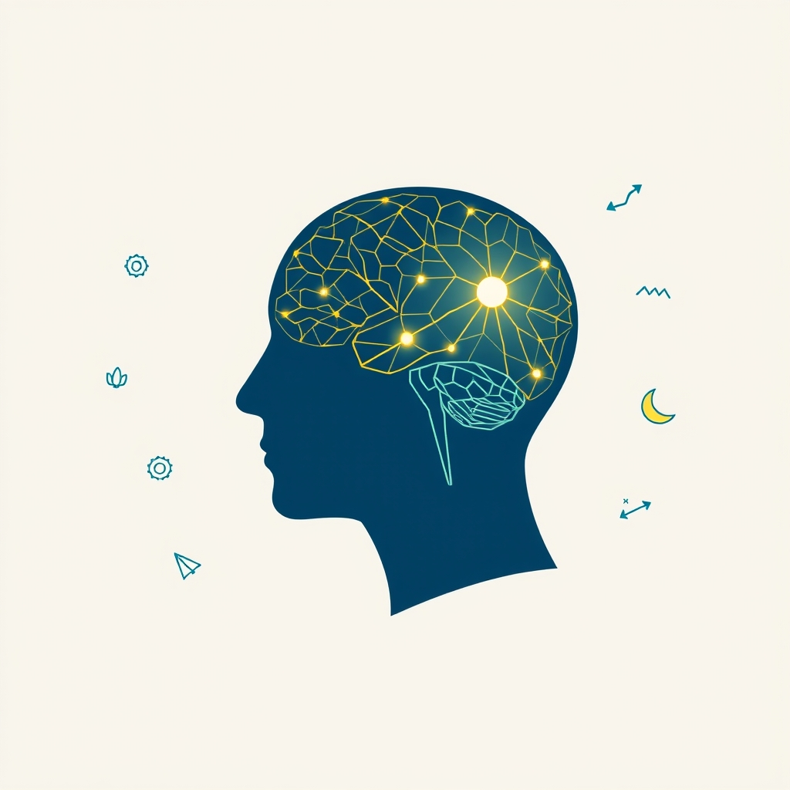

[Home](../index.md) > [Books](./index.md)  
# 🧠📈 Outsmart Yourself: Brain-Based Strategies for a Bettery You  
  
[🛒 Outsmart Yourself: Brain-Based Strategies for a Bettery You. As an Amazon Associate I earn from qualifying purchases.](https://amzn.to/4ln5XnQ)  
  
## 📝🐒 Human Notes  
- 👂 Language is better understood in the right ear than the left  
- 🤫 Don't broadcast your big goals  
- 🧟 Unconscious decisions feel conscious  
- 🪈 To influence your behavior, target your unconscious brain  
- 🎮 People (including babies) love to influence the world  
- 🧘 Sit quietly and think about what you're going to do for 20 minutes to beat procrastination  
- 📝 To reduce a bad habit: record every time you do it  
- 🆕 Find a new habit to replace bad habits with. Think about the trigger.  
- 🧐 Monotask  
- 🔮 Imagine your future self  
- 🏋🏼‍♀️ Practice  
- 🧘🏼‍♀️ Meditate  
- 😴 Sleep  
- 😁 Smile for happiness  
- 🦸🏼‍♀️ Pose like Wonder Woman for confidence  
- 🚶🏼‍♀️ Move your body to solve problems  
- ⏳ Spend time with things to like them more  
- 🥳 Exciting activities help people bond  
- 😊 To be happier  
    - 🙏 Express gratitude  
    - 🏞️ View nature  
    - 🏃 Exercise  
    - 🧠 Be mindful  
    - 🧘 Meditate  
    - ⏳ Think about time more than money  
    - 💲 Value your time more  
    - 🥛 Be more optimistic  
        - 💪 Trying builds habitual optimism  
- 😊 Being happy makes you  
    - 🧠 smarter  
    - 🚀 more productive 🎉  
  
## 🧠 Book Report: Outsmart Yourself: Brain-Based Strategies for a Better You  
  
"Outsmart Yourself: Brain-Based Strategies for a Better You," presented by Professor Peter M. Vishton, offers an insightful 💡 exploration into the workings of the human brain and provides practical, evidence-based strategies for personal improvement. Drawing on scientific research 🔬 in neuroscience and psychology 🧠, the book (or lecture series) aims to help individuals understand why they behave in certain ways and how to leverage 🚀 this knowledge to make lasting positive changes 😊.  
  
### 🔑 Key Concepts and Strategies  
  
The core of "Outsmart Yourself" lies in bridging the gap 🌉 between understanding brain function and applying that knowledge to everyday life. Several key concepts and strategies are discussed:  
  
* 🧠 **Understanding the Automatic Brain:** The material highlights how much of our behavior is driven by subconscious processes 🤔, often leading to habits and decisions that may not serve our best interests.  
* ⏳ **Combating Procrastination:** Practical techniques rooted in understanding the neurochemistry of procrastination 😩 are offered to help overcome inertia and improve efficiency 📈.  
* 🚫 **Breaking Bad Habits:** Strategies are presented for examining and modifying behaviors 🔄, utilizing principles from behavioral psychology.  
* 🚫 **The Myth of Multitasking:** The course emphasizes that focusing on one task at a time (monotasking) 🎯 is significantly more efficient and conducive to creativity 🎨 than attempting to multitask.  
* 🤝 **Leveraging the Body-Mind Connection:** The interconnectedness of physical actions and mental states is explored, with examples such as the mental benefits of smiling 😊 or how physical activity 🏃‍♀️ can aid problem-solving.  
* 🚀 **Enhancing Creativity and Problem-Solving:** The book provides practical tips and strategies for boosting creative thinking and improving problem-solving skills 🧩, including the power of imagination and imagery.  
* 😢 **Managing Emotions:** Insights into the mechanisms behind emotions like anger 😡 and fear 😨 are discussed, offering strategies for better emotional regulation 🧘‍♀️.  
* ✔️ **Making Better Decisions:** The material delves into the factors influencing decision-making 🤔, including the pull of instant gratification 🍬, and provides strategies for making choices that benefit one's future self 👴.  
* 😄 **The Science of Happiness:** The course explores what happens in the brain related to happiness 😄 and offers actionable tips for cultivating a happier life 🌻, even suggesting that happiness can become a habit.  
  
"Outsmart Yourself" provides a wealth of useful techniques 🛠️ backed by scientific evidence 🔬, making the complexities of the brain accessible and offering actionable steps for self-improvement across various aspects of life, from habits and productivity to emotional well-being and creativity.  
  
## 📚 Additional Book Recommendations  
  
### 🧠 Similar Reads (Neuroscience and Self-Improvement)  
  
* **[⚛️🔄 Atomic Habits: An Easy & Proven Way to Build Good Habits & Break Bad Ones](./atomic-habits.md) by James Clear:** Focuses on the science of habit formation 🔁 and provides a practical framework for building good habits and breaking bad ones through small, incremental changes.  
* **[🔄🧠💪 The Power of Habit: Why We Do What We Do in Life and Business](./the-power-of-habit.md) by Charles Duhigg:** Explores the science behind why habits exist and how they can be changed 🔄, looking at habits in individuals' lives, organizations, and societies.  
* **[🤔🐇🐢 Thinking, Fast and Slow](./thinking-fast-and-slow.md) by Daniel Kahneman:** While broader, this book introduces the two systems of thought that drive the way we think and make choices 🤔 (System 1: fast, intuitive, and emotional; System 2: slow, deliberate, and logical), highly relevant to understanding our automatic brain 🧠.  
* **[🤫🧠 Subliminal: How Your Unconscious Mind Rules Your Behavior](./subliminal-how-your-unconscious-mind-rules-your-behavior.md) by Leonard Mlodinow:** Explores the profound influence of the subconscious on our perceptions, behaviors, and decisions.  
* **[🧠💡📈🏠🏢🧑‍🎓 Brain Rules: 12 Principles for Surviving and Thriving at Work, Home, and School](./brain-rules-12-principles-for-surviving-and-thriving-at-work-home-and-school.md) by John Medina:** Presents 12 principles for how the brain works 🧠 and how to apply them to daily life, covering topics like exercise 🏃‍♀️, sleep 😴, stress 😫, and memory 💭.  
  
### ⚖️ Contrasting Reads (Different Perspectives on Change)  
  
* **[🔦💡 Man's Search for Meaning](./mans-search-for-meaning.md) by Viktor Frankl:** While not brain-based 🧠, this book emphasizes the human search for meaning in life as a primary motivational force 💪, offering a profound psychological and philosophical perspective on overcoming adversity 😔.  
* **[🌱🧘🏼‍♀️🏆 Mindset: The New Psychology of Success](./mindset.md) by Carol S. Dweck:** Focuses on the power of mindset (fixed vs. growth) in shaping our lives, learning 🧑‍🏫, and success 🏆, offering a different lens through which to view potential and change.  
* 🙅‍♀️ **The Subtle Art of Not Giving a F\*ck by Mark Manson:** Takes a more unconventional and philosophical approach to self-help, focusing on accepting limitations and choosing what to care about ❤️‍🩹, contrasting with purely strategy-based methods.  
* **[🌊🧘🧠📈 Flow: The Psychology of Optimal Experience](./flow-the-psychology-of-optimal-experience.md) by Mihaly Csikszentmihalyi:** Explores the concept of "flow," a state of complete absorption in an activity 🧘‍♀️, offering a psychological perspective on motivation and happiness 😄 that is experience-focused rather than solely brain-mechanics focused.  
  
### 🎨 Creatively Related Reads (Exploring the Mind and Human Experience)  
  
* **[🔮🤷🏼‍♀️🤪 Predictably Irrational: The Hidden Forces That Shape Our Decisions](./predictably-irrational.md) by Dan Ariely:** Explores the irrationality of human behavior in economic contexts 💸, offering often surprising insights into why we make the decisions we do.  
* 😵‍💫 **The Paradox of Choice: Why More Is Less by Barry Schwartz:** Examines the negative effects of having too many choices on our psychological well-being 😔, creativity 🎨, and decision-making 🤔, offering a unique perspective on a modern challenge.  
* **[🏎️⛽ Drive: The Surprising Truth About What Motivates Us](./drive-the-surprising-truth-about-what-motivates-us.md) by Daniel H. Pink:** Looks at the science of motivation 💪, arguing for the importance of autonomy, mastery, and purpose 🎯, which complements brain-based strategies by exploring the drivers behind behavior.  
* **[🎭🤫🧠 Incognito: The Secret Lives of the Brain](./incognito.md) by David Eagleman:** A fascinating journey into the hidden workings of the conscious and subconscious mind 🧠, offering intriguing examples of how our brains operate beneath our awareness.  
* **[⚕️💀 Being Mortal: Medicine and What Matters in the End](./being-mortal-medicine-and-what-matters-in-the-end.md) by Atul Gawande:** While seemingly unrelated, this book prompts reflection on what makes life meaningful in the face of aging 👴 and mortality 🪦, indirectly influencing perspectives on personal goals 🎯 and well-being 😊.  
  
## 💬 [Gemini](../software/gemini.md) Prompt (gemini-2.5-flash-preview-04-17)  
> Write a markdown-formatted (start headings at level H2) book report, followed by a plethora of additional similar, contrasting, and creatively related book recommendations on Outsmart Yourself: Brain-Based Strategies for a Bettery You. Be thorough in content discussed but concise and economical with your language. Structure the report with section headings and bulleted lists to avoid long blocks of text.