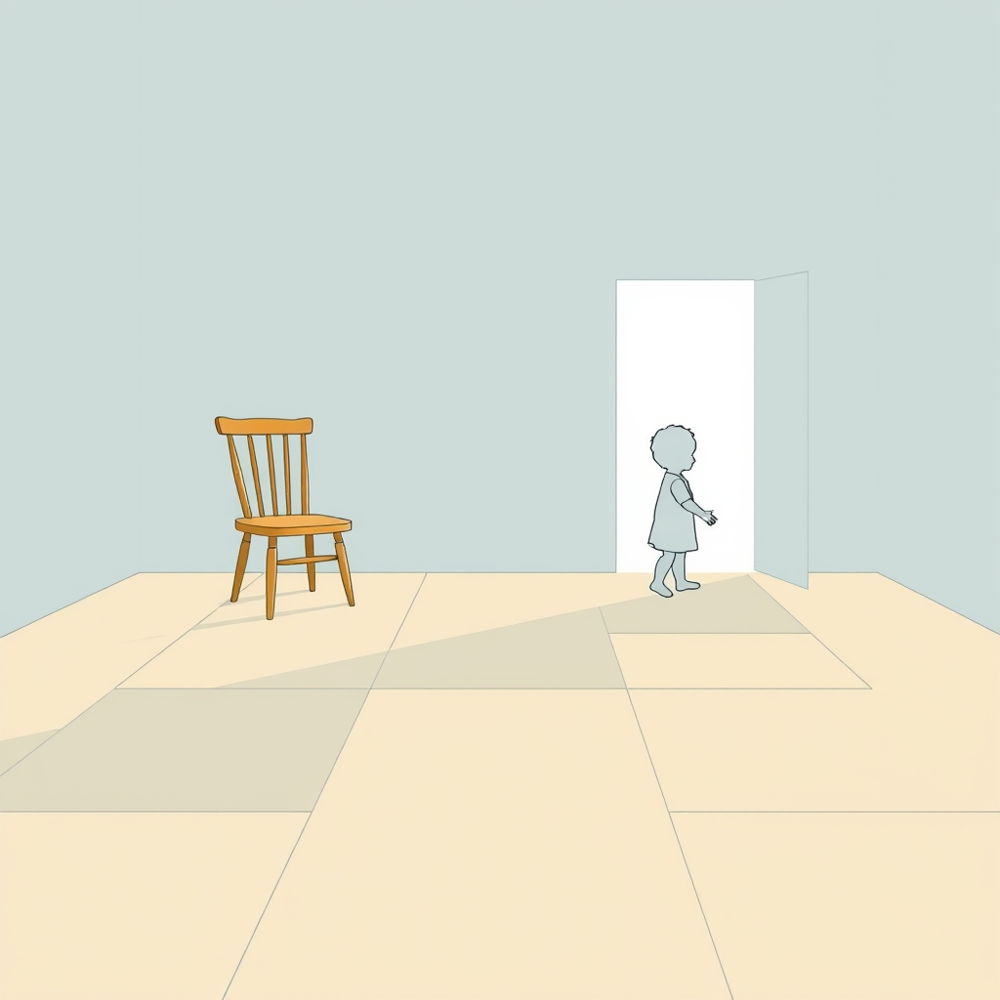

[Home](../index.md) > [Books](./index.md)  
# 👶🤔 Patterns of Attachment: A Psychological Study of the Strange Situation  
  
[🛒 Patterns of Attachment: A Psychological Study of the Strange Situation. As an Amazon Associate I earn from qualifying purchases.](https://amzn.to/4kSo9Wh)  
  
## 📚 Book Report: Patterns of Attachment  
  
### ℹ️ Overview  
  
* 🔖 **Title:** Patterns of Attachment: A Psychological Study of the Strange Situation  
* ✍️ **Authors:** Mary D. Salter Ainsworth, Mary C. Blehar, Everett Waters, Sally N. Wall.  
* 📅 **Publication:** Originally published in 1978, with later editions available.  
* 💡 **Context:** This seminal work details the methods and findings of Ainsworth's landmark Baltimore Longitudinal Study, building upon her earlier naturalistic observations in Uganda and John Bowlby's foundational attachment theory. 🧪 It introduced the "Strange Situation" procedure, a standardized observational method for assessing attachment patterns in infants.  
  
### 🧠 Key Concepts and Methodology  
  
* 🧪 **The Strange Situation:** A structured laboratory procedure designed to assess the quality of attachment between infants (typically aged 9-18 or 12-18 months) and their caregivers.  
    * 🔄 It involves a series of eight short episodes (around 3 minutes each) featuring separations and reunions with the caregiver and introductions to a stranger in an unfamiliar playroom setting.  
    * 📈 The procedure systematically increases stress to observe the infant's attachment behaviors.  
    * 👁️‍🗨️ Key behaviors observed include: exploration using the caregiver as a "secure base," reactions to the caregiver's departure, stranger anxiety, and reunion behaviors.  
* 👪 **Attachment Styles:** Based on infants' patterns of behavior in the Strange Situation, Ainsworth initially identified three main attachment styles:  
    * ✅ **Secure (Type B):** Infants use the caregiver as a secure base to explore, show distress upon separation, seek comfort upon reunion, and are easily soothed. 🤗 This style is associated with sensitive and responsive caregiving.  
    * 🚫 **Insecure-Avoidant (Type A):** Infants appear independent, explore freely but do not reference the caregiver, show little distress on separation, and actively avoid contact or interaction upon reunion. 💔 This may be linked to rejecting or consistently unresponsive caregiving.  
    * 😟 **Insecure-Ambivalent/Resistant (Type C):** Infants are clingy, overly dependent, distressed upon separation, but show ambivalent (angry/resistant alongside contact-seeking) behavior upon reunion, difficult to soothe. ❓ This may be linked to inconsistent caregiving.  
    * ❗ *Note:* A fourth category, **Disorganized/Disoriented (Type D)**, was later identified by Main and Solomon (1986, 1990) for infants displaying contradictory, fearful, or disoriented behaviors, often associated with trauma or fear.  
  
### 💬 Core Arguments/Findings  
  
* 🫂 **Caregiver Sensitivity Hypothesis:** Ainsworth proposed that the quality of an infant's attachment is largely determined by the caregiver's sensitivity and responsiveness to the infant's signals and needs. 💖 Sensitive care fosters security, while insensitive (rejecting, interfering, or inconsistent) care leads to insecure patterns.  
* 🏡 **Secure Base Phenomenon:** A securely attached infant uses the caregiver as a base from which to explore the environment and as a haven of safety to return to when distressed.  
* 🧠 **Internal Working Models:** Early attachment experiences shape internal working models – mental representations of the self, others, and relationships – which influence expectations and behaviors in future relationships.  
* 🏠 **Link Between Home Observation and Lab:** The patterns observed in the Strange Situation reflected the history of interaction observed in naturalistic home settings during the first year.  
  
### 🌟 Significance and Impact  
  
* 🏆 **Foundation of Attachment Research:** *Patterns of Attachment* provided a robust methodology (the Strange Situation) and a classification system that became foundational for subsequent generations of attachment research across the lifespan.  
* 🔬 **Refinement of Bowlby's Theory:** Ainsworth's empirical work significantly expanded and refined John Bowlby's original attachment theory, providing crucial observational evidence.  
* 🌍 **Interdisciplinary Influence:** The work has profoundly influenced developmental psychology, clinical psychology, psychiatry, social work, education, and pediatrics. 🧑‍⚕️ It informed practices regarding parent-infant bonding, therapeutic interventions, and the understanding of socioemotional development.  
* 📊 **Methodological Benchmark:** The book and the study it describes set high standards for observational research, quantitative behavioral analysis, and understanding individual differences in development.  
  
## 📚 Book Recommendations  
  
### 🏗️ Similar & Foundational  
  
* 👤 **John Bowlby:** Explore the originator of attachment theory.  
    * 📖 *Attachment (Attachment and Loss, Vol. 1)*  
    * 📖 *Separation: Anxiety and Anger (Attachment and Loss, Vol. 2)*  
    * 📖 *Loss: Sadness and Depression (Attachment and Loss, Vol. 3)*  
    * *[👨‍👩‍👧‍👦🛡️ A Secure Base: Parent-Child Attachment and Healthy Human Development](./a-secure-base-parent-child-attachment-and-healthy-human-development.md)*  
    * 📖 *The Making and Breaking of Affectional Bonds*  
* 🔎 **Overviews & Further Explorations of Attachment:**  
    * 📖 *Becoming Attached: First Relationships and How They Shape Our Capacity to Love* by Robert Karen - A comprehensive look at the history and implications of attachment theory.  
    * 📖 *[📖🫂🥼 Handbook of Attachment: Theory, Research, and Clinical Applications](./handbook-of-attachment-theory-research-and-clinical-applications.md)* edited by Jude Cassidy & Phillip R. Shaver - A major reference work covering all aspects of attachment.  
    * 📖 *John Bowlby and Attachment Theory* by Jeremy Holmes - An accessible introduction to Bowlby's work.  
  
### 💡 Expanding on Attachment (Adults, Therapy, Neuroscience)  
  
* 🧑‍🤝‍🧑 **Adult Attachment & Relationships:**  
    * *[🧑‍❤️‍🧑🔗 Attached: The New Science of Adult Attachment and How It Can Help You Find - and Keep - Love](./attached-the-new-science-of-adult-attachment-and-how-it-can-help-you-find-and-keep-love.md)* by Amir Levine & Rachel S.F. Heller - A highly popular introduction to adult attachment styles in romantic relationships.  
    * 🧠 *Wired for Love: How Understanding Your Partner's Brain and Attachment Style Can Help You Defuse Conflict and Build a Secure Relationship* by Stan Tatkin - Focuses on neuroscience and partner dynamics.  
    * [🫂 Hold Me Tight: Seven Conversations for a Lifetime of Love](./hold-me-tight-seven-conversations-for-a-lifetime-of-love.md) by Sue Johnson - Based on Emotionally Focused Therapy (EFT), rooted in attachment theory.  
    * 🩹 *The Power of Attachment: How to Create Deep and Lasting Intimate Relationships* by Diane Poole Heller - Explores healing attachment wounds.  
    * 🏳️‍🌈 *Polysecure: Attachment, Trauma and Consensual Nonmonogamy* by Jessica Fern - Applies attachment theory to non-monogamous relationships.  
* 🛋️ **Clinical Applications:**  
    * 📖 *Attachment in Psychotherapy* by David J. Wallin - Explores the relevance of attachment in the therapeutic process.  
    * 📖 *Attachment Theory in Practice: Emotionally Focused Therapy (EFT) with Individuals, Couples, and Families* by Susan M. Johnson - Details the application of EFT.  
    * 💔 *Attachment Disturbances in Adults: Treatment for Comprehensive Repair* by Daniel P. Brown - Focuses on treating significant attachment issues.  
* 🧠 **Neuroscience of Attachment:**  
    * 📖 *The Neuroscience of Human Relationships: Attachment and the Developing Social Brain* by Louis Cozolino - Explores the brain basis of attachment and social connection.  
    * 🧠 *The Polyvagal Theory: Neurophysiological Foundations of Emotions, Attachment, Communication, and Self-Regulation* by Stephen W. Porges - Links autonomic nervous system states to social behavior and attachment.  
    * 🤱 *Brain-Based Parenting: The Neuroscience of Caregiving for Healthy Attachment* by Daniel A. Hughes & Jonathan Baylin - Connects neuroscience to parenting for secure attachment.  
    * 👀 *Mindsight: The New Science of Personal Transformation* by Daniel J. Siegel - Explores awareness, the brain, and relationships.  
  
### 🧐 Contrasting & Critical Perspectives  
  
* 🤔 **Critiques of Attachment Theory:**  
    * 📖 *The Myth of Attachment Theory: A Critical Understanding for Multicultural Societies* by Heidi Keller - Argues against the universality of attachment theory, highlighting cultural variations and potential biases. Keller criticizes its individualistic assumptions and potential for misdiagnosis in non-Western contexts.  
    * 💭 General critiques often focus on the theory's potential overemphasis on the mother's role, ecological validity of the Strange Situation, cultural variations, and whether early patterns are overly deterministic. 🌳 Some argue it neglects evolutionary trade-offs or individual resilience.  
* ↔️ **Alternative Frameworks/Related Concepts:**  
    * 📖 *Reinventing Your Life: The Breakthrough Program to End Negative Behavior and Feel Great Again* by Jeffrey E. Young & Janet S. Klosko - Focuses on Schema Therapy, which addresses early maladaptive patterns often related to attachment issues.  
    * 📖 *Facing Codependence* by Pia Mellody - Explores codependency, which can intersect with insecure attachment patterns.  
  
### 👶 Creatively Related & Broader Child Development  
  
* 👪 **Broader Child Development & Relationships:**  
    * 📖 *Childhood Friendships and Peer Relations: Friends and Enemies* by Barry H. Schneider - Explores peer relationships, another crucial aspect of social development.  
    * 📖 *Readings in child development and relationships* by Russell Cook Smart - A collection covering broader developmental topics.  
    * 🥺 *The Emotional Life of the Toddler* by Alicia F. Lieberman - Focuses specifically on the emotional world of toddlers.  
    * ❤️ *Why Love Matters: How Affection Shapes a Baby's Brain* by Sue Gerhardt - Explores the neurobiological impact of early affection.  
    * 👶 *[Brain Rules for Baby](./brain-rules-for-baby.md)* by John Medina - A developmental molecular biologist's take on raising smart and happy children.  
* 🤕 **Trauma & Healing:**  
    * [🤕🎼🧠 The Body Keeps the Score: Brain, Mind, and Body in the Healing of Trauma](./the-body-keeps-the-score-brain-mind-and-body-in-the-healing-of-trauma.md) by Bessel van der Kolk - A landmark book on trauma, often relevant to disorganized attachment.  
    * 🧠 *Deep Brain Reorienting: Understanding the Neuroscience of Trauma, Attachment Wounding, and DBR Psychotherapy* by Frank Corrigan et al. - Introduces a specific trauma therapy linking neuroscience and attachment shock.  
* 🎭 **Literary/Cultural Theory:**  
    * 🖼️ *Hooked: Art and Attachment* by Rita Felski - Uses "attachment" in a different sense, exploring aesthetic and sociological connections to art, contrasting with purely critical detachment modes of reading.".  
  
## 💬 [Gemini](../software/gemini.md) Prompt (gemini-2.5-pro-exp-03-25)  
> Write a markdown-formatted (start headings at level H2) book report, followed by a plethora of additional similar, contrasting, and creatively related book recommendations on Patterns of Attachment: A Psychological Study of the Strange Situation. Be thorough in content discussed but concise and economical with your language. Structure the report with section headings and bulleted lists to avoid long blocks of text.