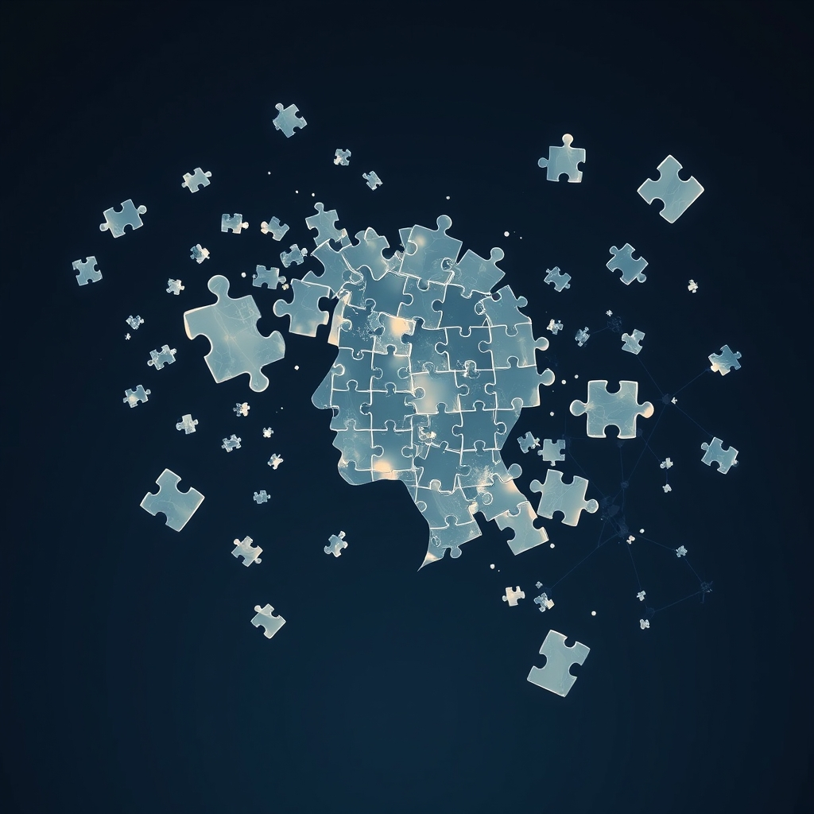

[Home](../index.md) > [Books](./index.md)  
# 🤔🧩⚖️ Patterns, Thinking, and Cognition: A Theory of Judgment  
  
[🛒 Patterns, Thinking, and Cognition: A Theory of Judgment. As an Amazon Associate I earn from qualifying purchases.](https://amzn.to/45TIJ2t)  
  
## 📚 Book Report: 🧠 Patterns, Thinking, and Cognition: 💡 A Theory of Judgment  
  
### 📖 Overview  
  
 Howard Margolis's book, 📚 Patterns, Thinking, and Cognition: 💡 A Theory of Judgment, published in 🗓️ 1987, offers a compelling and provocative challenge to traditional understandings of human judgment and thinking. 🧠 Margolis argues against the prevailing algorithmic models of the brain, proposing instead that thinking is fundamentally rooted in a-logical pattern recognition, which he terms "P-cognition." 🤔 The work provides an evolutionary account of how this pattern recognition ability developed in humans and applies this theory to explain persistent "illusions of judgment" and historical shifts in worldview. 🌍  
  
### 🔑 Key Concepts  
  
* 🔤 **P-cognition (Pattern Recognition):** The central concept, positing that human thinking and judgment are primarily based on the recognition of patterns, rather than strictly logical or rule-following processes. 🧩 This is described as an intrinsically a-logical mechanism.  
* 🚫 **A-logical Nature of Thinking:** Challenges the idea that judgment is solely a product of interests and logic, asserting that pattern recognition operates outside of strict logical frameworks. 🤯  
* 🧬 **Darwinian Evolution of Cognition:** Margolis provides an evolutionary perspective on how the capacity for pattern recognition evolved to form the basis of human cognitive abilities. 🐒  
* 🎭 **Illusions of Judgment:** The book systematically analyzes common cognitive anomalies and misjudgments, offering a unified explanation for their existence and recurrence, rather than treating them as isolated errors. 😵‍💫  
* 🧠 **Cognitive Repertoire:** Refers to the available cognitive patterns and their relationship to cues, which can change or resist change over time, influencing an individual's worldview. 👁️  
  
### 🗣️ Main Arguments  
  
 Margolis's primary argument is that a rule-following view of cognition is insufficient to explain judgment; instead, he posits that such processes must be reduced to pattern recognition. 🧩 He contends that information processing, particularly P-cognition, is central to thinking and can account for significant leaps in understanding throughout history. 🚀 By examining "illusions of judgment," Margolis explains why people consistently misjudge or misperceive, providing a more comprehensive theory than those that only explain specific anomalies. 🤷 Furthermore, the book utilizes historical examples, such as the Copernican discovery and Galileo's trial, to demonstrate how cognitive repertoires and worldviews evolve or endure, highlighting the interplay between individual and social cognition. 🗣️ This approach fundamentally challenges the paradigm that most theories of judgment are based on an algorithmic model of the brain. 🤖  
  
### 💡 Impact and Significance  
  
 Patterns, Thinking, and Cognition is significant for its foundational re-evaluation of how humans think and make judgments. 🧐 By emphasizing pattern recognition as an a-logical, evolved process, Margolis offers a powerful alternative to purely logical or algorithmic explanations of cognition. 🧠 The book's systematic approach to understanding cognitive illusions and its application to historical paradigm shifts provide a robust framework for analyzing both individual and collective decision-making, ensuring its relevance for stimulating debate in cognitive science, political science, and philosophy. 💬  
  
## 📚 Book Recommendations  
  
### ➕ Similar Books  
  
* **[🤔🐇🐢 Thinking, Fast and Slow](./thinking-fast-and-slow.md) by Daniel Kahneman:** Explores two systems of thinking: "System 1" (fast, intuitive, emotional, pattern-driven) and "System 2" (slower, more deliberative, logical). 🧠 This directly relates to Margolis's P-cognition by detailing the intuitive, pattern-based aspects of judgment and their interplay with more deliberate thought. 💭  
* **[⛲🔌🤔⚙️ Sources of Power: How People Make Decisions](./sources-of-power-how-people-make-decisions.md) by Gary Klein:** Focuses on naturalistic decision-making, particularly how experienced professionals (like firefighters or commanders) make rapid, high-stakes decisions by recognizing patterns and drawing on vast experience, often without conscious deliberation. 🔥 This strongly echoes Margolis's emphasis on the power of pattern recognition in practical judgment. 💪  
* 🎯 **The Power of Intuition: How to Use Your Gut Feelings to Make Better Decisions at Work by Gary Klein:** Further develops the concept of intuition, showing how it is not irrational but rather a sophisticated form of pattern recognition developed through experience, aligning with Margolis's a-logical P-cognition. 🔮  
  
### ➖ Contrasting Books  
  
* **[👉🤏 Nudge: Improving Decisions about Health, Wealth, and Happiness](./nudge.md) by Richard H. Thaler and Cass R. Sunstein:** While acknowledging cognitive biases (which Margolis also addresses as "illusions of judgment"), this book focuses more on how external "nudges" or subtle changes in choice architecture can guide individuals towards better decisions. 🤏 This contrasts with Margolis's focus on the internal, fundamental cognitive process of pattern recognition as the primary driver of judgment, instead emphasizing external influences to *correct* judgments. ✅  
* 🧠 **Rationality and the Reflective Brain by Keith E. Stanovich:** Explores different types of rationality and the cognitive mechanisms that underpin them, often emphasizing the role of deliberative, rule-based reasoning (System 2 thinking) in overcoming biases. ⚖️ While Margolis acknowledges logic, Stanovich's work leans more heavily into the prescriptive role of explicit rationality, offering a contrasting perspective to Margolis's intrinsically a-logical P-cognition. 🧭  
* **[🎨🤔🖼️ The Art of Thinking Clearly](./the-art-of-thinking-clearly.md) by Rolf Dobelli:** This book systematically lists and explains common cognitive biases and logical fallacies, implicitly advocating for a more rational, logical approach to decision-making by recognizing and avoiding these pitfalls. 🙅 This stands in contrast to Margolis's theory, which explains these "illusions" as inherent outcomes of an evolved, pattern-recognition system, rather than mere errors to be corrected by conscious logical effort. 🤕  
  
### ✨ Creatively Related Books  
  
* **[♾️📐🎶🥨 Gödel, Escher, Bach: An Eternal Golden Braid](./godel-escher-bach.md) by Douglas R. Hofstadter:** Explores common themes in mathematics, art, and music, such as recursion, self-reference, and isomorphism, which can be seen as highly complex forms of pattern recognition and the generation of meaning from structured information. 🎶 Its exploration of intelligence and consciousness from symbolic and structural perspectives relates to the underlying mechanisms of cognition, albeit from a different angle. 📐  
* 🧬 **The Extended Phenotype: The Long Reach of the Gene by Richard Dawkins:** This book argues that the phenotypic effects of a gene extend beyond the organism's body to include its environment and behavior. 🌱 This evolutionary perspective can be creatively linked to Margolis's Darwinian account of P-cognition, suggesting that cognitive patterns and their external manifestations in culture, technology, and social structures could be seen as extensions of our evolved pattern-recognition abilities. 🌍  
* **[🌐🔗🧠📖 Thinking in Systems: A Primer](./thinking-in-systems.md) by Donella H. Meadows:** Introduces the concept of systems thinking, focusing on understanding complex interconnections and feedback loops. 🌐 While not directly about individual cognition, it relates creatively by providing a framework for recognizing and understanding macro-level patterns in dynamic systems, which individuals, through P-cognition, must interact with and make judgments about.  
  
## 💬 [Gemini](https://gemini.google.com) Prompt (gemini-2.5-flash)  
> Write a markdown-formatted (start headings at level H2) book report, followed by similar, contrasting, and creatively related book recommendations on Patterns, Thinking, and Cognition: A Theory of Judgment. Never quote or italicize titles. Be thorough but concise. Use section headings and bulleted lists to avoid long blocks of text.