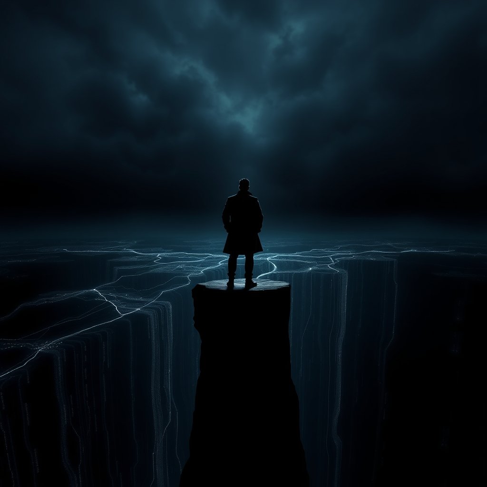

[Home](../index.md) > [Books](./index.md)  
# 🇺🇸🕵️💥 Playing to the Edge: American Intelligence in the Age of Terror  
  
[🛒 Playing to the Edge: American Intelligence in the Age of Terror. As an Amazon Associate I earn from qualifying purchases.](https://amzn.to/4oFYvW0)  
  
🕵️  Former CIA and NSA Director Michael Hayden defends controversial post-9/11 intelligence operations, arguing that aggressive, legally sound tactics were necessary to secure the nation against a new generation of terrorist and cyber threats.  
  
## 🤖 AI Summary  
### 🧠 Core Philosophy: Playing to the Edge  
* 📏 **Definition:** Operate at the absolute limit of legal and ethical boundaries; avoid playing back from the line to maximize national security.  
* 🇺🇸 **Rationale:** Protecting America demands utilizing every legitimate tool and authority.  
* ⚖️ **Balance:** Fragile equilibrium between security imperative and individual liberty.  
  
### 🗓️ Post-9/11 Intelligence Transformation  
* 🔄 **Shift:** From static Cold War targets to dynamic, decentralized terrorist networks.  
* 💻 **NSA Modernization:** Overcoming antiquated technology and bureaucracy amidst telecommunications revolution.  
* 🏛️ **Centralization:** 2004 legislation creating Director of National Intelligence (DNI) to centralize efforts.  
  
### 💬 Controversial Programs & Ethical Dilemmas  
* 👀 **Metadata Surveillance (Stellarwind, PRISM):** Digital surveillance programs initiated post-9/11, focused on foreign communications but included domestic phone records.  
    * 🔒 **Safeguards:** Hayden asserts careful design to protect privacy, despite public concerns.  
    * 📰 **Congressional Notification:** Acknowledged mishandling as a political mistake, leading to lost public support.  
* 🛸 **Drone Strikes:** Extensive use by both Bush and Obama administrations for targeted killing.  
* 🗣️ **Enhanced Interrogation Techniques (EITs):** Inherited program at CIA; Hayden worked to establish clear guidelines.  
    * 🛡️ **Defense:** Hayden remains a defender of coercive interrogation tactics, despite their withdrawal.  
  
### ⚠️ Key Challenges  
* 📺 **Public Opinion & Media:** Increasing criticism of US intelligence practices, often perceived as misinformed.  
* 🌐 **Cyber Warfare:** Emergence as a major national security concern, leading to offensive cyber development.  
* 🇮🇷 **Iran Threat:** Primary concern for intelligence agencies post-2003.  
* 🤫 **Whistleblowers (Snowden):** Dismissed as naive, narcissistic, and self-important, leading to damaging leaks.  
  
## ⚖️ Evaluation  
* 💡 Hayden provides an invaluable insider's perspective on the complexities of intelligence, national security, and the ethical tightrope walked by agencies like the NSA and CIA after 9/11.  
* 👍 The book is praised for its candor, humility, and ability to clarify extremely complex issues for both Beltway insiders and the average American. Hayden acknowledges failures, such as the lack of 9/11 intelligence and being wrong on WMDs in Iraq, and takes responsibility.  
* 🧐 Critics note the book, as an official memoir, is inherently self-serving, with Hayden devoting significant energy to defending his actions against media criticism rather than deeply analyzing the Iraq and Afghanistan wars.  
* 👎 Some reviewers find Hayden dismissive of critics, notably characterizing journalists like Glenn Greenwald and Laura Poitras as agenda-driven and Edward Snowden as incredibly naive and narcissistic. This stance is seen by some as myopic and unfair.  
* ⚔️ Hayden's defense of controversial programs like mass surveillance (Stellarwind, PRISM) and enhanced interrogation techniques is presented as a necessary response to terrorist threats, arguing for operating at the edge of legality to protect national security. However, this perspective often draws strong counter-arguments regarding civil liberties and constitutional rights.  
* 🤫 The book offers profound insights into the importance of ambiguity in US policy concerning counterterrorism, suggesting that transparency about limits can be exploited by adversaries.  
  
## 🔍 Topics for Further Understanding  
* 🌍 The long-term efficacy and unintended consequences of drone warfare on global perceptions and radicalization.  
* 📜 The evolving legal frameworks and international norms governing cyber warfare and state-sponsored hacking.  
* 👤 The psychological and societal impacts of pervasive surveillance on democratic societies and individual freedoms.  
* 🤝 The role of public-private partnerships in national intelligence gathering, particularly with tech companies.  
* 📊 Comparative analysis of intelligence agency oversight mechanisms in different democracies.  
* 🤖 The implications of artificial intelligence and quantum computing on future intelligence capabilities and ethical considerations.  
* 📉 The post-Snowden era's impact on intelligence community morale, recruitment, and operational methods.  
  
## ❓ Frequently Asked Questions (FAQ)  
### 💡 Q: What is the primary argument of Playing to the Edge: American Intelligence in the Age of Terror?  
✅ A: **Playing to the Edge** argues that American intelligence agencies, particularly the NSA and CIA, must operate at the very limits of their legal and ethical authority (play to the edge) to effectively protect national security in the complex post-9/11 age of terror.  
  
### 💡 Q: Who is Michael V. Hayden, the author of Playing to the Edge?  
✅ A: Michael V. Hayden is a retired United States Air Force four-star general who served as the Director of the National Security Agency (NSA) from 1999 to 2005 and as the Director of the Central Intelligence Agency (CIA) from 2006 to 2009.  
  
### 💡 Q: Does Playing to the Edge discuss the controversial NSA surveillance programs?  
✅ A: Yes, **Playing to the Edge** addresses the controversial NSA surveillance programs, such as Stellarwind and the collection of metadata, defending them as necessary measures taken after 9/11 to prevent future terrorist attacks, while claiming careful safeguards were in place.  
  
### 💡 Q: How does Playing to the Edge address the balance between security and liberty?  
✅ A: **Playing to the Edge** highlights the delicate and often challenging balance between the need for national security and the protection of civil liberties, arguing that intelligence agencies are compelled to push boundaries to ensure safety, even when it sparks public debate.  
  
## 📚 Book Recommendations  
### 🤝 Similar  
* 🗳️ Hard Choices by Hillary Rodham Clinton (Memoir on foreign policy and national security from a Secretary of State's perspective).  
* 🎖️ Duty: Memoirs of a Secretary at War by Robert M. Gates (Experiences as Secretary of Defense during Iraq and Afghanistan wars).  
* 📖 Intelligence and National Security in the Age of Terror by Mark Phythian (Academic exploration of intelligence post-9/11).  
  
### ↔️ Contrasting  
* 🚫 No Place to Hide: Edward Snowden, the NSA, and the U.S. Surveillance State by Glenn Greenwald (Critical perspective on NSA surveillance from the journalist who broke the Snowden story).  
* [😱🏛️ The Terror Presidency: Law and Judgment Inside the Bush Administration](./the-terror-presidency-law-and-judgment-inside-the-bush-administration.md) by Jack Goldsmith (Critique of legal and ethical decisions made in the Bush administration's War on Terror).  
* [🕵️📜 Legacy of Ashes: The History of the CIA](./legacy-of-ashes-the-history-of-the-cia.md) by Tim Weiner (A critical history of the CIA, often referenced by critics of intelligence agencies).  
  
### 🔗 Related  
* 💻 Dark Territory: The Secret History of Cyber War by Fred Kaplan (Explores the rise of cyber warfare, a key concern in Hayden's book).  
* 🚨 The Looming Tower: Al-Qaeda and the Road to 9/11 by Lawrence Wright (Detailed account of al-Qaeda's origins and the events leading to 9/11).  
* 📝 The 9/11 Commission Report (Official account and recommendations regarding the 9/11 attacks).  
  
## 🫵 What Do You Think?  
🤔 Where do you believe the line between security and liberty should be drawn?