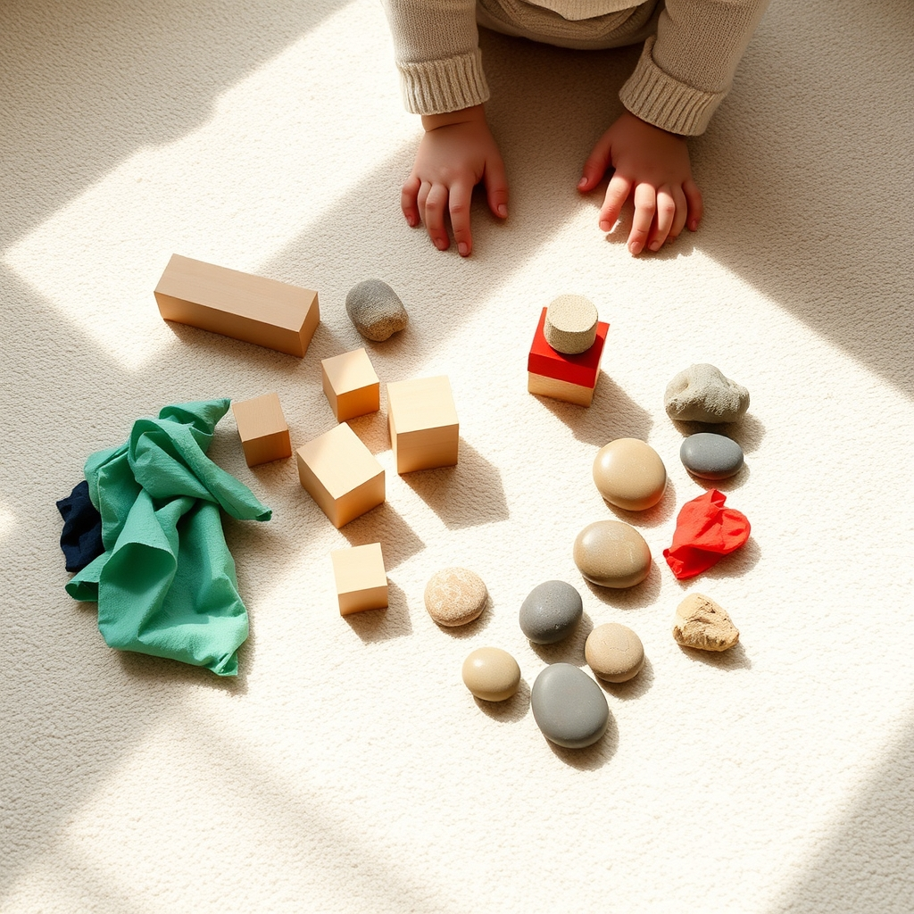

[Home](../index.md) > [Books](./index.md)  
# 🌱🔢✨ Precursor Math Concepts: The Wonder of Mathematical Worlds With Infants and Toddlers  
  
[🛒 Precursor Math Concepts: The Wonder of Mathematical Worlds With Infants and Toddlers. As an Amazon Associate I earn from qualifying purchases.](https://amzn.to/4ceTZeA)  
  
👶➕➖🤔 Infants and toddlers naturally develop foundational mathematical thinking through four precursor concepts: Attribute, Comparison, Change, and Pattern.  
  
## 🤖 AI Summary  
  
### 🧠 Core Philosophy  
* 🔢 Mathematics: Not arithmetic skills, but a logical way of thinking for increasing precision.  
* 👶 Innate Capacity: Infants and toddlers possess natural instincts for mathematical thinking from birth (0-3 years).  
* 👨‍👩‍👧‍👦 Caregiver Role: Loving knowledgeable others nurture development through intentional response.  
  
### ✨ Precursor Math Concepts  
* 🎨 **Attribute:** Describing objects by properties (color, size, texture). Foundation for sorting, classifying.  
* ⚖️ **Comparison:** Noticing similarities and differences between objects or sets.  
* 🌱 **Change:** Understanding transformation, part-part-whole, and quantitative/qualitative shifts.  
* 🔄 **Pattern:** Identifying, exploring, and creating repetitions in objects, sounds, routines. Building block of algebra.  
  
### 🤗 The CAIR Principle  
* 👀 **C**losely **A**ttend: Observe children's spontaneous mathematical explorations.  
* 💬 **I**ntentionally **R**espond: Engage with specific language and activities that support emerging math concepts.  
  
### 📈 Developmental Stages (0-3 years)  
* 🌟 **Emerging (0-14 months):** What is this? - Perceptual understanding.  
* 🚀 **Developing (12-24 months):** What can I do with this? - Building and taking on more.  
* 🛠️ **Transforming (22-36 months):** What can I make with this? - Increasing precision and utility.  
  
### 🔧 Implementation  
* 🗓️ Embed practices into everyday interactions and routines.  
* 🤝 Integrate across social-emotional, physical, and cognitive domains.  
* 📖 Use authentic anecdotes and research sections for guidance.  
  
## ⚖️ Evaluation  
  
* 🔬 **Alignment with Current Research:** The book aligns with research indicating that early mathematical thinking begins in infancy and is foundational for later academic success. Early numeracy skills predict later math and reading achievement.  
* 🎉 **Emphasis on Play and Interaction:** The book's focus on embedding math into daily routines and interactions resonates with expert recommendations for hands-on, play-based learning over rote memorization for young children. Structured, guided opportunities, in addition to unstructured play, are beneficial.  
* 🧠 **Distinction from Arithmetic:** The book's emphasis on mathematics as a logical way of thinking that allows for increasing precision rather than just arithmetic skills is a critical, research-supported distinction. Many common misconceptions about early math education include focusing only on simple numbers and shapes.  
* 🌱 **Holistic Development:** The integration of social-emotional, physical, and cognitive development aligns with a holistic view of early childhood education. Math skills are indeed connected to other learning domains like language and social-emotional development.  
* 👨‍🏫 **Practicality for Caregivers:** The book is designed as a user-friendly resource with concrete suggestions and anecdotes, making it highly valuable for early care providers and educators.  
* 🤝 **Comparison to Other Methodologies (Montessori/Reggio Emilia):** The book's principles, particularly the emphasis on observation, responsive environments, and natural exploration, share common ground with child-centered approaches like Montessori and Reggio Emilia, which also prioritize concrete, sensory experiences and self-directed learning for early math. Both approaches emphasize the importance of the environment and the child's innate capabilities.  
* ❌ **Addressing Misconceptions:** The book implicitly addresses common misconceptions such as young children are not ready for mathematics education or simple numbers and shapes are enough by demonstrating the depth and breadth of early mathematical thinking.  
  
## 🔍 Topics for Further Understanding  
  
* 🧠 Neurological underpinnings of infant mathematical cognition and brain development.  
* 🌍 Cross-cultural studies on the emergence and development of precursor math concepts.  
* 📱 Impact of digital tools and screen time on early mathematical world exploration.  
* 🧩 Specific interventions for infants and toddlers with identified mathematical learning differences.  
* 😟 The role of parental math anxiety in transmitting attitudes towards early math learning.  
* 📊 Longitudinal studies tracking the direct impact of the CAIR principle on later mathematical achievement.  
* 🔬 Integration of precursor math concepts within STEAM/STREAM frameworks for infants and toddlers.  
  
## ❓ Frequently Asked Questions (FAQ)  
  
### 💡 Q: What are the main precursor math concepts discussed in Precursor Math Concepts: The Wonder of Mathematical Worlds With Infants and Toddlers?  
✅ 🔢 A: Precursor Math Concepts: The Wonder of Mathematical Worlds With Infants and Toddlers primarily focuses on four core concepts: Attribute, Comparison, Change, and Pattern, which serve as foundational building blocks for later mathematical understanding.  
  
### 💡 Q: Who is the target audience for Precursor Math Concepts: The Wonder of Mathematical Worlds With Infants and Toddlers?  
✅ 👨‍👩‍👧‍👦 A: Precursor Math Concepts: The Wonder of Mathematical Worlds With Infants and Toddlers is primarily aimed at caregivers, early care providers, and educators working with infants and toddlers aged zero to three.  
  
### 💡 Q: How does Precursor Math Concepts: The Wonder of Mathematical Worlds With Infants and Toddlers define mathematics for young children?  
✅ 🤔 A: Precursor Math Concepts: The Wonder of Mathematical Worlds With Infants and Toddlers defines mathematics not as rote arithmetic skills, but as a logical way of thinking that allows for increasing precision.  
  
### 💡 Q: What is the CAIR principle in Precursor Math Concepts: The Wonder of Mathematical Worlds With Infants and Toddlers?  
✅ 🤗 A: The CAIR principle, central to Precursor Math Concepts: The Wonder of Mathematical Worlds With Infants and Toddlers, stands for Closely Attend & Intentionally Respond, guiding adults to observe and thoughtfully engage with children's emerging mathematical thinking.  
  
### 💡 Q: Does Precursor Math Concepts: The Wonder of Mathematical Worlds With Infants and Toddlers suggest formal math instruction for babies?  
✅ ❌ A: No, Precursor Math Concepts: The Wonder of Mathematical Worlds With Infants and Toddlers advocates for embedding mathematical thinking into everyday interactions and routines, recognizing math as natural instincts, rather than through formal, academic instruction.  
  
## 📚 Book Recommendations  
  
### 👍 Similar  
* 📖 Infants & Toddlers at Work: Reflections on the Evolving Curriculum by Carol Anne Wien  
* 🧠 Mathematical Mindsets: Unleashing Students' Potential Through Creative Math, Inspiring Messages and Innovative Teaching by Jo Boaler  
* 📏 Big Ideas for Little Learners: Math in the Preschool Classroom by Ann Marie Smith  
  
### 👎 Contrasting  
* 🚫 How to Teach Your Baby Math by Glenn Doman (focuses on flash cards, criticized for not fostering deeper understanding)  
* 📚 Why Johnny Can't Add: The Failure of the New Math by Morris Kline (critique of modern math education, though not specific to early childhood)  
  
### ✨ Related  
* [🧽🧠 The Absorbent Mind](./the-absorbent-mind.md) by Maria Montessori (core philosophy on early childhood learning)  
* 🗣️ The Hundred Languages of Children by Loris Malaguzzi and the Educators of Reggio Emilia (foundational text on Reggio Emilia approach)  
* 🌟 [🌱🧘🏼‍♀️🏆 Mindset: The New Psychology of Success](./mindset.md) by Carol S. Dweck (growth mindset, applicable to math learning)  
* 🎨 Play, Playfulness, Creativity and Creativity in Early Childhood by Jane Hislam (explores the importance of play)  
  
## 🫵 What Do You Think?  
🤔 How might integrating the CAIR principle into daily routines shift our perception of infants' and toddlers' innate capabilities? What specific, non-toy activities have you noticed foster early mathematical exploration in young children?