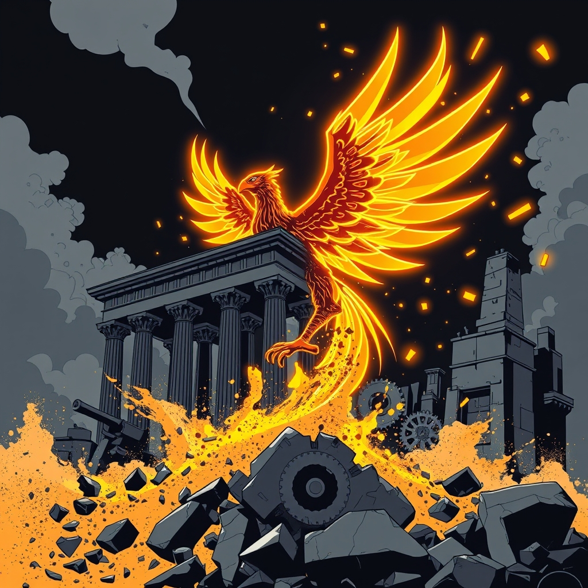

[Home](../index.md) > [Books](./index.md)  
# 🧑‍💼💥 Prophet of Innovation: Joseph Schumpeter and Creative Destruction  
  
[🛒 Prophet of Innovation: Joseph Schumpeter and Creative Destruction. As an Amazon Associate I earn from qualifying purchases.](https://amzn.to/48ha29f)  
  
💡 A biography of Joseph Schumpeter, showcasing his groundbreaking concept of creative destruction as capitalism's inherent engine for progress and the paradoxical forces that ultimately challenge its existence. 💡 dynamism, 💥 destruction, 🧬 evolution 📈.  
  
## 🏆 McCraw's Creative Destruction Strategy  
  
### 👨‍🏫 Joseph Schumpeter's Core Philosophy  
* 💰 **Capitalism's Essence:** 🚀 Dynamic, 🧬 evolutionary process. ⚖️ Not static equilibrium.  
* 💥 **Creative Destruction:** 🔄 Incessant revolutionizing of economic structure from within. 👴 Old replaced by 👶 new. ✅ Necessary for progress.  
    * 💨 Gale of creative destruction: 🌪️ the powerful, continuous force of innovation.  
* 🧑‍💼 **Entrepreneurship:** 🔑 Primary agent of economic progress. 🚀 Drive innovation, introduce new products/processes/markets/organization.  
    * 🧑‍💼 Entrepreneurs are 💡 innovators, not necessarily 🐻‍❄️ risk-bearers.  
    * 👺 Often contrarian in nature.  
* 💡 **Innovation:** 🔑 Key driver of economic change, 📈 growth, and ⚙️ productivity.  
    * ➡️ Distinction: 🧪 Invention (new idea) vs. 🚀 Innovation (commercial application).  
    * 🗂️ Categories: 🛍️ New goods, ⚙️ methods of production, 🌐 markets, ⛏️ raw material sources, 🏢 industry organization.  
* 📉 **Business Cycles:** 🔄 Endogenous outcome of innovation clusters.  
    * 💸 Investment and 💳 credit cycles amplify business fluctuations.  
* ❗ **Capitalism's Paradox:** 🏆 Its success generates forces (🤖 routinization of innovation, 🎓 rise of anti-capitalist intellectuals) that may undermine it.  
  
### 🎯 Actionable Insights  
* 💪 **Embrace Disruption:** 🔮 Expect and adapt to constant change. 🏛️ Old structures must be dismantled for new growth.  
* 🧑‍💼 **Foster Entrepreneurship:** 🔎 Recognize and support individuals/firms driving radical innovation.  
* 🚀 **Prioritize Innovation:** 🎯 Focus on new products, processes, and business models to ensure long-term survival. 💀 Stagnation is death.  
* 🧠 **Strategic Thinking:** 🏢 Businesses must be entrepreneurial and think strategically to survive in a dynamic market.  
* 🔭 **Long-Term View:** 🌍 Understand that short-term disruptions (📉 job losses, 🏭 industry shifts) are part of long-term economic progress and improved living standards.  
  
## ⚖️ Critical Evaluation  
  
* ✍️ **Comprehensive Biography:** 📚 McCraw provides a definitive and elegantly written study, drawing on Schumpeter's diaries, correspondence, and works to paint a vivid picture of his life and times, including personal struggles and intellectual development.  
* ⚖️ **Balances Life and Work:** 🧵 The book masterfully weaves together Schumpeter's professional achievements and personal history, showing how his experiences shaped his economic theories.  
* 👨‍🏫 **Excellent Interpreter:** 👏 McCraw is praised for being an extremely good interpreter of Schumpeter's published work, making complex economic ideas accessible to a broad audience.  
* 💯 **Schumpeter's Relevance:** 🌟 The biography highlights Schumpeter's enduring influence, particularly on modern economic thought regarding entrepreneurship, innovation, business strategy, and endogenous growth.  
* 🔎 **Critique of Focus:** ⚠️ Some reviewers note that while comprehensive, the book's emphasis on biography might not always sharpen our understanding of his economics as much as it deepens understanding of the man.  
* 🤔 **Big Think vs. Theory:** 🗣️ Robert Solow's review (2007) of McCraw's book, while acknowledging it, disparaged Schumpeter's *Capitalism, Socialism and Democracy* as Big Think or overarching attempts to capture a whole socioeconomic system in a few grand generalizations, implying a potential critique of Schumpeter's broader, less purely theoretical approach.  
* ✅ **Final Verdict:** 💯 Thomas K. McCraw's Prophet of Innovation largely succeeds in its core claim, presenting Schumpeter as a prophetic figure whose dynamic vision of capitalism, driven by creative destruction and entrepreneurship, remains profoundly relevant, even if his sociological prophecies about capitalism's demise were ultimately incorrect. 🚀 McCraw effectively demonstrates Schumpeter's foundational role in our understanding of economic evolution and continuous disruption.  
  
## 🔍 Topics for Further Understanding  
  
* 🤖 The impact of artificial intelligence and automation as contemporary examples of creative destruction, including their societal and labor market implications.  
* 🛡️ Policy frameworks designed to mitigate the negative social consequences of creative destruction while fostering its innovative potential.  
* 🏛️ The role of institutional structures and regulatory environments in shaping entrepreneurial activity and the pace of innovation.  
* 🌍 Comparative analysis of innovation ecosystems in different global regions and their adherence to Schumpeterian principles.  
* 🧠 The psychological and sociological factors influencing entrepreneurial risk-taking and the resistance to change within established organizations.  
* 🌿 The intersection of creative destruction with environmental sustainability goals and the transition to green economies.  
  
## ❓ Frequently Asked Questions (FAQ)  
  
### 💡 Q: What is Joseph Schumpeter best known for?  
✅ A: Joseph Schumpeter is best known for his concept of creative destruction, which describes the continuous process by which innovation disrupts existing economic structures, leading to the demise of old industries and the rise of new ones. 🧑‍💼 He also greatly emphasized the central role of the entrepreneur as the agent of innovation.  
  
### 💡 Q: How does Schumpeter define creative destruction?  
✅ A: Schumpeter defined creative destruction as the process of industrial mutation that incessantly revolutionizes the economic structure from within, incessantly destroying the old one, incessantly creating a new one. 💥 It's the essential fact about capitalism, where new innovations make older ones obsolete.  
  
### 💡 Q: What role do entrepreneurs play in Schumpeter's theory of creative destruction?  
✅ A: In Schumpeter's theory, entrepreneurs are the primus motor of capitalism, the crucial agents who drive economic development by introducing innovations—new products, methods of production, markets, or forms of organization—thereby initiating the process of creative destruction.  
  
### 💡 Q: Did Schumpeter believe capitalism would last indefinitely?  
✅ A: No, Schumpeter famously predicted that capitalism would eventually be undermined by its own success. 🏛️ He argued that the routinization of innovation within large corporations and the rise of an intellectual class hostile to capitalism's values would lead to its demise and transition towards socialism.  
  
### 💡 Q: What is the main difference between Schumpeter and Keynes?  
✅ A: While both were influential economists, Schumpeter viewed economic development as a dynamic, evolutionary process driven by innovation and disruption (creative destruction), often leading to cyclical instability. 📉 Keynes, in contrast, focused more on short-run economic fluctuations and advocated for government intervention to manage aggregate demand and stabilize economies, believing that capitalism without intervention was prone to stagnation.  
  
## 📚 Book Recommendations  
  
### 🤝 Similar  
* 📚 The Theory of Economic Development by Joseph A. Schumpeter  
* 📚 Capitalism, Socialism and Democracy by Joseph A. Schumpeter  
* [💡🤖💰💥🏢📉 The Innovator's Dilemma: When New Technologies Cause Great Firms to Fail](./the-innovators-dilemma.md) by Clayton M. Christensen  
* 📚 Scale: The Universal Laws of Growth, Innovation, Sustainability, and the Pace of Life in Organisms, Cities, Economies, and Companies by Geoffrey West  
  
### 🆚 Contrasting  
* [🧑‍💼🏦💸 The General Theory of Employment, Interest, and Money](./the-general-theory-of-employment-interest-and-money.md) by John Maynard Keynes  
* 📚 The Road to Serfdom by F.A. Hayek  
* 📚 Das Kapital by Karl Marx  
  
### ➕ Related  
* [🤔🐇🐢 Thinking, Fast and Slow](./thinking-fast-and-slow.md) by Daniel Kahneman (on human decision-making and biases affecting innovation)  
* [📜🌍⏳ Sapiens: A Brief History of Humankind](./sapiens-a-brief-history-of-humankind.md) by Yuval Noah Harari (on long-term historical forces and human systems)  
* [⚫🦢🎲 The Black Swan: The Impact of the Highly Improbable](./the-black-swan-the-impact-of-the-highly-improbable.md) by Nassim Nicholas Taleb (on unpredictable, high-impact events in systems)  
  
## 🫵 What Do You Think?  
  
🤔 How relevant do you find Schumpeter's prophecy of capitalism's self-destruction in today's increasingly automated and globalized world? ❓ Which contemporary industry do you believe best exemplifies the gale of creative destruction, and why? 🗣️ Share your insights below!