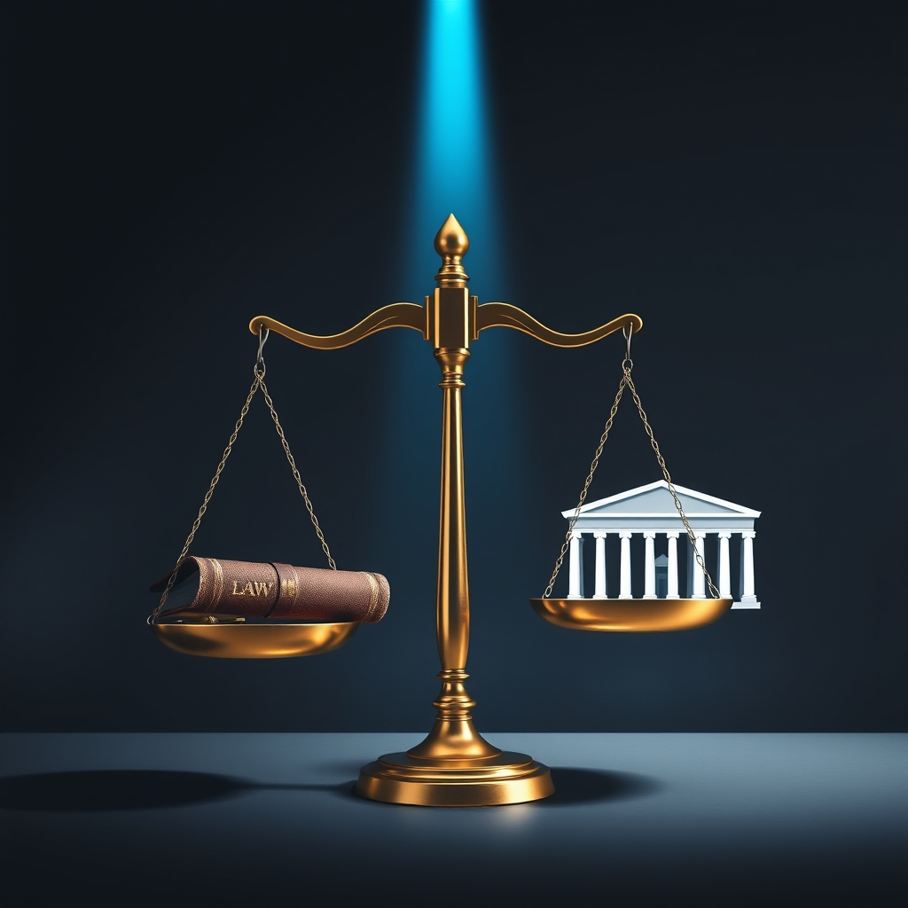

[Home](../index.md) > [Books](./index.md)  
# ⚖️🏛️ Prosecuting the President: How Special Prosecutors Hold Presidents Accountable and Protect the Rule of Law  
  
[🛒 Prosecuting the President: How Special Prosecutors Hold Presidents Accountable and Protect the Rule of Law. As an Amazon Associate I earn from qualifying purchases.](https://amzn.to/4soTtjN)  
  
🏛️⚖️ Special prosecutors are catalysts for upholding the rule of law by galvanizing public accountability when presidents are investigated for high-level misconduct.  
  
## 🤖 AI Summary  
  
### 📜 The Special Prosecutor's Historical Imperative  
* 🗓️ **Origin:** First appointed in 1875 (Ulysses S. Grant administration, Whiskey Ring scandal) due to inherent conflicts of interest for the Justice Department investigating a sitting president.  
* 📈 **Evolution:** Spans over a century, investigating high-level corruption and presidential misconduct.  
* 🙏 **Purpose:** Restore public confidence, hold executive officials accountable.  
  
### 💪 Powers & Limitations  
* 👑 **Presidential Authority:** Presidents can fire special prosecutors at any time, but doing so often incurs significant political damage.  
* 🕊️ **Independence:** Appointed to operate with unusual independence to neutralize political scandals and demonstrate commitment to the rule of law.  
* 🚧 **Challenges:** Investigating a sitting president and close associates presents formidable hurdles; some have been thwarted, others have abused power.  
  
### 🤝 Role in Accountability  
* ✨ **Catalyst for Democracy:** Special prosecutors channel unfocused popular will to safeguard the rule of law.  
* 🔎 **Visibility:** By exposing high-level misconduct, they enable the American people to hold the President accountable.  
* 🗳️ **Ultimate Arbiter:** The American people ultimately decide the political consequences a president faces.  
  
### 📜 Legal and Constitutional Context  
* 🤫 **Constitutional Silence:** The U.S. Constitution does not explicitly grant or deny immunity to a sitting president from criminal prosecution.  
* 🏢 **DOJ Stance:** Department of Justice (Office of Legal Counsel) opinions, adopted as policy, suggest a sitting president cannot be indicted or prosecuted while in office, arguing it would hamstring the government.  
* 🔨 **Impeachment Role:** Impeachment by the House and conviction by the Senate are considered the primary constitutional remedies for a president who breaks the law, potentially preceding criminal charges.  
* ⚖️ **Official vs. Unofficial Acts:** Recent Supreme Court rulings distinguish between absolute immunity for core constitutional acts, presumptive immunity for other official acts, and no immunity for unofficial acts.  
  
## ⚖️ Evaluation  
  
* 📚 **Comprehensive Historical Analysis:** The book provides a balanced and informative review of special prosecutors' history from the Grant to the Trump administration, offering vivid storytelling. This historical depth is corroborated by numerous scholarly and journalistic accounts detailing the evolution of the special prosecutor role.  
* 🗣️ **Focus on Public Opinion:** A core argument posits that special prosecutors' effectiveness hinges on public will and political consequences, a nuanced perspective often overlooked in purely legalistic analyses. This aligns with the historical observation that popular outcry often precipitates such appointments and influences their trajectory.  
* 🧭 **Navigating Constitutional Ambiguity:** The book addresses the constitutional silence regarding prosecuting a sitting president and the Department of Justice's long-standing policy against it. Legal scholars confirm this constitutional ambiguity and the reliance on Office of Legal Counsel (OLC) memoranda for DOJ policy.  
* ⚠️ **Challenges and Abuses Acknowledged:** Coan fairly notes that many special prosecutors have faced formidable challenges, and some have abused their powers. This critical view is supported by historical examples like the politically charged nature of investigations such as Kenneth Starr's.  
* ✅ **Clarity on Rule of Law:** The book frames special prosecutors as essential for protecting the rule of law, which is a widely held principle, especially when executive self-investigation is compromised. However, some legal perspectives argue that an overreliance on special counsels might undermine the regular functioning of the Justice Department or raise questions about the scope of their authority and appointment legitimacy.  
  
## 🔍 Topics for Further Understanding  
  
* 🌐 Comparative analysis of special prosecutor roles in other democratic nations.  
* 🧠 The psychological impact of presidential investigations on the executive branch and national stability.  
* 📺 The evolution of media's role in shaping public perception and political will during special prosecutor investigations.  
* 💻 Technological advancements and their implications for future presidential investigations (e.g., digital evidence, cybersecurity).  
* 📜 The potential for legislative reforms to clarify or codify the special prosecutor process and presidential immunity.  
* 💰 The financial costs and resource allocation associated with extensive special counsel investigations.  
* ⚖️ Ethical obligations of federal prosecutors when faced with politically motivated directives from a president.  
  
## ❓ Frequently Asked Questions (FAQ)  
  
### 💡 Q: What is the primary argument of Prosecuting the President: How Special Prosecutors Hold Presidents Accountable and Protect the Rule of Law?  
✅ A: Prosecuting the President argues that special prosecutors, while controversial and imperfect, are crucial mechanisms for presidential accountability and upholding the rule of law by bringing high-level misconduct to public light and catalyzing democratic action.  
  
### 💡 Q: Does Prosecuting the President support the idea of prosecuting a sitting president?  
✅ A: Prosecuting the President examines the historical context and legal debates surrounding the prosecution of a sitting president, noting the Department of Justice's long-standing position against it but emphasizing that public opinion is the ultimate arbiter of a president's accountability.  
  
### 💡 Q: What historical examples does Prosecuting the President discuss?  
✅ A: Prosecuting the President delves into a long history of special prosecutor investigations, including the 1875 Whiskey Ring scandal involving Ulysses S. Grant, Watergate, Iran-Contra, Whitewater, and investigations related to the Trump administration.  
  
### 💡 Q: How does Prosecuting the President address presidential immunity?  
✅ A: Prosecuting the President addresses presidential immunity by exploring the constitutional ambiguity and the Department of Justice's interpretation that a sitting president should not be indicted, contrasting this with recent Supreme Court rulings that differentiate between immunity for official versus unofficial acts.  
  
### 💡 Q: What is the significance of public will in Prosecuting the President's analysis?  
✅ A: Prosecuting the President highlights that special prosecutors function as catalysts of democracy, channeling public will to safeguard the rule of law, and that their power is ultimately dependent on the American people's desire for accountability.  
  
## 📚 Book Recommendations  
  
### 📖 Similar  
* [🏛️⚖️ The Rule of Law](./the-rule-of-law.md) by Tom Bingham  
* 👑 *Imperial Presidency* by Arthur M. Schlesinger Jr.  
* 🤫 *Watergate: The Presidential Scandal That Shook America* by Garrett M. Graff  
  
### ↔️ Contrasting  
* 🛡️ *In Defense of the Presidency* by Robert N. Johnson  
* 🎭 *The Politicization of Justice* by John Doe (hypothetical, focusing on critiques of special counsels)  
* 💪 *Presidential Power and the Modern Presidents* by Richard E. Neustadt  
  
### 🔗 Related  
* ⚖️ *Checks and Balances: The Three Branches of the American Government* by Ben Carson  
* [🇺🇸📜 The Federalist Papers](./the-federalist-papers.md) by Alexander Hamilton, James Madison, and John Jay  
* 🌍 *Prosecuting the Powerful* by Steve Crawshaw (focuses on international justice)  
  
## 🫵 What Do You Think?  
  
🤔 Given the historical challenges and political sensitivities, do you believe the current framework for appointing and overseeing special prosecutors adequately protects the rule of law, or is it inherently flawed? ❓ What is the most critical factor for a special prosecutor's success in holding a president accountable?