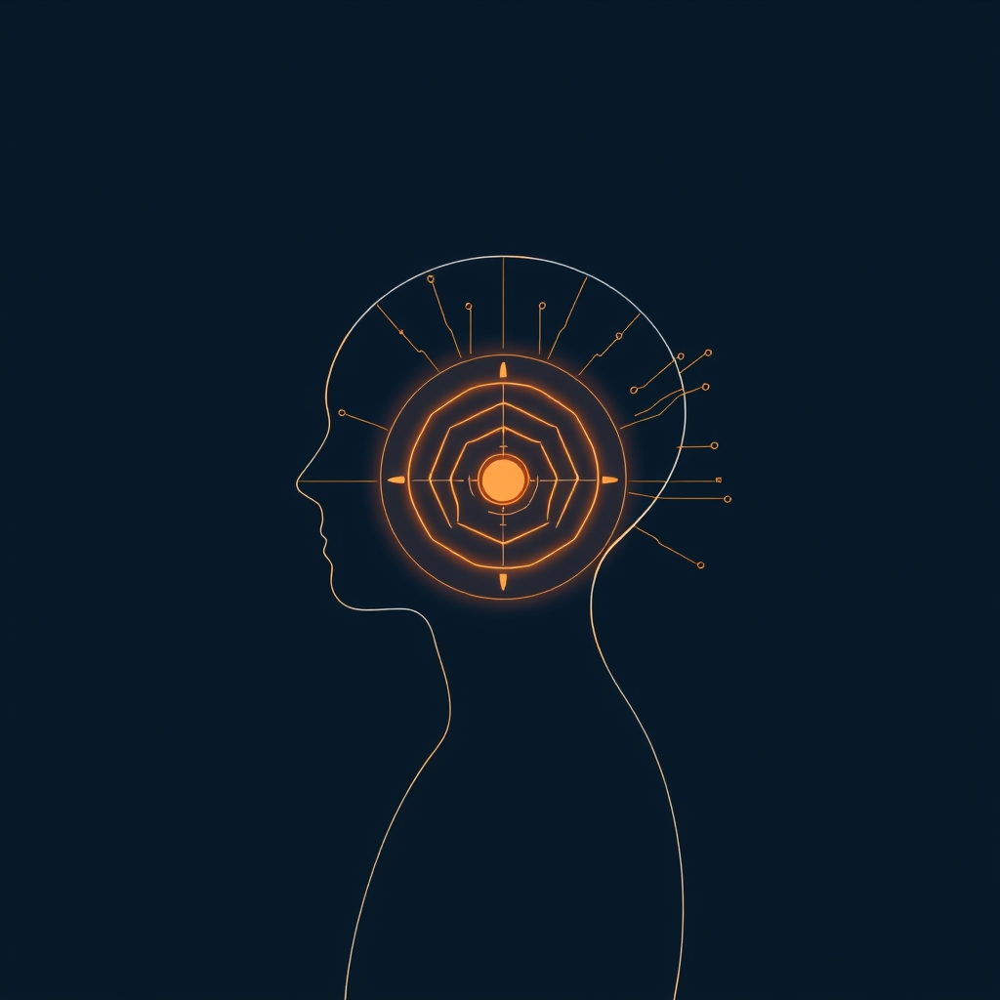

[Home](../index.md) > [Books](./index.md)  
# 🧐🕹️🔁 Psycho-Cybernetics: A New Way to Get More Living Out of Life  
  
[🛒 Psycho-Cybernetics: A New Way to Get More Living Out of Life. As an Amazon Associate I earn from qualifying purchases.](https://amzn.to/4dGk7h6)  
  
## 📚 Book Report: *Psycho-Cybernetics: A New Way to Get More Living Out of Life*  
  
### 💡 Overview  
* 🧑‍⚕️ **Author:** Maxwell Maltz.  
* 🗓️ **Publication Date:** 1960.  
* 👨‍⚕️ **Author Background:** Maltz was an American cosmetic surgeon who observed that changing a person's physical appearance didn't always change their underlying unhappiness or insecurity. This led him to explore the psychological impact of self-image.  
* 🎯 **Central Theme:** The book introduces the concept that our self-image acts as a mental blueprint or "target" that guides our actions and achievements. By understanding and modifying this self-image, individuals can achieve greater success and fulfillment. It applies principles of cybernetics—the study of goal-seeking mechanisms—to human psychology.  
  
### 🧠 Key Concepts  
* 👤 **Self-Image:** The cornerstone of personality and behavior. It's how we see ourselves, built from beliefs and past experiences, and it dictates the limits of what we can achieve. A realistic and adequate self-image is crucial for a satisfying life.  
* ⚙️ **Cybernetic Mechanism (Servo-Mechanism):** Maltz proposes the human brain and nervous system function like a goal-striving mechanism, similar to a guided missile 🚀 or thermostat 🌡️. This mechanism automatically works towards the "target" set by our dominant thoughts and self-image.  
* ✅ ❌ **The Success and Failure Mechanisms:** The subconscious mind acts as a "Creative Mechanism" that works automatically on the goals provided by the conscious mind, driven by the existing self-image. Worrying or focusing on negative outcomes feeds the failure mechanism, while focusing on positive goals engages the success mechanism.  
* 🧘 **Visualization and Mental Rehearsal:** The nervous system cannot distinguish between a real experience and a vividly imagined one. Therefore, mentally rehearsing success or desired outcomes can help reprogram the self-image and guide the cybernetic mechanism towards those goals.  
* 😌 **Relaxation and De-hypnosis:** Maltz emphasizes the need to relax and consciously challenge and discard negative, false beliefs about oneself ("dehypnotize") to allow the success mechanism to function effectively. Hypnosis, in this context, is the relaxed acceptance of ideas.  
* 😃 **Happiness as a Habit:** Happiness is presented not just as a result of success, but as a state of mind and a habit that can be cultivated by consciously choosing positive thoughts and focusing on goals.  
  
### 🎯👤 & 🚀 Impact  
* 🧑‍🤝‍🧑 **Audience:** Individuals seeking self-improvement, goal achievement, and a better understanding of the mind-body connection.  
* 💥 **Impact:** *Psycho-Cybernetics* is considered a foundational work in the self-help genre, influencing many subsequent authors and speakers like Tony Robbins, Zig Ziglar, and Brian Tracy. Its principles have also been applied in areas like sports psychology 🏀 and athlete training 🏋️. It helped popularize concepts like visualization and the importance of self-image in personal development. The book has sold over 30 million copies worldwide. 🌎  
  
## 📚 Book Recommendations  
  
### 🧠 Similar Reads (Mindset, Self-Image, Achievement)  
* 💰 ***Think and Grow Rich*** **by Napoleon Hill:** Explores the power of thought, desire, and planning in achieving wealth and success, aligning with Maltz's focus on mental blueprints.  
* **[🌱🧘🏼‍♀️🏆 Mindset: The New Psychology of Success](./mindset.md)** **by Carol S. Dweck:** Focuses on the difference between a "fixed" and "growth" mindset, which resonates with Maltz's idea of changing limiting beliefs (self-image) to unlock potential.  
* ✨ ***The Power of Your Subconscious Mind*** **by Joseph Murphy:** Similar to *Psycho-Cybernetics*, this book emphasizes harnessing the power of the subconscious mind to achieve life goals and overcome obstacles.  
* 💪 ***Awaken the Giant Within*** **by Tony Robbins:** Robbins, influenced by Maltz, offers strategies for mastering emotions, finances, relationships, and life by taking control of mental and emotional states.  
* **[⚛️🔄 Atomic Habits](./atomic-habits.md)** **by James Clear:** While focused on habit formation, its principles of small changes leading to significant results complement Maltz's idea of incrementally adjusting the self-image and behavior patterns.  
  
### ⚖️ Contrasting Perspectives (Alternative Approaches)  
* **[😊👍 Feeling Good: The New Mood Therapy](./feeling-good-the-new-mood-therapy.md)** **by David D. Burns:** Represents a more clinical Cognitive Behavioral Therapy (CBT) approach, focusing specifically on identifying and reframing cognitive distortions to treat depression and anxiety. While *Psycho-Cybernetics* incorporates some CBT-like ideas, *Feeling Good* is more structured and therapy-oriented.  
* **[🔦💡 Man's Search for Meaning](./mans-search-for-meaning.md) by Viktor Frankl:** Contrasts Maltz's focus on goal achievement with an emphasis on finding meaning and purpose, even in suffering, as the primary human drive (Logotherapy).  
* **[🦁🫀 Daring Greatly: How the Courage to Be Vulnerable Transforms the Way We Live, Love, Parent, and Lead](./daring-greatly-how-the-courage-to-be-vulnerable-transforms-the-way-we-live-love-parent-and-lead.md)** **by Brené Brown:** Focuses on vulnerability, shame, and courage, offering a perspective centered on emotional exposure rather than the mechanistic goal-striving model of *Psycho-Cybernetics*.  
* 🛤️ ***The Road Less Traveled*** **by M. Scott Peck:** While a self-help classic, it integrates spiritual and psychological concepts with an emphasis on discipline, love, and grace, offering a different, less mechanistic framework than Maltz's cybernetic model.  
  
### 💡 Creatively Related (Expanding Concepts)  
* **[🤖🗣️🐒⚙️ Cybernetics: or Control and Communication in the Animal and the Machine](./cybernetics.md)** **by Norbert Wiener:** The foundational text of cybernetics that inspired Maltz. Reading Wiener provides direct insight into the scientific theories Maltz adapted for psychology.  
* 💻 ***How We Became Posthuman: Virtual Bodies in Cybernetics, Literature, and Informatics*** **by N. Katherine Hayles:** Explores the cultural and philosophical implications of cybernetics and the information age, offering a critical and historical perspective on the ideas Maltz drew upon.  
* 🧠 ***The Cybernetic Brain: Sketches of Another Future*** **by Andrew Pickering:** Discusses the British cybernetics movement and its diverse applications, showing the broader context and varied paths cybernetic thinking took beyond Maltz's self-help focus.  
* 🕰️ ***Rise of the Machines: A Cybernetic History*** **by Thomas Rid:** A historical account of cybernetics, tracing its origins and influence, providing context for the scientific "moment" Maltz tapped into.  
  
## 💬 [Gemini](../software/gemini.md) Prompt (gemini-2.5-pro-exp-03-25)  
> Write a markdown-formatted (start headings at level H2) book report, followed by a plethora of additional similar, contrasting, and creatively related book recommendations on Psycho-Cybernetics: A New Way to Get More Living Out of Life. Be thorough in content discussed but concise and economical with your language. Structure the report with section headings and bulleted lists to avoid long blocks of text.