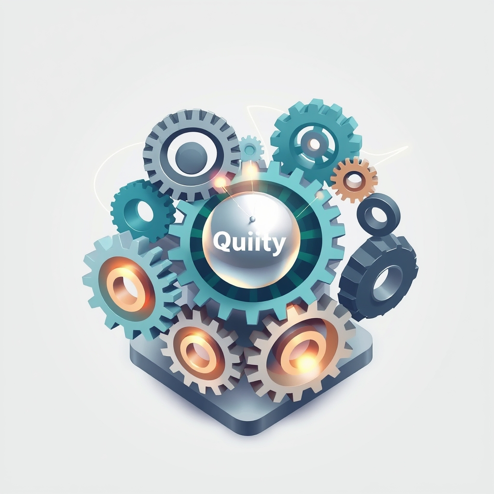

[Home](../index.md) > [Books](./index.md)  
# ⚙️🔗 Quality Software Management: Systems Thinking  
  
[🛒 Quality Software Management: Systems Thinking. As an Amazon Associate I earn from qualifying purchases.](https://amzn.to/47NjsrB)  
  
🚀💡🌱🛠️ Effective software quality stems from understanding complex human and organizational systems, not just technical processes. Conscious management and cultural awareness prevent endemic issues.  
  
## 🏆 Weinberg's Quality Software Management: Systems Thinking Strategy  
  
### 🎯 Core Philosophy: Systems Thinking for Software Quality  
* 🥇 **Quality Definition:** Value to some person. 🧑‍💼 Whose values count most is paramount.  
* 🌐 **Holistic View:** Software development as an interconnected system of people, processes, and tools.  
* 🌀 **Non-linearity:** Acknowledge complex, non-linear dynamics; 👨‍💻 Brooks's Law generalizes: adding people always complicates projects, often delaying them.  
* ⏱️ **Act Early, Act Small:** Key to maintaining control over the software process.  
* 🧑‍🤝‍🧑 **Cultural Patterns (Software Subcultures):** Organizations classified by how they approach software creation and quality:  
    * 🙈 **Pattern 0: Oblivious:** Unaware of creating software.  
    * 🎲 **Pattern 1: Variable:** Aware, but with inconsistent results.  
    * ⚙️ **Pattern 2: Routine:** Reduces variability, routine production, somewhat predictable.  
    * 🕹️ **Pattern 3: Steering:** Able to control/steer quality.  
    * 🔮 **Pattern 4: Anticipating:** Proactively deals with change.  
    * 🤝 **Pattern 5: Congruent:** Internal and external consistency, aligned messaging.  
  
### ⚙️ Actionable Management Steps  
* 🧑‍💼 **Manager Role:** Planners and catalysts.  
    * 🗓️ Continually plan.  
    * 👁️ Observe actual outcomes.  
    * ⚖️ Act decisively to align actual with planned.  
* 📍 **Control Points:** Identify and manage specific areas to prevent or mitigate crises.  
* 📊 **Measurement:** Focus on zeroth-order and first-order measurements that reveal systemic dynamics, not just superficial metrics.  
* 😓 **Understand Pressure & Breakdown Patterns:** Recognize how demands stress the system and lead to failures.  
* 🐛 **Fault Resolution Dynamics:** Analyze defect types and how organizations address them, linking to people's work.  
* ⏩ **Address Context Switching Waste:** Prioritize work to minimize productivity loss from switching between projects.  
  
## ⚖️ Critical Evaluation  
  
* 🔎 **Holistic Perspective:** Weinberg's emphasis on viewing software development as a complex system of interconnected parts was pioneering. 💡 This contrasts with earlier, more reductionist approaches, anticipating later frameworks like Agile and DevOps that also advocate for holistic views.  
* 📝 **Definition of Quality:** Defining quality as value to some person shifts focus from mere technical correctness to user and business needs. 💯 This perspective is robust and remains highly relevant, aligning with modern product management and customer-centric development.  
* 🫂 **Cultural Impact:** The cultural pattern model offers a practical lens for diagnosing organizational maturity regarding quality. 🧑‍🤝‍🧑 This people-oriented approach was a significant departure from contemporary models focusing solely on processes or technology. 🌐 While some modern quality frameworks, like Total Quality Management (TQM), also emphasize culture, Weinberg's specific patterns provide actionable diagnostics.  
* ⏳ **Timeless Principles:** Despite being published in 1991, the book's insights into systems thinking, human behavior, and organizational dynamics in software development are remarkably current. 🔄 Concepts like the non-linearity of adding people to a project resonate with contemporary understanding of scale and complexity.  
* 💯 **Final Verdict:** Quality Software Management: Systems Thinking fundamentally and correctly asserts that superior software quality is an emergent property of consciously managed, people-centric organizational systems, rather than a mere technical output. 📣 Its core claim that understanding and influencing these systemic patterns is paramount to quality is verifiably sound and foundational to effective software management.  
  
## 🔍 Topics for Further Understanding  
  
* 🤖 Artificial Intelligence and Machine Learning in Quality Assurance (AI/ML QA)  
* 🚀 DevOps and Continuous Delivery's impact on software quality loops  
* 🧩 Microservices architecture and distributed system quality challenges  
* 🔒 Cybersecurity's evolving role as a core quality attribute  
* 🏗️ No-Code/Low-Code development platforms and inherent quality considerations  
* ⚖️ Ethical AI and algorithmic fairness as dimensions of software quality  
* 📊 Data quality management in complex data-driven applications  
  
## ❓ Frequently Asked Questions (FAQ)  
  
### 💡 Q: What is the main premise of Quality Software Management: Systems Thinking?  
✅ A: The book posits that software quality issues are fundamentally systemic and organizational, not just technical, requiring managers to adopt a systems thinking approach to understand and influence the complex interplay of people, processes, and environment.  
  
### 💡 Q: How does Gerald Weinberg define quality in software?  
✅ A: Weinberg defines quality as value to some person, emphasizing that understanding whose values are prioritized is crucial for effective software development and management.  
  
### 💡 Q: What are the cultural patterns described in Quality Software Management: Systems Thinking?  
✅ A: Weinberg introduces six cultural patterns (Oblivious, Variable, Routine, Steering, Anticipating, Congruent) that categorize how organizations perceive and manage software creation and quality, from unawareness to full systemic alignment.  
  
### 💡 Q: Is Quality Software Management: Systems Thinking still relevant in modern software development?  
✅ A: Absolutely. Despite being published in the early 90s, its insights into human psychology, organizational dynamics, and the non-linear nature of complex projects remain highly relevant for understanding and improving software quality and management in any context.  
  
### 💡 Q: What is Act Early, Act Small and why is it important?  
✅ A: Act Early, Act Small is a key guideline emphasizing that proactive, small interventions are more effective for staying in control of the software process and preventing crises from escalating, highlighting the non-linear effects of delays and large changes.  
  
## 📚 Book Recommendations  
  
### 📖 Similar Books  
* 🧠 The Psychology of Computer Programming by Gerald M. Weinberg  
* 🌐 An Introduction to General Systems Thinking by Gerald M. Weinberg  
* 👨‍💼 Becoming a Technical Leader by Gerald M. Weinberg  
  
### 📚 Contrasting Books  
* [🦄👤🗓️ The Mythical Man-Month: Essays on Software Engineering](./the-mythical-man-month.md) by Frederick Brooks Jr. (While cited and built upon, offers a more traditional project management perspective, pre-dating Weinberg's full systems thinking framework)  
* 🌱 Extreme Programming Explained: Embrace Change by Kent Beck (Focuses on specific agile practices rather than broad systems thinking theory)  
  
### ➕ Related Books  
* [🌐🔗🧠📖 Thinking in Systems: A Primer](./thinking-in-systems.md) by Donella H. Meadows  
* 🤝 Teamwork Is An Individual Skill by Françoise Tourniaire  
* [🏎️⛽ Drive: The Surprising Truth About What Motivates Us](./drive-the-surprising-truth-about-what-motivates-us.md) by Daniel H. Pink  
  
## 🫵 What Do You Think?  
💡 What are the most powerful insights you've observed from holistic thinking about software systems?