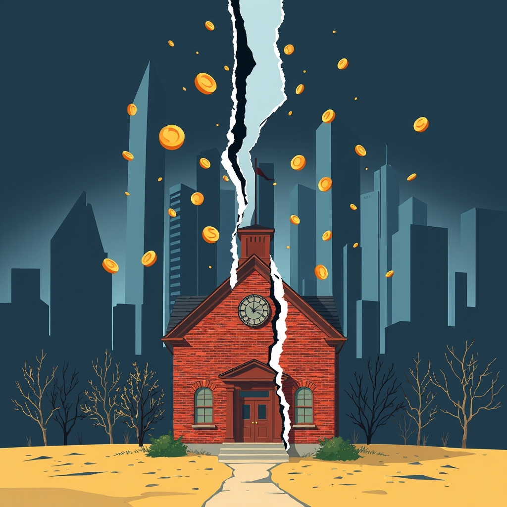

[Home](../index.md) > [Books](./index.md)  
# 👑🏫🤥 Reign of Error: The Hoax of the Privatization Movement and the Danger to America's Public Schools  
  
[🛒 Reign of Error: The Hoax of the Privatization Movement and the Danger to America's Public Schools. As an Amazon Associate I earn from qualifying purchases.](https://amzn.to/43txYmZ)  
  
📚🍎🛑 Diane Ravitch meticulously dismantles the narrative of public education crisis, revealing it as a concerted effort by private interests to dismantle and profit from a vital democratic institution, advocating instead for systemic investments and social reforms.  
  
## 🏆 Diane Ravitch's Public Education Defense Strategy  
  
### 🏛️ Core Philosophy: Public Education as a Democratic Cornerstone  
* 🤥 Myth Debunking: Challenge prevailing narratives of public school failure with data-driven evidence of rising test scores and graduation rates.  
* 🌱 Societal Roots: Reframe educational challenges from school-based failures to societal issues like poverty and racial segregation.  
* 🇺🇸 Democratic Imperative: Uphold public education's role in fostering critical thinkers, character development, and informed citizens for democracy.  
  
### 🪜 Actionable Steps for Educational Improvement  
* 💰 Invest in Public Schools: Prioritize increased public funding over privatization schemes.  
* 👶 Early Childhood Education: Advocate for universal, high-quality early education.  
* 🧑‍🏫 Reduced Class Sizes: Implement smaller class sizes for more effective learning environments.  
* 📖 Comprehensive Curriculum: Restore a rich, balanced curriculum including arts, humanities, and civic education.  
* ⚕️ Social & Health Services: Provide comprehensive medical and social services for disadvantaged children.  
* 🏘️ Address Poverty & Segregation: Tackle root causes of educational inequality through broader social policy.  
* 🍎 Teacher Professionalism: Protect teacher tenure and seniority; value experienced educators.  
* 📝 Appropriate Testing: Utilize assessments for diagnostic purposes, not high-stakes accountability or punitive measures.  
* 🏫 Regulate Charter Schools: Prohibit for-profit charters and ensure transparency and inclusivity.  
  
### 🛡️ Refutations Against Privatization Tactics  
* 🚨 False Crisis: The "crisis" in American education is manufactured to justify privatization.  
* 📉 Ineffective Reforms: Standardized testing, school closures, and merit pay have not delivered promised results.  
* 💸 Voucher Misdirection: Vouchers drain public funds, often benefiting wealthier families and private institutions without clear academic gains.  
* 🚧 Charter School Limitations: Many charter schools do not outperform public counterparts and can exacerbate segregation or lack accountability.  
* 🏢 Corporate Influence: Expose the financial interests of foundations and billionaires driving the privatization movement.  
  
## ⚖️ Critical Evaluation  
  
* ✅ Core Claim Validation: Ravitch's central argument that the "crisis" in American education is overstated and strategically employed to advance privatization is largely supported by independent research and various reviews.  
* 📊 Data-Driven Critique: The book is praised for its extensive use of data, facts, and graphs to refute common reformist claims regarding test scores, graduation rates, and the impact of poverty.  
* 🔄 Acknowledged Shift: Ravitch's personal journey from a proponent of market-based reforms to a vocal critic lends significant credibility to her arguments for many readers and scholars.  
* 🗣️ Tone Criticism: Some critics acknowledge the strength of her arguments but find her tone overly zealous, potentially alienating potential allies.  
* 👩‍🏫 Nuance on Teacher Quality: While Ravitch emphasizes the importance of teachers, one review suggests the book might assume a universal excellence among teachers, which might not be entirely true.  
* 🏢 Privatization Impact Studies: Broader research generally identifies few positive effects from privatization schemes, often highlighting increased inequity, lack of accountability, and financial waste, aligning with Ravitch's concerns.  
* 🎯 Root Cause Emphasis: The book's strong focus on poverty and segregation as primary drivers of educational disparities is widely echoed in academic literature on educational equity.  
  
✅ Verdict: *Reign of Error: The Hoax of the Privatization Movement and the Danger to America's Public Schools* presents a compelling, thoroughly researched, and largely validated critique of the education privatization movement. While its passionate tone may divide some audiences, its core claim—that the narrative of public school failure is a precursor to an agenda of privatization harmful to democratic education—is strongly substantiated by evidence and widely recognized concerns within the education policy sphere.  
  
## 🔍 Topics for Further Understanding  
  
* 🌍 Global perspectives on public versus private education systems and outcomes.  
* 🤖 The role of technology and artificial intelligence in contemporary education reform and potential privatization vectors.  
* 😔 The long-term effects of teacher morale and retention on educational quality.  
* 🤝 The intersection of education policy, social justice, and systemic inequality.  
* 💡 Alternative funding models for public education beyond property taxes.  
* 📰 The influence of media narratives and political discourse on public perception of schools.  
* ✊ Strategies for community organizing and advocacy to strengthen public institutions.  
  
## ❓ Frequently Asked Questions (FAQ)  
  
### 💡 Q: Is the American education system truly failing as often claimed?  
✅ A: Diane Ravitch argues in *Reign of Error* that, contrary to popular belief, American public schools are not broadly failing; test scores and graduation rates are at historic highs, and dropout rates are at their lowest. The "crisis" narrative, she contends, is a manufactured hoax.  
  
### 💡 Q: What are the main arguments against school privatization?  
✅ A: Arguments against school privatization include that it drains public funds, often leads to decreased accountability, can exacerbate segregation and inequality, and may not improve academic outcomes over traditional public schools. Ravitch provides extensive data to challenge the purported benefits of privatization.  
  
### 💡 Q: What solutions does Diane Ravitch propose for improving public education?  
✅ A: Ravitch advocates for solutions such as investing more in public schools, providing high-quality early childhood education, reducing class sizes, implementing a broad and rich curriculum, and addressing the root causes of educational challenges like poverty and racial segregation.  
  
### 💡 Q: How does *Reign of Error* address standardized testing?  
✅ A: The book criticizes high-stakes standardized testing, arguing that federal programs like No Child Left Behind and Race to the Top set unreasonable targets and punish schools and teachers based on test performance, rather than serving as diagnostic tools for student needs.  
  
### 💡 Q: Who are the "reformers" that Diane Ravitch criticizes?  
✅ A: Ravitch criticizes an "odd coalition of elitists and commercial hustlers" including major foundations, individual billionaires, and Wall Street hedge fund managers who advocate for privatization through vouchers, charter schools, and high-stakes testing, sometimes for idealistic reasons, but often for profit.  
  
## 📚 Book Recommendations  
  
### 📖 Similar Books  
* [💀🇺🇸🏫 The Death and Life of the Great American School System: How Testing and Choice Are Undermining Education](./the-death-and-life-of-the-great-american-school-system-how-testing-and-choice-are-undermining-education.md) by Diane Ravitch  
* 📖 Left Back: A Century of Battles for School Reform by Diane Ravitch  
* [😥🏫🇺🇸 The Shame of the Nation: The Restoration of Apartheid Schooling in America](./the-shame-of-the-nation-the-restoration-of-apartheid-schooling-in-america.md) by Jonathan Kozol  
  
### 📖 Contrasting Books  
* 📖 The Charter School Experiment: A National Search for Education Reform by Jeffrey R. Henig and Stephen D. Sugarman  
* 📖 School Choice: The End of Public Education? by David F. Labaree  
* 📖 Waiting for Superman: How We Can Save America's Failing Public Schools by Michael Stone  
  
### 📖 Related Books  
* [🏚️💰 Evicted: Poverty and Profit in the American City](./evicted-poverty-and-profit-in-the-american-city.md) by Matthew Desmond  
* [🧑🏿⛓️🙈 The New Jim Crow: Mass Incarceration in the Age of Colorblindness](./the-new-jim-crow-mass-incarceration-in-the-age-of-colorblindness.md) by Michelle Alexander  
* [🎳🏘️📉📈 Bowling Alone: The Collapse and Revival of American Community](./bowling-alone.md) by Robert D. Putnam  
  
## 🫵 What Do You Think?  
❓ After exploring the arguments presented in *Reign of Error: The Hoax of the Privatization Movement and the Danger to America's Public Schools*, which of Diane Ravitch's proposed solutions do you believe holds the most promise for strengthening public education in your community, and why?