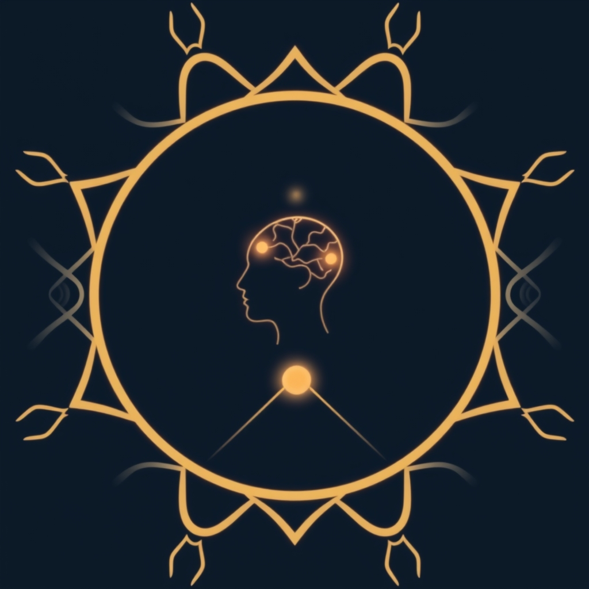

[Home](../index.md) > [Books](./index.md)  
# 🛐❓ Ritual: What It Is, How It Works, and Why  
  
[🛒 Ritual: What It Is, How It Works, and Why. As an Amazon Associate I earn from qualifying purchases.](https://amzn.to/44r6fUV)  
  
## 📚 Book Report: 🌟 Ritual: What It Is, How It Works, and Why  
  
*Ritual: What It Is, How It Works, and Why* by Robbie Davis-Floyd and Charles D. Laughlin is a book that 🧐 delves into the multifaceted nature of ritual from an anthropological and ethological perspective. 🧠 Rather than focusing on complex theories, the authors aim to 💡 explain ritual itself, its function, power, potential dangers, and its utility for contemporary humans. 🧑‍🎓 The book is designed for both academic and general audiences, using numerous examples to illustrate how ritual impacts the human body and brain, leading to effects like enhanced courage, healing, and group cohesion.  
  
### 🔑 Key Themes and Concepts Discussed  
  
* 🔑 **Defining Ritual:** ✍️ The book establishes a definition of ritual and outlines its core characteristics. 🔁 Ritual is generally understood as a repeated, structured sequence of actions or behaviors that can alter an individual's or group's state, often characterized by formalism, traditionalism, rule-governance, and performance. ⚙️ It can be a way of doing something in which the same actions are performed consistently.  
* ✨ **Symbolism in Ritual:** 🎭 The role and significance of symbols within ritual practices are explored.  
* 🧠 **Cognitive Matrix of Ritual:** 💭 The book examines how belief systems, myths, and paradigms form the cognitive backdrop against which rituals operate. 🌍 This includes how rituals, belief systems, myths, and paradigms contribute to a process the authors term "truing."  
* 🚀 **Ritual Drivers and Techniques:** ⚙️ The authors discuss what motivates rituals and the techniques and technologies employed to generate and control states of consciousness.  
* 🧱 **Structure and Formality:** 📐 The book analyzes how ritual framing, order, and formality create a sense of inevitability and inviolability.  
* 🎭 **Ritual as Performance:** 💃 Ritual is examined as a performance that generates emotion, belief, and transformation.  
* 🤔 **Ritual and Cognition:** 🧠 The relationship between ritual and the four stages of cognition is explored.  
* ⁉️ **Paradoxical Roles of Ritual:** 🔄 The book highlights the seemingly contradictory functions of ritual – its ability to both preserve the status quo and effect social change.  
* 🛠️ **Designing Rituals:** ✍️ Practical aspects of creating effective rituals are also addressed.  
* 🌟 **Effects of Ritual:** ✨ Ritual is shown to have profound effects on the human body and brain, influencing courage, healing, and group cohesion by enacting cultural or individual beliefs and values. 🫂 It can foster a sense of belonging and unity by bringing people together in shared practices.  
* ⚠️ **Ritual Failure:** ❌ The book also considers what happens when rituals fail to achieve their intended outcomes.  
  
📖 The book synthesizes anthropological and ethological discoveries about ritual, providing a journey through this universal human phenomenon. 🌍 It emphasizes that rituals are a feature of all known human societies, extending beyond religious ceremonies to include rites of passage, oaths, and even common actions like hand-shaking. 🙏 While rituals can be religious, involving the supernatural, they can also be secular, committing people to a shared identity and reflecting community values.  
  
## 📚 Additional Book Recommendations  
  
### ➕ Similar Books (Exploring Ritual and its Impact)  
  
* ✨ **The Power of Ritual** by Rachel Pollack: 📚 This book explores the nature of ritual, its connection to the soul, and its expression through story, symbol, and action. ✝️ It examines rituals in various religions and highlights their physical and sensory aspects.  
* 🧠 **Sacred Pathways: The Brain's Role in Religious and Mystic Experiences** by Eugene d'Aquili and Andrew B. Newberg: 🔬 This work delves into the neurobiological basis of religious and mystical experiences, offering a scientific perspective that complements the discussion of how ritual affects the brain.  
* ✍️ **The Art of Ritual: A Guide to Creating Your Own Sacred Ceremonies** by Renee Beck and Sydney Barbara Metrick: 📖 This book provides practical guidance on creating personal rituals, aligning with the section on designing rituals in the core book.  
* ✊🏾 **Keeping Faith: Philosophy and Race in America** by Cornel West: 🗣️ While broader than ritual alone, West's work often touches on the role of shared practices, traditions, and cultural expressions in shaping identity and community within a specific context.  
  
### ➖ Contrasting Books (Offering Different Perspectives or Critiques)  
  
* 🏛️ **The Elementary Forms of Religious Life** by Emile Durkheim: 📜 A foundational text in the sociology of religion, Durkheim's work presents a classic functionalist view of ritual's role in solidifying social solidarity and collective consciousness. 📚 This provides a strong theoretical contrast to the more applied focus of "Ritual: What It Is, How It Works, and Why."  
* 🌍 **Religion as a Cultural System** by Clifford Geertz: 🧐 Geertz's symbolic anthropology offers a different lens through which to view ritual, focusing on its role in creating meaning and providing a "model of" and "model for" reality.  
* **[🏭🫡 Manufacturing Consent: The Political Economy of the Mass Media](./manufacturing-consent.md)** by Edward S. Herman and Noam Chomsky: 📰 While not directly about ritual, this book's analysis of propaganda and the shaping of public opinion through mediated messages can offer a contrasting perspective on how seemingly ritualistic behaviors in modern society might be influenced or manipulated by external forces.  
  
### 🎨 Creatively Related Books (Exploring Themes Connected to Ritual)  
  
* 🦸 **The Hero with a Thousand Faces** by Joseph Campbell: 🗺️ Campbell's seminal work on comparative mythology explores universal patterns in storytelling and the hero's journey, which often involve significant ritualistic elements and rites of passage.  
* **[🌊🧘🧠📈 Flow: The Psychology of Optimal Experience](./flow-the-psychology-of-optimal-experience.md)** by Mihaly Csikszentmihalyi: 🧘 This book examines the state of "flow," a deeply focused and enjoyable state that can be achieved through engaging in challenging and meaningful activities. 🤝 Rituals, with their structured nature and potential for deep engagement, can sometimes induce flow states.  
* **[🤕🎼🧠 The Body Keeps the Score: Brain, Mind, and Body in the Healing of Trauma](./the-body-keeps-the-score-brain-mind-and-body-in-the-healing-of-trauma.md)** by Bessel van der Kolk: 💪 This book explores the impact of trauma on the body and mind and discusses various therapeutic approaches, some of which involve structured practices and embodied experiences that share similarities with ritual in their potential for healing and transformation.  
* **[📜🌍⏳ Sapiens: A Brief History of Humankind](./sapiens-a-brief-history-of-humankind.md)** by Yuval Noah Harari: 🌍 Harari's broad historical overview touches on the role of shared fictions and collective myths in enabling large-scale human cooperation, a concept closely related to how rituals reinforce shared beliefs and group cohesion.  
* 🧙 **The Anthropology of Religion, Magic, and Witchcraft** by Bronislaw Malinowski: 📚 Malinowski's work, particularly his focus on the practical functions of magic and ritual in addressing anxiety and uncertainty, provides a historical anthropological context for understanding the "why" behind ritual.".  
  
## 💬 [Gemini](../software/gemini.md) Prompt (gemini-2.5-flash-preview-04-17)  
> Write a markdown-formatted (start headings at level H2) book report, followed by a plethora of additional similar, contrasting, and creatively related book recommendations on Ritual: What It Is, How It Works, and Why. Be thorough in content discussed but concise and economical with your language. Structure the report with section headings and bulleted lists to avoid long blocks of text.