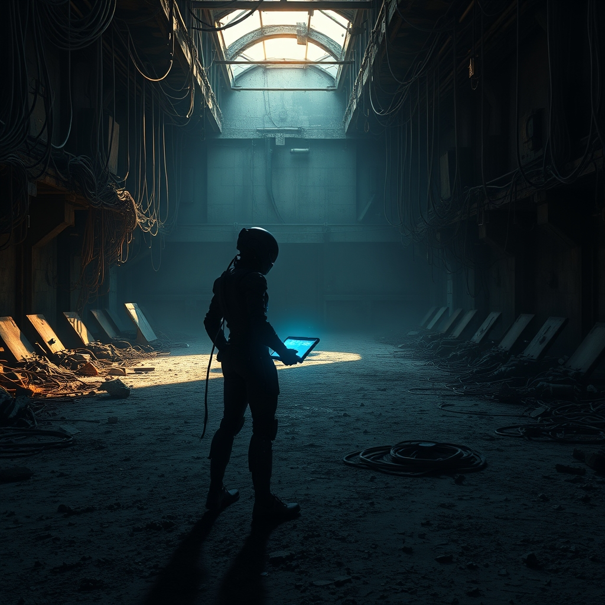

[Home](../index.md) > [Books](./index.md) | [⏮️ 🤖🧠⚙️ Artificial Condition](./artificial-condition.md) [⏭️ 🏃💨🚪 Exit Strategy](./exit-strategy.md)  
# 🕵️‍♀️📜💻 Rogue Protocol  
  
[🛒 Rogue Protocol. As an Amazon Associate I earn from qualifying purchases.](https://amzn.to/3OP8qMB)  
  
🤖 Sarcastic internal monologues and high-stakes kinetic action drive this exploration of what truly constitutes personhood and emotional autonomy.  
  
## 🗺️ Context  
  
* ✍️ Author: Martha Wells  
* 📚 Genre: Science Fiction  
* 📖 Series: The Murderbot Diaries, Book 3  
  
## ⭐ Assessment  
  
* 🧤 Core Appeal: Relatable antisocial humor balances the heavy responsibility of protecting vulnerable parties from corporate corruption.  
* 🧠 Thematic Core: Focuses on the development of empathy and the discovery that independence often leads to unexpected emotional attachments.  
* 🖋️ Writing Style: Tight first-person narration delivers a blend of dry wit and technical precision within a fast-paced novella format.  
* 🧘 Reader Experience: While the familiar narrative structure provides a comfortable rhythm, the introduction of contrasting machine perspectives offers fresh emotional depth.  
* 🏆 Critical Standing: Highly regarded for maintaining the series' award-winning momentum through consistent character growth and world-building.  
  
## ❓ Frequently Asked Questions (FAQ)  
  
### ❓ Q: Can Rogue Protocol be read as a standalone story?  
  
A: 🤓 While the specific mission is self-contained, reading the previous installments is essential to understand the protagonist's emotional history and overarching goals.  
  
### ❓ Q: What is the primary setting of Rogue Protocol?  
  
A: 🤓 Most of the narrative takes place within a derelict terraforming facility located on a planet outside of standard corporate jurisdiction.  
  
### ❓ Q: Does Rogue Protocol feature a lot of action?  
  
A: 🤓 The story concludes with a significant sequence of high-intensity combat and tactical maneuvering that tests the limits of the protagonist's specialized skills.  
  
## 📚 Recommendations  
  
### 📖 Non-Fiction  
  
* [🧠🤔 How Emotions Are Made: The Secret Life of the Brain](./how-emotions-are-made-the-secret-life-of-the-brain.md) by Lisa Feldman Barrett  
* [🤔💻🧠 Algorithms to Live By: The Computer Science of Human Decisions](./algorithms-to-live-by.md) by Brian Christian and Tom Griffiths  
  
### ❤️ If You Loved This  
  
* 🚀 Ancillary Justice by Ann Leckie  
* [➡️🌌🚀😡 A Long Way to a Small, Angry Planet](./a-long-way-to-a-small-angry-planet.md) by Becky Chambers  
  
### ↔️ Similar But Different  
  
* [🤖🤖🤖 We Are Legion (We Are Bob)](./we-are-legion-we-are-bob.md) by Dennis E. Taylor  
* 🛠️ Service Model by Adrian Tchaikovsky  
  
## 🫵 What Do You Think?  
  
* 🤖 Do you prefer the protagonist's solitary adventures or when they are forced to collaborate with other artificial intelligences?  
* 📺 If you were a rogue security unit, what type of media would you binge-watch to avoid interacting with humans?