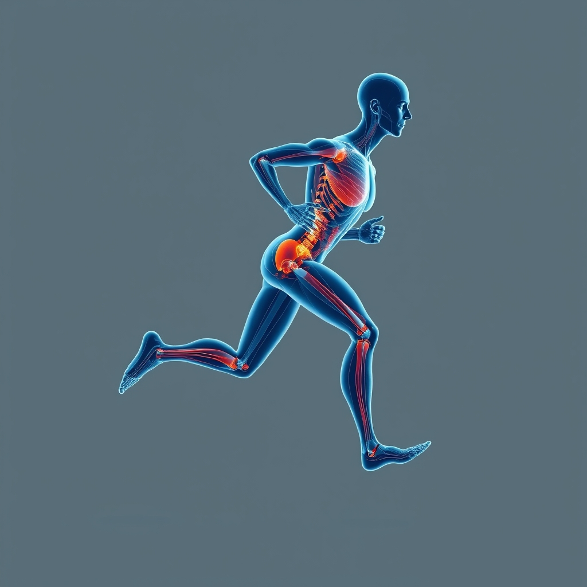

[Home](../index.md) > [Books](./index.md)  
# 🏃‍♂️🦴 Running Anatomy  
  
[🛒 Running Anatomy. As an Amazon Associate I earn from qualifying purchases.](https://amzn.to/3HZ3IZZ)  
  
## 📖 Book Report: Running Anatomy  
  
### 🏃 Introduction  
  
🏃 Running Anatomy, primarily authored by Joe Puleo and Patrick Milroy (with a second edition from Human Kinetics), serves as a comprehensive guide for understanding the physiological intricacies of running. 🧑‍🏫 The book aims to educate readers on how the human body functions during running movements, meticulously detailing the mechanisms through clear, full-color anatomical illustrations. 🦴💪 It elucidates the interaction of bones and soft tissues, including muscles, tendons, ligaments, fasciae, blood vessels, and nerves, to explain movement production and how to achieve personal running goals. 🚀 The second edition further enhances this offering with additional exercises, insights, and illustrations.  
  
### 🧠 Key Concepts and Content  
  
The book systematically breaks down the science of running into several core areas:  
  
* 👣 **The Running Gait Cycle**: 🏃 It defines running by its characteristic "double float" phase, where both feet are off the ground, contrasting it with walking. 🚶‍♀️ The book explains the stance and swing phases of the gait cycle, crucial for understanding efficient movement. ⚖️ Running demands greater balance, muscle strength, and joint range of movement compared to walking.  
* 💪 **Muscular Mechanics**: 🦵 Running Anatomy identifies the primary muscle groups vital for running, such as the quadriceps, hamstrings, calves, glutes, and core muscles. 🦵 It describes their specific roles in knee extension and flexion, propulsion, and stabilizing the pelvis and body during movement.  
* 🏋️ **Strength Training for Runners**: 🤸 A significant portion of the book is dedicated to practical application, featuring 48 to 50 effective strength exercises. 📝 Each exercise is accompanied by step-by-step descriptions and detailed anatomical illustrations that highlight the primary and secondary muscles engaged. 🧱 The emphasis is on building a robust muscular foundation to maintain proper running form, enhance performance, and minimize injury risk.  
* 🩹 **Injury Prevention and Rehabilitation**: 🤕 The text addresses common running-related injuries, including plantar fasciitis, lower-back pain, knee aches, strains, and torn muscles and tendons. ⚕️ It provides insights into how anatomical imbalances contribute to these injuries and offers strategies through specific strengthening exercises to prevent them.  
* 💨 **Optimizing Performance**: ⏱️ Beyond injury prevention, the book guides runners on improving gait efficiency for faster times and more fluid runs. ⛰️ It offers variations in training for diverse conditions like different terrains, speeds, elevations, and distances, ranging from sprints to marathons. ⚙️ Discussions on gear and technology are also included to maximize training and performance.  
* 🔬 **Biomechanics and External Factors**: 👟 The book offers an in-depth look at the internal and external mechanics of the running cycle, including how external influences like shoe mechanics, uneven ground reactive forces, and terrain differences affect running biomechanics.  
  
### 🎯 Target Audience  
  
🎯 Running Anatomy is designed for a broad spectrum of individuals interested in running, from fitness runners aiming to improve strength and conquer hills, to competitive athletes seeking an edge, and even novices looking to start a running program safely. 🧑‍🏫 It also serves as an invaluable resource for coaches and running clinics. 📖 The book's clear explanations and visual aids make complex anatomical and physiological information accessible to readers of all levels.  
  
### 👍 Strengths  
  
* 🎨 **Exceptional Illustrations**: 🖼️ The full-color anatomical illustrations are a standout feature, clearly depicting muscles, ligaments, and tendons in action during exercises and running movements.  
* 🏃 **Practical Application**: 🔗 The book directly links anatomical knowledge and strength exercises to improved running performance, injury prevention, and gait efficiency.  
* 📚 **Comprehensive Approach**: 📝 It covers a wide range of topics from basic running mechanics to advanced strength training, injury management, and even external factors affecting performance.  
* 👓 **Clarity and Accessibility**: 🔬 Despite the scientific subject matter, the content is presented in an easy-to-understand and absorb manner, making it valuable for both laypersons and professionals.  
* ❓ **Focus on "Why"**: 🤔 The book excels at explaining not just *what* to do, but *how and why* the body responds the way it does to running and specific training.  
  
### 🏁 Conclusion  
  
✅ Running Anatomy is an essential reference for anyone serious about understanding the physical demands of running and optimizing their performance while minimizing injury risk. 📚 Its blend of detailed anatomical explanations, practical strength exercises, and clear illustrations makes it a highly effective tool for runners and coaches alike.  
  
## 📚 Book Recommendations  
  
### 💡 Similar Books  
  
These books offer detailed insights into running mechanics, injury prevention, and performance enhancement, often with a strong focus on anatomy or physiology.  
  
* 🏃 **[🏃‍♀️🦴 Anatomy for Runners: Unlocking Your Athletic Potential for Health, Speed, and Injury Prevention](./anatomy-for-runners-unlocking-your-athletic-potential-for-health-speed-and-injury-prevention.md) by Jay Dicharry**: 🥇 This book is frequently recommended by physical therapists and running specialists for its comprehensive approach to running mechanics, injury causes, and prescriptive exercises. 🧪 It provides a solid scientific background in an accessible format for the layperson.  
* 💪 **The Runner's Body: How the Latest Exercise Science Can Help You Run Stronger, Longer, and Faster by Ross Tucker and Jonathan Dugas**: 🔬 This book delves into how muscles, the skeletal system, and cardiovascular, metabolic, and nervous systems work during running, offering detailed yet easy-to-understand explanations of the body's functions.  
* 🧪 **Running Science by Owen Anderson**: ⚗️ Part of a series by Human Kinetics, similar to Running Anatomy, this book explores the scientific principles behind running performance, training, and injury prevention in a detailed manner.  
  
### ↔️ Contrasting Books  
  
These recommendations offer different perspectives on running, moving beyond pure anatomy to focus on training methodologies, mental aspects, or broader movement principles.  
  
* 📊 **Daniels' Running Formula by Jack Daniels**: 📈 While Running Anatomy focuses on *how* the body works, Daniels' Running Formula provides a highly scientific and data-driven approach to structuring training plans. 🎯 It uses current fitness levels to define specific intensities and speeds for workouts, making it a guide for *what* to do in training.  
* **[💪🧠 Endure: Mind, Body, and the Curiously Elastic Limits of Human Performance](./endure-mind-body-and-the-curiously-elastic-limits-of-human-performance.md) by Alex Hutchinson**: 💡 Referenced within Running Anatomy, this book contrasts with a purely physical view by exploring the psychological and neurological factors that influence human endurance and performance, including concepts like the "central governor model".  
* 🧘 **ChiRunning by Danny Dreyer**: 🧘‍♀️ This book presents a revolutionary approach to running form, emphasizing effortless, injury-free running through principles of balance, relaxation, and proper alignment rather than muscle-specific anatomical breakdown. ✨ It focuses on technique to minimize impact.  
  
### 🌀 Creatively Related Books  
  
These books broaden the scope, connecting running to general human movement, evolutionary biology, or the mental aspects of sustained physical effort, offering a more philosophical or holistic view.  
  
* ⚔️ **Natural Born Heroes: How a Daring Band of Misfits Mastered the Lost Secrets of Strength and Endurance by Christopher McDougall**: 📜 Following up on his previous work, McDougall explores the ancient and modern secrets of human strength, resilience, and natural movement, linking historical practices to contemporary understanding of physical prowess and endurance, providing a narrative context to anatomical capabilities.  
* 🤸 **A Guide to Better Movement: The Science and Practice of Moving With More Skill And Less Pain by Todd R. Hargrove**: 🧠 While not exclusively about running, this book delves into the broader science of human movement, pain, and skill acquisition. 💡 It offers a deeper understanding of how the nervous system and brain influence movement patterns, which can be creatively applied to refining running technique and preventing injury.  
* 🌍 **Why We Run: A Natural History by Bernd Heinrich**: 🧬 This book explores the evolutionary and biological underpinnings of why humans are built to run long distances. 🌳 It offers a unique perspective on running beyond its mechanics, delving into its place in human history and nature, enriching a runner's appreciation for their anatomical design.".  
  
## 💬 [Gemini](https://gemini.google.com) Prompt (gemini-2.5-flash)  
> Write a markdown-formatted (start headings at level H2) book report, followed by similar, contrasting, and creatively related book recommendations on Running Anatomy. Never quote or italicize titles. Be thorough but concise. Use section headings and bulleted lists to avoid long blocks of text.