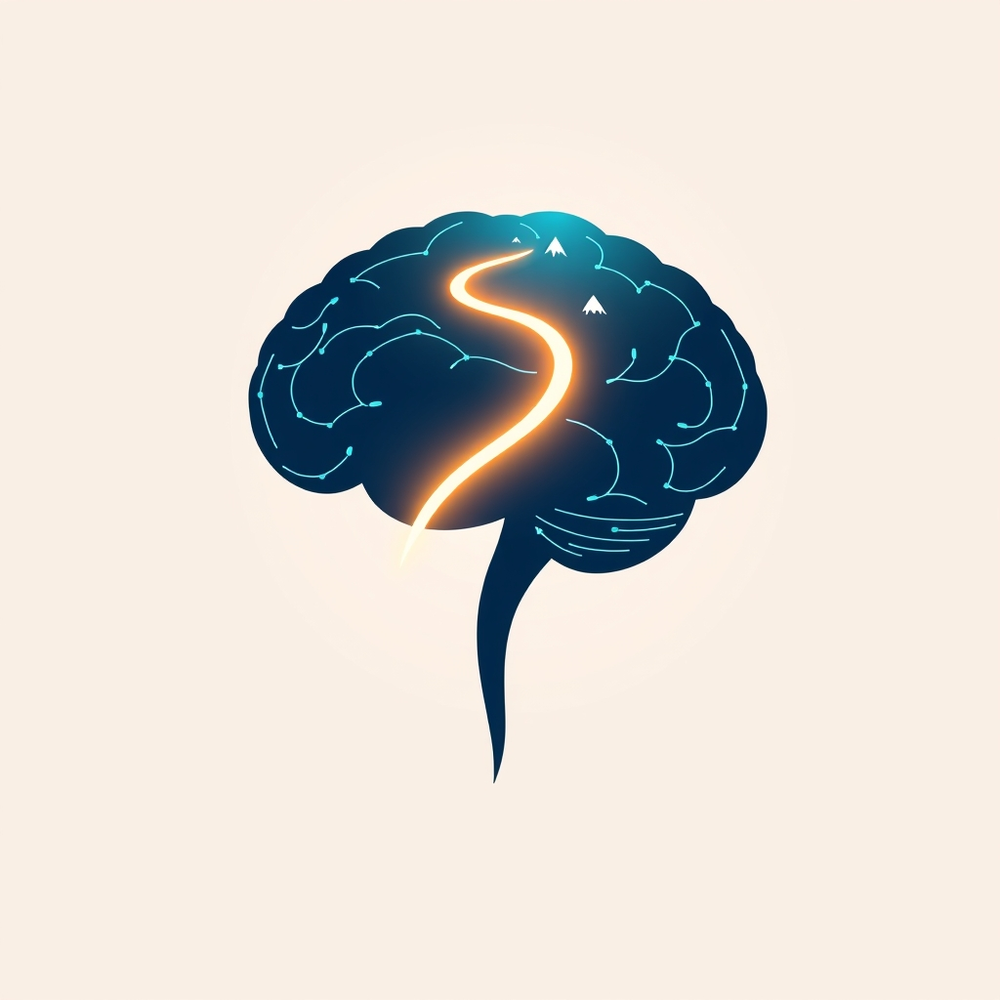

[Home](../index.md) > [Books](./index.md)  
# 😊🧠 Satisfaction: The Science of Finding True Fulfillment  
  
[🛒 Satisfaction: The Science of Finding True Fulfillment. As an Amazon Associate I earn from qualifying purchases.](https://amzn.to/43y79NG)  
  
## 📚 Book Report: 💡 Satisfaction: The Science of Finding True Fulfillment  
  
### ✍️ Author  
🧑‍⚕️ Gregory Berns, M.D., Ph.D., a neuroscientist, psychiatrist, and professor. 🎓 He holds the Distinguished Chair of Neuroeconomics at Emory University.  
  
### 📅 Publication Year  
🗓️ First published in 2005.  
  
### 🧠 Core Argument/Thesis  
🤔 The book challenges the idea that humans are primarily driven by seeking pleasure and avoiding pain. 🙅 Instead, Berns argues that true satisfaction arises from the *process* of striving towards goals, particularly those involving novelty and challenge, rather than just achieving the goal itself. 🎯 Satisfaction is distinct from passive happiness or fleeting pleasure; it requires conscious action and decision-making. 🤹 It's linked neurologically to the interaction between dopamine (released in anticipation of novelty or reward) and cortisol (released under stress), especially when we feel a sense of control over the challenging situation. control The more complex and challenging the pursuits, the greater the potential satisfaction. 💪  
  
### 🔑 Key Themes/Concepts  
* ⚖️ **Satisfaction vs. Happiness/Pleasure:** Satisfaction involves action and conscious choice, unlike pleasure or happiness which can be passive or circumstantial. 🧘  
* ✨ **The Role of Novelty:** 🧠 The brain craves new experiences, which trigger dopamine release in the striatum, a key component of satisfaction. 🚦 Routine dampens this response. 📉  
* 🧗 **Challenge and "Flow":** 🌊 Optimal satisfaction occurs when facing challenges that stretch our skills but remain manageable, similar to Csikszentmihalyi's concept of "flow". ✅ This induces a stress response (cortisol) that, combined with dopamine, intensifies the experience positively when control is perceived. 👍  
* 🔬 **Neurobiology:** 🧠 Explores the roles of the striatum, dopamine (motivation, anticipation), and cortisol (stress, intensity) in creating the feeling of satisfaction. 🎉  
* 🔍 **Exploration of Satisfaction Sources:** 👨‍🔬 Berns investigates various activities through personal experience and research, including ultramarathons, 🏃 S&M, ⛓️ fine dining, 🍽️ puzzle-solving, 🧩 money (as a facilitator of novelty), 💰 love, ❤️ and relationships, 🤝 illustrating how novelty and challenge contribute to satisfaction in diverse contexts. 🌍  
* 🗣️ **Narrative and Meaning:** 📖 Sharing experiences helps solidify the meaning derived from satisfying activities. ✍️  
  
### 🎯 Target Audience  
🤓 Individuals interested in the neuroscience behind motivation, happiness, and fulfillment, as well as those seeking a deeper understanding of why challenge and novelty are often more rewarding than comfort and ease. 🤔  
  
### 👍 Strengths  
* ✍️ **Engaging Narrative Style:** 📖 Berns blends personal anecdotes, scientific research (including MRI studies), and explorations of diverse fields like economics and evolutionary psychology in a readable, often compelling way. 😍  
* 🤯 **Thought-Provoking Thesis:** 🤔 The distinction between satisfaction, happiness, and pleasure offers a fresh perspective on motivation and well-being. 🌱  
* 🔬 **Scientific Grounding:** 🧪 The arguments are rooted in neuroscience research, particularly concerning brain chemistry and activity. 🧠  
  
### 👎 Weaknesses/Criticisms  
* 🖋️ **Writing Style:** 📝 Some reviewers find the writing style less than stellar or the dialogue contrived. 😒  
* 🔁 **Repetitive Premise:** 🗣️ The core idea about novelty stimulating dopamine is repeated frequently. 🔄  
* 🎭 **Focus on Exploits over Science:** 🎢 Some critics felt the book emphasized entertaining anecdotes more than in-depth scientific explanation. 🔬  
* 🩺 **Medical vs. Cognitive View:** 🧠 The book takes a heavily neurobiological/medical perspective, potentially downplaying cognitive or behavioral aspects explored by other authors. 🙅‍♀️  
  
### ✨ Overall Impression  
💯 "Satisfaction" offers a compelling, science-backed argument that true fulfillment comes not from easy pleasure or passive happiness, but from actively seeking out and engaging with novel and challenging experiences. 🚀 Berns uses vivid examples and personal journeys to illustrate how the brain's reward system is wired for exploration and effort, suggesting that a more demanding life may ultimately be a more satisfying one. 💪 While perhaps repetitive at times or prioritizing narrative over dense science for some tastes, it provides accessible insights into the neurobiology of motivation and satisfaction. 🧠  
  
## 📚 Book Recommendations  
  
### 🧠 Similar Reads (Science of Happiness/Decision Making/Neuroscience)  
* **[😀📜 The Happiness Hypothesis: Finding Modern Truth in Ancient Wisdom](./the-happiness-hypothesis-finding-modern-truth-in-ancient-wisdom.md)** by Jonathan Haidt: Explores the psychological and philosophical roots of happiness, using the metaphor of an elephant (automatic processes) and a rider (conscious control). 🐴  
* 🧠 **Buddha's Brain: The Practical Neuroscience of Happiness, Love, and Wisdom** by Rick Hanson & Richard Mendius: 🙏 Blends neuroscience, evolutionary biology, and Buddhist wisdom to explain how brain activity underlies states of mind and how to cultivate positive ones. 🧘‍♀️  
* **[🔌😁🧠🔬 Hardwiring Happiness: The New Brain Science of Contentment, Calm, and Confidence](./hardwiring-happiness-the-brain-science-that-changes-everything.md)** by Rick Hanson: Focuses on practical techniques grounded in neuroscience to rewire the brain for greater happiness and resilience. 🛠️  
* 💰 **NeuroWisdom: The New Brain Science of Money, Happiness, and Success** by Mark Robert Waldman & Chris Manning: Offers brain exercises based on neuroscience to improve productivity, satisfaction, and goal achievement. 🎯  
* 🤔 **Emotion and Decision Making Explained** by Edmund T. Rolls: A comprehensive look at the neuroscience of emotion, motivation, reward, and how the brain implements decision-making. 🧠  
* **[😊🧠📈🎯 The How of Happiness: A Scientific Approach to Getting the Life You Want](./the-how-of-happiness-a-scientific-approach-to-getting-the-life-you-want.md)** by Sonja Lyubomirsky: Presents research-based strategies and activities to intentionally increase happiness levels. 😄  
* **[🤔🐇🐢 Thinking, Fast and Slow](./thinking-fast-and-slow.md)** by Daniel Kahneman: Delves into the two systems that drive thought – the fast, intuitive System 1 and the slow, deliberate System 2 – explaining cognitive biases and errors in judgment. 🐢  
  
### 🔄 Contrasting Perspectives (Alternative Paths to Fulfillment)  
* **[🌊🧘🏼‍♀️🧠📈 Flow: The Psychology of Optimal Experience](./flow-the-psychology-of-optimal-experience.md)** by Mihaly Csikszentmihalyi: While related to Berns' concept of challenge, Flow focuses more on the psychological state of complete absorption in an activity, often seen as a key to happiness, sometimes irrespective of novelty. 🧘  
* **[🔦💡 Man's Search for Meaning](./mans-search-for-meaning.md)** by Viktor Frankl: A psychiatrist's account of life in Nazi death camps and his psychotherapeutic method (logotherapy), which posits that the primary human drive is not pleasure (Freud) or power (Adler), but the discovery and pursuit of what we personally find meaningful. 🌟  
* 💖 **The Gifts of Imperfection** by Brené Brown: Argues for embracing vulnerability, imperfection, and authenticity as pathways to wholehearted living, contrasting with a purely achievement- or novelty-driven approach to satisfaction. 🫂  
* 🧘 Books on Mindfulness and Meditation (e.g., works by Thich Nhat Hanh, Jon Kabat-Zinn): Emphasize presence, acceptance, and inner peace as routes to contentment, often contrasting with the striving and external seeking highlighted by Berns. ☮️  
* 💸 **Rich Dad Poor Dad** by Robert T. Kiyosaki: Focuses on financial literacy and mindset shifts for achieving financial independence, representing a specific, often contrasting, path to a form of life satisfaction. 🏦  
  
### ➕ Creatively Related (Exploring Themes Further)  
* 🧠 **Iconoclast: A Neuroscientist Reveals How to Think Differently** by Gregory Berns: Berns' follow-up book, exploring the neuroscience behind people who break norms and think differently, extending the theme of novelty and challenging convention. 💥  
* 🐶 **How Dogs Love Us / What It's Like to Be a Dog** by Gregory Berns: Berns applies his neuroscience research (using fMRI on awake dogs) to understand animal cognition and emotion, relating to the theme of exploring the unknown and challenging research boundaries. 🐕  
* **[🔄🧠💪 The Power of Habit: Why We Do What We Do in Life and Business](./the-power-of-habit.md)** by Charles Duhigg: Explores the neuroscience of habit formation, relevant to understanding how routines (the opposite of novelty) dominate lives but also how they can be changed. 🔄  
* **[🧠🔄🏆 The Brain That Changes Itself: Stories of Personal Triumph from the Frontiers of Brain Science](./the-brain-that-changes-itself.md)** by Norman Doidge: Showcases neuroplasticity through compelling stories, highlighting the brain's capacity for change and adaptation, linking to Berns' idea that experiences change the brain. 🌟  
* ⛰️ **Into the Wild** by Jon Krakauer or **Wild** by Cheryl Strayed: Narratives of individuals seeking profound experiences and self-discovery through challenging, unconventional journeys in nature, embodying the pursuit of satisfaction through adversity and novelty. 🌲  
* 💪 **Awaken the Giant Within** by Tony Robbins: A motivational self-help book focused on taking control of one's life through psychological techniques, touching on themes of drive and achieving goals, albeit from a different perspective than Berns' neuroscience focus. 🧠  
  
## 💬 [Gemini](../software/gemini.md) Prompt (gemini-2.5-pro-exp-03-25)  
> Write a markdown-formatted (start headings at level H2) book report, followed by a plethora of additional similar, contrasting, and creatively related book recommendations on Satisfaction: The Science of Finding True Fulfillment. Be thorough in content discussed but concise and economical with your language. Structure the report with section headings and bulleted lists to avoid long blocks of text.