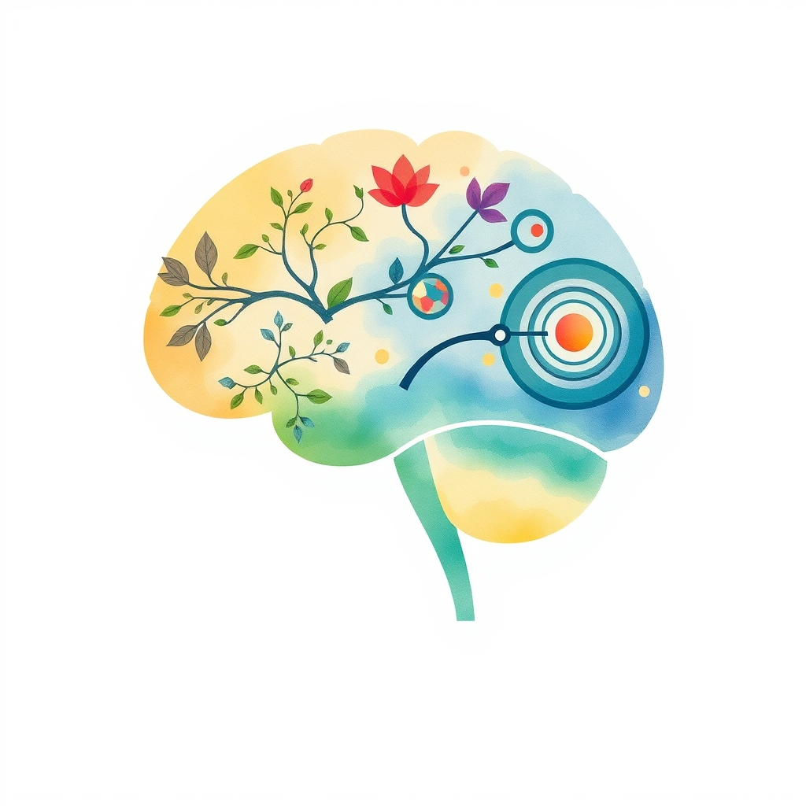

[Home](../index.md) > [Books](./index.md)  
# 👨‍👩‍👧‍👦🧠 Second Nature: How Parents Can Use Neuroscience to Help Kids Develop Empathy, Creativity, and Self-Control  
  
[🛒 Second Nature: How Parents Can Use Neuroscience to Help Kids Develop Empathy, Creativity, and Self-Control. As an Amazon Associate I earn from qualifying purchases.](https://amzn.to/4lbJnhQ)  
  
## 📚 Book Report: 🧠 Second Nature: How Parents Can Use Neuroscience to Help Kids Develop 🤝 Empathy, 🎨 Creativity, and 🧘 Self-Control  
  
⭐ *Second Nature* by Dr. Erin Clabough offers parents a guide rooted in 🧠 neuroscience to cultivate essential life skills in their children: 🤝 empathy, 🎨 creativity, and 🧘 self-control. 👩‍⚕️ Clabough, a neuroscientist and mother, translates complex 🧠 brain development research into accessible language and practical strategies for everyday parenting. 💡 The book posits that fostering these three interconnected skills is crucial for a child's self-regulation, ultimately leading to greater well-being, healthier relationships, and increased independence.  
  
### 📝 Summary  
  
🗣️ The book argues that while 🤝 empathy, 🎨 creativity, and 🧘 self-control are vital for children to thrive, they are also skills that can and must be intentionally developed, rather than being purely innate. 👨‍⚕️ Dr. Clabough highlights that a deficiency in these areas underlies many common parenting challenges. 🧠 By understanding the neuroscience behind these skills, parents can implement simple, low-effort, high-impact practices using everyday interactions. 🗺️ The book provides a "roadmap" for parents seeking to raise well-adjusted individuals who can make positive contributions to the world.  
  
### 🔑 Key Concepts and Approach  
  
* ⚖️ **Self-Regulation as a Master Skill:** The book emphasizes self-regulation as the overarching skill that integrates 🤝 empathy, 🎨 creativity, and 🧘 self-control, enabling children to make good choices and pursue goals even when faced with strong emotions.  
* 🧠 **Neuroscience-Informed Parenting:** Dr. Clabough explains key insights from 🧠 brain development research to show parents *how* these skills can be built at any age.  
* 🤝 **Three Intertwined Skills:** The core focus is on the development of:  
    * 🤗 **Empathy:** The ability to understand and share the feelings of others.  
    * 💡 **Creativity:** Encouraging imagination, flexible thinking, and problem-solving.  
    * 🧘 **Self-Control:** Developing the capacity to manage impulses, delay gratification, and regulate emotions.  
* 🛠️ **Practical, Everyday Strategies:** The book offers a wealth of actionable tools, from quick games to long-term approaches, integrating them into existing family routines. 😠 It addresses common issues like tantrums, impulsivity, and conflict through the lens of building these core skills.  
* 🚀 **Low Effort, High Impact:** The author promotes a mindset where small, consistent efforts in parenting can significantly nurture these crucial abilities.  
  
## 📚 Additional Book Recommendations  
  
### 👪 Similar Books (Parenting, Neuroscience, Emotional Intelligence)  
  
* **[🕳️🧠👶🏽 The Whole-Brain Child: 12 Revolutionary Strategies to Nurture Your Child's Developing Mind](./the-whole-brain-child.md)** by Daniel J. Siegel and Tina Payne Bryson: This highly recommended book by a neuroscientist and parenting expert also focuses on 🧠 brain development and offers practical strategies for dealing with everyday parenting challenges by fostering emotional intelligence and integration of the child's brain.  
* **[🚫🎭🧠 No-Drama Discipline: The Whole-Brain Way to Calm the Chaos and Nurture Your Child's Developing Mind](./no-drama-discipline.md)** by Daniel J. Siegel and Tina Payne Bryson: A follow-up to *The Whole-Brain Child*, this book specifically applies neuroscience principles to discipline, emphasizing connection over punishment to help children develop self-regulation.  
* **[👍🧠 The Yes Brain: How to Cultivate Courage, Curiosity, and Resilience in Your Child](./the-yes-brain.md)** by Daniel J. Siegel and Tina Payne Bryson: This book explores how to foster a "yes brain" in children, characterized by openness, resilience, and creativity, aligning well with *Second Nature*'s themes.  
* 😊 **Calm Parents, Happy Kids: The Secrets of Stress-Free Parenting** by Laura Markham: This book presents a program based on brain development research focusing on emotional intelligence, connection, empathy, and positive communication and discipline.  
* 🗣️ **How to Talk So Kids Will Listen & Listen So Kids Will Talk** by Adele Faber and Elaine Mazlish: A classic in parenting communication, this book provides practical techniques for improving communication with children, which is foundational for building empathy and understanding.  
  
### 🆚 Contrasting Books (Different Approaches or Focus)  
  
* 👨‍👩‍👧‍👦 **Parenting with Love and Logic: Teaching Children Responsibility** by Foster Cline and Jim Fay: While not strictly *contrasting* in goals, this series focuses heavily on logical consequences and empowering children through choices, offering a different methodological approach compared to a direct neuroscience focus, though principles can overlap.  
* 🐅 **Battle Hymn of the Tiger Mother** by Amy Chua: This memoir presents a strict, authoritarian parenting style with a strong emphasis on academic and extracurricular achievement, offering a stark contrast to the focus on emotional skills like empathy and self-regulation as the primary goals.  
* 🇫🇷 **Bringing Up Bébé: One American Mother Discovers the Wisdom of French Parenting** by Pamela Druckerman: This book explores cultural differences in parenting, highlighting a French approach that often emphasizes parental authority and independence in children from an early age, providing a different cultural perspective on raising well-adjusted children.  
  
### 🎨 Creatively Related Books (Broader Themes)  
  
* **[🌱🧘🏼‍♀️🏆 Mindset: The New Psychology of Success](./mindset.md)** by Carol S. Dweck: This book explores the power of a growth mindset, which is closely related to fostering creativity and resilience by emphasizing effort and learning over fixed abilities.  
* **[⚛️🔄 Atomic Habits: An Easy & Proven Way to Build Good Habits & Break Bad Ones](./atomic-habits.md)** by James Clear: While not specifically about parenting, the principles of habit formation discussed in this book can be applied by parents to help children develop positive routines related to self-control and responsibility.  
* **[❤️🧠📈🤔 Emotional Intelligence: Why It Can Matter More Than IQ](./emotional-intelligence.md)** by Daniel Goleman: This foundational book on emotional intelligence in adults provides a broader understanding of the skills *Second Nature* aims to cultivate in children, highlighting their importance throughout life.  
* **[🌊🧘🧠📈 Flow: The Psychology of Optimal Experience](./flow-the-psychology-of-optimal-experience.md)** by Mihaly Csikszentmihalyi: This book explores the concept of "flow," a state of complete absorption in an activity, which is highly relevant to fostering creativity and intrinsic motivation in children.  
* 💖 **The Gifts of Imperfection: Let Go of Who You Think You're Supposed to Be and Embrace Who You Are** by Brené Brown: This book focuses on vulnerability, courage, compassion, and connection in adults, themes that are deeply connected to fostering empathy and self-acceptance in both parents and children.  
  
## 💬 [Gemini](../software/gemini.md) Prompt (gemini-2.5-flash-preview-04-17)  
> Write a markdown-formatted (start headings at level H2) book report, followed by a plethora of additional similar, contrasting, and creatively related book recommendations on Second Nature: How Parents Can Use Neuroscience to Help Kids Develop Empathy, Creativity, and Self-Control. Be thorough in content discussed but concise and economical with your language. Structure the report with section headings and bulleted lists to avoid long blocks of text.  
  
## 🐦 Tweet  
<blockquote class="twitter-tweet" data-theme="dark">
👨‍👩‍👧‍👦🧠 Second Nature: How Parents Can Use Neuroscience to Help Kids Develop Empathy, Creativity, and Self-Control  🧠 Brain Development | 🤗 Emotional Skills | 👪 Parenting Strategies | 👶 Child Development | 🧘 Self-Regulation<a href="https://t.co/KtyIApQnlY">https://t.co/KtyIApQnlY</a>
&mdash; Bryan Grounds (@bagrounds) <a href="https://twitter.com/bagrounds/status/1935297377151369601?ref_src=twsrc%5Etfw">June 18, 2025</a></blockquote> 