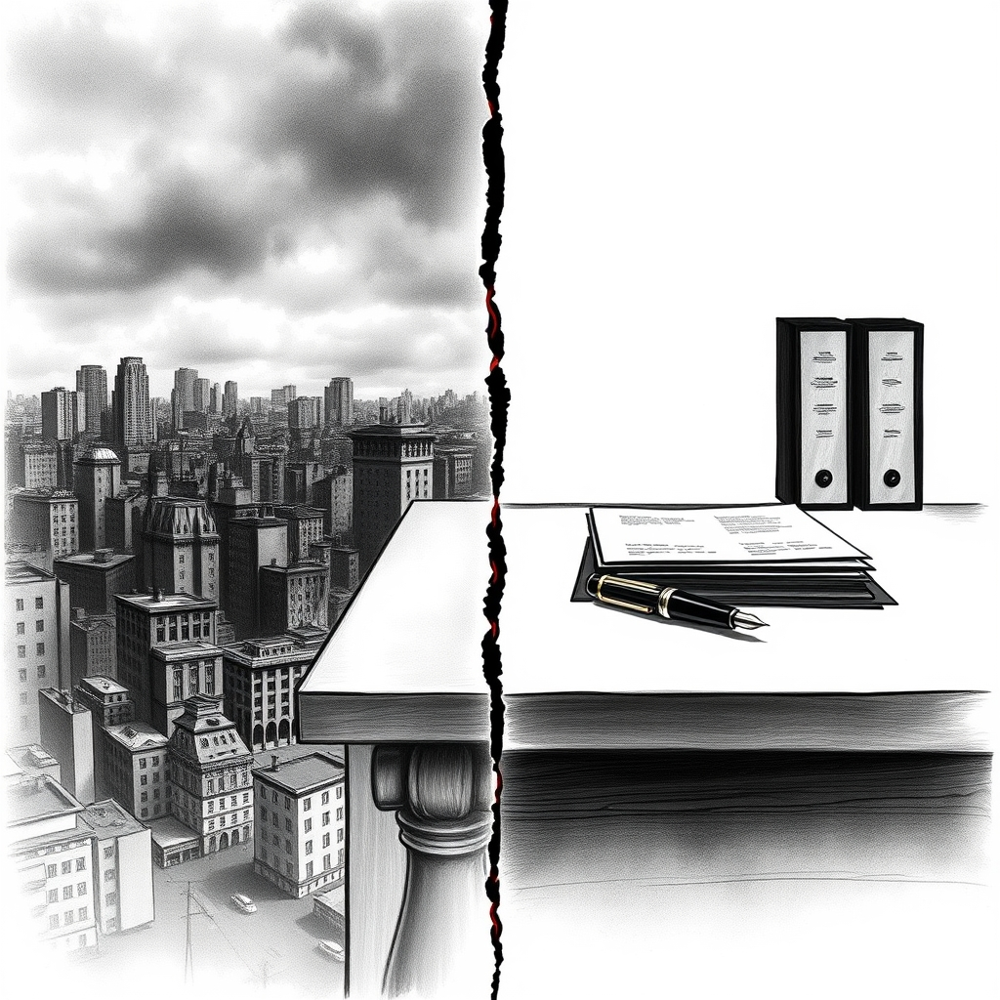

[Home](../index.md) > [Books](./index.md)  
# 🧑🏿⚖️🧑🏻💔 Separate and Unequal: The Kerner Commission and the Unraveling of American Liberalism  
  
[🛒 Separate and Unequal: The Kerner Commission and the Unraveling of American Liberalism. As an Amazon Associate I earn from qualifying purchases.](https://amzn.to/4acn8FJ)  
  
💔 The Kerner Commission's 1968 report starkly attributed urban unrest to white racism, predicting two separate and unequal societies, yet its ambitious liberal remedies were largely rejected by President Johnson, contributing to the eventual decline of 1960s liberalism and leaving a persistent legacy of racial division riven by political inaction.  
  
## 🤖 AI Summary  
  
### 🏛️ The Kerner Commission (1967-1968)  
* 🗓️ **Formation**: Established by President Lyndon B. Johnson in July 1967 via Executive Order 11365.  
* 🔎 **Mandate**: Investigate causes of over 150 race riots across the U.S. in summer 1967, especially Detroit. Provide recommendations to prevent recurrence.  
* 📜 **Core Finding**: White racism, systemic discrimination, and segregation were primary causes of urban unrest. Our nation is moving toward two societies, one black, one white—separate and unequal.  
* 👤 **Rioter Profile**: Not agitators or criminals, but often lifelong residents with jobs, slightly more education than average, responding to pervasive discrimination and segregation.  
  
### 📝 Key Recommendations  
* 💼 **Employment**: Create new jobs, job training programs.  
* 🏠 **Housing**: End de facto segregation, construct new housing, federal funding for programs.  
* 🎓 **Education**: Sharply increase efforts to eliminate de facto school segregation, financial incentives.  
* 💰 **Welfare**: Major changes to the welfare program, modify the welfare system.  
* 👮 **Policing**: Diversify local police, improve community relations, civilian complaint processes, condemn militarization.  
* 📺 **Media**: Diversification and improved coverage of Black America.  
* 📈 **Scale**: Recommendations required unprecedented levels of funding and national commitment.  
  
### 🏛️ Political & Societal Response  
* 🚫 **Johnson Administration**: Largely rejected the report's recommendations due to perceived unpopularity with conservatives, budgetary concerns, and belief it didn't credit his administration's achievements.  
* 🗣️ **Public Reaction**: Widespread media coverage. Conservatives disliked the blame on white society; some Black newspapers felt it stated the obvious, others welcomed the acknowledgment of racism. Polls showed significant white rejection of racism as a cause.  
* 📉 **Unraveling of Liberalism**: Gillon argues the report represented the last gasp of 1960s liberalism, a final strong call for federal intervention in systemic racism and poverty, before a shift towards law and order politics.  
  
## ⚖️ Evaluation  
  
* 💡 Gillon's central thesis in *Separate and Unequal* posits the Kerner Commission's report as a pivotal, yet ultimately failed, attempt by centrist liberals to address systemic racism and renew American liberalism, highlighting a moment when establishment politics confronted racial inequality directly but fell short of enacting transformative change.  
* 📚 The book effectively argues that the rejection of the Kerner Report's ambitious recommendations by President Johnson contributed to the unraveling of American liberalism, shifting the political discourse away from addressing root causes of inequality. This perspective is supported by historical accounts of Johnson's personal disapproval and the conservative backlash.  
* 🧐 While some contemporary scholarship might argue that the Kerner Report's influence was more sustained than initially perceived in specific policy areas (e.g., Fair Housing Act), Gillon focuses on the broader political and ideological retreat from its comprehensive vision.  
* 🤔 The book's emphasis on the unraveling aligns with analyses suggesting a hardening of racial attitudes among some white Americans following the civil rights movement and urban unrest, which created fertile ground for conservative political ascendancy.  
* ⚖️ Critics of the Kerner Report at the time, and some later historians, questioned the connection between its problem definition (white racism) and its policy recommendations, or whether commissions could truly be effective in the face of larger political landscapes. Gillon's work implicitly addresses this by showing how political will, or lack thereof, shaped the report's fate.  
* 🌍 The book underscores the report's enduring relevance, with its core warning of two societies continuing to resonate in discussions of persistent racial disparities in the 21st century.  
  
## 🔍 Topics for Further Understanding  
  
* 🏘️ **Long-term Economic Impacts of Redlining and Housing Segregation**: Deeper dive into policy mechanisms and their intergenerational wealth effects beyond the Kerner Report's scope.  
* 🚓 **Evolution of Policing and Militarization since 1968**: Tracing the trajectory of law enforcement tactics and equipment, particularly federal programs like 1033.  
* 📰 **The Role of Media in Framing Race and Protest**: Analysis of how journalistic practices, then and now, shape public perception of racial issues and contribute to or mitigate polarization.  
* 🏙️ **Intersectionality of Race and Class in Urban Development**: Examining how economic policies intertwined with racial dynamics to shape urban landscapes and opportunities.  
* 🌐 **Comparative Studies of National Responses to Racial Unrest**: How other nations have addressed similar issues of internal racial or ethnic conflict and inequality.  
  
## ❓ Frequently Asked Questions (FAQ)  
  
### 💡 Q: What is Separate and Unequal: The Kerner Commission and the Unraveling of American Liberalism about?  
✅ A: Steven M. Gillon's book, Separate and Unequal: The Kerner Commission and the Unraveling of American Liberalism, provides a historical analysis of the Kerner Commission's formation, its findings on the causes of 1967 urban riots (white racism and systemic discrimination), and the political rejection of its recommendations, arguing this contributed to the decline of American liberalism.  
  
### 💡 Q: What was the main conclusion of the Kerner Commission Report discussed in Separate and Unequal?  
✅ A: The main conclusion of the Kerner Commission Report, a central focus of Separate and Unequal, was that Our nation is moving toward two societies, one black, one white—separate and unequal, largely due to systemic white racism and pervasive discrimination in housing, employment, education, and policing.  
  
### 💡 Q: How did President Lyndon B. Johnson react to the Kerner Commission's findings in Separate and Unequal?  
✅ A: According to Separate and Unequal, President Lyndon B. Johnson largely rejected the Kerner Commission's report and its ambitious recommendations, finding them politically unpalatable with conservatives, financially unrealistic given budget constraints, and insufficient in acknowledging his administration's civil rights achievements.  
  
### 💡 Q: Why is the Kerner Report still relevant today, as explored in Separate and Unequal?  
✅ A: The Kerner Report's warning of two societies, separate and unequal remains relevant today because many of the racial and economic disparities it identified persist, making Separate and Unequal a critical examination of missed opportunities and the enduring challenges of racial inequality in America.  
  
## 📚 Book Recommendations  
  
### 📖 Similar Books  
* 🔥 The Fire Next Time by James Baldwin  
* [🧑🏿⛓️🙈 The New Jim Crow: Mass Incarceration in the Age of Colorblindness](./the-new-jim-crow-mass-incarceration-in-the-age-of-colorblindness.md) by Michelle Alexander  
* 😡 White Rage by Carol Anderson  
  
### ↔️ Contrasting Books  
* 📉 Coming Apart by Charles Murray  
* 🐘 The Conscience of a Conservative by Barry Goldwater  
  
### 🔗 Related Books  
* ☀️ The Warmth of Other Suns by Isabel Wilkerson  
* 🚫 American Apartheid by Douglas S. Massey and Nancy A. Denton  
* 💊 Dreamland: The True Tale of America's Opiate Epidemic by Sam Quinones  
  
## 🫵 What Do You Think?  
  
🤔 Could the Kerner Commission's recommendations, if fully implemented, have altered the trajectory of American race relations? Or were the forces driving the unraveling of American liberalism too powerful for any single report to overcome?