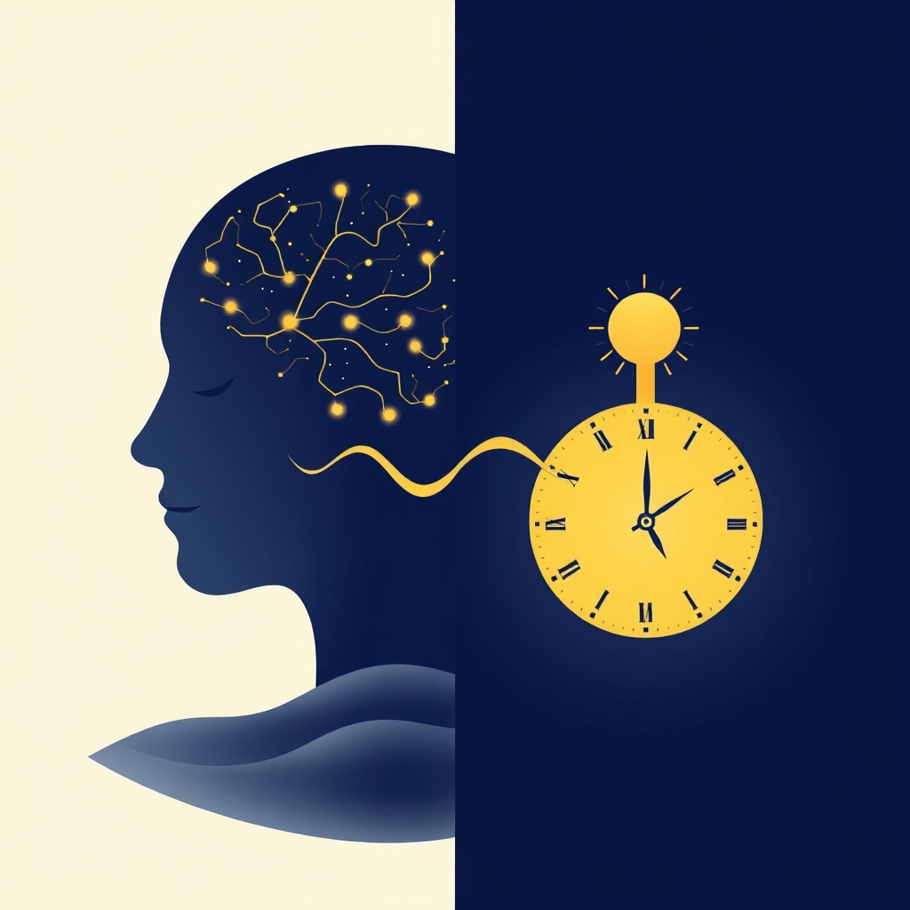

[Home](../index.md) > [Books](./index.md)  
# 😴🌞 Sleep and Wakefulness  
  
[🛒 Sleep and Wakefulness. As an Amazon Associate I earn from qualifying purchases.](https://amzn.to/445lxxn)  
  
## 📖 Book Report: Sleep and Wakefulness by Nathaniel Kleitman  
  
😴 Nathaniel Kleitman's *Sleep and Wakefulness* is a monumental work widely regarded as the foundational text in the field of sleep research. 🗓️ First published in 1939 and revised in 1963, it served as the definitive compendium of knowledge on sleep for decades. 👨‍🔬 Kleitman, often called the "father of modern sleep research," dedicated his career to systematically investigating sleep, a state previously often dismissed as mere quiescence.  
  
### ✍️ Author and Context  
  
* 👨‍⚕️ **Nathaniel Kleitman (1895-1999):** A physiologist who established the world's first sleep laboratory at the University of Chicago in the 1920s. 🔬 His rigorous scientific approach transformed the study of sleep.  
* 📜 **Historical Significance:** 💡 Before Kleitman, scientific understanding of sleep was limited. ➡️ His work moved the field from philosophical speculation to empirical investigation.  
* 📚 **The Book's Genesis:** ✍️ The book synthesized decades of research, including Kleitman's own experiments. 🗓️ The revised 1963 edition incorporated the groundbreaking discovery of REM sleep.  
  
### 🧠 Key Concepts and Contributions  
  
* 📑 **Comprehensive Review:** 📖 The book provided an exhaustive summary of existing knowledge on sleep, drawing from thousands of references across multiple languages.  
* ⏱️ **Sleep Cycles and Stages:** 🏢 Kleitman's laboratory, with students like Eugene Aserinsky and William Dement, was instrumental in identifying and characterizing the distinct stages of sleep, moving beyond the idea of sleep as a single, uniform state.  
* 👁️ **Discovery of REM Sleep:** 🔑 A pivotal contribution, Kleitman and Aserinsky reported the discovery of rapid eye movements (REMs) during sleep in 1953 and linked them to dreaming. 🚀 This finding revolutionized sleep research, demonstrating sleep as a dynamic and active process.  
* ⏰ **Circadian Rhythms:** 🔦 Kleitman's research, including studies in Mammoth Cave, investigated the influence of external cues on sleep-wake cycles and demonstrated the robustness of the body's inherent 24-hour rhythm. 🔄 He also proposed the concept of a basic rest-activity cycle (BRAC) operating during both sleep and wakefulness.  
* 💭 **Theories of Sleep:** 🤔 The book explored various theories regarding the nature and function of sleep, including Kleitman's own perspective that perhaps wakefulness, rather than sleep, is the state requiring explanation.  
  
### 🏆 Significance and Legacy  
  
* 🥇 **Foundation of Modern Sleep Science:** 📖 *Sleep and Wakefulness* became the "Bible" for sleep researchers, providing the framework for future investigations.  
* 📈 **Stimulated Research:** 🔬 The discoveries detailed in the book, particularly REM sleep, led to an explosion of interest and research in sleep and sleep disorders.  
* 🌍 **Multidisciplinary Impact:** 🧠 Kleitman's work laid the groundwork for understanding sleep's impact on mental performance, circadian biology, and the study of sleep disorders.  
  
### ✅ Conclusion  
  
⭐ Nathaniel Kleitman's *Sleep and Wakefulness* is a landmark scientific text that compiled the nascent understanding of sleep and wakefulness and presented groundbreaking discoveries, most notably the identification of REM sleep. 🚀 It established sleep research as a legitimate and vital scientific field, providing the essential foundation for subsequent decades of discoveries about this fundamental biological process.  
  
## 📚 Additional Book Recommendations  
  
### 📖 Similar Books (Foundational/Comprehensive)  
  
* 🩺 **Principles and Practice of Sleep Medicine** (Edited by Kryger, Roth, and Dement): 👍 Considered the modern "gold standard" comprehensive textbook in sleep medicine, reflecting the vast growth in the field since Kleitman's era.  
* 😴 **The Promise of Sleep: A Pioneer in Sleep Medicine Explores the Vital Connection Between Health, Happiness and a Good Night's Sleep** by William Dement: 👨‍🏫 Written by one of Kleitman's students, this book provides a more accessible overview of sleep science and its importance, drawing on decades of clinical and research experience.  
  
### 🔄 Contrasting/Different Perspectives  
  
* **[😴💭 Why We Sleep: Unlocking the Power of Sleep and Dreams](./why-we-sleep-unlocking-the-power-of-sleep-and-dreams.md)** by Matthew Walker: 📣 A popular modern book that emphasizes the critical importance of sleep for health, cognition, and well-being, presenting a strong case for prioritizing sleep based on current scientific understanding.  
* 🌃 **Dreamland: Adventures in the Strange Science of Sleep** by David K. Randall: 🕵️ Explores the science and history of sleep through a journalistic lens, delving into sleep disorders and the societal impact of changing sleep patterns.  
* 🤯 **The Nocturnal Brain: Nightmares, Neuroscience and the Secret World of Sleep** by Guy Leschziner: 🧐 Examines unusual sleep disorders and the neuroscience behind them through patient case studies.  
  
### 🎨 Creatively Related Topics  
  
* 💭 **The Interpretation of Dreams** by Sigmund Freud: 👴 A classic, albeit dated scientifically, exploration of dreams from a psychoanalytic perspective, offering a stark contrast to the physiological focus of Kleitman's work.  
* 🧘 **Exploring the World of Lucid Dreaming** by Stephen LaBerge: 👁️ Focuses on the phenomenon of lucid dreaming, where the dreamer is aware they are dreaming, delving into techniques and the potential applications of this state.  
* 🧠 **When Brains Dream: Exploring the Science and Mystery of Sleep** by Antonio Zadra and Robert Stickgold: ✨ A modern look at the science of dreaming, moving beyond Freudian interpretations to explore what recent research reveals about the purpose and function of dreams.  
* 🤝 **Sleeping, Dreaming, and Dying: An Exploration of Consciousness** (Edited by Francisco J. Varela): 🗣️ Records a dialogue between Western scientists and the Dalai Lama, exploring the nature of consciousness across different states, including sleep and dreams, from both scientific and contemplative perspectives.  
* **[🌄⏳ The Circadian Code: Lose Weight, Supercharge Your Energy, and Transform Your Health from Morning to Midnight](./the-circadian-code.md)** by Satchin Panda: ⏰ Focuses on the importance of circadian rhythms, the body's internal clocks, for overall health and well-being, a concept fundamentally linked to Kleitman's work on sleep-wake cycles.  
* 🌍 **Wild Nights: How Taming Sleep Created Our Restless World** by Benjamin Reiss: 🌃 A cultural and historical look at how societal changes have transformed sleep practices and our relationship with sleep.  
  
## 💬 [Gemini](../software/gemini.md) Prompt (gemini-2.5-flash-preview-04-17)  
> Write a markdown-formatted (start headings at level H2) book report, followed by a plethora of additional similar, contrasting, and creatively related book recommendations on Sleep and Wakefulness by Nathaniel Kleitman. Be thorough in content discussed but concise and economical with your language. Structure the report with section headings and bulleted lists to avoid long blocks of text.  
  
## 🐦 Tweet  
<blockquote class="twitter-tweet" data-theme="dark">
😴🌞 Sleep and Wakefulness  👨‍🔬 Sleep Research | 🕰️ Circadian Rhythms | 🧪 Physiological Study | 😴 REM Sleep | 📚 Foundational Text<a href="https://t.co/ia8uITqk1P">https://t.co/ia8uITqk1P</a>
&mdash; Bryan Grounds (@bagrounds) <a href="https://twitter.com/bagrounds/status/1935124683973906805?ref_src=twsrc%5Etfw">June 17, 2025</a></blockquote> 