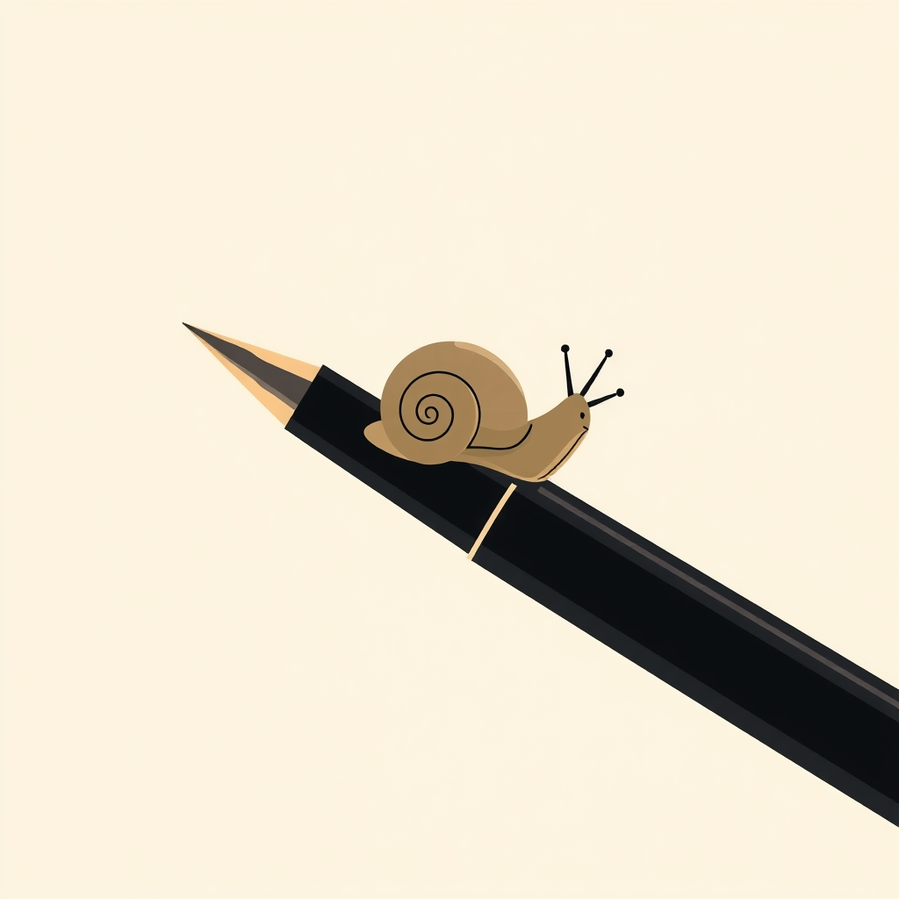

[Home](../index.md) > [Books](./index.md)  
# 🐌🎯 Slow Productivity: The Lost Art of Accomplishment Without Burnout  
  
[🛒 Slow Productivity: The Lost Art of Accomplishment Without Burnout. As an Amazon Associate I earn from qualifying purchases.](https://amzn.to/45x3xxT)  
  
## 📚 Book Report: 🐌 Slow Productivity: The Lost Art of Accomplishment Without Burnout  
  
✍️ Cal Newport's book, 🐌 Slow Productivity: The Lost Art of Accomplishment Without Burnout, published in 📅 2024, challenges the modern definition of productivity, which often equates 🏃 busyness with valuable effort and leads to widespread 😫 overwhelm and 🔥 burnout among knowledge workers. 👨‍🏫 Newport, a computer science professor and bestselling author, proposes a more 🧘 intentional and sustainable philosophy for achieving meaningful work without sacrificing well-being.  
  
### 🎯 Core Argument  
  
🗣️ Newport argues that the prevailing "pseudo-productivity" culture, characterized by endless 📝 task lists, ceaseless 🤝 meetings, and the use of visible activity as a proxy for actual productive effort, is fundamentally 💔 broken. He contends that this approach leads to 😩 fatigue and 😐 disengagement, rather than high-quality, ✨ impactful results. Drawing on historical examples of highly creative and influential thinkers like Galileo, Isaac Newton, Jane Austen, and Georgia O'Keefe, Newport suggests that past masters of accomplishment often embraced a more deliberate, unhurried approach to their work.  
  
### 🗝️ Key Principles of Slow Productivity  
  
The book outlines three core principles for adopting a "slow productivity" philosophy:  
  
* 🤏 **Do Fewer Things**: This principle emphasizes reducing obligations to a manageable level, allowing individuals to focus intensely on the most meaningful tasks and projects. It's about consciously limiting big missions and daily goals to create space for sustained progress on what truly matters, thereby combating the feeling of overwhelm.  
* 🐢 **Work at a Natural Pace**: Newport encourages individuals to allow projects to take the time they naturally require, recognizing that work involves periods of intense energy and necessary lulls. This approach contrasts with the relentless pressure to constantly accelerate, promoting a more humane and balanced work rhythm.  
* 💎 **Obsess Over Quality**: The final principle stresses the importance of prioritizing the quality of output over short-term gains or immediate opportunities. By dedicating oneself to mastering a craft and producing excellent work, individuals can achieve deep, long-term value and cultivate greater freedom in their professional lives.  
  
### 💥 Impact and Relevance  
  
🗺️ Slow Productivity offers a practical roadmap for knowledge workers to escape overload and pursue accomplishment in a more sustainable and fulfilling manner. 👨‍🏫 Newport combines cultural criticism with pragmatic advice, providing step-by-step guidance on rethinking workload management, incorporating seasonal variations in work intensity, and shifting focus toward long-term quality. The book provides a framework for individuals to embrace a more balanced and effective approach to their professional lives, aligning with natural rhythms and personal aspirations rather than external pressures for constant busyness.  
  
## 📚 Book Recommendations  
  
### ➕ Similar Books  
  
* **[🤿💼 Deep Work: Rules for Focused Success in a Distracted World](./deep-work.md) by Cal Newport**: This earlier work by Newport also advocates for focused, uninterrupted concentration on demanding tasks, directly aligning with the "slow productivity" principles of doing fewer things and obsessing over quality.  
* **[📱⬇️🧘 Digital Minimalism: Choosing a Focused Life in a Noisy World](./digital-minimalism-choosing-a-focused-life-in-a-noisy-world.md) by Cal Newport**: Another book by the same author, it encourages a philosophy of technology use where individuals consciously decide how and when to use digital tools, fostering more time and mental space for deep work and, by extension, slow productivity.  
* **[➖💯 Essentialism: The Disciplined Pursuit of Less](./essentialism-the-disciplined-pursuit-of-less.md) by Greg McKeown**: This book champions the idea of identifying and pursuing only the most essential tasks and eliminating everything else, resonating strongly with Newport's "do fewer things" principle.  
* ⏳ **Four Thousand Weeks: Time Management for Mortals by Oliver Burkeman**: Burkeman's book challenges conventional time management, urging readers to accept their limited time and make deliberate choices about how to spend it on what truly matters, echoing the sustainable and intentional aspects of slow productivity.  
  
### ➖ Contrasting Books  
  
* 🏝️ **The 4-Hour Workweek by Timothy Ferriss**: While offering strategies for efficiency and automation, Ferriss's book often promotes maximizing output and leveraging systems to achieve rapid results and geographical freedom, which can be seen as prioritizing speed and scale in a way that contrasts with the natural pace and deliberate focus of slow productivity.  
* 🐸 **Eat That Frog!: 21 Great Ways to Stop Procrastinating and Get More Done in Less Time by Brian Tracy**: This book focuses on overcoming procrastination and maximizing daily output by tackling the most important task first. Its emphasis on "getting more done" and efficiency in a short timeframe differs from Newport's call to embrace a slower, more deliberate, and less quantity-driven approach to work.  
* 🚀 **The 10X Rule: The Only Difference Between Success and Failure by Grant Cardone**: Cardone advocates for massive action and setting goals that are ten times greater than initially imagined. This philosophy of extreme effort and ambition stands in stark contrast to the measured, anti-burnout principles of slow productivity.  
  
### ✨ Creatively Related Books  
  
* **[🏍️🧘❓ Zen and the Art of Motorcycle Maintenance: An Inquiry into Values](./zen-and-the-art-of-motorcycle-maintenance-an-inquiry-into-values.md) by Robert M. Pirsig**: This philosophical novel explores the concept of "quality" and the integration of work, life, and meaning, aligning with the "obsess over quality" tenet and the pursuit of deeper fulfillment in one's craft.  
* 🔨 **The Craftsman by Richard Sennett**: Sennett's work examines the dedication, skill, and satisfaction derived from manual craftsmanship, offering insights into the intrinsic value of focused, high-quality work over time, a perspective that resonates with the slow productivity philosophy's emphasis on quality and deliberate practice.  
* **[😴📈 Rest: Why You Get More Done When You Work Less](./rest-why-you-get-more-done-when-you-work-less.md) by Alex Soojung-Kim Pang**: This book argues for the importance of deliberate rest in fostering creativity and productivity, providing a complementary perspective to slow productivity by highlighting how strategic periods of downtime are integral to high-quality output and avoiding burnout.  
* **[🛠️💖 Shop Class as Soulcraft: An Inquiry Into the Value of Work](./shop-class-as-soulcraft-an-inquiry-into-the-value-of-work.md) by Matthew B. Crawford**: Crawford's book critiques modern knowledge work and champions the tangible satisfaction and intellectual demands of manual labor, implicitly questioning the "busyness as productivity" paradigm and celebrating the deliberate, skilled work ethic central to slow productivity.  
  
## 💬 [Gemini](https://gemini.google.com) Prompt (gemini-2.5-flash)  
> Write a markdown-formatted (start headings at level H2) book report, followed by similar, contrasting, and creatively related book recommendations on Slow Productivity: The Lost Art of Accomplishment Without Burnout. Never quote or italicize titles. Be thorough but concise. Use section headings and bulleted lists to avoid long blocks of text.