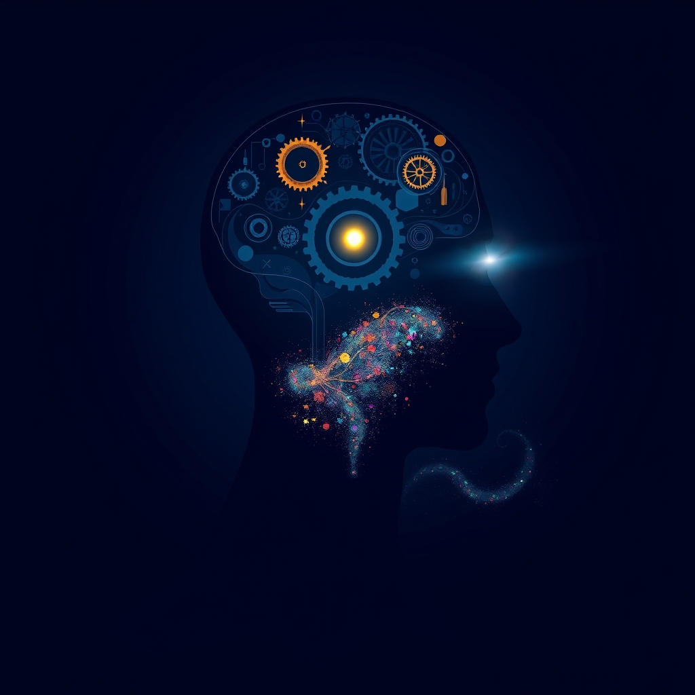

[Home](../index.md) > [Books](./index.md)  
# 🤫🧠 Subliminal: How Your Unconscious Mind Rules Your Behavior  
  
[🛒 Subliminal: How Your Unconscious Mind Rules Your Behavior. As an Amazon Associate I earn from qualifying purchases.](https://amzn.to/3GqZgCm)  
  
## 📚 Book Report: 🧠 Subliminal: 🤔 How Your Unconscious Mind Rules Your Behavior  
  
### 📌 Introduction  
  
"Subliminal: 🤔 How Your Unconscious Mind Rules Your Behavior" by Leonard Mlodinow 👨‍🔬 explores the profound influence of the unconscious mind 🤯 on nearly every aspect of our lives. 📖 The book challenges the traditional view that our conscious thoughts and intentions are the primary drivers 🚗 of our behavior, arguing instead that a vast amount of mental processing ⚙️ occurs beneath our awareness, significantly shaping our perceptions, decisions, and interactions. 🤝  
  
### 🔑 Key Concepts and Themes  
  
* 🧠 **The Dual Mind:** Mlodinow presents the idea that our minds operate on two levels: the conscious, 👀 which we are aware of, and the unconscious (or subliminal), 😴 which functions outside our direct perception. 🧠 He emphasizes that the unconscious mind handles the majority of our brain's processing, filtering and interpreting sensory information 👂 before it reaches conscious awareness.  
* 👁️‍🗨️ **Shaping Perception and Reality:** The book explains how the unconscious mind constructs our experience of reality, filling in sensory gaps and making inferences based on past experiences 🕰️ and learned patterns. 🧩 Our conscious perception is not a direct feed of raw data 📊 but a filtered and synthesized version created by the unconscious.  
* 🧑‍ تص **Influence on Behavior and Decision-Making:** A core theme is the powerful, often unseen, role of the unconscious in influencing our choices and actions. 🎯 Mlodinow provides numerous examples from scientific studies demonstrating how unconscious biases, environmental cues, and subtle factors can sway decisions, sometimes in ways contrary to our conscious intentions. ⚖️  
* 🤝 **Social Interactions and Relationships:** The unconscious mind significantly impacts how we perceive and interact with others. 🥰 Concepts like unconscious bias, nonverbal communication, and the drive for social connection 🫂 are explored as rooted in subliminal processes.  
* 💾 **Memory and Self-Perception:** The book delves into the fallibility of memory, suggesting that the unconscious mind can fill in blanks and even construct false memories. 🤥 It also touches on how the unconscious influences our self-perception and can lead us to misinterpret our own motivations and feelings. 🤔  
* 🧬 **Evolutionary Basis:** Mlodinow touches upon the evolutionary origins of unconscious processes, highlighting their role in survival and efficient processing of information. 🐒  
  
### ✍️ Author's Approach and Style  
  
Leonard Mlodinow, a theoretical physicist 👨‍🔬 and science writer, ✍️ employs an accessible and engaging style. He synthesizes complex neurological research 🧠 and psychological studies, explaining them with clarity, real-world anecdotes, 🗣️ and often humor. 😂 The book draws on a wide range of scientific evidence to support its claims, making the concepts understandable to a general audience. 🧑‍🤝‍🧑  
  
### ✅ Conclusion  
  
"Subliminal" makes a compelling case that our unconscious mind is a dominant force 🏋️ in shaping our reality, behavior, and interactions. By revealing the extent to which subliminal processes govern our lives, the book encourages readers to question their assumptions about conscious control 🎮 and consider the hidden influences that impact them daily. ⚠️ It suggests that greater awareness of these unconscious mechanisms can lead to a deeper understanding of ourselves and others. 🫂  
  
## ➕ Additional Book Recommendations  
  
**🤝 Similar Themes (Unconscious Mind, Behavioral Science, Cognitive Bias):**  
  
* **[🤔🐇🐢 Thinking, Fast and Slow](./thinking-fast-and-slow.md) by Daniel Kahneman:** Explores the two systems of thought: the fast, intuitive, and emotional (System 1) ⚡ and the slower, more deliberate, and logical (System 2). 🐢 Highly relevant to the conscious vs. unconscious processes discussed in "Subliminal."  
* **[🔮🤷🏼‍♀️🤪 Predictably Irrational: The Hidden Forces That Shape Our Decisions](./predictably-irrational.md) by Dan Ariely:** Delves into the systematic ways in which humans are irrational, often driven by unconscious biases and external factors. 🤔  
* **[👉🤏 Nudge: Improving Decisions about Health, Wealth, and Happiness](./nudge.md) by Richard Thaler and Cass Sunstein:** Focuses on how subtle changes in the way choices are presented ("nudges") can significantly influence decisions, demonstrating the power of context and the unconscious. 🎯  
* **[😇😈 Behave: The Biology of Humans at Our Best and Worst](./behave-the-biology-of-humans-at-our-best-and-worst.md) by Robert M. Sapolsky:** A comprehensive look at the biological factors, including unconscious drives and brain function, that underpin human behavior. 🧬  
* **[🧑‍🤝‍🧑🧠 The Undoing Project: A Friendship That Changed Our Minds](./the-undoing-project-a-friendship-that-changed-our-minds.md) by Michael Lewis:** Tells the story of the collaboration between Daniel Kahneman and Amos Tversky and their groundbreaking work on cognitive biases and heuristics. 🧑‍🤝‍🧑  
  
**☯️ Contrasting or Complementary Perspectives (Consciousness, Free Will, Different Psychological Frameworks):**  
  
* 💡 **Consciousness and the Brain: Deciphering How the Brain Codes Our Thoughts by Stanislas Dehaene:** Explores the neuroscience of consciousness, offering insights into the neural basis of conscious experience and contrasting it with unconscious processing. 🧠  
* 🕊️ **Free Will by Sam Harris:** Argues from a neuroscience perspective that free will is an illusion, a strong, albeit potentially controversial, counterpoint to the idea of conscious control over behavior. 🧠  
* **[🔦💡 Man's Search for Meaning](./mans-search-for-meaning.md) by Viktor Frankl:** While not directly about the unconscious, this book emphasizes the human capacity for conscious choice and finding meaning even in the most challenging circumstances, offering a perspective focused on agency. 🌟  
* 🗺️ **Maps of Meaning: The Architecture of Belief by Jordan B. Peterson:** Explores the psychological significance of ancient myths and religious stories, touching on archetypes and symbolic thinking that could be seen as related to deeper, potentially unconscious, cognitive structures. 🔱  
  
**🎨 Creatively Related Themes (Intuition, Perception, Social Influence, Memory):**  
  
* **[⚡🚫💭 Blink: The Power of Thinking Without Thinking](./blink-the-power-of-thinking-without-thinking.md) by Malcolm Gladwell:** Examines the power of rapid cognition and how our unconscious minds make split-second judgments, often accurately. ✅  
* **[🍃🧠🤝🏼 Influence: The Psychology of Persuasion](./influence.md) by Robert Cialdini:** Focuses on the psychological principles that lead people to comply with requests, many of which exploit unconscious tendencies and biases. 🤖  
* 🙈 **The Invisible Gorilla: How Our Intuitions Deceive Us by Christopher Chabris and Daniel Simons:** Uses fascinating examples and studies to illustrate how our intuitions about our own minds, including perception and memory, are often wrong. 🙉  
* 🚹 **Where Men Hide by Tobias van Schneider:** A lighthearted but insightful look at the unconscious behaviors and habits of men in their personal spaces, highlighting how environment influences behavior. 🛋️  
* 🎭 **The Person and the Situation: Perspectives of Social Psychology by Lee Ross and Richard E. Nisbett:** Explores the powerful influence of situational factors on behavior, often leading people to act in ways they wouldn't predict, complementing the idea of hidden influences. 🏞️  
* **[🚶‍♂️🧠 Moonwalking with Einstein: The Art and Science of Remembering Everything](./moonwalking-with-einstein-the-art-and-science-of-remembering-everything.md) by Joshua Foer:** While focused on memory techniques, it delves into the nature of memory and how it works, including its limitations and the ways it can be manipulated or flawed, resonating with the discussion of memory in "Subliminal." 💾  
  
## 💬 [Gemini](../software/gemini.md) Prompt (gemini-2.5-flash-preview-04-17)  
> Write a markdown-formatted (start headings at level H2) book report, followed by a plethora of additional similar, contrasting, and creatively related book recommendations on Subliminal: How Your Unconscious Mind Rules Your Behavior. Be thorough in content discussed but concise and economical with your language. Structure the report with section headings and bulleted lists to avoid long blocks of text.  
  
## 🐦 Tweet  
<blockquote class="twitter-tweet" data-theme="dark">
🤫🧠 Subliminal: How Your Unconscious Mind Rules Your Behavior  😴 Unconscious Mind | 🧠 Mental Processing | 👀 Conscious Awareness | 🚦 Decision-Making | 🫂 Social Interaction<a href="https://t.co/POTD07fjhU">https://t.co/POTD07fjhU</a>
&mdash; Bryan Grounds (@bagrounds) <a href="https://twitter.com/bagrounds/status/1941033611362447497?ref_src=twsrc%5Etfw">July 4, 2025</a></blockquote> 