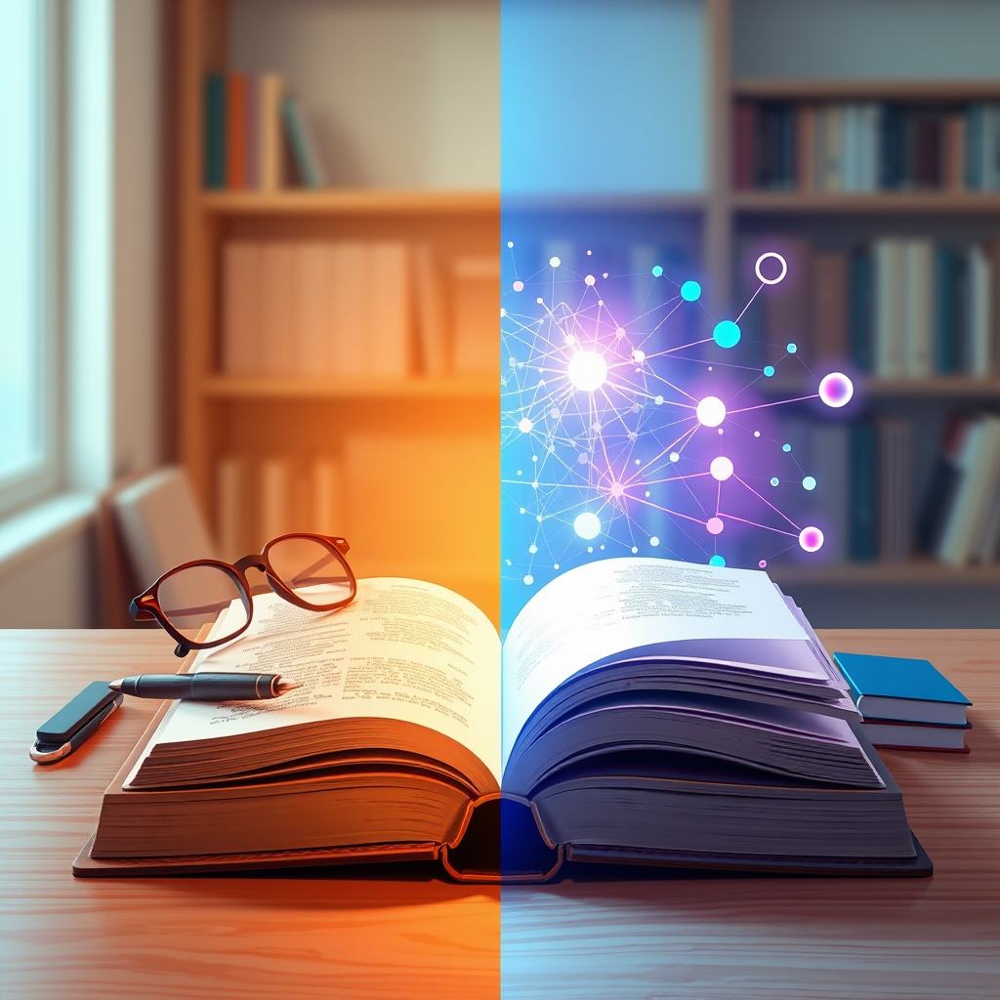

[Home](../index.md) > [Books](./index.md)  
# 🤖🧑‍🏫 Teaching with AI: A Practical Guide to a New Era of Human Learning  
  
[🛒 Teaching with AI: A Practical Guide to a New Era of Human Learning. As an Amazon Associate I earn from qualifying purchases.](https://amzn.to/45WGtcr)  
  
## 📚 Book Report: 🤖 Teaching with AI: A Practical Guide to a New Era of Human Learning  
  
**✍️ Authors:** José Antonio Bowen and C. Edward Watson  
**📅 Publication Year:** 2024  
**🏢 Publisher:** Johns Hopkins University Press  
  
📝 This report summarizes the key aspects of *Teaching with AI: A Practical Guide to a New Era of Human Learning* by José Antonio Bowen and C. Edward Watson, a ⏱️ timely guide for educators navigating the ⚙️ integration of artificial intelligence into the learning environment. 💡 The book posits that AI is 🚀 revolutionizing education, much like the 🌐 internet changed our relationship with knowledge, and provides 🛠️ practical strategies for educators to 🤝 leverage AI effectively and ethically.  
  
### 🧱 Core Structure  
  
📚 The book is organized into three main sections, progressively exploring the 🌐 multifaceted impact of AI on education:  
  
* 🧠 **Thinking with AI:** 🧠 This section lays the 🏗️ groundwork by introducing what AI is, how it functions, and its broader implications for work, literacy, and human creativity.  
* 👨‍🏫 **Teaching with AI:** 👨‍🏫 This part delves into the 🛠️ practical application of AI in pedagogical strategies, addressing topics such as ⚖️ academic integrity, ✍️ redesigning assignments and assessments, and using AI for 📊 grading and feedback.  
* 🎓 **Learning with AI:** 🎓 The final section focuses on the 🧑‍🎓 student experience, exploring how AI can be used to 🚀 enhance learning, 🤔 foster critical thinking, and 🗺️ create personalized learning pathways.  
  
### 🔑 Key Themes and Discussions  
  
* 🤖 **AI as a Transformative Force:** 💥 The authors emphasize that AI is not merely a new 🧰 tool but a force fundamentally changing how we learn, work, and think.  
* 👨‍🏫 **Practical Guidance for Educators:** 💡 The book offers concrete examples, including prompt writing, and actionable strategies for integrating AI into various aspects of teaching, from designing assignments to generating feedback.  
* 🚀 **Enhancing Learning and Creativity:** 🎨 A central argument is that AI can personalize learning experiences, ⬆️ increase student engagement, and even 🚀 enhance human creativity when used as a collaborative partner.  
* ⚠️ **Addressing Challenges and Ethical Considerations:** 🤝 Bowen and Watson tackle crucial issues such as ⚖️ academic integrity, 🧑‍🎓 cheating, 📊 algorithmic bias, and the need for 📜 ethical guidelines in AI usage in education. They stress the importance of teaching students to use AI tools critically and be aware of their limitations and potential biases.  
* 🤔 **Rethinking Assessment:** 🧑‍🏫 The book encourages educators to reconsider traditional assessment methods and focus on evaluating the process and higher-order thinking skills that AI cannot easily replicate.  
* 🗣️ **The Importance of AI Literacy:** 📚 The authors highlight AI literacy as an essential skill for both faculty and students in the new era.  
  
### 💯 Overall Impression  
  
📖 *Teaching with AI* serves as a 💡 valuable and 🛠️ practical guide for educators seeking to understand and integrate AI into their teaching practices. It provides a balanced perspective on the opportunities and challenges presented by AI in education, encouraging a forward-thinking approach to preparing students for a world where collaborating with AI will be increasingly common. While acknowledging the rapid evolution of AI tools, the book offers a solid framework for navigating this new landscape with confidence and integrity.  
  
## 📚 Additional Book Recommendations  
  
### 🤝 Similar Books (Focus on AI in Education & EdTech)  
  
* 🤖 **AI in Education: Promises and Implications for Teaching and Learning** by Wayne Holmes, Khalid Khoshafian, and Philippa Warrick: Explores the potential and implications of AI across different educational levels.  
* 💻 **EdTech Explained** by Ronald Linehan: Provides a broader look at educational technology, with sections likely relevant to the integration of new tools like AI.  
* 📊 **Learning with Big Data: The Future of Education** by Viktor Mayer-Schönberger and Kenneth Cukier: While focused on big data, this book discusses how technology and data analysis can personalize learning, a theme also present in discussions of AI in education.  
* 🏫 **The AI Classroom: Teaching & Learning in the Age of Artificial Intelligence** by Daniel Fitzpatrick and Heather Vail: Offers practical strategies for K-12 and higher education, likely with hands-on examples.  
* 🧑‍🏫 **Artificial Intelligence in Education: Contemporary Challenges and Opportunities** edited by Traian Bogdan, Maria Dascalu, and Mihai Dascalu: A collection of chapters by various authors, providing diverse perspectives on the challenges and opportunities of AI in educational settings.  
  
### 💔 Contrasting Books (Focus on Traditional Pedagogy, Critiques of EdTech, or Human-Centric Learning)  
  
* 📝 **Teaching Naked: How Moving Technology Out of Your College Classroom Will Improve Student Learning** by José Antonio Bowen: By the same co-author, this earlier work advocates for reducing technology use in the classroom to foster deeper human interaction and learning, offering a point of contrast to the integration of AI.  
* **[💀🇺🇸🏫 The Death and Life of the Great American School System: How Testing and Choice Are Undermining Education](./the-death-and-life-of-the-great-american-school-system-how-testing-and-choice-are-undermining-education.md)** by Diane Ravitch: A critical look at education reform movements, which can provide a contrasting perspective on technology-driven changes in education by emphasizing systemic and human factors.  
* 📚 **In Defense of a Liberal Education** by Fareed Zakaria: Argues for the enduring value of a liberal arts education, emphasizing critical thinking, communication, and broad knowledge, skills the authors of *Teaching with AI* also argue are enhanced by thoughtful AI integration but offering a different foundational perspective.  
* 🚧 **Blurring the Lines: The New Boundaries of Learning, Teaching, and Technology** by Curtis J. Bonk: Explores a wide range of learning technologies but might offer perspectives that highlight the potential downsides or complexities of over-reliance on technology.  
  
### 🧠 Creatively Related Books (Exploring the Future, Ethics, and Human-Technology Interaction)  
  
* 🔮 **Homo Deus: A Brief History of Tomorrow** by Yuval Noah Harari: Explores the future of humanity in the face of technological advancements, including AI, providing a broader societal context for the changes discussed in *Teaching with AI*.  
* **[🧬👥💾 Life 3.0: Being Human in the Age of Artificial Intelligence](./life-3-0.md)** by Max Tegmark: Discusses the potential impacts of advanced AI on society and humanity's future, prompting deeper thought about the long-term implications of AI in education and beyond.  
* ⚖️ **Ethics of Artificial Intelligence** edited by Matthew Kramer, Luke Nossek, Claire Craig, and Alan Winfield: A collection exploring the ethical dimensions of AI, directly relevant to the ethical considerations of using AI in educational settings.  
* **[💡🤖💰💥🏢📉 The Innovator's Dilemma: When New Technologies Cause Great Firms to Fail](./the-innovators-dilemma.md)** by Clayton M. Christensen: While a business book, its concepts about disruptive technologies can be applied metaphorically to understand how AI might disrupt traditional educational models.  
* **[🔫🦠🔩 Guns, Germs, and Steel: The Fates of Human Societies](./guns-germs-and-steel-the-fates-of-human-societies.md)** by Jared Diamond: A macro-historical perspective on societal development, which can inspire thinking about how major technological shifts like the rise of AI fit into the broader sweep of human progress and adaptation. While not directly about AI or education, its framework for understanding transformative changes can offer a creative lens.  
* 🚶‍♀️ **Mind in Motion: How Action Shapes Thought** by Barbara Tversky: Explores the relationship between our physical actions and our cognitive processes, offering a more fundamental look at how humans learn and think, which can provide a valuable counterpoint to purely technology-centric views of learning.  
  
## 💬 [Gemini](../software/gemini.md) Prompt (gemini-2.5-flash-preview-04-17)  
> Write a markdown-formatted (start headings at level H2) book report, followed by a plethora of additional similar, contrasting, and creatively related book recommendations on Teaching with AI: A Practical Guide to a New Era of Human Learning. Be thorough in content discussed but concise and economical with your language. Structure the report with section headings and bulleted lists to avoid long blocks of text.