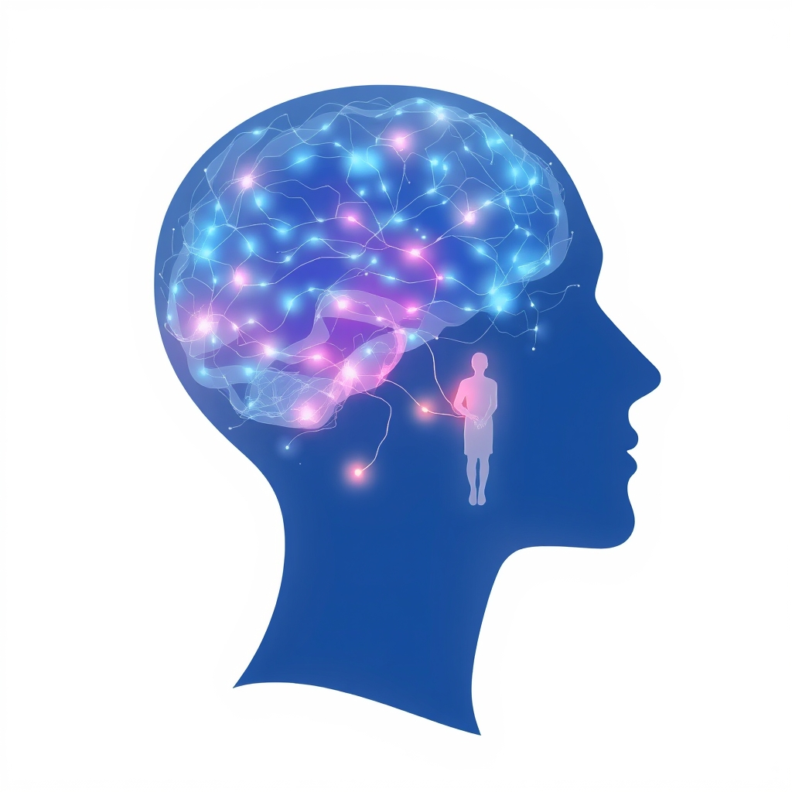

[Home](../index.md) > [Books](./index.md)  
# 🧠🧑‍🤝‍🧑 The Developing Mind: How Relationships and the Brain Interact to Shape Who We Are  
  
[🛒 The Developing Mind: How Relationships and the Brain Interact to Shape Who We Are. As an Amazon Associate I earn from qualifying purchases.](https://amzn.to/3FFXOeQ)  
  
## 🧠 Book Report: The Developing Mind (Third Edition)  
  
### 📖 Overview  
* ⭐ **Title:** The Developing Mind: How Relationships and the Brain Interact to Shape Who We Are  
* 🧑‍⚕️ **Author:** Daniel J. Siegel, M.D., a clinical professor of psychiatry at UCLA School of Medicine and a pioneer in Interpersonal Neurobiology (IPNB).  
* 🎯 **Central Thesis:** The book argues that the mind develops at the intersection of interpersonal relationships and the neurobiological processes of the brain. It moves beyond the nature vs. nurture debate to show how human connections actively shape neural connections. 🧩 Integration is presented as the key to mental health.  
  
### 💡 Key Concepts  
* 🤝 **Interpersonal Neurobiology (IPNB):** An interdisciplinary framework Siegel developed, drawing from fields like neuroscience, psychology, attachment theory, systems theory, and anthropology, to understand the mind, brain, and relationships. IPNB seeks common principles across different ways of knowing to understand human experience.  
* 🔺 **Mind, Brain, and Relationships (Triangle of Well-being):** Siegel proposes these three elements are fundamentally interconnected aspects of energy and information flow. 🧠 Relationships shape brain structure (neuroplasticity), the brain enables the mind, and the mind influences relationships. 🧠 He defines the mind as an embodied and relational process that regulates the flow of energy and information.  
* 🧩 **Integration:** The core concept representing mental health. It involves linking differentiated parts of a system (within the brain, mind, or relationships) into a functional whole. 🌱 Healthy development and well-being arise from integrated states, promoting flexibility, adaptability, coherence, energy, and stability (FACES). 🚧 Impeded integration leads to chaos or rigidity.  
* 🫂 **Attachment:** Building on attachment theory (Bowlby, Ainsworth, Main), the book details how early relationships with caregivers profoundly impact brain development, emotional regulation, memory formation, and the ability to form healthy relationships later in life. ✅ Secure attachment fosters integration.  
* 💾 **Memory:** Explores implicit and explicit memory, showing how experiences, particularly within relationships, shape memory processes and our ongoing sense of self.  
* 👁️ **Mindsight:** Siegel's term for the capacity to perceive one's own mind and the minds of others. It fosters empathy, self-awareness, and integration.  
  
### 🗣️ Core Argument  
* 🤯 The human mind is not confined to the skull but emerges from the dynamic interplay between brain functioning and interpersonal experiences.  
* ⚡ Experiences, especially relational ones, trigger neural firing patterns that physically shape the developing brain's structure and function throughout life (neuroplasticity).  
* 💖 Secure and attuned relationships facilitate brain integration, leading to emotional resilience, self-regulation, and psychological well-being. 💔 Conversely, disrupted or traumatic relational experiences can impede integration and contribute to various forms of psychopathology.  
  
### ✨ Significance  
* 🌉 This work provides a unifying framework that bridges subjective experience with objective neuroscience, offering profound insights for psychotherapy, parenting, education, and understanding human development.  
* 🌱 It emphasizes the potential for healing and growth throughout life due to the brain's ongoing plasticity in response to new experiences and relationships.  
  
### 💪 Strengths  
* 📚 Synthesizes complex information from diverse scientific fields into an accessible and coherent model.  
* 🧑‍⚕️ Offers practical implications for fostering mental health in individuals, families, and communities.  
* 💖 Highlights the crucial role of relationships in shaping who we are at a fundamental, biological level.  
  
## 📚 Book Recommendations  
  
### 🧠 Similar Reads (Interpersonal Neurobiology, Attachment, & Related Neuroscience)  
1. 👁️ **Mindsight: The New Science of Personal Transformation** by Daniel J. Siegel: Explores the concept of "mindsight" (seeing one's own mind and others') in more detail, with practical applications for personal growth.  
2. 👨‍👩‍👧‍👦 **[🤱🏼🤿🪞🌱 Parenting from the Inside Out: How a Deeper Self-Understanding Can Help You Raise Children Who Thrive](./parenting-from-the-inside-out-how-a-deeper-self-understanding-can-help-you-raise-children-who-thrive.md)** by Daniel J. Siegel & Mary Hartzell: Applies IPNB principles specifically to parenting, focusing on how parents' self-understanding impacts their relationship with their children.  
3. **[🕳️🧠👶🏽 The Whole-Brain Child: 12 Revolutionary Strategies to Nurture Your Child's Developing Mind](./the-whole-brain-child.md)** by Daniel J. Siegel & Tina Payne Bryson: Offers practical strategies for parents based on brain development, helping nurture emotional intelligence in children.  
4. 🧘 **Aware: The Science and Practice of Presence** by Daniel J. Siegel: Focuses on mindfulness practices and the Wheel of Awareness tool to cultivate integration and well-being.  
5. **[🤕🎼🧠 The Body Keeps the Score: Brain, Mind, and Body in the Healing of Trauma](./the-body-keeps-the-score-brain-mind-and-body-in-the-healing-of-trauma.md)** by Bessel van der Kolk: While focused on trauma, it deeply explores the interplay of brain, body, and relationships, complementing Siegel's work.  
6. 📚 **Affect Regulation and the Origin of the Self: The Neurobiology of Emotional Development** by Allan N. Schore: A seminal, more academic work on the neurobiology of attachment and emotional development, often cited alongside Siegel.  
7. 🗣️ **The Polyvagal Theory: Neurophysiological Foundations of Emotions, Attachment, Communication, Self-Regulation** by Stephen W. Porges: Explores the neurological underpinnings of safety, connection, and social engagement, highly relevant to IPNB.  
8. 🧠 **Buddha's Brain: The Practical Neuroscience of Happiness, Love, and Wisdom** by Rick Hanson & Richard Mendius: Blends neuroscience, positive psychology, and mindfulness, offering practical ways to reshape the brain for well-being.  
  
### ⚖️ Contrasting Perspectives (Alternative Developmental/Psychological Frameworks)  
1. ❓ **The Nurture Assumption: Why Children Turn Out the Way They Do** by Judith Rich Harris: Argues controversially that peers and genetics have significantly more influence on development than parenting, challenging the strong emphasis on parent-child relationships.  
2. 🛋️ **Beyond the Pleasure Principle** by Sigmund Freud: Represents classic psychoanalytic theory, emphasizing internal drives and psychosexual stages, a different lens than Siegel's focus on relational neurobiology.  
3. 🗣️ **Verbal Behavior** by B.F. Skinner: A foundational text of radical behaviorism, focusing purely on observable behavior and environmental contingencies, omitting the internal mental states and neurobiology central to Siegel's work.  
4. 🧠 **Cognitive Development: The Learning Brain** by Usha Goswami: Focuses primarily on the cognitive aspects of development (reasoning, problem-solving) often studied more separately from the relational and emotional emphasis in IPNB.  
5. ❗ **Critiques of Attachment Theory** (Various authors/articles): While Siegel builds heavily on attachment, some researchers critique its universality or methodology. Seeking academic critiques (e.g., exploring cultural variations or alternative models like the DMM mentioned in) provides contrast.  
6. 🧬 **Books Emphasizing Genetic Determinism:** Works focusing heavily on the genetic basis of personality and behavior (e.g., some interpretations of behavioral genetics research) offer a contrast to Siegel's emphasis on experience-dependent plasticity. (Note: Larry J. Siegel's work on latent trait theory in criminology explores related concepts of stable underlying traits, though in a different field).  
  
### 🎨 Creatively Related (Mindfulness, Social Connection, Education, Broader Themes)  
1. 🧘 **Mindfulness: An Eight-Week Plan for Finding Peace in a Frantic World** by Mark Williams & Danny Penman: A practical guide to mindfulness-based cognitive therapy (MBCT), relevant given Siegel's emphasis on mindfulness for integration.  
2. 🧠 **The Mindful Brain: Reflection and Attunement in the Cultivation of Well-Being** by Daniel J. Siegel: A direct follow-up to *The Developing Mind*, focusing specifically on the neuroscience of mindfulness.  
3. 🫂 **Social: Why Our Brains Are Wired to Connect** by Matthew D. Lieberman: Explores the neuroscience of social connection, reinforcing the "interpersonal" aspect of IPNB from a social neuroscience perspective.  
4. 💔 **Lost Connections: Uncovering the Real Causes of Depression – and the Unexpected Solutions** by Johann Hari: Argues that disconnection (from meaningful work, people, values, etc.) is a primary driver of depression and anxiety, resonating with the IPNB focus on relationships and integration for well-being.  
5. **[🧠🤔 How Emotions Are Made: The Secret Life of the Brain](./how-emotions-are-made-the-secret-life-of-the-brain.md)** by Lisa Feldman Barrett: Offers a theory of constructed emotion, providing a different but related perspective on how the brain creates emotional experiences.  
6. **[❤️🧠 Unconditional Parenting: Moving from Rewards and Punishments to Love and Reason](./unconditional-parenting-moving-from-rewards-and-punishments-to-love-and-reason.md)** by Alfie Kohn: Advocates for parenting based on children's needs and understanding, challenging traditional discipline methods, which aligns with the attuned relational approach implicit in IPNB.  
7. 🎉 **Thank & Grow Rich: A 30-Day Experiment in Shameless Gratitude and Unabashed Joy** by Pam Grout: Explores the power of mindset and gratitude, touching on themes of subjective experience shaping reality, albeit from a less neurobiological perspective.  
  
## 💬 [Gemini](../software/gemini.md) Prompt (gemini-2.5-pro-exp-03-25)  
> Write a markdown-formatted (start headings at level H2) book report, followed by a plethora of additional similar, contrasting, and creatively related book recommendations on The Developing Mind: How Relationships and the Brain Interact to Shape Who We Are. Be thorough in content discussed but concise and economical with your language. Structure the report with section headings and bulleted lists to avoid long blocks of text.