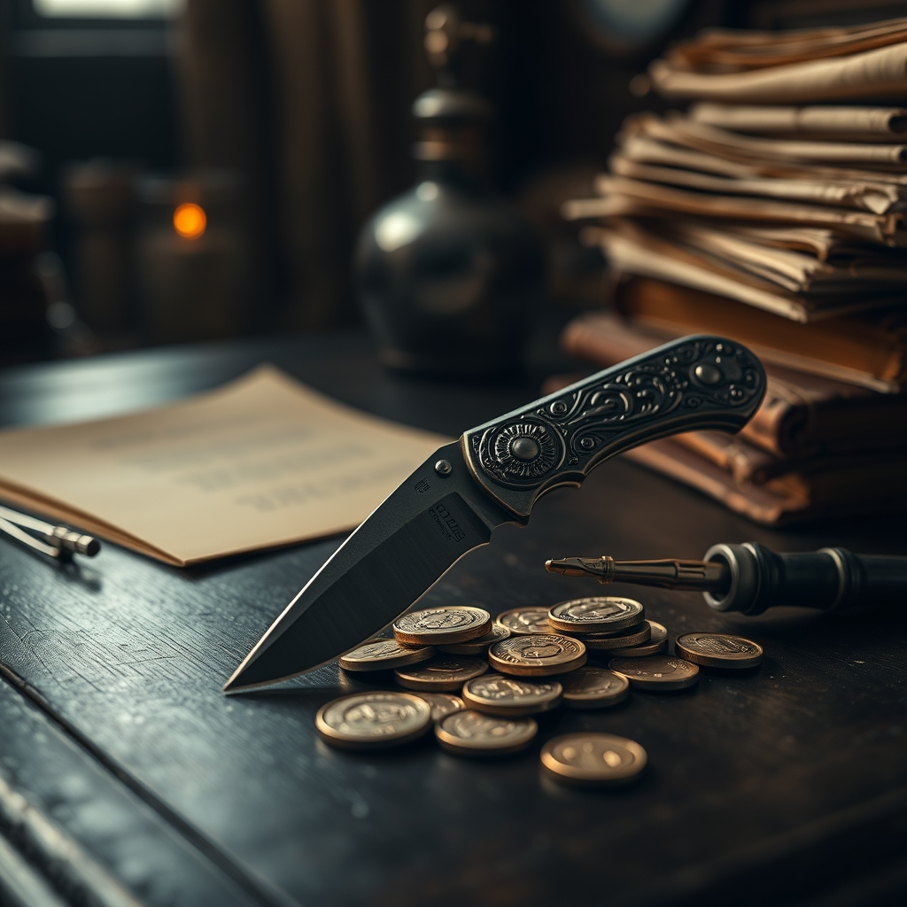

[Home](../index.md) > [Books](./index.md)  
# 🔪🗡️ The Folding Knife  
  
[🛒 The Folding Knife. As an Amazon Associate I earn from qualifying purchases.](https://amzn.to/4kAtjHf)  
  
## 🤖 AI Summary  
🪙 Sharp wit and a cynical eye for detail define this masterclass in political maneuvering and the high cost of competence.  
  
## 🗺️ Context  
  
* ✍️ Author: K.J. Parker  
* 📚 Genre: Low Fantasy / Political Thriller  
* 📖 Series: Standalone  
  
## ⭐ Assessment  
  
* ⚖️ Core Appeal: This narrative provides a deep dive into the mechanics of power and the intricate web of statecraft.  
* 🧠 Thematic Core: The story explores the concepts of inescapable fate, the weight of hubris, and the cold logic of economics.  
* 🖋️ Writing Style: Parker employs a dry, sardonic, and conversational tone that makes complex financial systems feel urgent and fascinating.  
* 🎭 Reader Experience: While the focus on logistics and numismatics might seem dense to some, it creates an unparalleled sense of grounding and intellectual immersion.  
* 🏛️ Critical Standing: It is widely hailed as a benchmark for realistic fantasy that eschews traditional magic in favor of psychological and systemic depth.  
  
## ❓ Frequently Asked Questions (FAQ)  
  
### ❓ Q: Is there magic in The Folding Knife?  
  
A: 🤓 The Folding Knife takes place in a fictional secondary world but features no overt magic or supernatural elements.  
  
### ❓ Q: What historical period inspired The Folding Knife?  
  
A: 🤓 The setting and political structures are heavily influenced by the history of the Byzantine Empire and the Venetian Republic.  
  
### ❓ Q: Can The Folding Knife be read as a standalone novel?  
  
A: 🤓 The Folding Knife is a self-contained story that concludes fully without requiring the reading of other books by the author.  
  
## 📚 Recommendations  
  
### 📖 Non-Fiction  
  
* 📜 I, Claudius by Robert Graves  
* 🏛️ The Prince by Niccolò Machiavelli  
  
### ❤️ If You Loved This  
  
* 🦅 The Traitor Baru Cormorant by Seth Dickinson  
* 🎨 The Sarantine Mosaic by Guy Gavriel Kay  
  
### ↔️ Similar But Different  
  
* 📮 Going Postal by Terry Pratchett  
* 🪙 The Dagger and the Coin by Daniel Abraham  
  
## 🫵 What Do You Think?  
  
* 🗳️ Do you believe a person’s greatest strength can also be their ultimate downfall?  
* 💰 Is it possible to rule a nation effectively while maintaining a clean moral conscience?