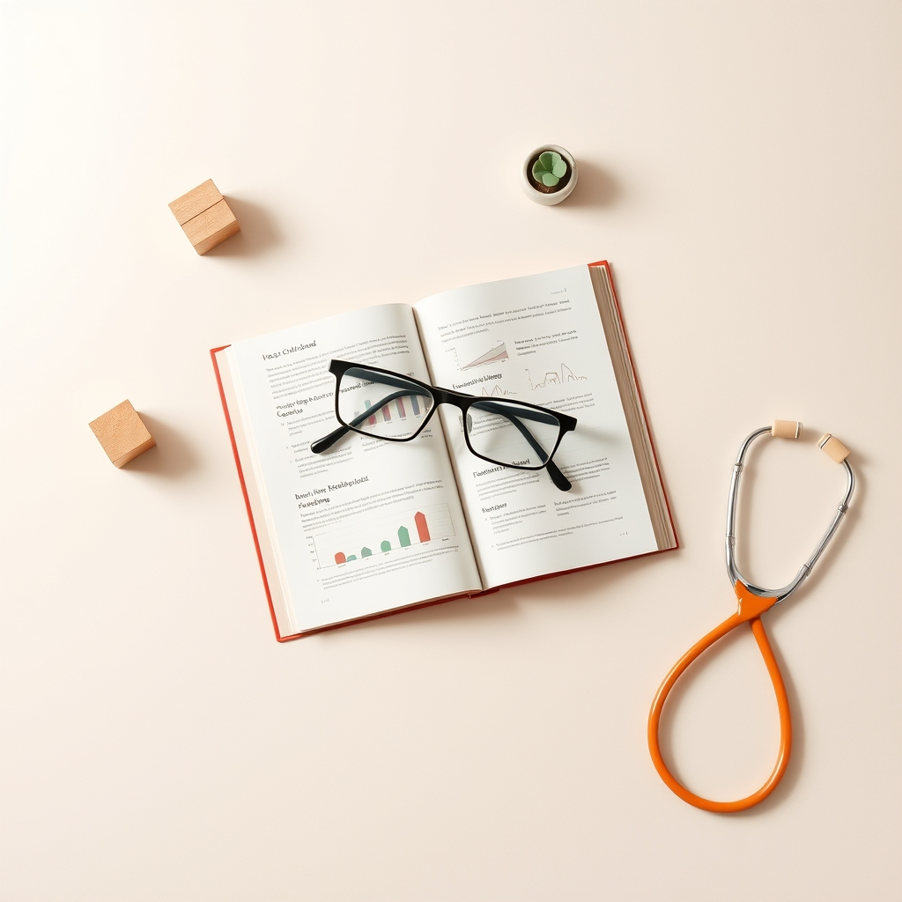

[Home](../index.md) > [Books](./index.md)  
# 🤓👩‍👦 The Informed Parent: A Science-Based Resource for Your Child's First Four Years  
  
[🛒 The Informed Parent: A Science-Based Resource for Your Child's First Four Years. As an Amazon Associate I earn from qualifying purchases.](https://amzn.to/4jrvRVZ)  
  
## 🤖 AI Summary  
📚 **Overview**  
*The Informed Parent: A Science‐Based Resource for Your Child’s First Four Years* is a guide for modern parents 👩‍🍼👨‍🍼 who value evidence 🔬 over anecdote 🗣️. 👩‍🔬👨‍🔬 Tara Haelle and Emily Willingham, both accomplished science writers ✍️ with robust credentials 🏅, sift through thousands of research studies 📈 to present balanced ⚖️, accessible summaries of the latest findings 📰 on key parenting issues—from pregnancy 🤰 through toddlerhood 👶. Their aim is not to dictate a single “right” way to parent 🚫 but to empower readers 💪 with scientific context 💡 and practical insights 👀 so they can make informed decisions ✅ for their families 👨‍👩‍👧‍👦.  
  
🗂️ **Catalogue of Topics, Methods, and Research**  
The book is organized chronologically 🗓️, covering topics such as:  
- 🤰 **Pregnancy & Birth:**  
  – 🏠 Home birth versus 🏥 hospital delivery  
  – ⏰ Labor induction and the choice between 👧 vaginal and ✂️ cesarean birth  
  – 🪡 Circumcision and ⚕️ prenatal care decisions  
- 🤱 **Postpartum Concerns:**  
  – 😔 Postpartum depression and the emotional challenges 😭 of early parenthood  
- 🍼 **Infant Feeding:**  
  – 🤱 Breastfeeding versus 🧪 formula feeding, with a discussion of benefits 👍 and limitations 👎  
- 💉 **Vaccinations:**  
  – 💪 A strong, evidence-based endorsement of immunizations along with an explanation of the research 🔬 behind vaccine schedules 🗓️  
- 😴 **Sleep and Soothing:**  
  – 🛌 Sleep training methods, 🛏️ bed-sharing, and 🧸 pacifier use  
- ⛑️ **Safety and Development:**  
  – 👶 SIDS, 🚽 potty training, 🍎 childhood obesity, and approaches to managing food sensitivities 🤧 and allergies  
  – 🧪 Debates around BPA in plastics, 🧬 GMOs versus 🥕 organic foods, and even ✋ spanking versus alternative disciplinary methods  
- 🧸 **Childcare Choices:**  
  – 🧑‍👧 Comparing daycare with alternative childcare options  
  
✍️ Throughout, the authors integrate brief “What We Did” sections that detail their own choices, providing a personal touch 🥰 alongside the research summary. They clarify study designs (e.g., randomized controlled trials 📊, meta-analyses 📈) and common pitfalls 🕳️ such as mistaking correlation for causation ⚠️ or falling prey to confirmation bias 🙈.  
  
🧐 **Critical Analysis of Information Quality**  
- 🔬 **Scientific Rigor:**  
  Haelle and Willingham ground their discussions in a review of thousands of studies 🤓, critically noting the strengths 💪 and limitations 👎 of research designs. They help readers interpret complex data 🤯 without overwhelming them, though some critics 🗣️ note that the lack of in‐text citations 📝 can sometimes obscure traceability 🔎 of specific claims.  
- 👩‍🔬 **Author Credentials:**  
  Tara Haelle’s extensive background as a science writer for outlets like NPR 📻, Forbes 📰, and Scientific American 🔬—and Emily Willingham’s Ph.D. 🎓 and experience in science journalism—lend strong credibility ✅ to the work. Their commitment to unbiased 🕊️, fact‐based discussion is reinforced by endorsements from experts such as Paul Offit and Deborah Blum.  
- 👍 **Authoritative Reviews:**  
  Reviews from Kirkus 📰, Publishers Weekly 📰, and various parent and academic communities praise the book’s clarity ✨ and its practical, non-dogmatic approach 🙏, even as some readers wish for deeper dives 🤿 into certain topics.  
- ⚖️ **Balance & Practicality:**  
  The authors avoid preaching 🙅‍♀️; instead, they lay out the evidence and then share their personal experiences 🥰, reinforcing that many “controversial” issues have modest effects in real life 😮‍💨. This balanced tone 🧘‍♀️ is a significant strength 💪 for parents seeking reassurance amid conflicting advice 🤯.  
  
✅ **Practical Takeaways**  
- 💡 **Empowered Decision Making:**  
  Readers learn to assess scientific evidence 🧐 and weigh risks and benefits ⚖️—tools that enable informed choices tailored to their unique family needs 👨‍👩‍👧‍👦.  
- 😌 **Reassurance:**  
  Many topics that often cause parental anxiety 😟 (e.g., vaccine safety 💉, sleep training debates 😴) are presented in a way that shows while studies may not be perfect 💯, the overall evidence supports common-sense decisions ✅.  
- 🧠 **Framework for Critical Thinking:**  
  The discussion on cognitive biases and study limitations equips parents with a “how-to” for interpreting future research 🔬 and media reports 📰, ensuring that the book’s benefits extend well beyond its pages.  
  
📚 **Additional Book Recommendations**  
  
1. 👍 **Best Alternate Book on the Same Topic:**  
   *[🤰👶🔬👩‍⚕️ 🧪 The Science of Mom: A Research-Based Guide to Your Baby's First Year](./the-science-of-mom.md): A Research-Based Guide to Your Baby’s First Year* by Alice Callahan  
   – Like *The Informed Parent* 📚, this book uses scientific research 🔬 to inform parenting decisions—but it focuses specifically on the first year 🗓️. Its in‐depth look 👀 at infant health 👶 and development offers a complementary 🤝, if narrower, perspective.  
  
2. 🤔 **Best Book Tangentially Related:**  
   *NurtureShock: New Thinking About Children* by Po Bronson and Ashley Merryman  
   – While not a parenting manual per se 📖, *NurtureShock* examines surprising research findings 😮 about child development and behavior 👦👧. Its insights into how children learn and adapt 🧠 provide valuable context for evidence-based parenting without being a direct “how-to” guide.  
  
3. 👎 **Best Book That Is Diametrically Opposed:**  
   *What to Expect When You're Expecting* by Heidi Murkoff  
   – This classic 🏆, anecdote-driven guide represents a more traditional, advice-laden approach 🗣️ to parenting. In contrast to the rigorous 💪, data-driven methodology of *The Informed Parent*, it relies more on established wisdom and generalized recommendations 📝 rather than current scientific research 🔬.  
  
4. 📖 **Best Fiction Book Incorporating Related Ideas:**  
   *Everything I Never Told You* by Celeste Ng  
   – Although a novel 🎭 rather than a parenting guide 📚, Ng’s work thoughtfully explores family dynamics 👨‍👩‍👧‍👦, the pressures of parental expectations 😟, and the often-unspoken consequences of decision-making in child-rearing. Its rich character studies and emotional depth 😭 offer a narrative reflection on the complexities of parenting that resonate with the themes of evidence 🔬, choice ✅, and consequence ⚠️.  
  
🎉 **Conclusion**  
*The Informed Parent* 📚 stands out as a resource that bridges hard science 🔬 with everyday practicalities. Its accessible summaries ✨, balanced discussion of research ⚖️, and personal reflections 🥰 empower parents 💪 to navigate the overwhelming landscape of parenting advice 🤯. Whether you’re looking to confirm your decisions ✅ or gain a new perspective 👀 on age-old debates 🗣️, this book 📖 and its recommended companions provide a well-rounded toolkit 🧰 for thoughtful, informed parenting 🧠.  
  
## 💬 [ChatGPT](https://chat.com) Prompt  
> Summarize the book: The Informed Parent: A Science-Based Resource for Your Child’s First Four Years by Tara Haelle. Catalogue the topics, methods, and research discussed. Provide a critical analysis of the quality of the information presented, using scientific backing, author credentials, authoritative reviews, and other markers of high quality information as justification. Emphasize practical takeaways. Make the following additional book recommendations: the best alternate book on the same topic, the best book that is tangentially related, the best book that is diametrically opposed, and the best fiction book that incorporates related ideas.  
  
## 🦋 Bluesky    
<blockquote class="bluesky-embed" data-bluesky-uri="at://did:plc:i4yli6h7x2uoj7acxunww2fc/app.bsky.feed.post/3mijjr4idtu2o" data-bluesky-cid="bafyreia2arc6dscfh5bf3nyjhfhbt7mj7hiiurasa2jicn4derxm3usfsy">
🤓👩‍👦 The Informed Parent: A Science-Based Resource for Your Child&#39;s First Four Years  
  
#AI Q: 🔬 Do you prioritize science or intuition in parenting?  
  
🔬 Evidence-Based Parenting | 🤰 Child Development | 📚 Parenting Guides | 🧠 Critical Thinking  
https://bagrounds.org/books/the-informed-parent
&mdash; <a href="https://bsky.app/profile/did:plc:i4yli6h7x2uoj7acxunww2fc?ref_src=embed">Bryan Grounds (@bagrounds.bsky.social)</a> <a href="https://bsky.app/profile/did:plc:i4yli6h7x2uoj7acxunww2fc/post/3mijjr4idtu2o?ref_src=embed">2026-04-02T15:34:03.000Z</a></blockquote>  
## 🐘 Mastodon    
<blockquote class="mastodon-embed" data-embed-url="https://mastodon.social/@bagrounds/116335840323542887/embed" style="background: #282c37; border-radius: 8px; border: 1px solid #393f4f; margin: 0; max-width: 540px; min-width: 270px; overflow: hidden; padding: 0;"> <a href="https://mastodon.social/@bagrounds/116335840323542887" target="_blank" style="align-items: center; color: #d9e1e8; display: flex; flex-direction: column; font-family: system-ui, -apple-system, BlinkMacSystemFont, 'Segoe UI', Oxygen, Ubuntu, Cantarell, 'Fira Sans', 'Droid Sans', 'Helvetica Neue', Roboto, sans-serif; font-size: 14px; justify-content: center; letter-spacing: 0.25px; line-height: 20px; padding: 24px; text-decoration: none;"> <svg xmlns="http://www.w3.org/2000/svg" xmlns:xlink="http://www.w3.org/1999/xlink" width="32" height="32" viewBox="0 0 79 75"><path d="M63 45.3v-20c0-4.1-1-7.3-3.2-9.7-2.1-2.4-5-3.7-8.5-3.7-4.1 0-7.2 1.6-9.3 4.7l-2 3.3-2-3.3c-2-3.1-5.1-4.7-9.2-4.7-3.5 0-6.4 1.3-8.6 3.7-2.1 2.4-3.1 5.6-3.1 9.7v20h8V25.9c0-4.1 1.7-6.2 5.2-6.2 3.8 0 5.8 2.5 5.8 7.4V37.7H44V27.1c0-4.9 1.9-7.4 5.8-7.4 3.5 0 5.2 2.1 5.2 6.2V45.3h8ZM74.7 16.6c.6 6 .1 15.7.1 17.3 0 .5-.1 4.8-.1 5.3-.7 11.5-8 16-15.6 17.5-.1 0-.2 0-.3 0-4.9 1-10 1.2-14.9 1.4-1.2 0-2.4 0-3.6 0-4.8 0-9.7-.6-14.4-1.7-.1 0-.1 0-.1 0s-.1 0-.1 0 0 .1 0 .1 0 0 0 0c.1 1.6.4 3.1 1 4.5.6 1.7 2.9 5.7 11.4 5.7 5 0 9.9-.6 14.8-1.7 0 0 0 0 0 0 .1 0 .1 0 .1 0 0 .1 0 .1 0 .1.1 0 .1 0 .1.1v5.6s0 .1-.1.1c0 0 0 0 0 .1-1.6 1.1-3.7 1.7-5.6 2.3-.8.3-1.6.5-2.4.7-7.5 1.7-15.4 1.3-22.7-1.2-6.8-2.4-13.8-8.2-15.5-15.2-.9-3.8-1.6-7.6-1.9-11.5-.6-5.8-.6-11.7-.8-17.5C3.9 24.5 4 20 4.9 16 6.7 7.9 14.1 2.2 22.3 1c1.4-.2 4.1-1 16.5-1h.1C51.4 0 56.7.8 58.1 1c8.4 1.2 15.5 7.5 16.6 15.6Z" fill="currentColor"/></svg> 
Post by @bagrounds@mastodon.social
 
View on Mastodon
 </a> </blockquote>   
