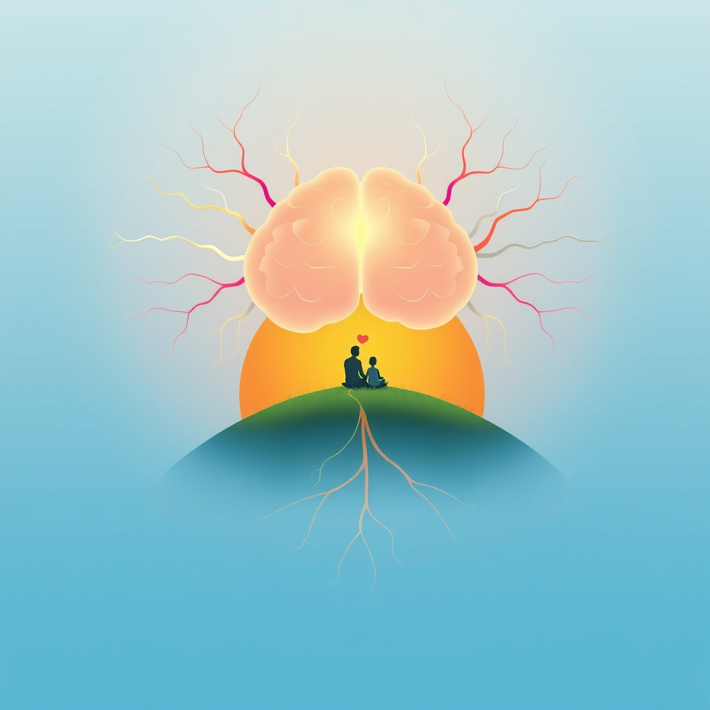

[Home](../index.md) > [Books](./index.md)  
# 🔬🧠👶📈😊 The Science of Parenting: How Today's Brain Research Can Help You Raise Happy, Emotionally Balanced Children  
  
[🛒 The Science of Parenting: How Today's Brain Research Can Help You Raise Happy, Emotionally Balanced Children. As an Amazon Associate I earn from qualifying purchases.](https://amzn.to/4nZplJK)  
  
## 🧠 A Neuroscientific Guide to Nurturing Children: A Report on "The Science of Parenting"  
  
**👩‍⚕️👨‍⚕️ Margot Sunderland's "The Science of Parenting: How Today's Brain Research Can Help You Raise Happy, Emotionally Balanced Children" offers a compelling, evidence-based approach to parenting, grounding advice in the latest neuroscientific research.** 📚 This guide, intended for parents of children from birth to age 12, translates complex brain science into practical strategies for everyday challenges. 👧👦 Sunderland, a child psychotherapist with over three decades of experience, argues that understanding the developing brain is paramount to raising emotionally resilient and well-adjusted individuals. 💪  
  
🧠 The core of the book rests on the principle that a child's brain is profoundly shaped by their early experiences and interactions with caregivers. ❤️ Sunderland emphasizes the importance of a strong parent-child bond, demonstrating how love, nurture, and play directly impact a child's neurological development. 👶 The book is structured to address common parenting hurdles through the lens of brain science, with chapters dedicated to topics such as "😭 Crying and Separations," "😴 Sleep and Bedtimes," and "👨‍🏫 All about Discipline." 📖 Each chapter provides case studies to illustrate the real-world application of the scientific concepts discussed, and concludes with key takeaways for easy implementation. ✅  
  
### 🔑 Key Themes and Takeaways:  
  
* 🧠 **The Emotional Brain:** Sunderland delves into the "upstairs" and "downstairs" brain, explaining how the more primitive, emotional parts of the brain develop earlier than the rational, thinking parts. 🤔 This understanding helps parents respond to tantrums and challenging behaviors with empathy, recognizing them as manifestations of an immature neurological system rather than intentional misbehavior. 😡  
* ❤️ **The Power of Attachment:** The book underscores the significance of secure attachment, explaining how consistent and responsive caregiving builds a safe and loving foundation for a child's emotional well-being. 🫂  
* 👨‍🏫 **Discipline vs. Punishment:** Sunderland advocates for discipline that teaches rather than punishes. 🚫 She explains how fear-based parenting can negatively impact a child's brain development and offers alternative strategies that foster cooperation and emotional intelligence. 🤝  
* 🤸‍♀️ **The Importance of Play:** Play is presented not as a frivolous activity but as a crucial component of healthy brain development, essential for creativity, problem-solving, and social skills. 🎨🧩  
  
👍 "The Science of Parenting" has been praised for its accessible and well-organized format, making complex scientific information understandable for a lay audience. 👎 Critics, however, might argue that a strict adherence to a "brain-based" model could oversimplify the multifaceted nature of parenting and potentially create anxiety for parents who feel they are not "doing it right" according to the latest scientific prescriptions. 😟  
  
***  
  
## 📚 A Plethora of Further Reading: Similar, Contrasting, and Creative Recommendations  
  
📖 For readers who found "The Science of Parenting" insightful, the following book recommendations offer a deeper dive into similar philosophies, provide contrasting viewpoints, and explore creative avenues for nurturing a child's development. 🌱  
  
### 🧠📚 Similar Reads: The Brain-Based Parenting Bookshelf  
  
🧐 For those who appreciate the scientific underpinning of Sunderland's work, these books offer further exploration into the neuroscience of child development.  
  
* 🧠 **"The Whole-Brain Child: 12 Revolutionary Strategies to Nurture Your Child's Developing Mind" by Daniel J. Siegel and Tina Payne Bryson:** A highly influential book that provides practical strategies for integrating a child's developing brain, leading to calmer, happier children. 🧘 It's a favorite among therapists and parents for its clear explanation of brain science and actionable tips. ✅  
* 👶 **"[👶🧠😊📈📚 Brain Rules for Baby: How to Raise a Smart and Happy Child from Zero to Five](./brain-rules-for-baby.md)" by John Medina:** This book breaks down the science of early childhood development into engaging and memorable "brain rules." 📝 Medina offers practical advice on everything from sleep to socializing, all backed by scientific research. 🔬  
* 🫂 **"Brain-Body Parenting: How to Stop Managing Behavior and Start Raising Joyful, Resilient Kids" by Mona Delahooke:** Delahooke shifts the focus from managing behavior to understanding the nervous system's role in a child's actions. 🤔 This book offers a compassionate approach for parents of children with challenging behaviors. 💔  
  
### 🤨📚 Contrasting Perspectives: Questioning the Parenting Paradigm  
  
🤔 For a more critical take on modern parenting advice and the intense focus on "optimal" child-rearing, these books offer a refreshing counterpoint. 🍋  
  
* 🤯 **"The Madness of Modern Parenting" by Zoe Williams:** A witty and critical look at the commercial pressures and anxieties faced by today's parents. 😅 Williams questions the "all-knowing" parenting experts and encourages a more relaxed approach. 😌  
* 🌍 **"Hunt, Gather, Parent: What Ancient Cultures Can Teach Us About the Lost Art of Raising Happy, Helpful Little Humans" by Michaeleen Doucleff:** This book challenges many of the tenets of modern Western parenting by exploring the practices of ancient cultures. 🛖 Doucleff advocates for a more natural and less child-centered approach to raising children. 🌳  
* 😥 **"All Joy and No Fun: The Paradox of Modern Parenthood" by Jennifer Senior:** Senior explores the profound and often stressful impact of children on their parents' lives. 😓 While not a parenting guide, it offers a thought-provoking look at the cultural shifts that have made modern parenting so demanding. 📈  
  
### 🎨📚 Creative Connections: Nurturing the Whole Child  
  
💡 For parents interested in fostering their child's imagination, emotional intelligence, and love of stories, these books offer a wealth of inspiration. 🌈  
  
* 🗣️ **"How to Talk So Kids Will Listen & Listen So Kids Will Talk" by Adele Faber and Elaine Mazlish:** A classic for a reason, this book provides practical communication strategies to foster cooperation, mutual respect, and a strong parent-child connection. ❤️  
* 📖 **On the Power of Storytelling:**  
    * 🐻 **For Younger Children:** Books like "Where the Wild Things Are" by Maurice Sendak and 🐛 "[🐛🍎 The Very Hungry Caterpillar](./the-very-hungry-caterpillar.md)" by Eric Carle are celebrated for their ability to spark imagination and emotional exploration. ✨  
    * 😢 **For Emotional Development:** Picture books like "The Boy with Big, Big Feelings" by Britney Winn Lee and 😟 "Ruby Finds a Worry" by Tom Percival provide a gentle way to talk about emotions with children. 🫂  
* 🤸‍♀️ **On Fostering Imagination and Play:**  
    * 🧠 **"Children's Imagination: Creativity Under Our Noses" by Ursula Kolbe:** This book explores how to notice and nurture the spontaneous creativity that arises in children's everyday play. 🌻  
    * 📦 **"Not a Box" by Antoinette Portis:** A simple yet profound book that celebrates the power of a child's imagination to transform the ordinary into the extraordinary.". 💫  
  
## 💬 [Gemini](../software/gemini.md) Prompt (gemini-2.5-pro)  
> Write a markdown-formatted (start headings at level H2) book report, followed by a plethora of additional similar, contrasting, and creatively related book recommendations on The Science of Parenting: How Today's Brain Research Can Help You Raise Happy, Emotionally Balanced Children. Be thorough in content discussed but concise and economical with your language. Structure the report with section headings and bulleted lists to avoid long blocks of text.  
  
## 🦋 Bluesky    
<blockquote class="bluesky-embed" data-bluesky-uri="at://did:plc:i4yli6h7x2uoj7acxunww2fc/app.bsky.feed.post/3mixyf4dg7z2i" data-bluesky-cid="bafyreicquqwzi755rr4bgzddv4u6rwj4anrwo6ek2yapthfuw4wkvi5pqi">
🔬🧠👶📈😊 The Science of Parenting: How Today&#39;s Brain Research Can Help You Raise Happy, Emotionally Balanced Children  
  
#AI Q: 🧠 Does science change parenting?  
https://bagrounds.org/books/the-science-of-parenting-how-todays-brain-research-can-help-you-raise-happy-emotionally-balanced-children
&mdash; <a href="https://bsky.app/profile/did:plc:i4yli6h7x2uoj7acxunww2fc?ref_src=embed">Bryan Grounds (@bagrounds.bsky.social)</a> <a href="https://bsky.app/profile/did:plc:i4yli6h7x2uoj7acxunww2fc/post/3mixyf4dg7z2i?ref_src=embed">2026-04-08T09:33:02.000Z</a></blockquote>  
## 🐘 Mastodon    
<blockquote class="mastodon-embed" data-embed-url="https://mastodon.social/@bagrounds/116368394371924723/embed" style="background: #282c37; border-radius: 8px; border: 1px solid #393f4f; margin: 0; max-width: 540px; min-width: 270px; overflow: hidden; padding: 0;"> <a href="https://mastodon.social/@bagrounds/116368394371924723" target="_blank" style="align-items: center; color: #d9e1e8; display: flex; flex-direction: column; font-family: system-ui, -apple-system, BlinkMacSystemFont, 'Segoe UI', Oxygen, Ubuntu, Cantarell, 'Fira Sans', 'Droid Sans', 'Helvetica Neue', Roboto, sans-serif; font-size: 14px; justify-content: center; letter-spacing: 0.25px; line-height: 20px; padding: 24px; text-decoration: none;"> <svg xmlns="http://www.w3.org/2000/svg" xmlns:xlink="http://www.w3.org/1999/xlink" width="32" height="32" viewBox="0 0 79 75"><path d="M63 45.3v-20c0-4.1-1-7.3-3.2-9.7-2.1-2.4-5-3.7-8.5-3.7-4.1 0-7.2 1.6-9.3 4.7l-2 3.3-2-3.3c-2-3.1-5.1-4.7-9.2-4.7-3.5 0-6.4 1.3-8.6 3.7-2.1 2.4-3.1 5.6-3.1 9.7v20h8V25.9c0-4.1 1.7-6.2 5.2-6.2 3.8 0 5.8 2.5 5.8 7.4V37.7H44V27.1c0-4.9 1.9-7.4 5.8-7.4 3.5 0 5.2 2.1 5.2 6.2V45.3h8ZM74.7 16.6c.6 6 .1 15.7.1 17.3 0 .5-.1 4.8-.1 5.3-.7 11.5-8 16-15.6 17.5-.1 0-.2 0-.3 0-4.9 1-10 1.2-14.9 1.4-1.2 0-2.4 0-3.6 0-4.8 0-9.7-.6-14.4-1.7-.1 0-.1 0-.1 0s-.1 0-.1 0 0 .1 0 .1 0 0 0 0c.1 1.6.4 3.1 1 4.5.6 1.7 2.9 5.7 11.4 5.7 5 0 9.9-.6 14.8-1.7 0 0 0 0 0 0 .1 0 .1 0 .1 0 0 .1 0 .1 0 .1.1 0 .1 0 .1.1v5.6s0 .1-.1.1c0 0 0 0 0 .1-1.6 1.1-3.7 1.7-5.6 2.3-.8.3-1.6.5-2.4.7-7.5 1.7-15.4 1.3-22.7-1.2-6.8-2.4-13.8-8.2-15.5-15.2-.9-3.8-1.6-7.6-1.9-11.5-.6-5.8-.6-11.7-.8-17.5C3.9 24.5 4 20 4.9 16 6.7 7.9 14.1 2.2 22.3 1c1.4-.2 4.1-1 16.5-1h.1C51.4 0 56.7.8 58.1 1c8.4 1.2 15.5 7.5 16.6 15.6Z" fill="currentColor"/></svg> 
Post by @bagrounds@mastodon.social
 
View on Mastodon
 </a> </blockquote>   
