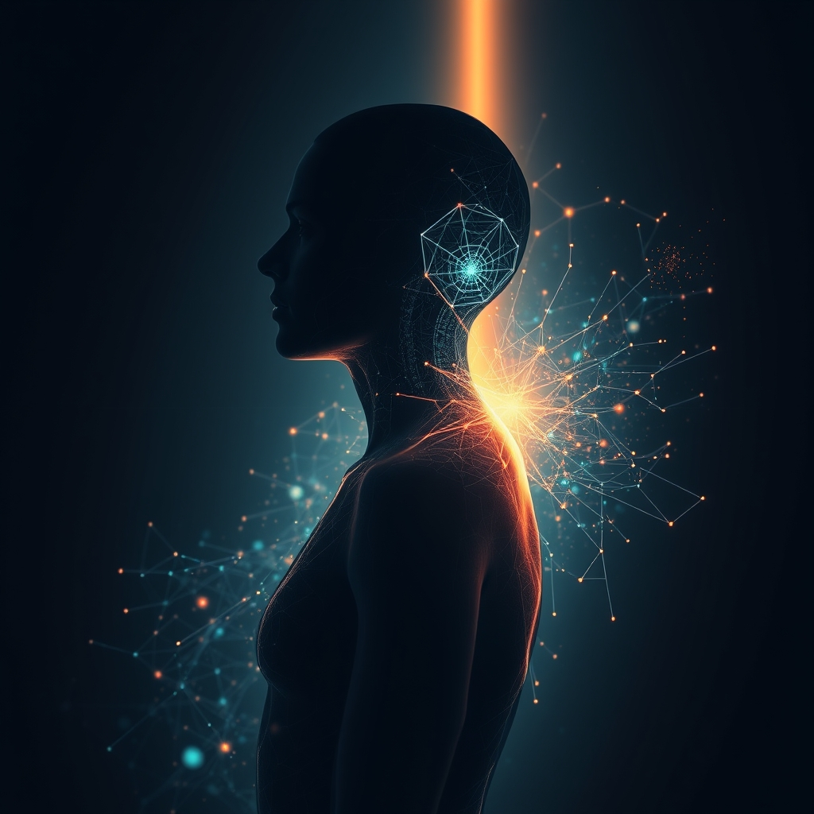

[Home](../index.md) > [Books](./index.md)  
# 🤖🧬⬆️ The Singularity Is Near: When Humans Transcend Biology  
  
[🛒 The Singularity Is Near: When Humans Transcend Biology. As an Amazon Associate I earn from qualifying purchases.](https://amzn.to/3Mwqyd5)  
  
🚀🧠✨ Ray Kurzweil's vision of a future where accelerating technological progress, particularly in artificial intelligence, genetics, and nanotechnology, leads to a singularity—a point where machine intelligence surpasses human capabilities, profoundly transforming humanity and potentially blurring the lines between biology and technology by 2045.  
  
## 🤖 AI Summary  
  
### 📈 Core Premise: Law of Accelerating Returns (LOAR)  
* 📈 Technological progress not linear, but exponential.  
* 🔗 Each technological advance accelerates the next, creating a positive feedback loop.  
* 🌍 Applies across diverse fields: computation, genetics, nanotechnology, robotics, AI.  
  
### 🌌 The Singularity Defined  
* 💭 Hypothetical future event.  
* 🤯 Technological growth accelerates beyond human control and comprehension.  
* 🧠 Driven by AI surpassing human cognitive capabilities.  
* 🌪️ Culminates in unpredictable, irreversible changes to human civilization.  
* 🗓️ Predicted for 2045, with human-level AI by 2029.  
  
### 🧬 Human Transcendence  
* 🤝 Merging of human and machine intelligence.  
* ✨ Humans transcend biological limitations: aging, disease, physical boundaries.  
* 💪 Enhanced cognitive and physical abilities via direct integration with AI/robotics.  
* 👤 Potential for posthuman or transhuman beings.  
* ☁️ Consciousness potentially uploaded to digital realms.  
  
### ⚙️ Key Technologies Driving Singularity  
* 🤖 **Artificial Intelligence (AI):** Recursive self-improvement, intelligence explosion.  
* 🔬 **Nanotechnology:** Self-replicating nanobots for internal body repair, environmental manipulation.  
* 🧬 **Genetics & Biotechnology:** Gene editing (CRISPR), synthetic biology, organ regeneration, radical life extension.  
* 🔌 **Brain-Computer Interfaces (BCIs):** Direct connection of human brains to computers.  
* **[⚛️ Quantum Computing](../topics/quantum-computing.md):** Exponential increase in computing power and efficiency.  
  
## ⚖️ Evaluation  
  
* ✅ **Prediction Accuracy:** Kurzweil claims an 86% accuracy rate for his past predictions (115 entirely correct, 12 essentially correct out of 147 predictions made since the 1990s). For example, he predicted a computer would beat the world chess champion by 2000 (Deep Blue beat Kasparov in 1997). He also anticipated computers responding to queries by searching the internet, and exoskeletal limbs for disabled individuals.  
* 🧐 **Criticism of Prediction Methodology:** Some critics argue that evaluating prediction accuracy is subjective, as Kurzweil selects which parts he finds relevant. Others, like Forbes, assessed Kurzweil's 2009 predictions and found only 25% accuracy, noting that the broader picture of society he painted was far off.  
* 🛑 **Technological Limits & Feasibility:** Critics question the unbounded exponential growth assumption, suggesting that Moore's Law specific to computing power is not a universal law of all technology and that exponential growth in many areas eventually plateaus. There are also concerns about technological limiting factors not adequately addressed.  
* 🌍 **Ethical and Societal Implications:** The book acknowledges potential pitfalls, such as the misuse of AI for control. Critics further highlight that the promised utopia and access to advanced technologies might only be for a select few, exacerbating existing inequalities if not accompanied by robust regulations and social safety nets. The difficulty in controlling or predicting superintelligent AIs is a major concern.  
* 🤔 **Philosophical Underpinnings:** Kurzweil's work has been described as a form of New Age spiritualism by some critics, who suggest his predictions are partly motivated by a fear of death, framing the singularity as a quasi-religious escape from biological limitations. The concept of merging with machines and redefining human identity raises profound philosophical questions about consciousness, individuality, and the nature of being.  
  
## 🔍 Topics for Further Understanding  
  
* 🚨 Existential Risk from Artificial General Intelligence (AGI)  
* 🎯 AI Alignment Problem and Value Loading  
* 👤 Posthumanism and Transhumanist Ethics  
* ⚡ Resource Constraints and Energy Demands of Advanced AI  
* 🌐 The Digital Divide and Equitable Access to Life-Extending Technologies  
* 🧠 Neuroethics of Brain-Computer Interfaces and Cognitive Enhancement  
* ✨ The Role of Consciousness in AI and Synthetic Minds  
  
## ❓ Frequently Asked Questions (FAQ)  
  
### 💡 Q: What is the main idea of The Singularity Is Near: When Humans Transcend Biology?  
✅ A: The Singularity Is Near proposes that exponential growth in technologies like artificial intelligence, genetics, and nanotechnology will lead to a singularity around 2045, where machine intelligence surpasses human intellect, radically transforming human life and enabling humans to transcend their biological limitations.  
  
### 💡 Q: When does Ray Kurzweil predict the Singularity will occur?  
✅ A: Ray Kurzweil predicts that artificial intelligence will reach human-level intelligence by approximately 2029, and the technological singularity, where human civilization is profoundly transformed by this superintelligence, will occur around 2045.  
  
### 💡 Q: What is the Law of Accelerating Returns discussed in The Singularity Is Near: When Humans Transcend Biology?  
✅ A: The Law of Accelerating Returns is Ray Kurzweil's principle stating that the rate of technological progress itself accelerates exponentially over time, with each advancement building on previous ones to create increasingly rapid innovation, rather than progressing linearly.  
  
### 💡 Q: What are some criticisms of the ideas presented in The Singularity Is Near: When Humans Transcend Biology?  
✅ A: Criticisms include questions about the universal applicability of exponential growth beyond specific technological domains, concerns about the feasibility and societal impact of proposed technologies like nanobots, and debates over the philosophical and ethical implications of merging with machines and achieving radical life extension, including potential dystopian outcomes and increased inequality.  
  
### 💡 Q: Does The Singularity Is Near: When Humans Transcend Biology suggest that AI will replace humans?  
✅ A: While the book posits that AI will eventually far exceed human intelligence, Kurzweil suggests a future of human-machine synthesis, where humans merge with and are enhanced by technology, expanding their capabilities and redefining what it means to be human, rather than outright replacement.  
  
## 📚 Book Recommendations  
  
### ➡️ Similar  
* [🤖⚠️📈 Superintelligence: Paths, Dangers, Strategies](./superintelligence-paths-dangers-strategies.md) by Nick Bostrom: Explores the risks and strategies for managing the creation of superintelligent AI.  
* [🧬👥💾 Life 3.0: Being Human in the Age of Artificial Intelligence](./life-3-0.md) by Max Tegmark: Discusses AI's potential futures and its implications for human existence.  
* 💡 How to Create a Mind by Ray Kurzweil: Delves into reverse-engineering the brain for AI development.  
* 🚀 The Singularity Is Nearer: When We Merge with AI by Ray Kurzweil: A more recent exploration of similar themes by the same author.  
* 🔮 Homo Deus: A History of Tomorrow by Yuval Noah Harari: Explores humanity's future goals of immortality, happiness, and divinity.  
  
### ⬅️ Contrasting  
* [📱🧠 The Shallows: What the Internet Is Doing to Our Brains](./the-shallows-what-the-internet-is-doing-to-our-brains.md) by Nicholas Carr: Examines the negative cognitive impacts of digital technology.  
* 🚫 Jaron Lanier's work (e.g., You Are Not a Gadget): Often critiques techno-utopianism and advocates for human-centric technology.  
* 🎨 Against the Machine: Why an Age of Robots and AI Still Needs Human Creativity by Michael Bhaskar: Argues for enduring human creativity in an automated world.  
  
### 🔄 Related  
* 🌃 Permutation City by Greg Egan: Science fiction exploring mind uploading, simulated realities, and immortality.  
* 🦍 Artificial Intelligence and Human Evolution: Contextualizing AI in Human History by Ameet Joshi: Explores parallels between human and machine evolution.  
* [🤖📈 The Second Machine Age: Work, Progress, and Prosperity in a Time of Brilliant Technologies](./the-second-machine-age-work-progress-and-prosperity-in-a-time-of-brilliant-technologies.md) by Erik Brynjolfsson and Andrew McAfee: Discusses the impact of digital technologies on labor, prosperity, and innovation.  
* 🔭 Physics of the Future by Michio Kaku: Provides a broad scientific outlook on future technological advancements.  
* 🌐 Nexus: A Brief History of Information Networks from the Stone Age to AI by Yuval Noah Harari: Examines how information flow has shaped civilizations and AI's transformative impact.  
  
## 🫵 What Do You Think?  
🤔 Which aspects of the singularity most excite or concern you? What ethical considerations are most critical to address as we advance towards a future of human-machine integration?  
  
## 🦋 Bluesky    
<blockquote class="bluesky-embed" data-bluesky-uri="at://did:plc:i4yli6h7x2uoj7acxunww2fc/app.bsky.feed.post/3mhb6iu55df2b" data-bluesky-cid="bafyreibbri2xpvjfufcxi47llkomkuzn2ogjhsoeekcgmrwirsbaa6kn4u">
🤖🧬⬆️ The Singularity Is Near: When Humans Transcend Biology  
  
#AI Q: 🤖 Would you choose to merge your consciousness with a machine?  
  
🤖 AI Futures | 🧬 Biotechnology | 🚀 Technological Progress | 🧠 Cognitive Science  
https://bagrounds.org/books/the-singularity-is-near-when-humans-transcend-biology
&mdash; <a href="https://bsky.app/profile/did:plc:i4yli6h7x2uoj7acxunww2fc?ref_src=embed">Bryan Grounds (@bagrounds.bsky.social)</a> <a href="https://bsky.app/profile/did:plc:i4yli6h7x2uoj7acxunww2fc/post/3mhb6iu55df2b?ref_src=embed">2026-03-17T14:26:05.672Z</a></blockquote>  
  
## 🐘 Mastodon    
<blockquote class="mastodon-embed" data-embed-url="https://mastodon.social/@bagrounds/116244975751732275/embed" style="background: #282c37; border-radius: 8px; border: 1px solid #393f4f; margin: 0; max-width: 540px; min-width: 270px; overflow: hidden; padding: 0;"> <a href="https://mastodon.social/@bagrounds/116244975751732275" target="_blank" style="align-items: center; color: #d9e1e8; display: flex; flex-direction: column; font-family: system-ui, -apple-system, BlinkMacSystemFont, 'Segoe UI', Oxygen, Ubuntu, Cantarell, 'Fira Sans', 'Droid Sans', 'Helvetica Neue', Roboto, sans-serif; font-size: 14px; justify-content: center; letter-spacing: 0.25px; line-height: 20px; padding: 24px; text-decoration: none;"> <svg xmlns="http://www.w3.org/2000/svg" xmlns:xlink="http://www.w3.org/1999/xlink" width="32" height="32" viewBox="0 0 79 75"><path d="M63 45.3v-20c0-4.1-1-7.3-3.2-9.7-2.1-2.4-5-3.7-8.5-3.7-4.1 0-7.2 1.6-9.3 4.7l-2 3.3-2-3.3c-2-3.1-5.1-4.7-9.2-4.7-3.5 0-6.4 1.3-8.6 3.7-2.1 2.4-3.1 5.6-3.1 9.7v20h8V25.9c0-4.1 1.7-6.2 5.2-6.2 3.8 0 5.8 2.5 5.8 7.4V37.7H44V27.1c0-4.9 1.9-7.4 5.8-7.4 3.5 0 5.2 2.1 5.2 6.2V45.3h8ZM74.7 16.6c.6 6 .1 15.7.1 17.3 0 .5-.1 4.8-.1 5.3-.7 11.5-8 16-15.6 17.5-.1 0-.2 0-.3 0-4.9 1-10 1.2-14.9 1.4-1.2 0-2.4 0-3.6 0-4.8 0-9.7-.6-14.4-1.7-.1 0-.1 0-.1 0s-.1 0-.1 0 0 .1 0 .1 0 0 0 0c.1 1.6.4 3.1 1 4.5.6 1.7 2.9 5.7 11.4 5.7 5 0 9.9-.6 14.8-1.7 0 0 0 0 0 0 .1 0 .1 0 .1 0 0 .1 0 .1 0 .1.1 0 .1 0 .1.1v5.6s0 .1-.1.1c0 0 0 0 0 .1-1.6 1.1-3.7 1.7-5.6 2.3-.8.3-1.6.5-2.4.7-7.5 1.7-15.4 1.3-22.7-1.2-6.8-2.4-13.8-8.2-15.5-15.2-.9-3.8-1.6-7.6-1.9-11.5-.6-5.8-.6-11.7-.8-17.5C3.9 24.5 4 20 4.9 16 6.7 7.9 14.1 2.2 22.3 1c1.4-.2 4.1-1 16.5-1h.1C51.4 0 56.7.8 58.1 1c8.4 1.2 15.5 7.5 16.6 15.6Z" fill="currentColor"/></svg> 
Post by @bagrounds@mastodon.social
 
View on Mastodon
 </a> </blockquote>   
