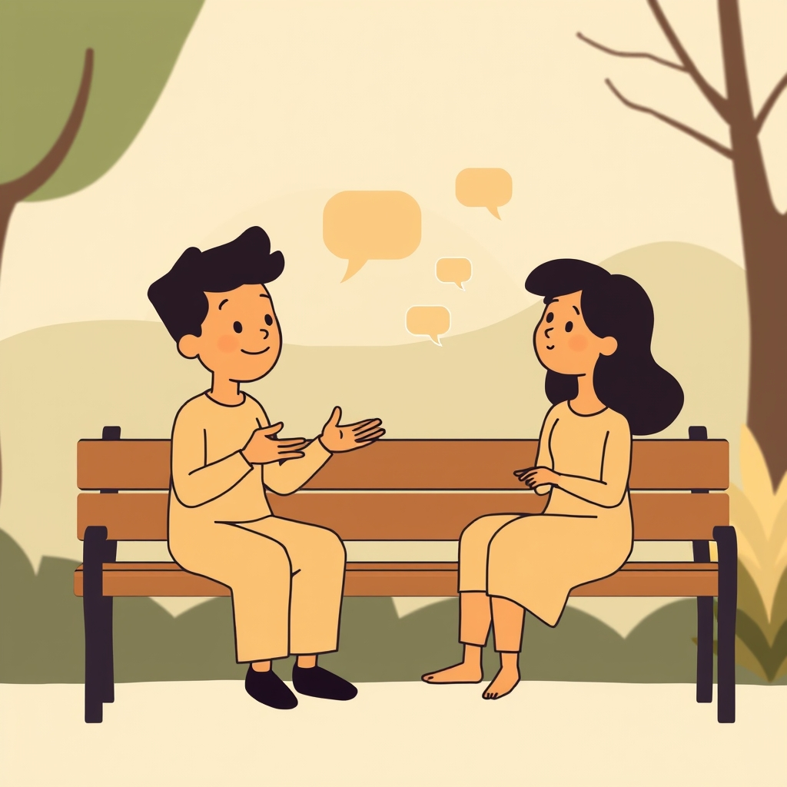

[Home](../index.md) > [Books](./index.md)  
# 🧑‍🤝‍🧑🗣️ The Social Skills Guidebook: Manage Shyness, Improve Your Conversations, and Make Friends, Without Giving Up Who You Are  
  
[🛒 The Social Skills Guidebook: Manage Shyness, Improve Your Conversations, and Make Friends, Without Giving Up Who You Are. As an Amazon Associate I earn from qualifying purchases.](https://amzn.to/4oWwhHf)  
  
💡🤝📈 A practical, authentic roadmap for developing interpersonal skills, managing social anxiety, and building genuine connections without compromising one's core identity.  
  
## 🏆 Chris MacLeod's Social Skills Strategy  
  
### 🧠 Mindset Shifts  
* 💪 Embrace Discomfort: Social discomfort signals growth, not failure.  
* 💯 Authenticity First: True connections forged by being yourself, not faking charisma.  
* 🌱 Skills are Learnable: Social competence develops through deliberate practice, like any muscle.  
* 🤔 Challenge Negative Thoughts: Recognize and logically debunk unhelpful self-talk.  
* 🚶‍♀️ Gradual Exposure: Confront social fears in manageable steps to reduce anxiety.  
  
### 🗣️ Conversation Mastery  
* 👂 Active Listening: Fully engage, make eye contact, use body language, avoid interrupting.  
* ❓ Cultivate Curiosity: Ask thoughtful, open-ended questions showing genuine interest.  
* 💬 Practice Small Talk: Use as a bridge to deeper conversations; prepare starters.  
* 😶 Navigate Silences: Don't fear them; allow natural pauses; change topic if awkward persists.  
* 🎭 Nonverbal Awareness: Understand and utilize body language, facial expressions, and tone.  
  
### 🧑‍🤝‍🧑 Friendship Building  
* 🎯 Identify Potential Connections: Seek individuals with shared interests and values.  
* 🗓️ Initiate Plans: Take initiative to invite others and solidify relationships.  
* ❤️‍🩹 Deepen Connections: Foster bonds through shared experiences and open communication.  
* 🤝 Manage Group Dynamics: Learn to participate, contribute, and adapt within groups.  
* 🚧 Set Boundaries: Healthy relationships require clear personal limits.  
  
## ⚖️ Critical Evaluation  
  
* ✅ Core Claim Validation: MacLeod's central premise that social skills are learnable and can be improved without changing one's core identity is widely supported by psychological research. Social skills training (SST) is an evidence-based intervention that teaches communication, problem-solving, and self-management, often showing significant improvements in social interaction and competence.  
* 🚶‍♀️ Gradual Exposure and Practice: The book's emphasis on gradual exposure to social situations aligns with established therapeutic approaches for managing shyness and social anxiety. Techniques like behavioral rehearsal and role-play in SST are proven to help individuals confront fears and practice new skills in safe environments.  
* 🎭 Authenticity vs. Performance: MacLeod's focus on authenticity over "faking it" resonates with expert advice suggesting genuine connection is built on self-acceptance, not a performative facade. Psychologists suggest that overly focusing on self-criticism and trying to be "perfect" hinders social progress.  
* 🗂️ Holistic Approach: The book's three-pillar structure (mental barriers, conversation, friendships) is comprehensive and mirrors the multifaceted nature of social competence addressed in professional social skills training, which often includes psychoeducation, skill-building, and cognitive-emotional components.  
* ⏳ Timeframe Expectation: MacLeod acknowledges that significant improvement takes time, often citing 1-3 years for substantial change, which is consistent with expert opinions on developing deeply ingrained behavioral patterns. This realistic expectation helps manage frustration and promotes sustained effort.  
  
**⚖️ Verdict:** The 📚 Social Skills Guidebook provides a well-founded and actionable framework for social skill improvement, strongly aligning with current psychological understanding and effective social skills training methodologies. Its core claim of achievable social growth while maintaining authenticity is robustly supported.  
  
## 🔍 Topics for Further Understanding  
  
* 🧠 Neurodiversity and Social Interaction: Tailored social strategies for individuals with autism spectrum disorder or other neurodivergent conditions.  
* 🌏 Cultural Nuances in Nonverbal Communication: Deep dive into how nonverbal cues vary significantly across different cultures.  
* 📱 Digital Communication Etiquette: Mastering social interactions in online spaces, virtual meetings, and social media.  
* ✨ The Psychology of Charisma: Exploring the specific components and learnable aspects of personal magnetism beyond basic likability.  
* 🤝 Conflict Resolution and Difficult Conversations: Advanced techniques for navigating disagreements and high-stakes interpersonal challenges.  
* 🏘️ Building Community and Network Effects: Strategies for moving beyond individual friendships to cultivate broader supportive communities and professional networks.  
  
## ❓ Frequently Asked Questions (FAQ)  
  
### 💡 Q: Is The Social Skills Guidebook good for introverts?  
✅ A: Yes, the book is highly relevant for introverts as it emphasizes improving social skills without requiring a personality change, focusing on authenticity and making connections while staying true to oneself. It distinguishes between introversion (a personality trait) and shyness (a fear of negative judgment), offering strategies to manage the latter.  
  
### 💡 Q: What are the main takeaways from The Social Skills Guidebook?  
✅ A: Key takeaways include embracing social discomfort, mastering conversation through practice and curiosity, developing empathy and active listening, overcoming shyness via gradual exposure, cultivating likability through positive traits, and taking initiative in making and deepening friendships. The book stresses that social skills are learned, and confidence grows through action and experience.  
  
### 💡 Q: How long does it take to improve social skills?  
✅ A: Significant improvement in social skills typically takes time, often ranging from one to three years of consistent effort and practice. Progress is gradual, and expecting instant change can be counterproductive.  
  
### 💡 Q: Can social skills be learned?  
✅ A: Absolutely. Social skills are not innate but are learned behaviors that can be developed and improved through deliberate practice, observation, and self-correction. Various social skills training programs and psychological theories support this view.  
  
## 📚 Book Recommendations  
  
### 👍 Similar  
* [🫂🤝🗣️ How To Win Friends And Influence People](./how-to-win-friends-and-influence-people.md) by Dale Carnegie: Classic guide on likability and influence through genuine interest.  
* ✨ The Charisma Myth: How Anyone Can Master the Art and Science of Personal Magnetism by Olivia Fox Cabane: Breaks down charisma into learnable skills.  
* 🌱 Improve Your Social Skills by Daniel Wendler: Practical, ground-up approach to social development.  
  
### 👎 Contrasting  
* 🤫 Quiet: The Power of Introverts in a World That Can't Stop Talking by Susan Cain: Explores the strengths of introversion, challenging extrovert-centric norms.  
* 🐺 The Unplugged Alpha: The No Bullshit Guide To Winning With Women & Life by Richard Cooper: Offers a different perspective on social dynamics, often focusing on masculine principles.  
  
### ➕ Related  
* 🗣️ What Every Body Is Saying: An Ex-FBI Agent's Guide to Speed-Reading People by Joe Navarro: Focuses on nonverbal communication and body language interpretation.  
* [❤️🧠📈🤔 Emotional Intelligence: Why It Can Matter More Than IQ](./emotional-intelligence.md) by Daniel Goleman: Defines and explores emotional intelligence, a foundational aspect of social skills.  
* [🧰💬 Crucial Conversations: Tools for Talking When Stakes Are High](./crucial-conversations-tools-for-talking-when-stakes-are-high.md) by Kerry Patterson: Provides strategies for navigating difficult and high-impact discussions.  
  
## 🫵 What Do You Think?  
  
🤔 Which of MacLeod's strategies resonated most with your own experiences, and what's one social skill you're actively working to improve?