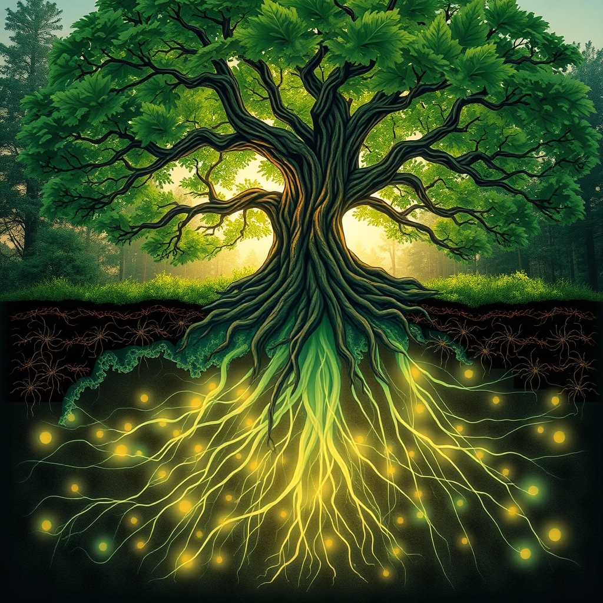

[Home](../index.md) > [Books](./index.md)  
# 🌳🎶 The Songs of Trees: Stories from Nature's Great Connectors  
  
[🛒 The Songs of Trees: Stories from Nature's Great Connectors. As an Amazon Associate I earn from qualifying purchases.](https://amzn.to/47IXCqc)  
  
🌳🎶 The Songs of Trees: Stories from Nature's Great Connectors reveals a profound truth: life is an intricate, interdependent symphony, where trees are not isolated entities but vital connectors within vast, unseen biological networks, urging us to listen and belong.  
  
## 🤖 AI Summary  
  
### 🧠 Core Philosophy  
* 🔗 **Interconnectedness:** Life as an embodied network, not isolated individuals.  
* 🤝 **Relationality:** Survival and beauty emerge from relationships and interdependence.  
* ✨ **Ecological Aesthetics:** Beauty as a relational feature of the web of life.  
* 💖 **Ethic of Belonging:** Humans are integral blood kin within nature's conversation.  
  
### 🌿 Key Concepts & Mechanisms  
* 🎶 **Metaphorical Songs:** Interactions between a tree and its environment (rustling leaves, insect buzz, sap flow).  
* 🌐 **Underground Networks:** Mycorrhizal fungi form symbiotic wood-wide webs connecting tree roots.  
* 📡 **Communication:** Trees send chemical, hormonal, and electrical signals through networks and air.  
    * 🚨 **Distress Signals:** Warning about drought, disease, insect attacks.  
    * 💧 **Resource Sharing:** Nutrients, carbon, water exchange, especially from Mother Trees to seedlings.  
    * 👨‍👩‍👧 **Kin Recognition:** Mother trees preferentially support their offspring.  
* 🌳 **Biodiversity Hubs:** Individual trees, like the Ceibo, host hundreds of other species, demonstrating dense ecological activity.  
  
### 🌱 Actionable Insights  
* 👂 **Sensory Engagement:** Actively listen, observe, feel, and smell nature to deepen connection.  
* 🔄 **Shift Perspective:** Move from anthropocentric individualism to ecocentric interdependence.  
* 💚 **Protect Habitats:** Recognize the urgent need to preserve these vital biological networks.  
  
## ⚖️ Evaluation  
* ✅ **Core Message Validity:** David George Haskell's central message of the interconnectedness of all life through trees is widely supported by ecological science.  
* 🔬 **Scientific Foundation of Tree Communication:** The concept of tree communication is underpinned by substantial scientific evidence regarding mycorrhizal networks, where fungi facilitate the exchange of water, nutrients, and signaling molecules between trees. Pioneering work by scientists like Suzanne Simard demonstrated this resource transfer and warning signal propagation.  
* ✍️ **Lyrical & Evocative Prose:** The book is critically acclaimed for its blend of scientific depth and poetic language, drawing comparisons to Rachel Carson for its ability to convey complex science with lyrical prose.  
* 🌟 **Impact on Reader Perspective:** Reviews highlight the book's ability to transport the reader to new locations and foster a profound sense of our interconnectedness with the rest of life on Earth, inspiring ecological responsibility.  
* 🧐 **Nuance in Communication:** While the scientific community generally accepts the mechanisms of resource exchange and signaling, some ecologists caution against over-interpreting communication as conscious or intentional in a human sense, emphasizing the biochemical and physiological processes involved.  
* 🌍 **Ethical Implications:** The book serves as a powerful argument against the ways in which humankind has severed the very biological networks that give us our place in the world, advocating for a shift towards an ethic of belonging.  
  
## 🔍 Topics for Further Understanding  
* 🌳 **Deep Ecology philosophy** and its implications for human-nature relationships.  
* 🩺 **Ecological Medicine** and connection-based interventions for human and planetary health.  
* 📈 **The structure and robustness** of multi-interaction ecological networks.  
* 🧪 **Specific biochemical pathways** and molecular signals involved in plant-fungi communication.  
* 🌡️ **The impact of climate change** and deforestation on underground mycorrhizal networks.  
* 🔊 **The role of soundscapes** and bioacoustics in ecosystem health assessment beyond metaphorical songs.  
  
## ❓ Frequently Asked Questions (FAQ)  
  
### 💡 Q: What is The Songs of Trees: Stories from Nature's Great Connectors about?  
✅ A: The Songs of Trees by David George Haskell explores the interconnectedness of trees with their environments and all other life forms, examining twelve individual trees across various global locations to reveal the hidden networks and communication systems that sustain life.  
  
### 💡 Q: What is the main message of The Songs of Trees: Stories from Nature's Great Connectors?  
✅ A: The main message is the profound interconnectedness of all life and ecosystems, emphasizing that trees are not isolated entities but vital hubs of activity, linked to a vast network of organisms, and that humans are an integral part of this conversation.  
  
### 💡 Q: How do trees sing or communicate according to the book?  
✅ A: David George Haskell uses songs as a metaphor for the myriad interactions between a tree and its environment, including the rustle of leaves, insect sounds, and scientific revelations of chemical, hormonal, and slow-pulsing electrical signals exchanged through underground mycorrhizal networks.  
  
### 💡 Q: Who is David George Haskell?  
✅ A: David George Haskell is a biologist and acclaimed author known for his lyrical scientific writing that explores the interconnectedness of nature. He has received awards like the John Burroughs Medal for his work.  
  
### 💡 Q: What scientific basis supports the ideas in The Songs of Trees: Stories from Nature's Great Connectors?  
✅ A: The book draws on scientific research demonstrating how trees form symbiotic relationships with mycorrhizal fungi to create extensive underground networks for sharing water, nutrients, and sending warning signals about threats like drought or pests. This research, notably by Suzanne Simard, provides a strong basis for the book's themes.  
  
## 📚 Book Recommendations  
  
### 📖 Similar Books  
* 🌲 [🌳🗣️ The Hidden Life of Trees: What They Feel, How They Communicate: Discoveries from a Secret World](./the-hidden-life-of-trees-what-they-feel-how-they-communicate-discoveries-from-a-secret-world.md) by Peter Wohlleben: Explores the intelligence, communication, and social networks of trees from a forester's perspective, emphasizing their cooperative existence.  
* 🌾 [🪢🌾 Braiding Sweetgrass: Indigenous Wisdom, Scientific Knowledge, and the Teachings of Plants](./braiding-sweetgrass.md): Indigenous Wisdom, Scientific Knowledge and the Teachings of Plants by Robin Wall Kimmerer: Combines scientific understanding with Indigenous traditions to explore humanity's relationship with the living world, emphasizing reciprocity and interconnectedness.  
* 📚 The Overstory by Richard Powers: A Pulitzer-winning novel that weaves together stories of disparate characters whose lives become connected through trees, exploring themes of ecological destruction and resilience.  
  
### ↔️ Contrasting Books  
* 🌃 A World Without Us by Alan Weisman: A thought experiment exploring what would happen if humans suddenly vanished, offering a perspective on how nature reclaims and adapts without human intervention.  
* 📉 Collapse: How Societies Choose to Fail or Succeed by Jared Diamond: Examines historical and contemporary societies that have collapsed or succeeded based on their interactions with their environment, often highlighting unsustainable human-centric approaches.  
  
### ➕ Related Books  
* 🍄 [🍄🌍🧠🔮 Entangled Life: How Fungi Make Our Worlds, Change Our Minds & Shape Our Futures](./entangled-life-how-fungi-make-our-worlds-change-our-minds-shape-our-futures.md) by Merlin Sheldrake: A deep dive into the fascinating world of fungi, the primary architects of the wood-wide web discussed in Haskell's work.  
* ⚛️ The Web of Life by Fritjof Capra: Explores a holistic, ecological worldview rooted in systems theory, emphasizing the interdependence of all phenomena in the cosmos.  
  
## 🫵 What Do You Think?  
🤔 How has observing a single tree transformed your understanding of its place in the broader ecosystem, and what song do you imagine it sings?  
  
## 🦋 Bluesky    
<blockquote class="bluesky-embed" data-bluesky-uri="at://did:plc:i4yli6h7x2uoj7acxunww2fc/app.bsky.feed.post/3mir2epxybe2s" data-bluesky-cid="bafyreicdnqjxqa6mrfgdk5cbete57wnsvuy7mm3sxo2yotqeepsr7qe3ae">
🌳🎶 The Songs of Trees: Stories from Nature&#39;s Great Connectors  
  
#AI Q: 🌳 Do trees talk to you in woods?  
  
🌳 Biological Networks | 🍄 Mycorrhizal Fungi | 🌿 Ecological Interdependence | 💚 Environmental Ethics  
https://bagrounds.org/books/the-songs-of-trees-stories-from-natures-great-connectors
&mdash; <a href="https://bsky.app/profile/did:plc:i4yli6h7x2uoj7acxunww2fc?ref_src=embed">Bryan Grounds (@bagrounds.bsky.social)</a> <a href="https://bsky.app/profile/did:plc:i4yli6h7x2uoj7acxunww2fc/post/3mir2epxybe2s?ref_src=embed">2026-04-05T15:19:59.000Z</a></blockquote>  
  
## 🐘 Mastodon    
<blockquote class="mastodon-embed" data-embed-url="https://mastodon.social/@bagrounds/116352771574140218/embed" style="background: #282c37; border-radius: 8px; border: 1px solid #393f4f; margin: 0; max-width: 540px; min-width: 270px; overflow: hidden; padding: 0;"> <a href="https://mastodon.social/@bagrounds/116352771574140218" target="_blank" style="align-items: center; color: #d9e1e8; display: flex; flex-direction: column; font-family: system-ui, -apple-system, BlinkMacSystemFont, 'Segoe UI', Oxygen, Ubuntu, Cantarell, 'Fira Sans', 'Droid Sans', 'Helvetica Neue', Roboto, sans-serif; font-size: 14px; justify-content: center; letter-spacing: 0.25px; line-height: 20px; padding: 24px; text-decoration: none;"> <svg xmlns="http://www.w3.org/2000/svg" xmlns:xlink="http://www.w3.org/1999/xlink" width="32" height="32" viewBox="0 0 79 75"><path d="M63 45.3v-20c0-4.1-1-7.3-3.2-9.7-2.1-2.4-5-3.7-8.5-3.7-4.1 0-7.2 1.6-9.3 4.7l-2 3.3-2-3.3c-2-3.1-5.1-4.7-9.2-4.7-3.5 0-6.4 1.3-8.6 3.7-2.1 2.4-3.1 5.6-3.1 9.7v20h8V25.9c0-4.1 1.7-6.2 5.2-6.2 3.8 0 5.8 2.5 5.8 7.4V37.7H44V27.1c0-4.9 1.9-7.4 5.8-7.4 3.5 0 5.2 2.1 5.2 6.2V45.3h8ZM74.7 16.6c.6 6 .1 15.7.1 17.3 0 .5-.1 4.8-.1 5.3-.7 11.5-8 16-15.6 17.5-.1 0-.2 0-.3 0-4.9 1-10 1.2-14.9 1.4-1.2 0-2.4 0-3.6 0-4.8 0-9.7-.6-14.4-1.7-.1 0-.1 0-.1 0s-.1 0-.1 0 0 .1 0 .1 0 0 0 0c.1 1.6.4 3.1 1 4.5.6 1.7 2.9 5.7 11.4 5.7 5 0 9.9-.6 14.8-1.7 0 0 0 0 0 0 .1 0 .1 0 .1 0 0 .1 0 .1 0 .1.1 0 .1 0 .1.1v5.6s0 .1-.1.1c0 0 0 0 0 .1-1.6 1.1-3.7 1.7-5.6 2.3-.8.3-1.6.5-2.4.7-7.5 1.7-15.4 1.3-22.7-1.2-6.8-2.4-13.8-8.2-15.5-15.2-.9-3.8-1.6-7.6-1.9-11.5-.6-5.8-.6-11.7-.8-17.5C3.9 24.5 4 20 4.9 16 6.7 7.9 14.1 2.2 22.3 1c1.4-.2 4.1-1 16.5-1h.1C51.4 0 56.7.8 58.1 1c8.4 1.2 15.5 7.5 16.6 15.6Z" fill="currentColor"/></svg> 
Post by @bagrounds@mastodon.social
 
View on Mastodon
 </a> </blockquote>   
