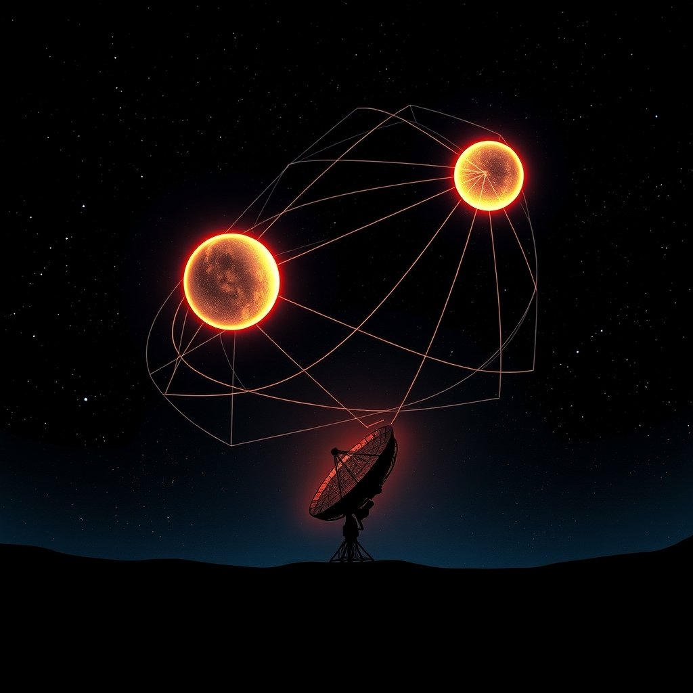

[Home](../index.md) > [Books](./index.md)  
# 🌌3️⃣⚛️ The Three-Body Problem  
  
[🛒 3️⃣⚛️ The Three-Body Problem. As an Amazon Associate I earn from qualifying purchases.](https://amzn.to/4kmbewG)  
  
## 🤖 AI Summary  
🌌 This grand-scale hard science fiction masterpiece blends theoretical physics with historical trauma to examine humanity’s fragility and the cold indifference of the cosmos.  
  
## 🗺️ Context  
  
* ✍️ Author: Liu Cixin  
* 📚 Genre: Hard Science Fiction  
* 📖 Series: Remembrance of Earth’s Past  
  
## ⭐ Assessment  
  
* 🧠 Core Appeal: Intellectual depth and massive conceptual scale.  
* ⚛️ Thematic Core: The intersection of scientific discovery and sociopolitical upheaval.  
* 🖋️ Writing Style: Highly technical and concept-driven with a focus on big ideas over character growth.  
* 🪐 Reader Experience: While some readers find the characterizations somewhat utilitarian, the sheer brilliance of the scientific mysteries creates an addictive sense of wonder.  
* 🏆 Critical Standing: Widely celebrated as a modern classic and the first Asian novel to win the Hugo Award.  
  
## ❓ Frequently Asked Questions (FAQ)  
  
### ❓ Q: What is the main theme of The Three-Body Problem?  
  
A: 🤓 The story explores how scientific progress and historical trauma influence the survival of civilizations.  
  
### ❓ Q: Is The Three-Body Problem part of a series?  
  
A: 🤓 The Three-Body Problem is the first entry in a trilogy titled Remembrance of Earth’s Past.  
  
### ❓ Q: Is The Three-Body Problem difficult to read?  
  
A: 🤓 The narrative contains heavy scientific theory but presents it through an engaging mystery format.  
  
## 📚 Recommendations  
  
### 📖 Non-Fiction  
  
* 🔭 Death by Black Hole by Neil deGrasse Tyson  
* 🌿 Silent Spring by Rachel Carson  
  
### ❤️ If You Loved This  
  
* 🛸 Contact by Carl Sagan  
* [🕷️⏳ Children of Time](./children-of-time.md) by Adrian Tchaikovsky  
  
### ↔️ Similar But Different  
  
* [🏜️🐛 Dune](./dune.md) by Frank Herbert  
* [🏗️🧱🌍 Foundation](./Foundation.md) by Isaac Asimov  
  
## 🫵 What Do You Think?  
  
* 🚀 Does the coldness of the universe make you feel curious or fearful?  
* 🧪 Do you prefer science fiction that prioritizes technical accuracy or emotional character arcs?