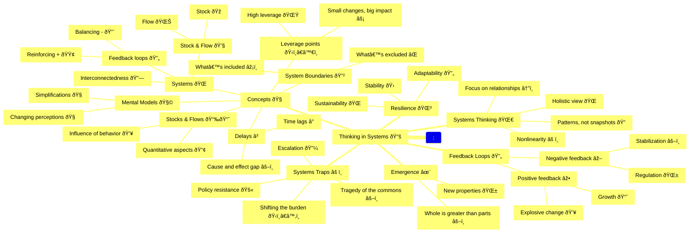

[Home](../index.md) > [Books](./index.md)  
# Thinking in Systems  
## 🤖 AI Summaries  
### 💬 [Gemini](https://gemini.google.com) Prompt  
> Summarize the book: Thinking in Systems: A Primer. Start the summary with a TLDR - a single statement that conveys a maximum of the useful information provided in the book. Next, explain how this book may offer a new or surprising perspective. Follow this with a deep dive. Catalogue the topics, methods, and research discussed. Be sure to highlight any significant theories, theses, or mental models proposed. Provide a critical analysis of the quality of the information presented, using scientific backing, author credentials, authoritative reviews, and other markers of high quality information as justification. Emphasize practical takeaways. Make the following additional book recommendations: the best alternate book on the same topic; the best book that is tangentially related; the best book that is diametrically opposed; the best fiction book that incorporates related ideas; and a book that is more general, more specific, or more rigorous than this book. Format your response as markdown, starting at heading level H4, with inline links, for easy copy paste. Use meaningful emojis liberally to enhance readability, especially in headings and as bullets for lists. Do not include broken links or links to commercial sites (e.g. Amazon).  
  
#### **TLDR**  
Systems thinking provides a framework for understanding complex, interconnected problems by focusing on relationships, feedback loops, and emergent behaviors, rather than isolated events.  
  
#### **A New Perspective ðŸ§**  
"Thinking in Systems: A Primer" by Donella Meadows offers a surprising perspective by shifting the focus from linear cause-and-effect thinking to a holistic, dynamic view. It reveals how seemingly simple systems can produce complex and often counterintuitive outcomes. This book challenges the reader to move beyond blaming individuals or isolated incidents and instead examine the underlying structures that drive behavior. This perspective is refreshing because it allows for a more nuanced understanding of problems, fostering more effective and sustainable solutions.  
  
#### **Deep Dive 🧠**  
**Topics, Methods, and Research:**  
  
* **Systems Fundamentals:**  
    * Definition of a system: Interconnected elements organized to achieve a purpose. 🔗  
    * Elements of a system: Stocks, flows, and feedback loops. 🔄  
    * Types of feedback loops: Reinforcing (positive) and balancing (negative). âš–ï¸  
    * Delays: The time lag between action and effect. â³  
    * Boundaries: What is included and excluded from the system. ðŸ—ºï¸  
* **System Behaviors:**  
    * Growth and decay: Exponential and linear patterns. 📈📉  
    * Oscillation: Fluctuations around a set point. ã€°ï¸  
    * Limits to growth: The constraints on exponential growth. 🛑  
    * Resilience: The ability of a system to withstand shocks. 💪  
    * Self-organization: The emergence of complex patterns from simple interactions. 🧩  
* **Mental Models and Leverage Points:**  
    * Mental models: Our internal representations of the world. 💭  
    * Leverage points: Places within a system where small changes can lead to significant outcomes. 🔑  
    * Hierarchy of leverage points: From parameters to mindsets. 🪜  
* **Practical Applications:**  
    * Environmental issues, economic systems, and social problems. ðŸŒðŸ’°ðŸ¤  
    * Policy design and implementation. 📠 
    * Personal and organizational change. 👤🢠 
  
**Significant Theories, Theses, and Mental Models:**  
* **Stocks and Flows:** Stocks are accumulations within a system, and flows are the rates of change in those stocks. This fundamental concept allows for a clear visualization of system dynamics. 💧  
* **Feedback Loops:** These loops, whether reinforcing or balancing, determine the stability and behavior of a system. Understanding them is crucial for predicting and managing system outcomes. 🔄  
* **Leverage Points:** Meadows identifies a hierarchy of leverage points, with changing mindsets and paradigms at the top, as the most effective ways to influence systems. 🎯  
* **Limits to Growth:** This theory highlights the constraints on exponential growth imposed by finite resources and environmental limits. 🚫  
  
**Critical Analysis:**  
Donella Meadows was an environmental scientist and systems thinker with a strong reputation. Her work is grounded in rigorous research and modeling. 🔬 The book is well-regarded for its clear and accessible explanation of complex concepts. Reviews consistently praise its ability to demystify systems thinking. The concepts are scientifically sound, drawing on principles from ecology, cybernetics, and engineering. 📚 The book's practical examples and exercises enhance its educational value. The book is widely used in academic settings and professional training.  
  
**Practical Takeaways:**  
* Develop a systems perspective to understand complex problems. 🌠 
* Identify feedback loops and leverage points in your own life and work. 🔎  
* Recognize the importance of delays and unintended consequences. â³  
* Be aware of your own mental models and how they shape your perception of reality. 🧠  
* Focus on changing system structures rather than just symptoms. ðŸ› ï¸  
  
#### **Book Recommendations 📚**  
* **Best Alternate Book on the Same Topic:** "[The Fifth Discipline](./the-fifth-discipline.md): The Art & Practice of The Learning Organization" by Peter Senge. This book also explores systems thinking within organizations, providing a more in-depth look at organizational learning. 🢠 
* **Best Tangentially Related Book:** "[Thinking, Fast and Slow](./thinking-fast-and-slow.md)" by Daniel Kahneman. This book explores the cognitive biases and mental shortcuts that influence our decision-making, which is relevant to understanding how mental models affect systems thinking. 🧠  
* **Best Diametrically Opposed Book:** "The Rational Optimist: How Prosperity Evolves" by Matt Ridley. This book argues for the benefits of free markets and technological progress, offering a more optimistic view of human systems than Meadows' cautionary approach. 📈  
* **Best Fiction Book That Incorporates Related Ideas:** "Dune" by Frank Herbert. This science fiction classic explores complex ecological and social systems, highlighting the interconnectedness of elements and the consequences of actions within those systems. ðŸœï¸  
* **More General, More Specific, or More Rigorous:**  
    * **More General:** "A Brief History of Everything" by Ken Wilber. This book takes a broad, integrative approach to understanding the evolution of the universe, life, and consciousness, providing a larger context for systems thinking. 🌌  
    * **More Specific:** "Business Dynamics: Systems Thinking and Modeling for a Complex World" by John Sterman. This more academic text dives deeper into the technical aspects of systems dynamics modeling, with a focus on business applications. 📊  
    * **More Rigorous:** "Introduction to Systems Thinking" by Daniel H. Kim. This text provides a more academic and mathematically rigorous approach to systems thinking. âœï¸  
  
### 💬 [ChatGPT](https://chatgpt.com) Prompt  
> Very briefly summarize the book: Thinking in Systems and make the following additional book recommendations: 1 for the best alternate book on the same topic, 1 for the best book that is tangentially related, 1 for the best book that is diametrically opposed, and 1 for the best fiction book that incorporated related ideas.  
  
### 🤖💬 **Summary of _Thinking in Systems: A Primer_ by Donella H. Meadows**:    
_Thinking in Systems_ introduces the concept of systems thinking, which focuses on understanding the behavior of complex systems through their components, feedback loops, and interrelationships. Meadows explains how to analyze and influence these systems to solve problems, using concepts like stocks, flows, and feedback to address real-world challenges in fields such as ecology, economics, and society.  
  
---  
  
**Book Recommendations**:  
  
1. **Best Alternate Book on the Same Topic**:   
    **"[The Fifth Discipline](./the-fifth-discipline.md): The Art & Practice of The Learning Organization" by Peter Senge**    
    A foundational book on systems thinking in the context of organizational learning, emphasizing how understanding and applying systems thinking can foster growth and adaptation in businesses and institutions.  
      
2. **Best Tangentially Related Book**:    
    **"[The Innovator's Dilemma](./the-innovators-dilemma.md): When New Technologies Cause Great Firms to Fail" by Clayton Christensen**    
    This book focuses on how disruptive innovations affect businesses, providing a perspective on how systems and processes within companies can be disrupted, indirectly applying system dynamics concepts.  
      
3. **Best Diametrically Opposed Book**:    
    **"The Black Swan: The Impact of the Highly Improbable" by Nassim Nicholas Taleb**    
    Taleb's book challenges the predictability of systems, arguing that rare, unpredictable events (Black Swans) have far greater impacts than the gradual changes emphasized in systems thinking, highlighting the limitations of modeling and predicting complex systems.  
      
4. **Best Fiction Book that Incorporated Related Ideas**:    
    **"The Dispossessed" by Ursula K. Le Guin**    
    This science fiction novel explores societal systems, their flaws, and how feedback loops affect social structures. It provides a fictional narrative that thoughtfully incorporates ideas of systems thinking, focusing on the relationship between two contrasting worlds—one built on capitalism and the other on anarchism.  
  
### 💬 ChatGPT Prompt  
> Generate robust code for a concise, obsidian markdown embeddable mermaidjs (v11.4.0) mindmap for the most important concepts from the book Thinking in Systems. Be very concise with words. Illustrate each element with appropriate emojis. Use semicolons at the end of each appropriate line and quote liberally to avoid syntax errors. Check your code to ensure it works and fix the bugs before showing it to me!  
  
### 🪄 Result  

  
## ðŸª„ðŸ–¼ï¸ AI Imagery  
### 💬 [Meta.ai](https://meta.ai) Prompt  
> Imagine a complex system of feedback loops.  
  
### 🚃 Trolling?  
