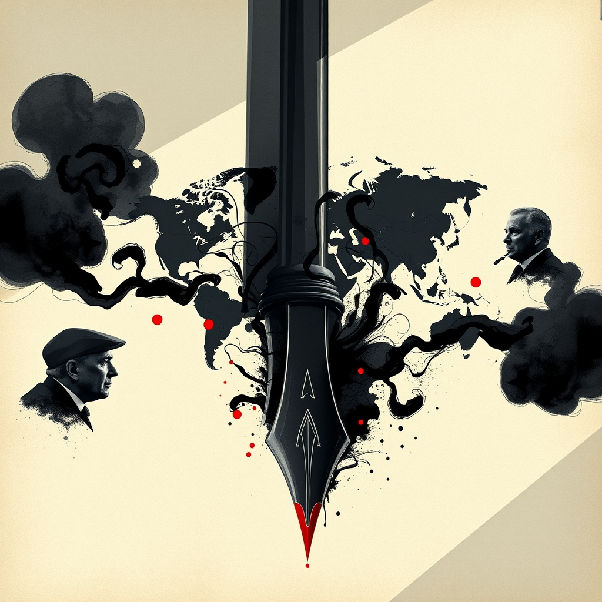

[Home](../index.md) > [Books](./index.md)  
# 🇷🇺⚔️🇺🇦🇮🇱⚔️🇮🇷🇺🇸⚔️🇺🇸 War  
  
[🛒 War. As an Amazon Associate I earn from qualifying purchases.](https://amzn.to/4nMsEDL)  
  
## 📖 Book Report: *War* by Bob Woodward  
  
✍️ Bob Woodward's book *War*, published in October 2024, offers a behind-the-scenes look at major global conflicts and their intersection with American presidential politics during a tumultuous period. 🕵️ Drawing on extensive interviews and his signature "deep background" reporting style, Woodward provides an intimate account of decision-making at the highest levels of government.  
  
### 📌 Summary  
  
* 🌍 *War* primarily focuses on three intertwined "wars": the conflict in Ukraine following Russia's invasion, the conflict in the Middle East between Israel and Hamas, and the political struggle for the American presidency, particularly the dynamic between President Joe Biden and former President Donald Trump leading up to the 2024 election.  
  
🗣️ The book details tense conversations and back-channel diplomacy involving President Biden and key international figures like Vladimir Putin, Benjamin Netanyahu, and Volodymyr Zelensky. 💥 It explores the complexities of managing these international crises, including efforts to deter the use of nuclear weapons and prevent a wider conflict. 🇺🇸 Simultaneously, Woodward examines Donald Trump's continued influence and efforts to regain political power, describing it as a "shadow presidency." 🗳️ The book also touches upon Vice President Kamala Harris's positioning ahead of the election.  
  
🎙️ Woodward's narrative is built upon hundreds of interviews with direct participants and witnesses to crucial meetings and conversations within the Biden and Trump circles. 📍 This allows him to present a seemingly "you-are-there" account of critical moments and internal debates.  
  
### 🔑 Key Themes and Insights  
  
* 🏛️ **Presidential Decision-Making in Crisis:** The book highlights the challenges and complexities faced by President Biden and his advisors in navigating simultaneous international crises.  
* 🤝 **High-Stakes Diplomacy:** It reveals details of sensitive diplomatic exchanges aimed at managing conflicts and preventing escalation.  
* ⚖️ **Interplay of Foreign Policy and Domestic Politics:** *War* underscores how global conflicts are inextricably linked with the intense political competition within the United States.  
* 🎭 **Contrasting Leadership Styles:** The book implicitly (and at times explicitly) contrasts the approaches of Joe Biden and Donald Trump to foreign policy and the exercise of power.  
* ⚔️ **The Nature of Modern Conflict:** By covering the wars in Ukraine and the Middle East, the book touches upon the diverse challenges of interstate warfare and complex regional conflicts.  
  
## 📚 Additional Book Recommendations  
  
### 🔎 Similar Books (Investigative Journalism, US Presidency, and Foreign Policy)  
  
* 📝 ***Obama's Wars*** by Bob Woodward: This earlier book by Woodward offers a similar in-depth look at presidential decision-making regarding the wars in Iraq and Afghanistan during Barack Obama's first term, exploring the internal debates and civil-military tensions.  
* 🏛️ ***Bush at War*** by Bob Woodward: The first in Woodward's series on the George W. Bush presidency, focusing on the administration's response to the 9/11 attacks and the initial phases of the War in Afghanistan.  
* **[⚠️😬😰 Peril](./peril.md)** by Bob Woodward and Robert Costa: Covers the transition from the Trump to the Biden presidency, including the aftermath of the 2020 election and the January 6th Capitol attack, touching on themes of political instability relevant to the "war for the presidency" aspect of Woodward's *War*.  
* 💣 ***The Looming Tower: Al-Qaeda and the Road to 9/11*** by Lawrence Wright: An acclaimed investigative work providing deep historical context on the rise of Al-Qaeda and the events leading up to the 9/11 attacks, offering a different, though related, angle on the origins of conflicts the US has been involved in.  
* 💼 ***The Education of an Idealist*** by Samantha Power: A memoir offering an insider's perspective on US foreign policy during the Obama administration, from a diplomat and policymaker's viewpoint.  
  
### 🔄 Contrasting Books (Different Perspectives and Approaches)  
  
* 🏘️ ***A Small, Stubborn Town*** by Andrew Harding: Tells the story of the resistance in Voznesensk during Russia's invasion of Ukraine, offering a ground-level view of the conflict from the perspective of those directly affected, contrasting with Woodward's focus on high-level decision-making.  
* 🇺🇦 ***The Russo-Ukrainian War: The Return of History*** by Serhii Plokhy: Provides a comprehensive historical analysis of the origins and development of the conflict in Ukraine, offering deeper historical context than a journalistic account focused on recent events.  
* 📖 ***The Drone Eats With Me: A Gaza Diary*** by Atef Abu Seif: A memoir offering an intimate, personal account of life in Gaza during the 2014 conflict, presenting the human experience of war from within a besieged population.  
* 💭 ***Imperial Hubris: Why the West Is Losing the War on Terror*** by Michael Scheuer: Written by a former CIA Bin Laden station chief, this book offers a critical perspective on US counterterrorism strategy, contrasting with insider accounts by questioning fundamental approaches. (Note: This book criticized Woodward's *Bush at War* for giving a platform to leaks).  
* 🎓 ***Decision-Making in American Foreign Policy*** by Nikolas K. Gvosdev, Jessica D. Blankshain, David A. Cooper: An academic textbook analyzing the complex influences and theoretical frameworks behind US foreign policy decisions, providing a more structural perspective compared to Woodward's event-driven narrative.  
  
### 🎭 Creatively Related Books (Themes of Power, Leadership, and Conflict)  
  
* 📜 ***On War*** by Carl von Clausewitz: A foundational work of military theory that explores the nature of war, strategy, and the relationship between war and politics. Provides a timeless theoretical lens through which to view the conflicts discussed in *War*.  
* 👑 ***The Prince*** by Niccolò Machiavelli: A classic treatise on political power, leadership, and the acquisition and maintenance of the state. Offers historical insights into the dynamics of power and political maneuvering relevant to the "war for the presidency" theme.  
* 🎖️ ***Leadership Under Pressure: Tactics from the Front Line*** by Bob Stewart: Draws on military and business experience to discuss leadership in crisis situations, offering lessons applicable to the high-pressure environments described in *War*.  
* 👦 ***Beasts of No Nation*** by Uzodinma Iweala: A powerful novel about a child soldier in a West African civil war, exploring the devastating human cost and psychological impact of conflict, offering a starkly different, fictional perspective on the experience of war.  
* **[🎨⚔️ The Art of War](./the-art-of-war.md)** by Sun Tzu: An ancient Chinese military treatise offering strategic principles applicable to conflict and competition, providing a classic framework for understanding strategic thinking relevant to both military and political "wars."  
  
## 💬 [Gemini](../software/gemini.md) Prompt (gemini-2.5-flash-preview-04-17)  
> Write a markdown-formatted (start headings at level H2) book report, followed by a plethora of additional similar, contrasting, and creatively related book recommendations on War by Bob Woodward. Be thorough in content discussed but concise and economical with your language. Structure the report with section headings and bulleted lists to avoid long blocks of text.