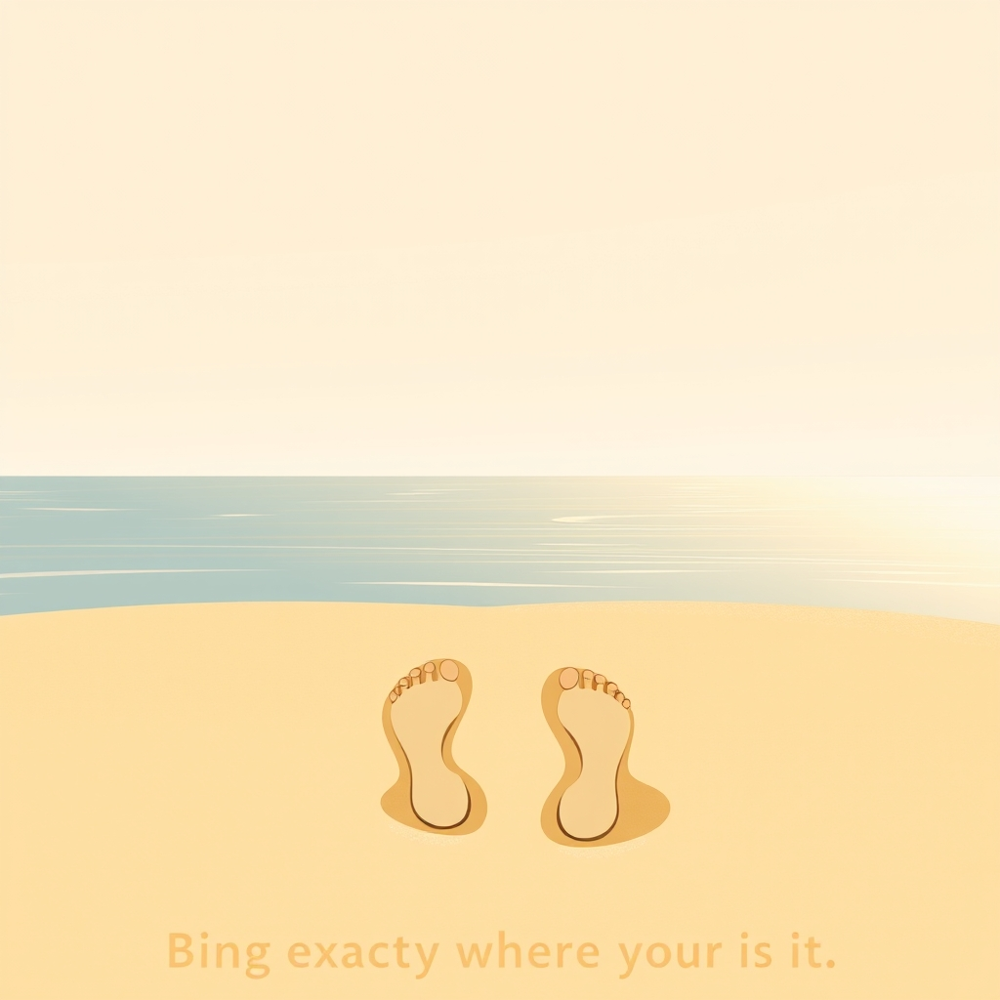

[Home](../index.md) > [Books](./index.md)  
# 👣➡️🌍 Wherever You Go, There You Are  
  
[🛒 Wherever You Go, There You Are. As an Amazon Associate I earn from qualifying purchases.](https://amzn.to/3T8Kdje)  
  
## 📖 Book Report: Wherever You Go, There You Are  
  
### ✍️ Author and Publication  
  
* 🧑‍🏫 **Author:** Jon Kabat-Zinn, PhD  
* 📅 **Publication Date:** 1994 (with subsequent editions, including a 10th-anniversary edition in 2004 with a new afterword).  
* ℹ️ **Context:** 🧘‍♂️ Kabat-Zinn is a renowned meditation teacher, scientist, and the founder of the Stress Reduction Clinic and the Center for Mindfulness in Medicine, Health Care, and Society at the University of Massachusetts Medical School. 🧑‍⚕️ He is also the creator of the widely used Mindfulness-Based Stress Reduction (MBSR) program.  
  
### 🧠 Core Concepts  
  
* 🧘 **Mindfulness Definition:** 📖 The book defines mindfulness as paying attention intentionally, in the present moment, and non-judgmentally.  
* ⏱️ **Present Moment Awareness:** 🧘‍♂️ It emphasizes the importance of grounding oneself in the "now," rather than dwelling on the past or worrying about the future.  
* 🧘‍♀️ **Being vs. Doing:** 🧘 Mindfulness is presented as a state of "being" – simply observing and accepting the present reality – rather than constantly "doing" or striving.  
* 👁️ **Non-Judgmental Observation:** 🔑 A key aspect is learning to observe thoughts, feelings, and sensations without labeling them as good or bad, simply acknowledging their presence.  
* 🔄 **Integration into Daily Life:** 🚶 Kabat-Zinn stresses that mindfulness isn't just for formal meditation sessions but can be woven into everyday activities like walking, eating, or even breathing.  
  
### 📑 Structure and Style  
  
* 📝 **Accessible Essays:** 📖 The book is structured as a collection of short, easily digestible chapters or essays.  
* 🧭 **Practical Guidance:** ✅ It includes practical instructions and suggestions for various meditation practices (sitting, standing, walking, lying down).  
* 🕊️ **Gentle and Encouraging Tone:** ✍️ Kabat-Zinn's writing is poetic, gentle, and accessible, making complex ideas understandable for beginners.  
* 🌍 **Secular Approach:** 🙏 While acknowledging the Buddhist roots of mindfulness, the book presents the practice in a largely secular, science-based context, suitable for a wide audience.  
  
### 🔑 Key Takeaways  
  
* ✨ **The Power of Presence:** 💪 Real clarity, peace, and personal power are found in the present moment, not in ruminating on the past or fearing the future.  
* 🧘‍♂️ **Meditation as Awareness:** 🧘‍♀️ Meditation is framed as a way to become aware of who you are and the path of your life, moment by moment.  
* 🤝 **Acceptance:** 🧘‍♂️ Cultivating acceptance of things as they are, without judgment, is crucial for navigating life's challenges.  
* 🌱 **Simplicity:** 🌬️ Mindfulness practice can be simple – focusing on the breath or sensations during routine activities.  
* 💡 **Self-Awareness:** 🧘 Through mindfulness, one can gain deeper self-understanding and make more conscious choices.  
  
### 🎯 Target Audience  
  
* 🆕 Individuals new to mindfulness and meditation.  
* 😩 People seeking practical ways to reduce stress, anxiety, and the feeling of being overwhelmed.  
* 🤔 Anyone interested in developing greater self-awareness and living more fully in the present.  
* 😇 Those who prefer a gentle, non-dogmatic introduction to meditative practices.  
  
### 🌟 Overall Impression  
  
* 💯 "Wherever You Go, There You Are" is a foundational and highly influential book that demystifies mindfulness meditation.  
* 📖 It offers a compassionate and practical guide to integrating awareness into everyday life, making it a timeless resource for cultivating inner peace and presence.  
* 💪 Its strength lies in its simplicity, gentle encouragement, and focus on making mindfulness accessible to everyone, regardless of their background or beliefs.  
  
## 📚 Further Reading: Exploring Mindfulness and Beyond  
  
### 🧘‍♀️ Similar Mindfulness Guides (Practical & Foundational)  
  
* 📖 **[🌪️🧘‍♂️ Full Catastrophe Living: Using the Wisdom of Your Body and Mind to Face Stress, Pain, and Illness](./full-catastrophe-living.md)** by Jon Kabat-Zinn: His earlier, more comprehensive work detailing the MBSR program, focusing on using mindfulness for stress, pain, and illness.  
* 📖 **Mindfulness for Beginners** by Jon Kabat-Zinn: A concise introduction, often accompanied by guided meditations.  
* 📖 **The Miracle of Mindfulness** by Thich Nhat Hanh: A classic introduction by the revered Zen master, emphasizing mindful breathing and daily activities.  
* 📖 **Peace is Every Step** by Thich Nhat Hanh: Short, accessible teachings on finding peace in everyday moments.  
* 📖 **Radical Acceptance** by Tara Brach: Integrates Buddhist teachings and psychology, focusing on accepting ourselves and our lives with compassion.  
* 📖 **Lovingkindness** by Sharon Salzberg: Focuses on cultivating compassion and kindness towards oneself and others through Metta meditation.  
* **[🧘🗣️ Mindfulness in Plain English](./mindfulness-in-plain-english.md)** by Henepola Gunaratana: A straightforward, practical guide to insight meditation (Vipassanā).  
  
### 🧠 Deeper Dives into Mindfulness & Meditation Theory  
  
* 📖 **Aware: The Science and Practice of Presence** by Daniel J. Siegel, M.D.: Explores the neuroscience behind meditation and introduces the "Wheel of Awareness" practice for focus and emotional resilience.  
* **[🧘🧠✅ Why Buddhism is True: The Science and Philosophy of Meditation and Enlightenment](./why-buddhism-is-true-the-science-and-philosophy-of-meditation-and-enlightenment.md)** by Robert Wright: Examines Buddhist philosophy and psychology through the lens of evolutionary psychology and modern science.  
* 📖 **Coming to Our Senses** by Jon Kabat-Zinn: A deeper, more expansive exploration of mindfulness and its potential for personal and global healing.  
* 📖 **The Routledge Handbook of Phenomenology of Mindfulness** edited by Susi Ferrarello & Christos Hadjioannou: An academic collection exploring mindfulness through the lens of phenomenology, contrasting it with various philosophical traditions.  
  
### 🤔 Contrasting Perspectives (Alternative Approaches to Well-being)  
  
* 📖 **Mindfulness** by Ellen J. Langer: Presents a different, more cognitive perspective on mindfulness developed in social psychology, distinct from meditative traditions. 💡 Often focuses on actively noticing novelty and questioning assumptions ("mindlessness").  
* **[📈🧘🏼‍♀️ 10% Happier](./10-percent-happier.md)** by Dan Harris: A skeptical journalist's journey into meditation, offering a relatable perspective for those wary of spiritual jargon.  
* 📖 **The Subtle Art of Not Giving a F*ck** by Mark Manson: A counterintuitive approach focusing on choosing what to care about and accepting life's struggles, contrasting with non-judgmental acceptance.  
* 📖 **Books on Stoicism (e.g., Meditations by Marcus Aurelius, Letters from a Stoic by Seneca):** 🏛️ Ancient philosophy focused on virtue, reason, and accepting what you cannot control, offering a different framework for resilience.  
* 📖 **Books on Cognitive Behavioral Therapy (CBT) or Acceptance and Commitment Therapy (ACT):** 🧑‍⚕️ Psychological approaches that focus on changing thought patterns or accepting thoughts/feelings without struggle to improve well-being.  
  
### ✨ Creatively Related (Philosophy, Psychology, Nature Writing, Presence)  
  
* 📖 **The Power of Now** by Eckhart Tolle: A hugely popular spiritual guide emphasizing presence and transcending the egoic mind. 🧘‍♂️ Shares themes but has a distinct, more overtly spiritual style.  
* 📖 **Walden** by Henry David Thoreau: A classic of transcendentalist literature exploring simplicity, self-sufficiency, and mindful observation of nature (frequently quoted by Kabat-Zinn).  
* 📖 **Silence: In the Age of Noise** by Erling Kagge: An explorer's meditation on the importance and nature of silence in the modern world.  
* 📖 **Presence: Bringing Your Boldest Self to Your Biggest Challenges** by Amy Cuddy: Focuses on embodying confidence and presence in high-stakes situations, drawing on social psychology.  
* 📖 **The Untethered Soul** by Michael A. Singer: Explores consciousness, identity, and freeing oneself from limiting thoughts and emotions.  
* 📖 **Forest Bathing** by Dr. Qing Li: Explores the Japanese practice of Shinrin-yoku (mindfully immersing oneself in nature) for health and well-being.  
* 📖 **[The Creative Act: A Way of Being](./the-creative-act.md)** by Rick Rubin: While focused on creativity, it delves deeply into awareness, presence, and connecting with inner wisdom, themes resonant with mindfulness.  
  
  
## 💬 [Gemini](../software/gemini.md) Prompt (gemini-2.5-pro-exp-03-25)  
> Write a markdown-formatted (start headings at level H2) book report, followed by a plethora of additional similar, contrasting, and creatively related book recommendations on Wherever You Go, There You Are. Be thorough in content discussed but concise and economical with your language. Structure the report with section headings and bulleted lists to avoid long blocks of text..  
  
